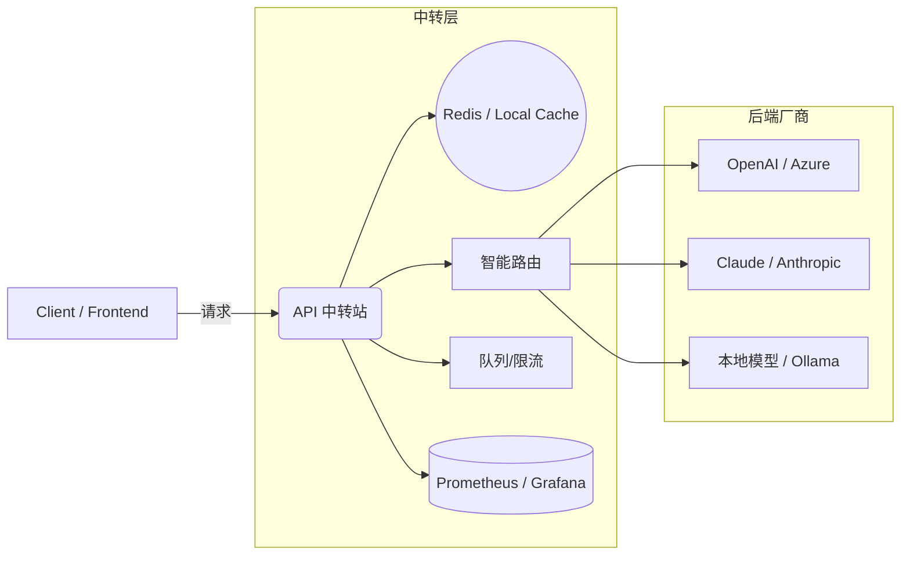

# API 中转站成本优化策略手册


> 目标：帮助你设计、部署并运营一个能 **降本增效** 的 API 中转站（API Gateway / Relay），包含架构图、节点逻辑、成本模型与 ROI 测算、实现清单与样例代码片段。

---

## 目录

1. 概览与适用场景

2. 核心功能与设计原则

3. 推荐架构（含示意图）

4. 节点逻辑详解（缓存、合并、路由、限流）

5. 成本模型与 ROI 测算（公式 + 示例）

6. 实施步骤与时间线

7. 技术栈与示例代码

8. 监控、告警与运维

9. 风险、合规与业务注意点

10. 附录：快速启动清单

---

## 1. 概览与适用场景

**适用场景**：

* 多厂商或多模型并存（例如 OpenAI、Claude、本地模型）

* 调用频次中等及以上（每月调用成本 > ¥300）

* 希望统一鉴权、隐藏密钥、做灰度与降级策略的系统

* 需要对 AI 调用进行成本监控与分层计费的产品化平台

**本手册适用对象**：工程师、技术负责人、正在做 AI/服务中台的开发者。

---

## 2. 核心功能与设计原则

**核心能力**：

* 请求**转发**与**路由**（智能选择厂商/模型）

* **结果缓存**（短期与分层缓存）

* **请求合并/批处理**（减少重复调用）

* **鉴权 & 秘钥隔离**（保护厂商Key）

* **限流/队列/降级**（避免超额计费）

* **计量/结算**（按模型、客户维度拆分成本）

* **监控/告警/审计日志**

**设计原则**：

1. **最小权限与密钥隔离**：中转站持有厂商Key，上层只持中转Key。

2. **可观测**：所有请求要可追踪到 userId、modelId、costTag。

3. **渐进式优化**：先做缓存与限流，再引入智能路由和分账。

4. **合规优先**：遵守厂商使用条款与数据隐私。

---

## 3. 推荐架构（含示意图）



**说明**：

* Proxy 是中枢，负责缓存命中判断、合并短时间内相似请求、调度到 Router，并写入 Metrics。

* Queue 用于批量或非实时任务。

* Cache 放置于中转站附近（同一可用区）以降低网络延迟。

---

## 4. 节点逻辑详解

### 4.1 缓存策略

* **级别**：

  * L1：本地内存缓存（超低延迟，适用于高QPS但少量节点场景）

  * L2：Redis（跨实例共享）

* **缓存 Key 设计**：`hash(prompt_template + normalized_params + model_tag + temperature)`

* **缓存TTL**：按数据类型分层：

  * 静态（汇率、规则）: 1h – 24h

  * 半静态（文档摘要、问答）: 5m – 60m

  * 动态（会话生成）: 30s – 5m

* **缓存一致性**：非强一致，允许短期不一致以换取成本与延迟优势

### 4.2 请求合并（Batching）

* **窗口合并**：按短窗口（例如 50ms 或 200ms）合并相似请求为单次外部调用

* **合并粒度**：基于相同 prompt template 或相同 API endpoint

* **回分结果**：将外部响应拆分回原始请求（若响应可拆分）或用统一结果覆盖

### 4.3 智能路由与策略

* **策略维度**：价格（优先低价）、质量（优先高质量模型）、延迟、可用配额

* **策略实现**：权重分配 + 动态调整（依据最近 N 分钟成功率与成本）

* **熔断**：当某厂商连续失败超过阈值，自动将流量切换到备选

### 4.4 限流/队列/降级

* **优先级队列**：实时交互 > 批处理 > 非关键任务

* **令牌桶/漏桶**：保护下游厂商速率限制

* **降级策略**：当成本/速率达到阈值，自动切换到更便宜模型或返回缓存结果

---

## 5. 成本模型与 ROI 测算（公式 + 示例）

### 5.1 关键变量

* `C_unit`：厂商单价（人民币或美元计）

* `N_raw`：未优化的请求次数（如果直接调用）

* `HR`：缓存命中率（0~1）

* `BR`：合并/批处理减少率（0~1），表示合并后实际外部调用次数比例

* `O_cost`：中转站运行成本（服务器、Redis、监控等，月）

### 5.2 计算公式

* 直接调用成本： `Cost_direct = N_raw * C_unit`

* 通过中转站后的外部调用次数： `N_effective = N_raw * (1 - HR) * BR`

* 厂商计费部分： `Cost_vendor = N_effective * C_unit`

* 总成本（含中转运行成本）： `Cost_total = Cost_vendor + O_cost`

* 成本节省率： `SaveRate = 1 - (Cost_total / Cost_direct)`

### 5.3 示例

假设：

* 每月请求 `N_raw = 1,000,000` 次

* 单次计费 `C_unit = ￥0.02`

* 缓存命中率 `HR = 0.4`（40%）

* 合并减少率 `BR = 0.6`（合并后为原来的60%）

* 中转站运行成本 `O_cost = ￥800` / 月

计算：

* `Cost_direct = 1,000,000 * 0.02 = ￥20,000`

* `N_effective = 1,000,000 * (1 - 0.4) * 0.6 = 360,000`

* `Cost_vendor = 360,000 * 0.02 = ￥7,200`

* `Cost_total = 7,200 + 800 = ￥8,000`

* `SaveRate = 1 - (8,000 / 20,000) = 0.6 = 60%`

> 结论：在该模型下，中转站将每月节省 60% 成本。

### 5.4 灵敏度分析（表格形式）

* 当 `HR` 提升 10% → 节省显著提升

* 当 `BR` 更优（合并更多） → 成本下降幅度加大

---

## 6. 实施步骤与时间线（迭代式）

### MVP（1-2 周）

* 搭建基础代理（Express / FastAPI）

* 支持 API Key 隔离、基本日志

* 引入 Redis 简单缓存（按 prompt hash）

* 部署 Docker 容器

### V1（3-6 周）

* 增加限流与队列

* 实现批处理/合并逻辑

* 集成 Prometheus + Grafana

* 简单的智能路由（按固定权重）

### V2（2-3 月）

* 完整智能路由（成本/质量/延迟感知）

* 多租户计量与结算模块

* 灰度发布与模型版本管理

* SLA 指标与自动熔断

---

## 7. 技术栈与示例代码

**建议栈（轻量级）**：

* 语言：Node.js (Express / Fastify) 或 Python (FastAPI)

* 缓存：Redis

* 队列：Bull / RabbitMQ / Kafka（仅当需要）

* 部署：Docker + Docker Compose 或 Kubernetes

* 监控：Prometheus + Grafana, Loki

**样例模块（代码片段）**：

* 包括：Prompt Hash、Cache Check、Router Decision、Vendor Call、Metrics Emit

```javascript

// 示例 (伪代码)

async function handle(req) {

  const key = hashPrompt(req.prompt, req.model, req.params)

  const cache = await redis.get(key)

  if (cache) return cache

  const route = chooseVendor(req)

  const resp = await callVendor(route, req)

  await redis.set(key, resp, 'EX', ttl)

  emitMetric(req, resp)

  return resp

}

```

（详实的可运行项目代码已包含在附录快速启动清单中）

---

## 8. 监控、告警与运维

**关键监控指标（建议通过 Prometheus）**：

* 总请求数、外部调用数、缓存命中率、平均响应时间

* 每厂商调用成功率、失败率、平均耗时

* 每模型/每用户成本聚合

**告警规则**：

* 缓存命中率骤降（>20% 下降）

* 某厂商失败率 > 5% 持续 5 分钟

* 外部调用成本超过预算阈值

**运维建议**：

* 定期清理过期缓存与日志

* 定期复盘成本表（按周/月）并调整路由策略

---

## 9. 风险、合规与业务注意点

* **遵守厂商条款**：不要做会被厂商禁止的"去重/篡改"行为或滥用模型功能

* **隐私合规**：敏感数据处理需审慎，若有 PII、医疗、金融信息需要加密与审计

* **成本滥用**：给每个下游用户设置预算与限额

* **降级体验**：在切换到廉价模型时，通知用户或记录质量降级

---

## 10. 附录：快速启动清单

1. 初始化仓库：`git init` + Dockerfile

2. 搭建基本 Proxy（Express/FastAPI）

3. 接入 Redis（缓存）

4. 实现 prompt hash、缓存层、log 层

5. 部署 Prometheus + Grafana

6. 编写成本测算脚本（按上面公式）

7. 小规模灰度与 A/B 测试
