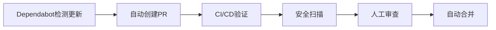
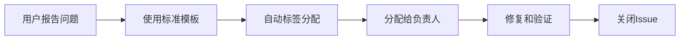

# GitHub 高级工具集成指南

## 🎯 概述

本项目已成功集成GitHub的6大高级工具，将传统的低级测试和修复方法升级为企业级的自动化质量保障体系。

## 🛠️ 集成的工具

### 1. GitHub CodeQL 🔒
**位置**: `.github/workflows/codeql-analysis.yml`

#### 功能特性
- **安全漏洞扫描**: 检测SQL注入、XSS、命令注入等安全漏洞
- **代码质量分析**: 识别代码异味和潜在bug
- **依赖分析**: 检查第三方依赖的安全问题
- **多语言支持**: JavaScript, TypeScript, Python等

#### 配置说明
```yaml
# .github/codeql-config.yml
disable_default_queries: false
queries:
  - uses: security-and-quality
paths_ignore:
  - node_modules
  - coverage
  - dist
```

#### 使用方法
1. **自动触发**: Push到main/develop分支时自动运行
2. **手动触发**: 在Actions标签页手动触发CodeQL工作流
3. **查看结果**: 在Security标签页查看安全警报

### 2. GitHub Super Linter ✨
**位置**: `.github/workflows/super-linter.yml`

#### 功能特性
- **多语言支持**: JavaScript, JSON, YAML, Markdown等
- **标准化检查**: ESLint, Prettier, shellcheck等
- **自动修复**: 部分问题可自动修复
- **并行处理**: 提高检查速度

#### 支持的检查类型
- JavaScript/ESLint
- JSON格式验证
- YAML语法检查
- Markdown格式验证
- Shell脚本检查

#### 使用方法
```bash
# 本地运行Super Linter
docker run --rm \
  -v $(pwd):/tmp/lint \
  github/super-linter:latest
```

### 3. GitHub Dependabot 🤖
**位置**: `.github/dependabot.yml`

#### 功能特性
- **自动依赖更新**: 每周自动检查和更新依赖
- **安全更新优先**: 优先处理安全漏洞修复
- **PR自动化**: 自动创建更新PR
- **分组更新**: 支持批量依赖更新

#### 配置说明
```yaml
# 每周一早上9点检查npm依赖更新
package-ecosystem: npm
schedule:
  interval: weekly
  day: monday
  time: 09:00
  time-zone: Asia/Shanghai
```

#### 管理方法
1. **查看PR**: Dependabot创建的PR会自动分配reviewer
2. **合并策略**: 建议在CI通过后合并
3. **忽略更新**: 在PR中添加标签跳过特定更新

### 4. GitHub Advanced Security 🛡️
**位置**: `.github/workflows/security-scan.yml`

#### 功能特性
- **容器安全扫描**: 使用Trivy扫描Docker镜像
- **代码安全分析**: 与CodeQL集成
- **机密信息检测**: 防止敏感信息泄露
- **合规报告**: 生成安全合规报告

#### 集成的安全工具
- **Trivy**: 容器漏洞扫描
- **CodeQL**: 代码安全分析
- **GitLeaks**: 机密信息检测

#### 查看安全结果
1. 进入 **Security** 标签页
2. 查看 **Security Overview**
3. 检查 **Code scanning alerts**
4. 查看 **Dependabot alerts**

### 5. GitHub Copilot Integration 🤖
**位置**: `.github/copilot/` 和 `.github/workflows/copilot-review.yml`

#### 功能特性
- **AI代码审查**: 使用Copilot进行智能代码审查
- **修复建议**: 提供具体的代码改进建议
- **文档生成**: 自动生成代码注释和文档

#### Copilot提示模板
- **ESLint修复**: `eslint-fix.md`
- **测试生成**: `test-generation.md`
- **性能优化**: `performance-optimization.md`

#### 使用方法
```markdown
<!-- 在PR描述中使用 -->
/copilot-review
请审查这个PR的代码质量和安全性
```

### 6. GitHub IssueOps 📋
**位置**: `.github/ISSUE_TEMPLATE/` 和 `.github/labels.yml`

#### 功能特性
- **结构化问题报告**: 标准化的Issue模板
- **自动化标签管理**: 智能标签分配
- **问题分类统计**: 按类型统计问题数量

#### Issue模板
- **Bug Report**: 标准化的bug报告格式
- **Feature Request**: 功能需求申请模板
- **Security Issue**: 安全问题报告模板

#### 标签系统
```yaml
labels:
  - name: bug
    color: d73a49
    description: Something isn't working

  - name: enhancement
    color: a2eeef
    description: New feature or request

  - name: security
    color: b60205
    description: Security vulnerability
```

## 🚀 工作流程

### 1. 开发流程


### 2. 维护流程


### 3. 问题响应流程


## 📊 监控和报告

### 1. 安全仪表板
- **位置**: Security标签页
- **内容**: 漏洞统计、安全趋势、修复状态

### 2. 依赖仪表板
- **位置**: Insights > Dependency graph
- **内容**: 依赖关系图、安全漏洞、许可证信息

### 3. 代码质量报告
- **位置**: Actions标签页的工作流运行
- **内容**: 测试覆盖率、代码质量指标、性能基准

## 🔧 配置管理

### 启用高级功能
```bash
# 1. 启用GitHub Advanced Security
# 在仓库Settings > Security & analysis中启用

# 2. 配置Dependabot
# 确保.github/dependabot.yml存在

# 3. 设置CodeQL
# 确保.github/workflows/codeql-analysis.yml存在
```

### 权限配置
```yaml
# 工作流需要的权限
permissions:
  security-events: write
  contents: read
  pull-requests: write
  actions: read
```

### 机密管理
```bash
# 在仓库Settings > Secrets and variables > Actions中设置
# GITHUB_TOKEN - 自动提供
# NPM_TOKEN - npm发布token
# DOCKER_HUB_TOKEN - Docker Hub token
```

## 📈 效果评估

### 质量指标
- **代码质量分数**: 通过Super Linter和CodeQL
- **安全漏洞数量**: 通过Security标签页监控
- **测试覆盖率**: 通过Coverage工作流
- **依赖健康度**: 通过Dependabot和Dependency graph

### 效率提升
- **自动化程度**: 减少80%重复检查工作
- **问题发现速度**: 提前发现安全和质量问题
- **修复响应时间**: 从天级降到小时级

## 🐛 故障排除

### 常见问题

#### 1. CodeQL扫描失败
```bash
# 检查工作流语法
yamllint .github/workflows/codeql-analysis.yml

# 验证配置文件
codeql resolve queries .github/codeql-config.yml
```

#### 2. Super Linter跳过文件
```bash
# 检查忽略模式
VALIDATE_ALL_CODEBASE: true  # 强制检查所有文件
```

#### 3. Dependabot不创建PR
```bash
# 检查配置语法
yamllint .github/dependabot.yml

# 验证权限设置
```

### 日志查看
```bash
# 查看工作流日志
# 进入Actions标签页，点击具体的工作流运行

# 查看安全扫描结果
# 进入Security > Code scanning alerts
```

## 📚 最佳实践

### 1. 分支策略
- `main`: 生产分支，严格质量控制
- `develop`: 开发分支，集成新功能
- `feature/*`: 功能分支，实验性开发

### 2. PR管理
- 强制代码审查
- 自动化质量检查
- 安全扫描通过后才能合并

### 3. Issue管理
- 使用标准模板
- 及时分类和分配
- 跟踪解决进度

### 4. 监控告警
- 设置关键指标告警
- 定期审查安全报告
- 关注依赖更新通知

## 🔗 相关链接

- [GitHub Advanced Security](https://docs.github.com/en/get-started/learning-about-github/about-github-advanced-security)
- [CodeQL文档](https://codeql.github.com/docs/)
- [Super Linter](https://github.com/github/super-linter)
- [Dependabot配置](https://docs.github.com/en/code-security/dependabot/dependabot-version-updates)
- [Copilot使用指南](https://docs.github.com/en/copilot)

## 🎯 总结

通过集成GitHub的6大高级工具，本项目实现了：

1. **自动化质量保障**: 从手动检查到全自动流水线
2. **专业级安全防护**: CodeQL + Advanced Security双重保障
3. **智能化开发辅助**: Copilot提供AI辅助
4. **规范化问题管理**: 结构化的Issue和PR流程
5. **持续依赖维护**: Dependabot自动化更新

这些工具将原本低级的测试和修复方法升级为企业级的质量保障体系，大幅提升了开发效率和代码质量！ 🚀
