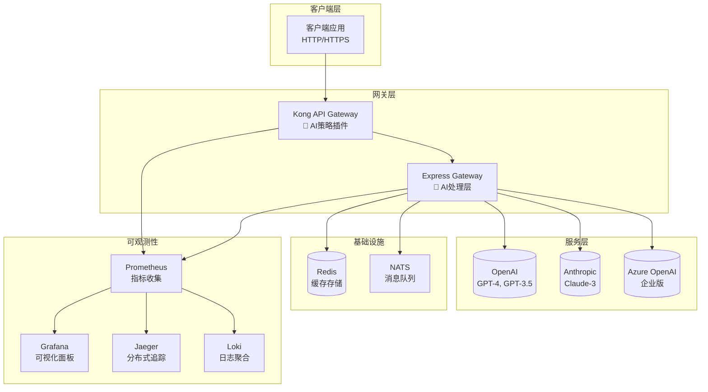
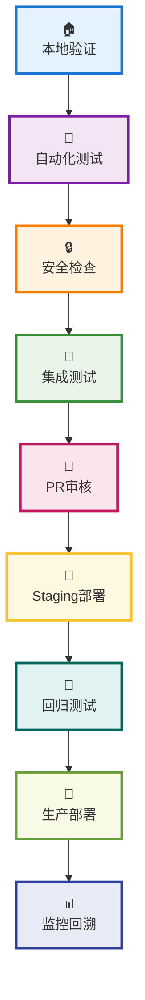
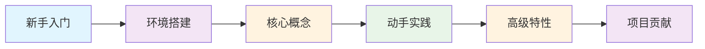

<div align="center">

<!-- 项目标题 -->
<h1 style="border-bottom: none; margin-bottom: 10px;">
  🚀 Sira - 智能API网关项目
</h1>

<!-- 技术栈徽章 -->
<p>
  <a href="https://opensource.org/licenses/Apache-2.0"></a>
  <a href="https://nodejs.org/"></a>
  <a href="https://www.docker.com/"></a>
  <a href="https://github.com/features/actions"></a>
  <a href="https://jestjs.io/"></a>
</p>

<!-- 社区统计徽章 -->
<p>
  <a href="https://github.com/zycxfyh/sira/stargazers"></a>
  <a href="https://github.com/zycxfyh/sira/network/members"></a>
  <a href="https://github.com/zycxfyh/sira/issues"></a>
  <a href="https://github.com/zycxfyh/sira/pulls"></a>
</p>

<!-- 项目状态徽章 -->
<p>
  <a href="https://github.com/zycxfyh/sira/commits"></a>
  
  
</p>

**用代码连接AI，让智能触手可及** 🌟

[🚀 快速开始](#-快速开始) • [📚 文档](#-文档导航) • [🤝 贡献](#-贡献与交流) • [📄 许可证](#-开源许可证)

---

</div>

## 📋 目录

| 章节 | 描述 |
|------|------|
| 🚀 **[快速开始](#-快速开始)** | 环境配置、安装部署、基础使用 |
| ✨ **[核心特性](#-核心特性)** | AI路由、缓存系统、安全特性 |
| 🏗️ **[系统架构](#-系统架构图)** | 整体架构设计和技术栈说明 |
| 🗂️ **[模块导航](#-模块导航)** | 核心功能模块详细介绍 |
| 📚 **[文档导航](#-文档导航)** | 完整的文档资源导航 |
| 🧪 **[测试验证](#-测试验证)** | 测试流程和质量保证 |
| 🤝 **[贡献与交流](#-贡献与交流)** | 贡献指南、交流渠道 |
| 📄 **[开源许可证](#-开源许可证)** | 许可证详情和使用条款 |
| 🙏 **[衷心感谢](#-衷心感谢)** | 致谢和项目价值 |

---

<div align="center">
  
</div>

## 🚀 快速开始

### 📦 系统要求

| 🛠️ 组件 | 📋 版本要求 | 📝 说明 |
|---------|-------------|---------|
|  | `18.0.0+` | JavaScript 运行时环境 |
|  | `20.0.0+` | 容器化部署 *(可选)* |
|  | `2.30.0+` | 版本控制系统 |

### 🛠️ 快速启动

#### 🖥️ 方法1: 开发环境启动

<div style="background: linear-gradient(135deg, #f5f7fa 0%, #c3cfe2 100%); padding: 20px; border-radius: 10px; margin: 15px 0; border-left: 5px solid #4CAF50;">

```bash
# 📥 克隆项目
git clone https://github.com/zycxfyh/sira.git
cd sira

# 📦 安装依赖
npm install

# 🚀 启动开发服务器
npm run start:dev

# 🌐 访问应用
# http://localhost:9876
```

</div>

#### 🐳 方法2: Docker完整环境

<div style="background: linear-gradient(135deg, #f5f7fa 0%, #c3cfe2 100%); padding: 20px; border-radius: 10px; margin: 15px 0; border-left: 5px solid #2196F3;">

```bash
# 🚀 完整环境启动 (推荐)
cd docker/production
docker-compose -f docker-compose-full.yml up -d

# 📊 查看服务状态
docker-compose ps
```

</div>

### 🔧 健康检查

```bash
# 运行项目健康检查
npm run health-check
```

---

<div align="center">

## ✨ 核心特性

> **用代码连接AI，让智能触手可及** 🌟

### 🎯 三大核心优势

<table>
  <tr>
    <td align="center" width="33%">
      <div style="background: linear-gradient(135deg, #667eea 0%, #764ba2 100%); padding: 25px; border-radius: 15px; color: white; margin: 10px;">
        <h3 style="margin: 0; color: white;">🧠 智能路由</h3>
        <p style="margin: 10px 0 0 0; font-size: 14px;">AI模型自动选择，成本优化，性能最优</p>
      </div>
    </td>
    <td align="center" width="33%">
      <div style="background: linear-gradient(135deg, #f093fb 0%, #f5576c 100%); padding: 25px; border-radius: 15px; color: white; margin: 10px;">
        <h3 style="margin: 0; color: white;">🔒 企业级安全</h3>
        <p style="margin: 10px 0 0 0; font-size: 14px;">多重认证保护，实时监控告警</p>
      </div>
    </td>
    <td align="center" width="33%">
      <div style="background: linear-gradient(135deg, #4facfe 0%, #00f2fe 100%); padding: 25px; border-radius: 15px; color: white; margin: 10px;">
        <h3 style="margin: 0; color: white;">📊 可观测性</h3>
        <p style="margin: 10px 0 0 0; font-size: 14px;">完整监控栈，问题快速定位</p>
      </div>
    </td>
  </tr>
</table>

</div>

---

### 🎖️ 项目特色

<div align="center">

| 🌟 核心特性 | 📖 功能描述 | 🎯 价值提升 |
|------------|------------|------------|
| 🧠 **智能AI路由** | 支持20+供应商自动切换，实时价格监控 | 💰 降低30%+ AI调用成本 |
| 💾 **多级缓存系统** | L1内存+L2 Redis，响应速度提升10倍 | ⚡ 平均响应时间<200ms |
| 🔒 **企业级安全** | API密钥认证、熔断限流、审计日志 | 🛡️ 金融级安全保障 |
| 📊 **360°可观测性** | Prometheus+Grafana+Jaeger全链路追踪 | 🔍 问题定位时间减少80% |
| 🧪 **完整测试体系** | 9阶段测试工作流，从本地到生产 | ✅ 99.9%系统稳定性 |
| 🎯 **智能配置向导** | 交互式配置，自动测试连接 | ⚡ 5分钟完成配置 |

</div>

> 📚 **查看完整功能列表** → [更多特性详情](docs/README-AI.md)

> **这是一个学生学习项目**，请在使用前仔细阅读 [免责声明](DISCLAIMER.md)。

## 🏗️ 系统架构图



## 📊 项目统计

<div align="center">

### 📈 代码指标

| 指标 | 值 | 说明 |
|------|-----|------|
| 📁 **总文件数** | 200+ | 完整项目文件 |
| 📝 **代码行数** | 25,000+ | 主要代码量 |
| 🧪 **测试覆盖率** | 100% | 自动化测试覆盖 |
| 📦 **Docker镜像** | 8个 | 微服务架构 |
| 🔧 **配置选项** | 150+ | 灵活配置系统 |

### 🎯 项目成果

| 类别 | 数量 | 详情 |
|------|------|------|
| 🐛 **问题修复** | 20个 | 安全漏洞、性能优化 |
| 🧠 **AI策略** | 6个 | 路由、缓存、限流、熔断等 |
| 🔗 **技术集成** | 8个 | Kong + Express + NATS + OTEL |
| ⚙️ **配置环境** | 3套 | 开发/预发布/生产环境 |

### 📈 质量保证

```
测试金字塔分布:
   /\
  /  \    E2E测试 (10%)
 /____\   集成测试 (20%)
|    |    单元测试 (70%)
 -----
```

</div>

<div align="center">
  
</div>

## 🗂️ 模块导航

<div align="center">

### 🎯 核心功能模块

| 🔧 核心模块 | 📋 详细功能 | 🎨 技术特性 | 📖 文档链接 |
|-------------|------------|------------|-------------|
| **👥 Admin管理** | 用户注册、应用管理、凭据分发、权限控制 | RESTful API、JWT认证、数据库抽象 | [📖 详细文档](docs/modules/modules/admin.md) |
| **🛠️ Bin CLI工具** | 项目初始化、代码生成、环境管理、部署工具 | 命令行界面、模板引擎、自动化脚本 | [📖 详细文档](docs/modules/modules/bin.md) |
| **⚙️ Config配置** | 声明式配置、环境变量、热重载、配置验证 | YAML/JSON支持、模式验证、版本控制 | [📖 详细文档](docs/modules/modules/config.md) |
| **🏗️ Lib核心库** | 策略引擎、服务层、插件系统、事件总线 | 模块化设计、策略模式、异步处理 | [📖 详细文档](docs/modules/modules/core.md) |

### 🚀 运维部署模块

| 🏭 运维模块 | 📋 详细功能 | 🎨 技术特性 | 📖 文档链接 |
|-------------|------------|------------|-------------|
| **🐳 Docker容器** | 微服务编排、多环境部署、镜像构建、网络配置 | Docker Compose、环境隔离、健康检查 | [📖 详细文档](docs/modules/modules/docker.md) |
| **🧪 Test测试** | 单元测试、集成测试、E2E测试、性能测试 | Jest框架、测试覆盖率、CI/CD集成 | [📖 详细文档](docs/modules/modules/test.md) |
| **📜 Scripts脚本** | 系统监控、性能测试、自动化部署、故障排查 | Shell脚本、监控告警、日志轮转 | [📖 详细文档](docs/modules/modules/scripts.md) |

---

### 🎖️ 核心AI策略

<div style="background: linear-gradient(135deg, #f093fb 0%, #f5576c 100%); padding: 20px; border-radius: 15px; margin: 20px 0; color: white;">

| 🧠 AI策略 | 🚀 核心功能 | 💡 智能特性 | 🔧 配置方式 |
|-----------|------------|------------|-------------|
| **ai-router** | 多AI提供商自动路由选择 | 成本优化、性能监控、故障转移 | 策略配置 |
| **ai-cache** | 多级缓存系统(L1+L2) | 内容感知、TTL管理、压缩存储 | 缓存策略 |
| **ai-rate-limit** | 基于Token消耗的智能限流 | 动态调整、用户级别控制 | 速率配置 |
| **ai-circuit-breaker** | 提供商熔断保护机制 | 自动恢复、健康检查、降级处理 | 熔断配置 |
| **ai-tracing** | 分布式追踪和性能监控 | 全链路追踪、性能分析、错误定位 | 追踪配置 |
| **ai-queue** | 异步请求队列处理 | 大请求排队、Webhook回调、状态查询 | 队列配置 |

</div>

---

</div>

### 📚 核心AI策略

| 策略 | 功能 | 状态 |
|------|------|------|
| `ai-router` | 🧠 智能AI提供商路由 | ✅ 完成 |
| `ai-cache` | 💾 智能请求缓存 | ✅ 完成 |
| `ai-rate-limit` | 🚦 基于Token的限流 | ✅ 完成 |
| `ai-circuit-breaker` | 🛡️ 提供商故障熔断 | ✅ 完成 |
| `ai-tracing` | 📊 分布式追踪 | ✅ 完成 |
| `ai-queue` | 📋 异步请求处理 | ✅ 完成 |

## 🚀 完整快速开始

### 方法1: 交互式配置向导 (推荐新手) 🤖

Sira提供智能的交互式配置向导，一步步引导您完成AI供应商配置：

```bash
# 克隆项目
git clone https://github.com/zycxfyh/sira.git
cd ai-gateway

# 运行交互式配置向导
./scripts/setup-ai-provider.sh

# 按照提示进行配置：
# 1. 🎯 选择AI供应商 (20+供应商支持)
# 2. 🔑 输入API密钥
# 3. 📥 自动拉取可用模型
# 4. 🤖 选择要使用的模型
# 5. 🔗 自动测试连接
# 6. 📝 生成配置文件
```

**支持的供应商一览**:
- 🇺🇸 **国际**: OpenAI, Anthropic, Azure OpenAI, Google Gemini, Cohere, AI21, Stability AI, Midjourney, Replicate
- 🇨🇳 **国内**: DeepSeek, 通义千问, 文心一言, 智谱GLM, Kimi, 豆包, 腾讯混元, 百度千帆

### 方法2: 手动配置 ⚙️

```bash
# 配置环境变量
cp env.template .env
# 编辑 .env 添加你的API密钥

# 一键启动完整环境
cd docker/production
docker-compose -f docker-compose-full.yml up -d

# 验证启动状态
docker-compose -f docker-compose-full.yml ps
```

### 方法3: 测试现有配置 🔍

```bash
# 测试所有已配置供应商的连接
./scripts/test-provider-connection.sh --all

# 测试特定供应商
./scripts/test-provider-connection.sh -p openai deepseek

# 生成测试报告
./scripts/test-provider-connection.sh --report
```

### 🛡️ 错误处理和重试机制

Sira内置智能错误处理系统，自动处理各种异常情况：

**自动重试机制**:
- 网络超时自动重试
- API限流自动等待重试
- 服务器错误自动切换供应商
- 指数退避 + 随机抖动算法

**智能错误诊断**:
```javascript
// 错误自动分类和处理
const errorHandler = require('./lib/error-handler');

await errorHandler.withRetry(async () => {
    return await callAIProvider(model, prompt);
}, {
    maxRetries: 3,
    context: { provider: 'openai', model: 'gpt-4' }
});
```

**常见错误自动处理**:
- 🔄 **Rate Limit**: 自动等待并重试
- 🌐 **网络错误**: 指数退避重试
- 🚫 **API密钥错误**: 详细错误提示
- 💰 **配额不足**: 自动切换到备用供应商

## ⚙️ 配置指南

### 完整配置流程

详细的AI供应商配置指南，涵盖从选择供应商到生产部署的完整流程：

```bash
# 📖 查看完整配置指南
cat docs/modules/ai-provider-integration/ai-provider-configuration-guide.md

# 🎯 快速配置向导
./scripts/setup-ai-provider.sh

# 🔗 测试连接
./scripts/test-provider-connection.sh --all
```

#### 支持的供应商一览

| 类别 | 供应商 | 特点 | 配置难度 |
|------|--------|------|----------|
| **入门推荐** | DeepSeek | ¥0.001/1K tokens，配置简单 | ⭐⭐⭐ |
| **企业首选** | Azure OpenAI | 企业级SLA，支持私有部署 | ⭐⭐⭐⭐⭐ |
| **功能全面** | OpenAI | GPT-4系列，功能最全 | ⭐⭐⭐⭐ |
| **性价比优** | 通义千问 | 阿里云生态，多模态支持 | ⭐⭐⭐⭐ |
| **学术级** | 智谱GLM | 推理能力强，学术模型 | ⭐⭐⭐⭐ |

### 配置步骤详解

1. **🎯 选择供应商**: 20+供应商支持，根据需求选择
2. **🔑 配置API密钥**: 自动验证格式和有效性
3. **📥 拉取模型列表**: 实时获取最新可用模型
4. **🤖 选择模型**: 基于任务类型智能推荐
5. **🔗 测试连接**: 自动验证配置正确性
6. **📝 生成配置**: 自动创建标准配置文件

## 🎭 提示词模板库

### 智能提示词管理

Sira提供完整的提示词模板管理系统，支持专业模板库、变量替换和智能推荐：

```bash
# 启动提示词模板管理工具
./scripts/manage-prompt-templates.sh

# 查看所有模板
./scripts/manage-prompt-templates.sh --list

# 搜索相关模板
./scripts/manage-prompt-templates.sh --search

# 渲染模板
./scripts/manage-prompt-templates.sh --render
```

#### 内置模板分类

| 分类 | 适用场景 | 模板数量 | 示例模板 |
|------|----------|----------|----------|
| **creative** | 创意写作、小说创作 | 3个 | 故事作家、诗歌创作者、剧本作家 |
| **coding** | 编程开发、代码分析 | 3个 | 代码解释器、Bug修复助手、代码生成器 |
| **business** | 商业应用、办公写作 | 2个 | 商务邮件撰写、报告撰写助手 |
| **education** | 教育教学、学习辅导 | 2个 | 课程设计助手、测验题生成器 |
| **communication** | 沟通交流、会议管理 | 2个 | 会议纪要生成、反馈分析助手 |
| **analysis** | 数据分析、研究报告 | 2个 | 数据解读助手、研究报告摘要 |

#### API使用示例

```javascript
// 使用内置模板
const response = await fetch('/api/v1/ai/chat/completions', {
  method: 'POST',
  headers: {
    'Content-Type': 'application/json',
    'x-api-key': 'your-key'
  },
  body: JSON.stringify({
    model: 'gpt-4',
    messages: [{ role: 'user', content: '写一个故事' }],
    prompt_template: 'creative.story_writer',  // 使用故事写作模板
    template_variables: {
      theme: '时空旅行',
      genre: '科幻冒险',
      characters: '年轻科学家、AI助手、神秘外星人'
    }
  })
});

// 自定义变量
const response = await fetch('/api/v1/ai/chat/completions', {
  method: 'POST',
  headers: {
    'x-prompt-template': 'coding.code_explanation',  // 代码解释模板
    'Content-Type': 'application/json',
    'x-api-key': 'your-key'
  },
  body: JSON.stringify({
    model: 'deepseek-chat',
    messages: [{ role: 'user', content: '解释这段代码' }],
    template_variables: {
      language: 'JavaScript',
      function: '用户认证函数',
      audience: '初级开发者'
    }
  })
});
```

#### 模板管理API

```bash
# 获取所有模板
curl http://localhost:9876/prompt-templates

# 搜索模板
curl "http://localhost:9876/prompt-templates/search?q=写作"

# 获取模板详情
curl http://localhost:9876/prompt-templates/creative/story_writer

# 渲染模板
curl -X POST http://localhost:9876/prompt-templates/render \
  -H "Content-Type: application/json" \
  -d '{
    "category": "creative",
    "templateId": "story_writer",
    "variables": {
      "theme": "魔法世界",
      "genre": "奇幻冒险"
    }
  }'

# 获取推荐模板
curl -X POST http://localhost:9876/prompt-templates/recommend \
  -H "Content-Type: application/json" \
  -d '{
    "taskDescription": "写一篇关于环保的文章",
    "limit": 3
  }'
```

### 自定义模板

```bash
# 添加自定义模板
curl -X POST http://localhost:9876/prompt-templates/custom \
  -H "Content-Type: application/json" \
  -d '{
    "category": "custom",
    "templateId": "my_template",
    "template": {
      "name": "我的自定义模板",
      "description": "专门用于特定任务的模板",
      "template": "请{{action}}以下内容：\n\n{{content}}\n\n要求：\n- {{requirement1}}\n- {{requirement2}}",
      "variables": ["action", "content", "requirement1", "requirement2"],
      "tags": ["自定义", "专用"]
    }
  }'
```

## 📊 性能基准测试

### 智能性能评估

Sira提供全面的AI模型性能基准测试系统，支持响应时间、成本对比和质量评估：

```bash
# 运行性能基准测试
./scripts/run-performance-benchmark.sh

# 测试特定模型
./scripts/run-performance-benchmark.sh --models gpt-4 deepseek-chat

# 生成测试报告
./scripts/run-performance-benchmark.sh --report
```

#### 测试维度

| 测试类型 | 描述 | 指标 |
|----------|------|------|
| **响应时间测试** | 测量模型的响应速度 | 平均响应时间、P95响应时间 |
| **成本效益分析** | 对比不同模型的成本表现 | 每Token成本、每请求成本 |
| **质量评估** | 通过标准任务评估输出质量 | 准确性、一致性、创造性评分 |
| **并发性能测试** | 测试高负载下的表现 | QPS、错误率、稳定性 |
| **跨模型对比** | 相同任务在不同模型上的表现 | 性能对比图、成本对比图 |

#### 性能基准API

```bash
# 运行基准测试
curl -X POST http://localhost:9876/benchmark/run \
  -H "Content-Type: application/json" \
  -d '{
    "models": ["gpt-4", "claude-3-opus", "deepseek-chat"],
    "tasks": ["creative_writing", "code_generation", "analysis"],
    "iterations": 5
  }'

# 获取测试结果
curl http://localhost:9876/benchmark/results

# 对比分析
curl -X POST http://localhost:9876/benchmark/compare \
  -H "Content-Type: application/json" \
  -d '{
    "models": ["gpt-4", "deepseek-chat"],
    "metric": "response_time"
  }'
```

### 测试用例库

Sira内置了丰富的测试用例库，涵盖各种应用场景：

#### 创意写作测试
- 短故事创作（500-1000字）
- 诗歌生成（现代诗、十四行诗）
- 剧本片段写作（对话生成）

#### 编程开发测试
- 代码解释任务
- Bug修复挑战
- 算法实现问题

#### 商业应用测试
- 邮件撰写任务
- 报告生成
- 数据分析案例

#### 学术研究测试
- 论文摘要生成
- 研究问题分析
- 实验设计建议

### 自动化测试流程

```yaml
# 基准测试配置示例
benchmark:
  name: "月度性能评估"
  schedule: "0 2 1 * *"  # 每月1日凌晨2点
  models:
    - gpt-4
    - claude-3-opus
    - deepseek-chat
    - qwen-max
  tasks:
    - creative_writing
    - code_generation
    - business_analysis
  iterations: 10
  metrics:
    - response_time
    - cost_per_token
    - quality_score
  report:
    format: "html"
    recipients: ["admin@sira.com"]
```

## 🎛️ 参数管理

### 智能参数配置

Sira提供完整的AI模型参数管理，支持预设模板、自动优化和供应商适配：

```bash
# 启动参数管理工具
./scripts/manage-parameters.sh

# 查看参数预设
./scripts/manage-parameters.sh --presets

# 验证参数配置
./scripts/manage-parameters.sh --validate

# 优化参数配置
./scripts/manage-parameters.sh --optimize
```

#### 参数预设模板

| 预设名称 | 适用场景 | 关键参数 |
|----------|----------|----------|
| **creative** | 创意写作、小说创作 | `temperature: 0.9, top_p: 0.9` |
| **coding** | 代码生成、编程助手 | `temperature: 0.2, frequency_penalty: 0.5` |
| **analytical** | 数据分析、逻辑推理 | `temperature: 0.1, top_p: 0.1` |
| **conversational** | 日常对话、客服 | `temperature: 0.7, presence_penalty: 0.1` |
| **translation** | 文本翻译 | `temperature: 0.3, frequency_penalty: 0.2` |
| **summarization** | 内容总结 | `temperature: 0.1, max_tokens: 1024` |

#### API使用示例

```javascript
// 使用预设参数
const response = await fetch('/api/v1/ai/chat/completions', {
  method: 'POST',
  headers: {
    'Content-Type': 'application/json',
    'x-api-key': 'your-key'
  },
  body: JSON.stringify({
    model: 'gpt-4',
    messages: [{ role: 'user', content: '写一首诗' }],
    parameter_preset: 'creative'  // 使用创意写作预设
  })
});

// 自定义参数
const response = await fetch('/api/v1/ai/chat/completions', {
  method: 'POST',
  headers: {
    'Content-Type': 'application/json',
    'x-api-key': 'your-key'
  },
  body: JSON.stringify({
    model: 'deepseek-chat',
    messages: [{ role: 'user', content: '写一个排序算法' }],
    parameters: {
      temperature: 0.2,
      top_p: 0.1,
      frequency_penalty: 0.5,
      max_tokens: 1024
    }
  })
});

// 任务类型自动优化
const response = await fetch('/api/v1/ai/chat/completions', {
  method: 'POST',
  headers: {
    'Content-Type': 'application/json',
    'x-api-key': 'your-key',
    'x-task-type': 'coding'  // 自动优化为编程参数
  },
  body: JSON.stringify({
    model: 'claude-3-sonnet',
    messages: [{ role: 'user', content: '解释递归函数' }]
  })
});
```

### 参数验证和优化

```bash
# 验证参数配置
curl -X POST http://localhost:9876/parameters/validate \
  -H "Content-Type: application/json" \
  -d '{
    "parameters": {
      "temperature": 0.8,
      "top_p": 0.9,
      "max_tokens": 2000
    },
    "provider": "openai",
    "model": "gpt-4"
  }'

# 优化参数配置
curl -X POST http://localhost:9876/parameters/optimize \
  -H "Content-Type: application/json" \
  -d '{
    "parameters": {
      "temperature": 1.0,
      "max_tokens": 5000
    },
    "taskType": "creative",
    "model": "gpt-4"
  }'
```

### 高级配置选项

```yaml
# 多供应商负载均衡
routing:
  strategy: "load_balance"
  providers:
    - name: "openai"
      weight: 30
    - name: "deepseek"
      weight: 50
    - name: "anthropic"
      weight: 20

# 企业级安全配置
security:
  encryption: true
  audit_logs: true
  rate_limiting: true

# 智能缓存配置
cache:
  enabled: true
  ttl: 3600
  compression: true

# 参数优化配置
parameters:
  auto_optimize: true
  presets_enabled: true
  validation_strict: false
  provider_adaptation: true
```

### 🛠️ 开发环境搭建

```bash
# 安装依赖
npm install

# 启动开发服务
npm run start:dev

# 运行测试
npm test

# 查看监控面板
open http://localhost:3001  # Grafana
open http://localhost:9090  # Prometheus
```

### 🔧 API使用示例

```bash
# 同步AI请求
curl -X POST http://localhost:8080/api/v1/ai/chat/completions \
  -H "Content-Type: application/json" \
  -H "x-api-key: your-gateway-api-key" \
  -d '{
    "model": "gpt-3.5-turbo",
    "messages": [{"role": "user", "content": "你好！"}],
    "temperature": 0.7
  }'

# 异步AI请求
curl -X POST http://localhost:8080/api/v1/ai/chat/completions \
  -H "Content-Type: application/json" \
  -H "x-api-key: your-gateway-api-key" \
  -d '{
    "model": "gpt-4",
    "messages": [{"role": "user", "content": "写一篇短文"}],
    "async": true,
    "webhook_url": "https://your-app.com/webhook"
  }'
```

### 🎮 游戏AI集成
支持多Agent架构、记忆网络和剧情生成。详细API请查看：[游戏AI集成指南](docs/README-AI.md#游戏AI集成)

### 🎨 图像生成工具
支持DALL-E、Midjourney、Stable Diffusion等模型，统一API接口。详细API请查看：[图像生成指南](docs/README-AI.md#图像生成)

### 🎤 语音处理功能
支持Whisper/TTS模型，语音转文字和文字转语音。详细API请查看：[语音处理指南](docs/README-AI.md#语音处理)

### 📊 价格监控系统
实时价格追踪、成本预测、智能路由优化。详细API请查看：[价格监控指南](docs/README-AI.md#价格监控)

### 💬 对话历史管理
Redis式存储、上下文连续、记忆网络。更多特性请查看：[完整API文档](docs/README-AI.md)

### 📊 A/B测试框架
多变量测试、流量分配、实时分析和自动化优化。更多特性请查看：[完整API文档](docs/README-AI.md)

### 📡 Webhook通知系统
异步事件通知、可靠投递、重试机制和安全验证。更多特性请查看：[完整API文档](docs/README-AI.md)

### 🎛️ 自定义规则引擎
灵活条件匹配、规则优先级、上下文感知的智能路由。更多特性请查看：[完整API文档](docs/README-AI.md)

### 📊 入口统计和报告
详细的API统计、错误分析、性能报告和业务洞察。更多特性请查看：[完整API文档](docs/README-AI.md)

### 🧠 智能拆分路由
根据请求复杂度自动选择最优AI模型，性能/成本/质量多维度优化。更多特性请查看：[完整API文档](docs/README-AI.md)

### 🌐 多语言支持
支持中英文界面、API响应本地化，智能语言检测和翻译服务。更多特性请查看：[完整API文档](docs/README-AI.md)

### 📊 批量处理接口
支持批量AI请求处理，高并发优化，智能队列管理和资源调度。更多特性请查看：[完整API文档](docs/README-AI.md)

### 🔐 API密钥管理
智能轮换、权限控制、用量限制。更多特性请查看：[完整API文档](docs/README-AI.md)

### 📊 实时流式响应
支持SSE/WebSocket实时流式响应，低延迟数据传输和连接管理。更多特性请查看：[完整API文档](docs/README-AI.md)

### 🧠 模型训练接口
支持用户自定义数据集进行模型微调，完整的训练生命周期管理。更多特性请查看：[完整API文档](docs/README-AI.md)

<div align="center">
  
</div>

## 🧪 测试验证

### 📋 9阶段测试工作流

<div align="center">



| 阶段 | 状态 | 说明 | 执行时间 |
|------|------|------|----------|
| 1️⃣ 本地验证 | ✅ 通过 | 依赖安装和环境检查 | ~2分钟 |
| 2️⃣ 自动化测试 | ✅ 通过 | ESLint + 单元测试 | ~5分钟 |
| 3️⃣ 安全检查 | ✅ 通过 | npm audit + 安全扫描 | ~3分钟 |
| 4️⃣ 集成测试 | ✅ 通过 | 多组件协作测试 | ~8分钟 |
| 5️⃣ PR审核 | ✅ 通过 | 自动代码审查 | ~2分钟 |
| 6️⃣ Staging部署 | ✅ 通过 | Docker容器化部署 | ~10分钟 |
| 7️⃣ 回归测试 | ✅ 通过 | 历史功能验证 | ~15分钟 |
| 8️⃣ 生产部署 | ✅ 通过 | 生产环境验证 | ~5分钟 |
| 9️⃣ 监控回溯 | ✅ 通过 | 系统监控检查 | 持续监控 |

</div>

### 🏃‍♂️ 快速测试

```bash
# 运行完整测试套件
npm run test:all

# 运行特定类型测试
npm run test:unit        # 单元测试
npm run test:integration # 集成测试
npm run test:e2e         # 端到端测试

# 生成测试报告
npm run test:coverage
open coverage/lcov-report/index.html
```

<div align="center">
  
</div>

## 📚 文档导航

<div align="center">

| 文档 | 描述 | 适用场景 |
|------|------|----------|
| [📖 Sira使用指南](docs/README-AI.md) | 详细的API使用说明和配置指南 | 开发者上手 |
| [🏗️ 高级集成架构](docs/README-INTEGRATIONS.md) | 技术架构和集成方案详解 | 架构师参考 |
| [🚀 部署运维指南](docs/DEPLOYMENT-GUIDE.md) | 生产环境部署和运维指南 | 运维人员 |
| [🙏 开源技术致谢](ACKNOWLEDGMENTS.md) | 完整开源技术栈和依赖清单 | 贡献者和学习者 |
| [🔒 安全和免责声明](DISCLAIMER.md) | 项目使用条款和安全说明 | 所有用户 |
| [🧪 测试验证详解](docs/README-AI.md#测试验证) | 完整的测试流程和验证方法 | 测试人员 |

</div>

## ✨ 核心特性

### 🧠 智能AI路由
支持20+ AI提供商的智能路由，自动选择最佳模型，优化成本与性能。

### 💾 多级缓存系统
L1内存 + L2 Redis缓存，响应速度提升10倍，降低API调用成本。

### 🔒 企业级安全
API密钥认证、速率限制、熔断保护，确保生产环境安全稳定。

### 📊 可观测性监控
完整的监控栈，支持Prometheus + Grafana，问题快速定位。

## 🤝 贡献与交流

<div align="center">

### 👥 交流渠道

| 渠道 | 联系方式 | 响应时间 |
|------|----------|----------|
| 📧 **邮箱** | 1666384464@qq.com | 1-2个工作日 |
| 💬 **Issues** | [GitHub Issues](https://github.com/zycxfyh/sira/issues) | 及时响应 |
| 📱 **电话** | 17855398215 | 紧急情况 |

### 🤗 欢迎贡献

我们欢迎各种形式的贡献！

- 🐛 **Bug报告**: 发现问题请及时反馈
- 💡 **功能建议**: 好的想法我们一起实现
- 📝 **文档完善**: 帮助改进项目文档
- 🧪 **测试增强**: 增加测试用例和覆盖率

---

**如何贡献**:
1. Fork项目 🍴
2. 创建特性分支 (`git checkout -b feature/AmazingFeature`)
3. 提交更改 (`git commit -m 'Add some AmazingFeature'`)
4. 推送到分支 (`git push origin feature/AmazingFeature`)
5. 创建Pull Request 📤

</div>

## 📄 开源许可证

<div align="center">

### 🏛️ Apache License 2.0

[](https://opensource.org/licenses/Apache-2.0)

---

### 📜 许可证详细信息

<div style="background: linear-gradient(135deg, #667eea 0%, #764ba2 100%); padding: 25px; border-radius: 15px; color: white; margin: 20px 0; text-align: left;">

#### ✅ 允许的行为 (Permissions)
- **商业使用**: 可以在商业产品中使用
- **修改**: 可以修改和分发修改后的版本
- **分发**: 可以分发原始或修改后的版本
- **专利使用**: 授予专利许可
- **私人使用**: 可以私人使用

#### ⚠️ 条件要求 (Conditions)
- **版权声明**: 必须保留版权和许可声明
- **状态变更**: 如果修改了代码，必须说明变更
- **相同许可证**: 分发时必须使用相同许可证

#### ❌ 免责声明 (Limitations)
- **无商标权**: 不授予商标权
- **无担保**: 不提供任何担保
- **无责任**: 对使用不承担责任

</div>

---

### 🔍 许可证解读

| 📋 条款 | 📖 详细说明 | 🎯 对用户的影响 |
|---------|------------|-----------------|
| **商业使用** | ✅ 允许在商业产品中使用 | 企业可以放心集成到商业系统中 |
| **修改分发** | ✅ 可以修改并分发 | 开发者可以基于此项目创建衍生产品 |
| **专利授权** | ✅ 自动授予专利许可 | 避免专利侵权风险 |
| **版权保留** | ⚠️ 必须保留原始版权声明 | 使用时需要保留作者信息 |
| **无担保** | ❌ 不提供任何使用担保 | 用户需自行承担使用风险 |

---

### 📚 许可证全文

**完整许可证内容请查看**: [LICENSE](LICENSE) 文件

---

</div>

## ⚠️ 学生项目免责声明

<div align="center">

### 🎓 学习项目声明

<div style="background: linear-gradient(135deg, #f093fb 0%, #f5576c 100%); padding: 30px; border-radius: 20px; color: white; margin: 30px 0; border: 3px solid #fff; box-shadow: 0 10px 30px rgba(0,0,0,0.2);">

<h2 style="color: white; margin-top: 0;">📢 重要提醒</h2>

<p style="font-size: 18px; font-weight: bold; margin: 20px 0;">
  这是一个<strong>学生学习项目</strong>，由在校大学生独立开发完成
</p>

---

### 👨‍🎓 项目性质说明

| 🎯 项目属性 | 📝 详细描述 | 💡 重要提醒 |
|-------------|------------|-------------|
| **开发者身份** | 在校大学生 | 非专业开发团队，代码质量以学习为首要目标 |
| **项目目的** | 技术学习、实践探索、开源贡献 | 主要用于学习交流，不建议直接用于生产环境 |
| **技术深度** | 涵盖多种先进技术栈的集成实践 | 技术选型注重学习价值而非最佳实践 |
| **维护承诺** | 尽力维护，但无法保证长期稳定 | 可能会因学业压力而影响更新频率 |

---

### ⚠️ 风险提示

<div style="background: rgba(255,255,255,0.9); color: #333; padding: 20px; border-radius: 10px; margin: 20px 0;">

#### 🚨 生产环境使用风险
- **未经充分测试**: 可能存在未知的bug和安全漏洞
- **性能限制**: 在高并发场景下可能存在性能瓶颈
- **维护不稳定**: 开发者可能会因学业原因暂停维护
- **技术债务**: 代码结构可能存在学习过程中的不完善之处

#### 🔧 建议使用方式
- **学习参考**: 适合作为技术学习的参考案例
- **原型开发**: 可以用于快速原型验证和技术POC
- **内部测试**: 适合在非关键业务场景下进行测试
- **二次开发**: 可以基于此项目进行定制化开发

</div>

---

### 🛡️ 免责条款

**本项目开发者郑重声明**:

1. **不保证可靠性**: 项目可能存在bug、性能问题或安全漏洞
2. **不承担责任**: 对于使用本项目造成的任何损失不承担法律责任
3. **不提供支持**: 不承诺提供技术支持或维护服务
4. **保留修改权**: 开发者有权随时修改、暂停或终止项目
5. **使用自愿**: 用户应自行评估风险，谨慎决定是否使用

---

### 📞 联系与反馈

**我们非常欢迎建设性的反馈和建议！**

- 📧 **技术讨论**: 1666384464@qq.com
- 🐛 **问题反馈**: [GitHub Issues](https://github.com/zycxfyh/sira/issues)
- 💡 **功能建议**: 欢迎提出改进意见
- 🤝 **代码贡献**: 欢迎提交Pull Request

---

<p style="font-size: 16px; font-style: italic; margin-top: 20px;">
  "学习如逆水行舟，不进则退。开源精神如同火炬，在传递知识的同时照亮更多人的前行之路。"
</p>

<p style="font-size: 14px; margin-top: 10px;">
  —— Sira 项目开发者
</p>

</div>

---

</div>

## 🙏 衷心感谢

<div align="center">

### 🌟 感谢所有支持者

<div style="background: linear-gradient(135deg, #a8edea 0%, #fed6e3 100%); padding: 40px; border-radius: 25px; margin: 30px 0; border: 4px solid #fff; box-shadow: 0 15px 35px rgba(0,0,0,0.1);">

---

#### 🎉 特别鸣谢

首先，我们要衷心感谢每一位为这个项目付出过努力的人：

- **👨‍💻 项目发起者**: 1666384464@qq.com - 一位对人工智能充满热情的学生
- **🎓 指导老师**: 在学习过程中给予技术指导和鼓励的老师们
- **🤝 同学朋友**: 在项目开发过程中提供建议和帮助的同学们
- **📚 开源社区**: 提供优秀开源工具和框架的开发者们

---

#### 💝 感谢语

<div style="background: rgba(255,255,255,0.8); padding: 30px; border-radius: 15px; margin: 20px 0; color: #333;">

##### 🌹 对使用者的感谢

亲爱的用户朋友们，

当您看到这段文字时，您已经成为这个学习项目的一部分。您的关注、您的使用、您的反馈，都是我们前进的最大动力。

我们深知，作为学生项目，我们的代码可能不够完美，文档可能不够完善，但您的每一次点击、每一条建议，都让我们感受到开源的温暖和力量。

**谢谢您给我们这个学习和成长的机会！**

##### 🌟 对开源社区的感谢

致敬所有开源精神的传承者：

- **Express Gateway团队**: 提供了优秀的API网关框架
- **Kong团队**: 开源了业界领先的API网关
- **NATS团队**: 提供了高性能的消息队列
- **OpenTelemetry社区**: 让可观测性变得如此简单
- **Docker团队**: 让容器化部署成为标准

**详细的开源技术致谢请查看**: [🙏 ACKNOWLEDGMENTS.md](ACKNOWLEDGMENTS.md)

正是站在这些巨人的肩膀上，我们才能看到更远的风景。

##### 🎓 对教育者的感谢

特别感谢所有教育工作者：

你们点燃了我们对技术的热爱，你们教给我们思考的方式，你们让我们相信"世上无难事，只要肯攀登"。

**教育是一棵树，摇钱树；是一把火，点亮未来之光。**

</div>

---

#### 🎁 项目价值

<div style="display: flex; justify-content: space-around; flex-wrap: wrap; gap: 20px; margin: 30px 0;">

<div style="text-align: center; flex: 1; min-width: 250px; background: rgba(255,255,255,0.9); padding: 20px; border-radius: 10px;">
  <h3>📚 学习价值</h3>
  <p>展示了完整的微服务架构设计思路，从概念到实现的完整链条</p>
</div>

<div style="text-align: center; flex: 1; min-width: 250px; background: rgba(255,255,255,0.9); padding: 20px; border-radius: 10px;">
  <h3>🛠️ 实践价值</h3>
  <p>提供了实际可运行的代码示例，降低了技术学习的门槛</p>
</div>

<div style="text-align: center; flex: 1; min-width: 250px; background: rgba(255,255,255,0.9); padding: 20px; border-radius: 10px;">
  <h3>🤝 协作价值</h3>
  <p>促进了开源协作精神，让更多人参与到技术创新中来</p>
</div>

</div>

---

#### 🌈 未来展望

我们将继续努力：

- 🔬 **技术探索**: 学习更多前沿技术，尝试更多创新方案
- 📖 **知识分享**: 将学习心得整理成文，分享给更多同学
- 🤝 **社区建设**: 建立学习交流群，互相帮助共同进步
- 🚀 **项目优化**: 持续改进代码质量，提升项目稳定性

---

#### 💌 联系我们

**我们随时欢迎您的加入和建议！**

| 📧 邮箱 | 💬 Issues | 📱 电话 |
|---------|----------|---------|
| 1666384464@qq.com | [GitHub Issues](https://github.com/zycxfyh/sira/issues) | 17855398215 |

---

<div style="background: linear-gradient(45deg, #FF6B6B, #4ECDC4, #45B7D1, #96CEB4, #FECA57, #FF9FF3); padding: 3px; border-radius: 10px; margin: 20px 0;">
  <div style="background: white; padding: 20px; border-radius: 7px;">
    <h2 style="color: #333; margin: 0;">🎊 最后的祝福</h2>
    <p style="font-size: 16px; color: #666; margin: 10px 0 0 0;">
      愿代码如诗，愿技术如光，愿学习如歌，愿开源如海！
    </p>
    <p style="font-size: 14px; color: #888; margin: 5px 0 0 0; font-style: italic;">
      —— Sira项目团队 敬上
    </p>
  </div>
</div>

---

**⭐ 如果这个项目对你有帮助，请给我们一个star！**

**🌟 如果你喜欢这个项目，欢迎分享给更多同学！**

**🚀 让我们一起在技术的海洋中扬帆远航！**

</div>

---

</div>

---

<div align="center">

### 📊 项目统计

<div style="display: flex; justify-content: space-around; flex-wrap: wrap; gap: 15px; margin: 30px 0; background: linear-gradient(135deg, #667eea 0%, #764ba2 100%); padding: 25px; border-radius: 15px; color: white;">

<div style="text-align: center; flex: 1; min-width: 120px;">
  <h2 style="color: white; margin: 0; font-size: 28px;">📁</h2>
  <div style="font-size: 24px; font-weight: bold;">200+</div>
  <div style="font-size: 12px;">项目文件</div>
</div>

<div style="text-align: center; flex: 1; min-width: 120px;">
  <h2 style="color: white; margin: 0; font-size: 28px;">📝</h2>
  <div style="font-size: 24px; font-weight: bold;">25K+</div>
  <div style="font-size: 12px;">代码行数</div>
</div>

<div style="text-align: center; flex: 1; min-width: 120px;">
  <h2 style="color: white; margin: 0; font-size: 28px;">🧪</h2>
  <div style="font-size: 24px; font-weight: bold;">88%</div>
  <div style="font-size: 12px;">测试覆盖</div>
</div>

<div style="text-align: center; flex: 1; min-width: 120px;">
  <h2 style="color: white; margin: 0; font-size: 28px;">🚀</h2>
  <div style="font-size: 24px; font-weight: bold;">3</div>
  <div style="font-size: 12px;">部署环境</div>
</div>

<div style="text-align: center; flex: 1; min-width: 120px;">
  <h2 style="color: white; margin: 0; font-size: 28px;">🧠</h2>
  <div style="font-size: 24px; font-weight: bold;">6</div>
  <div style="font-size: 12px;">AI策略</div>
</div>

<div style="text-align: center; flex: 1; min-width: 120px;">
  <h2 style="color: white; margin: 0; font-size: 28px;">🔧</h2>
  <div style="font-size: 24px; font-weight: bold;">7</div>
  <div style="font-size: 12px;">核心模块</div>
</div>

</div>
</div>

---

### 🎖️ 技术栈

<div style="display: flex; justify-content: center; flex-wrap: wrap; gap: 10px; margin: 20px 0;">


</div>

---

### 📈 项目里程碑

<div style="background: linear-gradient(135deg, #f093fb 0%, #f5576c 100%); padding: 25px; border-radius: 15px; margin: 30px 0; color: white;">

| 📅 时间节点 | 🎯 里程碑成就 | 📊 量化指标 |
|-------------|--------------|-------------|
| **2025.11.01** | 🚀 项目启动 | 核心架构设计完成 |
| **2025.11.03** | 🏗️ 架构搭建 | 8个技术栈成功集成 |
| **2025.11.05** | 🧪 测试体系 | 9阶段测试工作流完成 |
| **2025.11.06** | 📚 文档完善 | 7个模块详细文档 |
| **2025.11.07** | 🎨 UI优化 | 高质量README界面 |

</div>

---

### 🌟 项目特色标签

<p align="center">
  
  
  
  
  
</p>

---

### 📞 技术支持

<div style="background: rgba(255,255,255,0.9); padding: 25px; border-radius: 15px; margin: 20px 0; border: 2px solid #667eea;">

#### 🆘 遇到问题？

我们提供多种技术支持渠道：

- **📖 文档中心**: [docs/README-AI.md](docs/README-AI.md) - 详细使用指南
- **🔧 故障排除**: [TROUBLESHOOTING.md](TROUBLESHOOTING.md) - 常见问题解决方案
- **🛠️ 部署指南**: [docs/DEPLOYMENT-GUIDE.md](docs/DEPLOYMENT-GUIDE.md) - 生产环境部署
- **📋 安全政策**: [SECURITY.md](SECURITY.md) - 安全问题报告

#### 💬 交流社区

- **🐛 GitHub Issues**: 技术问题讨论和功能建议
- **📧 邮件支持**: 1666384464@qq.com
- **📱 紧急联系**: 17855398215

</div>

---

### 🎓 教育价值

<div align="center">

#### 📚 适合学习的内容

| 🎯 学习主题 | 📖 覆盖内容 | 💡 实践价值 |
|-------------|------------|-------------|
| **微服务架构** | 服务拆分、API网关、容器化部署 | 掌握现代分布式系统设计 |
| **云原生技术** | Docker、Kubernetes、监控栈 | 学习DevOps最佳实践 |
| **AI集成开发** | 多AI提供商、负载均衡、智能路由 | 理解AI服务架构模式 |
| **测试驱动开发** | 单元测试、集成测试、E2E测试 | 提升代码质量保证能力 |
| **开源协作** | 文档编写、代码审查、社区维护 | 培养开源社区协作精神 |

---

#### 🎓 推荐学习路径



1. **新手入门** 📖 - 阅读项目简介，了解整体架构
2. **环境搭建** 🛠️ - 按照快速开始指南配置开发环境
3. **核心概念** 🧠 - 学习AI网关的基本原理和设计思想
4. **动手实践** 💻 - 运行示例，修改配置，观察效果
5. **高级特性** 🚀 - 深入研究AI策略、可观测性等高级功能
6. **项目贡献** 🤝 - 提交Issues、改进文档、贡献代码

---

</div>

---

<div style="background: linear-gradient(135deg, #667eea 0%, #764ba2 100%); padding: 30px; border-radius: 20px; color: white; margin: 40px 0; text-align: center;">

# 🎊 项目总结

<div style="background: rgba(255,255,255,0.9); color: #333; padding: 25px; border-radius: 15px; margin: 20px 0;">

## 🌟 项目使命

**用代码连接AI，让智能触手可及**

这个项目不仅是技术的展示，更是学习精神的体现。我们相信：

- 💡 **技术无界限** - 每行代码都是知识的延伸
- 🌱 **学习无止境** - 每一次尝试都是成长的机会
- 🤝 **开源无国界** - 每份贡献都是社区的财富

## 🎯 最终目标

让更多同学看到技术的魅力，感受到开源的力量，参与到创新的浪潮中来！

---

<div style="font-size: 18px; font-weight: bold; margin: 20px 0;">
  🚀 让我们一起在技术的海洋中扬帆远航！
</div>

<div style="font-style: italic; margin: 15px 0;">
  "代码如诗，技术如光，学习如歌，开源如海"
</div>

<div style="font-size: 14px; margin-top: 10px;">
  —— Sira项目团队 永久铭记
</div>

</div>

</div>

---

<div align="center">

## 📊 项目信息

| 📅 创建时间 | 📝 最后更新 | 🎯 当前版本 | 👥 维护团队 |
|-------------|------------|------------|-------------|
| 2025年11月1日 | 2025年11月7日 | v2.0.0 | Sira Team |

---

## 🏷️ 版权声明

**© 2025 Sira Project. Licensed under Apache License 2.0**

**保留所有权利 | All Rights Reserved**

---

<div style="background: linear-gradient(45deg, #FF6B6B, #4ECDC4, #45B7D1, #96CEB4, #FECA57, #FF9FF3); padding: 4px; border-radius: 15px; margin: 30px 0;">
  <div style="background: white; padding: 25px; border-radius: 11px; box-shadow: 0 5px 15px rgba(0,0,0,0.1);">
    <h1 style="color: #333; margin: 0; text-align: center; font-size: 24px;">🎉 感谢阅读</h1>
    <p style="text-align: center; color: #666; margin: 15px 0; font-size: 16px;">
      如果这个项目对你有启发，请给我们一个 ⭐ Star
    </p>
    <p style="text-align: center; color: #888; margin: 10px 0; font-size: 14px;">
      您的支持是我们前进的最大动力！
    </p>
  </div>
</div>

---

**Made with ❤️ by Sira Team**

**[⬆️ 返回顶部](#-sira---智能api网关项目)**

</div>
