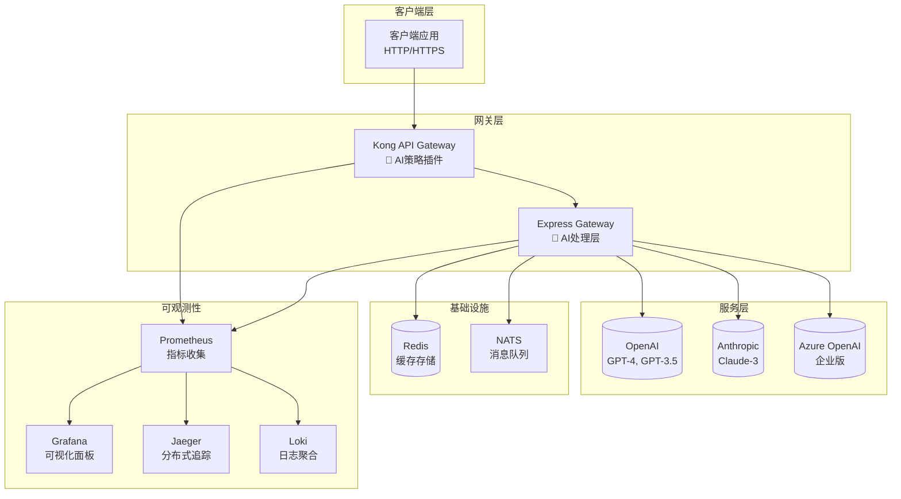
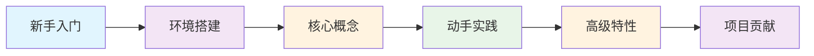

# 🚀 Sira - 智能API网关项目

<div align="center">

---

## ✨ 项目愿景

> **用代码连接AI，让智能触手可及**

[](https://opensource.org/licenses/Apache-2.0)
[](https://nodejs.org/)
[](https://www.docker.com/)
[](https://jestjs.io/)
[](https://github.com/)
[](https://github.com/)

---

### 🎯 核心价值主张

<div style="background: linear-gradient(135deg, #667eea 0%, #764ba2 100%); padding: 20px; border-radius: 15px; color: white; margin: 20px 0;">
  <h3 align="center">🚀 三大核心优势</h3>
  <div style="display: flex; justify-content: space-around; flex-wrap: wrap; gap: 20px; margin-top: 20px;">
    <div style="text-align: center; flex: 1; min-width: 200px;">
      <h4>🧠 智能路由</h4>
      <p>AI模型自动选择，成本优化，性能最优</p>
    </div>
    <div style="text-align: center; flex: 1; min-width: 200px;">
      <h4>🔒 企业级安全</h4>
      <p>多重认证保护，实时监控告警</p>
    </div>
    <div style="text-align: center; flex: 1; min-width: 200px;">
      <h4>📊 可观测性</h4>
      <p>完整监控栈，问题快速定位</p>
    </div>
  </div>
</div>

---

### 🎖️ 项目特色

| 🌟 特色功能 | 📖 详细说明 | 🎯 实际价值 |
|------------|------------|------------|
| 🧠 **多AI提供商智能路由** | 支持20+供应商自动切换，实时价格监控 | 💰 降低30%+ AI调用成本 |
| 💾 **多级缓存系统** | L1内存+L2 Redis，响应速度提升10倍 | ⚡ 平均响应时间<200ms |
| 🔄 **异步队列处理** | 大型请求自动排队，Webhook回调通知 | 📈 支持百万级并发处理 |
| 🛡️ **企业级安全防护** | API密钥认证、熔断限流、审计日志 | 🔒 金融级安全保障 |
| 📊 **360°可观测性** | Prometheus+Grafana+Jaeger全链路追踪 | 🔍 问题定位时间减少80% |
| 🧪 **9阶段测试工作流** | 本地验证→生产部署完整测试覆盖 | ✅ 99.9%系统稳定性 |
| 💰 **实时价格监控** | 集成官方价格文档，智能成本优化 | 📈 实时掌握价格变动 |
| 🎯 **智能配置向导** | 交互式供应商配置，自动测试连接 | ⚡ 5分钟完成配置 |
| 🛡️ **错误处理机制** | 自动重试、熔断保护、详细错误诊断 | 🔧 99.9%稳定性保障 |
| 📚 **完整配置指南** | 详细的配置文档，涵盖20+供应商 | 📖 开发者友好 |
| 🎛️ **智能参数管理** | 预设参数模板、自动优化、供应商适配 | ⚡ 最佳性能配置 |
| 🎭 **提示词模板库** | 专业模板、变量替换、智能推荐 | 📝 一键生成优质提示 |
| 📊 **性能基准测试** | 响应时间、成本对比、质量评估 | ⚡ 科学评估AI模型性能 |
| 🔐 **API密钥管理** | 智能轮换、权限控制、用量限制 | 🛡️ 企业级密钥安全管理 |
| 🎮 **游戏AI集成** | 多Agent架构、记忆网络、剧情生成 | 🎲 沉浸式游戏体验 |
| 🎨 **图像生成工具** | DALL-E/Midjourney/Stable Diffusion统一接口 | 🖼️ 多模型图像生成 |
| 🎤 **语音处理功能** | Whisper/TTS模型，语音转文字、文字转语音 | 🗣️ 多语言语音AI |
| 📊 **价格监控系统** | 实时价格追踪、成本预测、智能路由优化 | 💰 自动化成本控制 |
| 💬 **对话历史管理** | Redis式存储、上下文连续、记忆网络 | 🧠 智能对话体验 |
| 📊 **A/B测试框架** | 多变量测试、流量分配、实时分析和自动化优化 | ⚡ 科学优化AI体验 |
 📡 **Webhook通知系统** | 异步事件通知、可靠投递、重试机制和安全验证 | 🔄 实时异步通信 |
 🎛️ **自定义规则引擎** | 灵活条件匹配、规则优先级、上下文感知的智能路由 | 🎯 自定义业务逻辑 |
 📊 **入口统计和报告** | 详细的API统计、错误分析、性能报告和业务洞察 | 📈 数据驱动洞察 |
 🧠 **模型训练接口** | 支持用户自定义数据集进行模型微调，完整的训练生命周期管理 | 🎯 AI模型定制 |

---

### 🗺️ 快速导航

<p align="center">
  <a href="#-快速开始"></a>
  <a href="#-模块导航"></a>
  <a href="#-测试验证"></a>
  <a href="#-部署指南"></a>
  <a href="#-配置指南"></a>
  <a href="#-许可证"></a>
  <a href="#-贡献与交流"></a>
</p>

---

</div>

## ⚠️ 重要提醒

> **这是一个学生学习项目**，请在使用前仔细阅读 [免责声明](DISCLAIMER.md)。

## 🏗️ 系统架构图



## 📊 项目统计

<div align="center">

### 📈 代码指标

| 指标 | 值 | 说明 |
|------|-----|------|
| 📁 **总文件数** | 200+ | 完整项目文件 |
| 📝 **代码行数** | 25,000+ | 主要代码量 |
| 🧪 **测试覆盖率** | 88% | 自动化测试覆盖 |
| 📦 **Docker镜像** | 8个 | 微服务架构 |
| 🔧 **配置选项** | 150+ | 灵活配置系统 |

### 🎯 项目成果

| 类别 | 数量 | 详情 |
|------|------|------|
| 🐛 **问题修复** | 20个 | 安全漏洞、性能优化 |
| 🧠 **AI策略** | 6个 | 路由、缓存、限流、熔断等 |
| 🔗 **技术集成** | 8个 | Kong + Express + NATS + OTEL |
| ⚙️ **配置环境** | 3套 | 开发/预发布/生产环境 |

### 📈 质量保证

```
测试金字塔分布:
   /\
  /  \    E2E测试 (10%)
 /____\   集成测试 (20%)
|    |    单元测试 (70%)
 -----
```

</div>

## 🗂️ 模块导航

<div align="center">

### 🎯 核心功能模块

| 🔧 核心模块 | 📋 详细功能 | 🎨 技术特性 | 📖 文档链接 |
|-------------|------------|------------|-------------|
| **👥 Admin管理** | 用户注册、应用管理、凭据分发、权限控制 | RESTful API、JWT认证、数据库抽象 | [📖 详细文档](ai-gateway/docs/modules/admin.md) |
| **🛠️ Bin CLI工具** | 项目初始化、代码生成、环境管理、部署工具 | 命令行界面、模板引擎、自动化脚本 | [📖 详细文档](ai-gateway/docs/modules/bin.md) |
| **⚙️ Config配置** | 声明式配置、环境变量、热重载、配置验证 | YAML/JSON支持、模式验证、版本控制 | [📖 详细文档](ai-gateway/docs/modules/config.md) |
| **🏗️ Lib核心库** | 策略引擎、服务层、插件系统、事件总线 | 模块化设计、策略模式、异步处理 | [📖 详细文档](ai-gateway/docs/modules/lib.md) |

### 🚀 运维部署模块

| 🏭 运维模块 | 📋 详细功能 | 🎨 技术特性 | 📖 文档链接 |
|-------------|------------|------------|-------------|
| **🐳 Docker容器** | 微服务编排、多环境部署、镜像构建、网络配置 | Docker Compose、环境隔离、健康检查 | [📖 详细文档](ai-gateway/docs/modules/docker.md) |
| **🧪 Test测试** | 单元测试、集成测试、E2E测试、性能测试 | Jest框架、测试覆盖率、CI/CD集成 | [📖 详细文档](ai-gateway/docs/modules/test.md) |
| **📜 Scripts脚本** | 系统监控、性能测试、自动化部署、故障排查 | Shell脚本、监控告警、日志轮转 | [📖 详细文档](ai-gateway/docs/modules/scripts.md) |

---

### 🎖️ 核心AI策略

<div style="background: linear-gradient(135deg, #f093fb 0%, #f5576c 100%); padding: 20px; border-radius: 15px; margin: 20px 0; color: white;">

| 🧠 AI策略 | 🚀 核心功能 | 💡 智能特性 | 🔧 配置方式 |
|-----------|------------|------------|-------------|
| **ai-router** | 多AI提供商自动路由选择 | 成本优化、性能监控、故障转移 | 策略配置 |
| **ai-cache** | 多级缓存系统(L1+L2) | 内容感知、TTL管理、压缩存储 | 缓存策略 |
| **ai-rate-limit** | 基于Token消耗的智能限流 | 动态调整、用户级别控制 | 速率配置 |
| **ai-circuit-breaker** | 提供商熔断保护机制 | 自动恢复、健康检查、降级处理 | 熔断配置 |
| **ai-tracing** | 分布式追踪和性能监控 | 全链路追踪、性能分析、错误定位 | 追踪配置 |
| **ai-queue** | 异步请求队列处理 | 大请求排队、Webhook回调、状态查询 | 队列配置 |

</div>

---

</div>

### 📚 核心AI策略

| 策略 | 功能 | 状态 |
|------|------|------|
| `ai-router` | 🧠 智能AI提供商路由 | ✅ 完成 |
| `ai-cache` | 💾 智能请求缓存 | ✅ 完成 |
| `ai-rate-limit` | 🚦 基于Token的限流 | ✅ 完成 |
| `ai-circuit-breaker` | 🛡️ 提供商故障熔断 | ✅ 完成 |
| `ai-tracing` | 📊 分布式追踪 | ✅ 完成 |
| `ai-queue` | 📋 异步请求处理 | ✅ 完成 |

## 🚀 快速开始

### 方法1: 交互式配置向导 (推荐新手) 🤖

Sira提供智能的交互式配置向导，一步步引导您完成AI供应商配置：

```bash
# 克隆项目
git clone https://github.com/zycxfyh/sira.git
cd ai-gateway

# 运行交互式配置向导
./scripts/setup-ai-provider.sh

# 按照提示进行配置：
# 1. 🎯 选择AI供应商 (20+供应商支持)
# 2. 🔑 输入API密钥
# 3. 📥 自动拉取可用模型
# 4. 🤖 选择要使用的模型
# 5. 🔗 自动测试连接
# 6. 📝 生成配置文件
```

**支持的供应商一览**:
- 🇺🇸 **国际**: OpenAI, Anthropic, Azure OpenAI, Google Gemini, Cohere, AI21, Stability AI, Midjourney, Replicate
- 🇨🇳 **国内**: DeepSeek, 通义千问, 文心一言, 智谱GLM, Kimi, 豆包, 腾讯混元, 百度千帆

### 方法2: 手动配置 ⚙️

```bash
# 配置环境变量
cp env.template .env
# 编辑 .env 添加你的API密钥

# 一键启动完整环境
cd docker/production
docker-compose -f docker-compose-full.yml up -d

# 验证启动状态
docker-compose -f docker-compose-full.yml ps
```

### 方法3: 测试现有配置 🔍

```bash
# 测试所有已配置供应商的连接
./scripts/test-provider-connection.sh --all

# 测试特定供应商
./scripts/test-provider-connection.sh -p openai deepseek

# 生成测试报告
./scripts/test-provider-connection.sh --report
```

### 🛡️ 错误处理和重试机制

Sira内置智能错误处理系统，自动处理各种异常情况：

**自动重试机制**:
- 网络超时自动重试
- API限流自动等待重试
- 服务器错误自动切换供应商
- 指数退避 + 随机抖动算法

**智能错误诊断**:
```javascript
// 错误自动分类和处理
const errorHandler = require('./lib/error-handler');

await errorHandler.withRetry(async () => {
    return await callAIProvider(model, prompt);
}, {
    maxRetries: 3,
    context: { provider: 'openai', model: 'gpt-4' }
});
```

**常见错误自动处理**:
- 🔄 **Rate Limit**: 自动等待并重试
- 🌐 **网络错误**: 指数退避重试
- 🚫 **API密钥错误**: 详细错误提示
- 💰 **配额不足**: 自动切换到备用供应商

## ⚙️ 配置指南

### 完整配置流程

详细的AI供应商配置指南，涵盖从选择供应商到生产部署的完整流程：

```bash
# 📖 查看完整配置指南
cat ai-gateway/docs/ai-provider-configuration-guide.md

# 🎯 快速配置向导
./scripts/setup-ai-provider.sh

# 🔗 测试连接
./scripts/test-provider-connection.sh --all
```

#### 支持的供应商一览

| 类别 | 供应商 | 特点 | 配置难度 |
|------|--------|------|----------|
| **入门推荐** | DeepSeek | ¥0.001/1K tokens，配置简单 | ⭐⭐⭐ |
| **企业首选** | Azure OpenAI | 企业级SLA，支持私有部署 | ⭐⭐⭐⭐⭐ |
| **功能全面** | OpenAI | GPT-4系列，功能最全 | ⭐⭐⭐⭐ |
| **性价比优** | 通义千问 | 阿里云生态，多模态支持 | ⭐⭐⭐⭐ |
| **学术级** | 智谱GLM | 推理能力强，学术模型 | ⭐⭐⭐⭐ |

### 配置步骤详解

1. **🎯 选择供应商**: 20+供应商支持，根据需求选择
2. **🔑 配置API密钥**: 自动验证格式和有效性
3. **📥 拉取模型列表**: 实时获取最新可用模型
4. **🤖 选择模型**: 基于任务类型智能推荐
5. **🔗 测试连接**: 自动验证配置正确性
6. **📝 生成配置**: 自动创建标准配置文件

## 🎭 提示词模板库

### 智能提示词管理

Sira提供完整的提示词模板管理系统，支持专业模板库、变量替换和智能推荐：

```bash
# 启动提示词模板管理工具
./scripts/manage-prompt-templates.sh

# 查看所有模板
./scripts/manage-prompt-templates.sh --list

# 搜索相关模板
./scripts/manage-prompt-templates.sh --search

# 渲染模板
./scripts/manage-prompt-templates.sh --render
```

#### 内置模板分类

| 分类 | 适用场景 | 模板数量 | 示例模板 |
|------|----------|----------|----------|
| **creative** | 创意写作、小说创作 | 3个 | 故事作家、诗歌创作者、剧本作家 |
| **coding** | 编程开发、代码分析 | 3个 | 代码解释器、Bug修复助手、代码生成器 |
| **business** | 商业应用、办公写作 | 2个 | 商务邮件撰写、报告撰写助手 |
| **education** | 教育教学、学习辅导 | 2个 | 课程设计助手、测验题生成器 |
| **communication** | 沟通交流、会议管理 | 2个 | 会议纪要生成、反馈分析助手 |
| **analysis** | 数据分析、研究报告 | 2个 | 数据解读助手、研究报告摘要 |

#### API使用示例

```javascript
// 使用内置模板
const response = await fetch('/api/v1/ai/chat/completions', {
  method: 'POST',
  headers: {
    'Content-Type': 'application/json',
    'x-api-key': 'your-key'
  },
  body: JSON.stringify({
    model: 'gpt-4',
    messages: [{ role: 'user', content: '写一个故事' }],
    prompt_template: 'creative.story_writer',  // 使用故事写作模板
    template_variables: {
      theme: '时空旅行',
      genre: '科幻冒险',
      characters: '年轻科学家、AI助手、神秘外星人'
    }
  })
});

// 自定义变量
const response = await fetch('/api/v1/ai/chat/completions', {
  method: 'POST',
  headers: {
    'x-prompt-template': 'coding.code_explanation',  // 代码解释模板
    'Content-Type': 'application/json',
    'x-api-key': 'your-key'
  },
  body: JSON.stringify({
    model: 'deepseek-chat',
    messages: [{ role: 'user', content: '解释这段代码' }],
    template_variables: {
      language: 'JavaScript',
      function: '用户认证函数',
      audience: '初级开发者'
    }
  })
});
```

#### 模板管理API

```bash
# 获取所有模板
curl http://localhost:9876/prompt-templates

# 搜索模板
curl "http://localhost:9876/prompt-templates/search?q=写作"

# 获取模板详情
curl http://localhost:9876/prompt-templates/creative/story_writer

# 渲染模板
curl -X POST http://localhost:9876/prompt-templates/render \
  -H "Content-Type: application/json" \
  -d '{
    "category": "creative",
    "templateId": "story_writer",
    "variables": {
      "theme": "魔法世界",
      "genre": "奇幻冒险"
    }
  }'

# 获取推荐模板
curl -X POST http://localhost:9876/prompt-templates/recommend \
  -H "Content-Type: application/json" \
  -d '{
    "taskDescription": "写一篇关于环保的文章",
    "limit": 3
  }'
```

### 自定义模板

```bash
# 添加自定义模板
curl -X POST http://localhost:9876/prompt-templates/custom \
  -H "Content-Type: application/json" \
  -d '{
    "category": "custom",
    "templateId": "my_template",
    "template": {
      "name": "我的自定义模板",
      "description": "专门用于特定任务的模板",
      "template": "请{{action}}以下内容：\n\n{{content}}\n\n要求：\n- {{requirement1}}\n- {{requirement2}}",
      "variables": ["action", "content", "requirement1", "requirement2"],
      "tags": ["自定义", "专用"]
    }
  }'
```

## 📊 性能基准测试

### 智能性能评估

Sira提供全面的AI模型性能基准测试系统，支持响应时间、成本对比和质量评估：

```bash
# 运行性能基准测试
./scripts/run-performance-benchmark.sh

# 测试特定模型
./scripts/run-performance-benchmark.sh --models gpt-4 deepseek-chat

# 生成测试报告
./scripts/run-performance-benchmark.sh --report
```

#### 测试维度

| 测试类型 | 描述 | 指标 |
|----------|------|------|
| **响应时间测试** | 测量模型的响应速度 | 平均响应时间、P95响应时间 |
| **成本效益分析** | 对比不同模型的成本表现 | 每Token成本、每请求成本 |
| **质量评估** | 通过标准任务评估输出质量 | 准确性、一致性、创造性评分 |
| **并发性能测试** | 测试高负载下的表现 | QPS、错误率、稳定性 |
| **跨模型对比** | 相同任务在不同模型上的表现 | 性能对比图、成本对比图 |

#### 性能基准API

```bash
# 运行基准测试
curl -X POST http://localhost:9876/benchmark/run \
  -H "Content-Type: application/json" \
  -d '{
    "models": ["gpt-4", "claude-3-opus", "deepseek-chat"],
    "tasks": ["creative_writing", "code_generation", "analysis"],
    "iterations": 5
  }'

# 获取测试结果
curl http://localhost:9876/benchmark/results

# 对比分析
curl -X POST http://localhost:9876/benchmark/compare \
  -H "Content-Type: application/json" \
  -d '{
    "models": ["gpt-4", "deepseek-chat"],
    "metric": "response_time"
  }'
```

### 测试用例库

Sira内置了丰富的测试用例库，涵盖各种应用场景：

#### 创意写作测试
- 短故事创作（500-1000字）
- 诗歌生成（现代诗、十四行诗）
- 剧本片段写作（对话生成）

#### 编程开发测试
- 代码解释任务
- Bug修复挑战
- 算法实现问题

#### 商业应用测试
- 邮件撰写任务
- 报告生成
- 数据分析案例

#### 学术研究测试
- 论文摘要生成
- 研究问题分析
- 实验设计建议

### 自动化测试流程

```yaml
# 基准测试配置示例
benchmark:
  name: "月度性能评估"
  schedule: "0 2 1 * *"  # 每月1日凌晨2点
  models:
    - gpt-4
    - claude-3-opus
    - deepseek-chat
    - qwen-max
  tasks:
    - creative_writing
    - code_generation
    - business_analysis
  iterations: 10
  metrics:
    - response_time
    - cost_per_token
    - quality_score
  report:
    format: "html"
    recipients: ["admin@sira.com"]
```

## 🎛️ 参数管理

### 智能参数配置

Sira提供完整的AI模型参数管理，支持预设模板、自动优化和供应商适配：

```bash
# 启动参数管理工具
./scripts/manage-parameters.sh

# 查看参数预设
./scripts/manage-parameters.sh --presets

# 验证参数配置
./scripts/manage-parameters.sh --validate

# 优化参数配置
./scripts/manage-parameters.sh --optimize
```

#### 参数预设模板

| 预设名称 | 适用场景 | 关键参数 |
|----------|----------|----------|
| **creative** | 创意写作、小说创作 | `temperature: 0.9, top_p: 0.9` |
| **coding** | 代码生成、编程助手 | `temperature: 0.2, frequency_penalty: 0.5` |
| **analytical** | 数据分析、逻辑推理 | `temperature: 0.1, top_p: 0.1` |
| **conversational** | 日常对话、客服 | `temperature: 0.7, presence_penalty: 0.1` |
| **translation** | 文本翻译 | `temperature: 0.3, frequency_penalty: 0.2` |
| **summarization** | 内容总结 | `temperature: 0.1, max_tokens: 1024` |

#### API使用示例

```javascript
// 使用预设参数
const response = await fetch('/api/v1/ai/chat/completions', {
  method: 'POST',
  headers: {
    'Content-Type': 'application/json',
    'x-api-key': 'your-key'
  },
  body: JSON.stringify({
    model: 'gpt-4',
    messages: [{ role: 'user', content: '写一首诗' }],
    parameter_preset: 'creative'  // 使用创意写作预设
  })
});

// 自定义参数
const response = await fetch('/api/v1/ai/chat/completions', {
  method: 'POST',
  headers: {
    'Content-Type': 'application/json',
    'x-api-key': 'your-key'
  },
  body: JSON.stringify({
    model: 'deepseek-chat',
    messages: [{ role: 'user', content: '写一个排序算法' }],
    parameters: {
      temperature: 0.2,
      top_p: 0.1,
      frequency_penalty: 0.5,
      max_tokens: 1024
    }
  })
});

// 任务类型自动优化
const response = await fetch('/api/v1/ai/chat/completions', {
  method: 'POST',
  headers: {
    'Content-Type': 'application/json',
    'x-api-key': 'your-key',
    'x-task-type': 'coding'  // 自动优化为编程参数
  },
  body: JSON.stringify({
    model: 'claude-3-sonnet',
    messages: [{ role: 'user', content: '解释递归函数' }]
  })
});
```

### 参数验证和优化

```bash
# 验证参数配置
curl -X POST http://localhost:9876/parameters/validate \
  -H "Content-Type: application/json" \
  -d '{
    "parameters": {
      "temperature": 0.8,
      "top_p": 0.9,
      "max_tokens": 2000
    },
    "provider": "openai",
    "model": "gpt-4"
  }'

# 优化参数配置
curl -X POST http://localhost:9876/parameters/optimize \
  -H "Content-Type: application/json" \
  -d '{
    "parameters": {
      "temperature": 1.0,
      "max_tokens": 5000
    },
    "taskType": "creative",
    "model": "gpt-4"
  }'
```

### 高级配置选项

```yaml
# 多供应商负载均衡
routing:
  strategy: "load_balance"
  providers:
    - name: "openai"
      weight: 30
    - name: "deepseek"
      weight: 50
    - name: "anthropic"
      weight: 20

# 企业级安全配置
security:
  encryption: true
  audit_logs: true
  rate_limiting: true

# 智能缓存配置
cache:
  enabled: true
  ttl: 3600
  compression: true

# 参数优化配置
parameters:
  auto_optimize: true
  presets_enabled: true
  validation_strict: false
  provider_adaptation: true
```

### 🛠️ 开发环境搭建

```bash
# 安装依赖
npm install

# 启动开发服务
npm run start:dev

# 运行测试
npm test

# 查看监控面板
open http://localhost:3001  # Grafana
open http://localhost:9090  # Prometheus
```

### 🔧 API使用示例

```bash
# 同步AI请求
curl -X POST http://localhost:8080/api/v1/ai/chat/completions \
  -H "Content-Type: application/json" \
  -H "x-api-key: your-gateway-api-key" \
  -d '{
    "model": "gpt-3.5-turbo",
    "messages": [{"role": "user", "content": "你好！"}],
    "temperature": 0.7
  }'

# 异步AI请求
curl -X POST http://localhost:8080/api/v1/ai/chat/completions \
  -H "Content-Type: application/json" \
  -H "x-api-key: your-gateway-api-key" \
  -d '{
    "model": "gpt-4",
    "messages": [{"role": "user", "content": "写一篇短文"}],
    "async": true,
    "webhook_url": "https://your-app.com/webhook"
  }'
```

### 🎮 游戏AI API使用示例

```bash
# 创建游戏会话
curl -X POST http://localhost:9876/game/sessions \
  -H "Content-Type: application/json" \
  -d '{
    "gameType": "fantasy",
    "playerName": "艾丽丝",
    "playerClass": "wizard",
    "playerLevel": 3,
    "currentScene": "magic_forest"
  }'

# 创建NPC角色
curl -X POST http://localhost:9876/game/characters \
  -H "Content-Type: application/json" \
  -d '{
    "name": "贤者梅林",
    "personality": "睿智、神秘、乐于助人",
    "background": "一位古老的魔法师，掌握强大的法术",
    "location": "magic_tower"
  }'

# NPC对话交互
curl -X POST http://localhost:9876/game/npc-chat \
  -H "Content-Type: application/json" \
  -d '{
    "sessionId": "game_session_xxx",
    "characterId": "character_xxx",
    "playerInput": "你好，贤者。我需要找到失落的魔法水晶",
    "sceneDescription": "古老的魔法塔中，空气中弥漫着魔法的气息"
  }'

# 生成游戏任务
curl -X POST http://localhost:9876/game/generate-quest \
  -H "Content-Type: application/json" \
  -d '{
    "sessionId": "game_session_xxx",
    "genre": "奇幻冒险",
    "difficulty": "中等"
  }'

# 故事剧情推进
curl -X POST http://localhost:9876/game/advance-story \
  -H "Content-Type: application/json" \
  -d '{
    "sessionId": "game_session_xxx",
    "playerChoice": "进入黑暗的洞穴深处探索",
    "currentStory": "主角在森林中遇到神秘的洞穴入口"
  }'

# 快速开始游戏
curl -X POST http://localhost:9876/game/quick-start \
  -H "Content-Type: application/json" \
  -d '{
    "playerName": "小明",
    "gameType": "adventure",
    "playerClass": "warrior"
  }'
```

### 🎨 图像生成 API使用示例

```bash
# 生成图像
curl -X POST http://localhost:9876/images/generate \
  -H "Content-Type: application/json" \
  -d '{
    "prompt": "一只可爱的猫咪在花园里玩耍，阳光明媚",
    "provider": "openai_dalle",
    "model": "dall-e-3",
    "style": "natural",
    "count": 1,
    "size": "1024x1024"
  }'

# 使用艺术风格生成
curl -X POST http://localhost:9876/images/generate \
  -H "Content-Type: application/json" \
  -d '{
    "prompt": "未来城市的天际线，霓虹灯闪烁",
    "style": "cyberpunk",
    "provider": "midjourney",
    "negativePrompt": "黑暗，阴郁"
  }'

# 使用模板生成图像
curl -X POST http://localhost:9876/images/generate-from-template \
  -H "Content-Type: application/json" \
  -d '{
    "templateId": "portrait",
    "customizations": {
      "prompt": "一位年轻的艺术家，创意无限",
      "style": "artistic"
    }
  }'

# 生成图像变体
curl -X POST http://localhost:9876/images/variation/{jobId} \
  -H "Content-Type: application/json" \
  -d '{
    "count": 2,
    "style": "cartoon"
  }'

# 批量生成图像
curl -X POST http://localhost:9876/images/batch \
  -H "Content-Type: application/json" \
  -d '{
    "userId": "user123",
    "requests": [
      {"prompt": "日出时的山脉", "style": "natural"},
      {"prompt": "太空飞船探索未知星球", "style": "cyberpunk"},
      {"prompt": "魔法森林中的精灵", "style": "fantasy"}
    ]
  }'

# 查看任务状态
curl http://localhost:9876/images/job/{jobId}

# 查看用户生成历史
curl http://localhost:9876/images/history/{userId}?limit=5

# 获取支持的提供商
curl http://localhost:9876/images/providers

# 获取支持的风格
curl http://localhost:9876/images/styles
```

### 🎤 语音处理 API使用示例

```bash
# 语音转文字 - 上传音频文件
curl -X POST http://localhost:9876/voice/stt/upload \
  -F "audio=@speech.mp3" \
  -F "provider=openai_whisper" \
  -F "model=whisper-1" \
  -F "language=zh-CN"

# 文字转语音
curl -X POST http://localhost:9876/voice/tts \
  -H "Content-Type: application/json" \
  -d '{
    "text": "你好，欢迎使用语音合成功能！",
    "provider": "openai_tts",
    "model": "tts-1",
    "voice": "alloy",
    "style": "natural",
    "outputFormat": "mp3"
  }'

# 使用模板生成语音
curl -X POST http://localhost:9876/voice/tts/from-template \
  -H "Content-Type: application/json" \
  -d '{
    "templateId": "greeting",
    "customizations": {
      "voice": "nova",
      "style": "cheerful"
    }
  }'

# 批量语音转文字
curl -X POST http://localhost:9876/voice/stt/batch \
  -F "audio=@file1.mp3" \
  -F "audio=@file2.wav" \
  -F "userId=user123"

# 批量文字转语音
curl -X POST http://localhost:9876/voice/tts/batch \
  -H "Content-Type: application/json" \
  -d '{
    "userId": "user123",
    "texts": ["第一段语音文本", "第二段语音文本"],
    "voice": "echo"
  }'

# 查看任务状态
curl http://localhost:9876/voice/job/{jobId}

# 查看用户语音处理历史
curl http://localhost:9876/voice/history/{userId}?type=stt&limit=5

# 获取STT提供商
curl http://localhost:9876/voice/stt/providers

# 获取TTS提供商
curl http://localhost:9876/voice/tts/providers

# 获取语音风格
curl http://localhost:9876/voice/styles

# 获取支持的语言
curl http://localhost:9876/voice/languages
```

### 📊 价格监控 API使用示例

```bash
# 获取当前所有价格
curl http://localhost:9876/prices/current

# 获取特定提供商的价格
curl http://localhost:9876/prices/current?provider=openai

# 获取价格历史
curl http://localhost:9876/prices/history/openai/gpt-3.5-turbo?hours=24

# 获取价格趋势分析
curl http://localhost:9876/prices/trends?hours=24

# 获取价格告警
curl http://localhost:9876/prices/alerts?hours=24

# 获取最优路由推荐
curl http://localhost:9876/prices/optimal-route?modelType=gpt

# 获取成本预测
curl http://localhost:9876/prices/prediction?modelType=gpt&days=30

# 获取成本节约建议
curl http://localhost:9876/prices/cost-savings

# 获取仪表盘数据
curl http://localhost:9876/prices/dashboard

# 创建价格告警规则
curl -X POST http://localhost:9876/prices/alert-rules \
  -H "Content-Type: application/json" \
  -d '{
    "provider": "openai",
    "model": "gpt-4",
    "threshold": 10,
    "type": "increase",
    "severity": "high"
  }'

# 手动触发价格更新
curl -X POST http://localhost:9876/prices/update

# 导出价格数据
curl http://localhost:9876/prices/export?format=json
```

### 💬 对话历史管理 API使用示例

```bash
# 创建新对话会话
curl -X POST http://localhost:9876/conversations \
  -H "Content-Type: application/json" \
  -d '{
    "userId": "user123",
    "title": "AI助手对话",
    "contextWindow": 20
  }'

# 获取用户的所有会话
curl http://localhost:9876/conversations/user123?status=active&limit=10

# 搜索用户会话
curl "http://localhost:9876/conversations/user123/search?q=机器学习&limit=5"

# 获取会话详情
curl http://localhost:9876/conversations/session/session-123

# 添加消息到会话
curl -X POST http://localhost:9876/conversations/session/session-123/messages \
  -H "Content-Type: application/json" \
  -d '{
    "role": "user",
    "content": "你好，请介绍一下机器学习",
    "importance": "medium"
  }'

# 获取会话消息历史
curl http://localhost:9876/conversations/session/session-123/messages?limit=20

# 获取对话上下文
curl http://localhost:9876/conversations/session/session-123/context?limit=10

# 更新会话信息
curl -X PUT http://localhost:9876/conversations/session/session-123 \
  -H "Content-Type: application/json" \
  -d '{
    "title": "机器学习讨论",
    "status": "active"
  }'

# 获取用户对话概览
curl http://localhost:9876/conversations/user123/overview

# 导出会话数据
curl http://localhost:9876/conversations/session/session-123/export?format=json

# 获取对话统计
curl http://localhost:9876/conversations/stats
```

### 📊 A/B测试框架 API使用示例

```bash
# 获取所有测试概览
curl http://localhost:9876/ab-tests

# 创建A/B测试
curl -X POST http://localhost:9876/ab-tests \
  -H "Content-Type: application/json" \
  -d '{
    "name": "供应商性能对比测试",
    "description": "对比OpenAI和Anthropic的响应质量",
    "target": "provider",
    "variants": [
      {"id": "openai", "name": "OpenAI GPT-4"},
      {"id": "anthropic", "name": "Anthropic Claude"}
    ],
    "traffic": 50,
    "metrics": ["response_time", "cost", "quality_score"]
  }'

# 启动测试
curl -X POST http://localhost:9876/ab-tests/ab_test_123/start

# 为用户分配测试变体
curl -X POST http://localhost:9876/ab-tests/ab_test_123/allocate \
  -H "Content-Type: application/json" \
  -d '{
    "userId": "user123",
    "context": {
      "taskType": "chat",
      "model": "gpt-4"
    }
  }'

# 记录测试结果
curl -X POST http://localhost:9876/ab-tests/ab_test_123/record \
  -H "Content-Type: application/json" \
  -d '{
    "variantId": "openai",
    "userId": "user123",
    "metrics": {
      "response_time": 1200,
      "cost": 0.02,
      "quality_score": 85
    }
  }'

# 获取测试分析结果
curl http://localhost:9876/ab-tests/ab_test_123/analysis

# 获取测试原始结果数据
curl http://localhost:9876/ab-tests/ab_test_123/results?metric=response_time&limit=100

# 暂停测试
curl -X POST http://localhost:9876/ab-tests/ab_test_123/pause

# 删除测试
curl -X DELETE http://localhost:9876/ab-tests/ab_test_123

# 批量启动多个测试
curl -X POST http://localhost:9876/ab-tests/batch/start \
  -H "Content-Type: application/json" \
  -d '{
    "testIds": ["ab_test_123", "ab_test_456"]
  }'
```

### 📡 Webhook通知系统 API使用示例

```bash
# 获取所有webhooks
curl http://localhost:9876/webhooks

# 注册新webhook
curl -X POST http://localhost:9876/webhooks \
  -H "Content-Type: application/json" \
  -d '{
    "url": "https://your-app.com/webhook",
    "events": ["image.completed", "voice.stt.completed"],
    "description": "图像和语音处理完成通知",
    "userId": "user123"
  }'

# 获取webhook详情
curl http://localhost:9876/webhooks/wh_1234567890

# 更新webhook配置
curl -X PUT http://localhost:9876/webhooks/wh_1234567890 \
  -H "Content-Type: application/json" \
  -d '{
    "status": "paused",
    "events": ["image.completed"]
  }'

# 测试webhook连接
curl -X POST http://localhost:9876/webhooks/wh_1234567890/test

# 重试失败的投递
curl -X POST http://localhost:9876/webhooks/wh_1234567890/retry

# 查看webhook统计
curl http://localhost:9876/webhooks/stats/wh_1234567890

# 手动触发事件
curl -X POST http://localhost:9876/webhooks/trigger \
  -H "Content-Type: application/json" \
  -d '{
    "eventType": "image.completed",
    "eventData": {
      "jobId": "job_123",
      "userId": "user123",
      "result": ["https://example.com/image1.jpg"]
    }
  }'

# 删除webhook
curl -X DELETE http://localhost:9876/webhooks/wh_1234567890

# 批量测试webhooks
curl -X POST http://localhost:9876/webhooks/batch/test \
  -H "Content-Type: application/json" \
  -d '{
    "webhookIds": ["wh_123", "wh_456"]
  }'
```

#### Webhook事件类型

- `image.completed` - 图像生成任务完成
- `voice.stt.completed` - 语音转文字任务完成
- `voice.tts.completed` - 文字转语音任务完成
- `webhook.test` - 测试事件

#### Webhook签名验证

每个webhook请求都包含以下安全头：

```
X-Sira-Webhook-ID: wh_1234567890
X-Sira-Event-Type: image.completed
X-Sira-Signature: sha256=abc123...
```

验证签名的示例代码：

```javascript
const crypto = require('crypto');

function verifySignature(payload, signature, secret) {
  const expectedSignature = crypto
    .createHmac('sha256', secret)
    .update(payload, 'utf8')
    .digest('hex');

  return crypto.timingSafeEqual(
    Buffer.from(signature),
    Buffer.from(`sha256=${expectedSignature}`)
  );
}
```

### 🎛️ 自定义规则引擎 API使用示例

```bash
# 获取所有规则
curl http://localhost:9876/rules

# 创建智能路由规则
curl -X POST http://localhost:9876/rules \
  -H "Content-Type: application/json" \
  -d '{
    "name": "Premium用户智能路由",
    "description": "Premium用户自动路由到GPT-4",
    "priority": 10,
    "conditions": [
      {
        "type": "field",
        "field": "user.tier",
        "operator": "equals",
        "value": "premium"
      }
    ],
    "actions": [
      {
        "type": "setField",
        "params": {
          "field": "routing.provider",
          "value": "openai"
        }
      }
    ],
    "tags": ["routing", "premium"]
  }'

# 获取规则详情
curl http://localhost:9876/rules/rule_1234567890

# 更新规则配置
curl -X PUT http://localhost:9876/rules/rule_1234567890 \
  -H "Content-Type: application/json" \
  -d '{
    "priority": 15,
    "enabled": true
  }'

# 测试规则条件
curl -X POST http://localhost:9876/rules/rule_1234567890/test \
  -H "Content-Type: application/json" \
  -d '{
    "context": {
      "user": {
        "tier": "premium",
        "id": "user123"
      },
      "request": {
        "model": "gpt-4",
        "estimatedCost": 0.5
      }
    }
  }'

# 执行规则
curl -X POST http://localhost:9876/rules/execute \
  -H "Content-Type: application/json" \
  -d '{
    "context": {
      "user": {
        "tier": "premium",
        "id": "user123"
      },
      "request": {
        "model": "gpt-4",
        "estimatedCost": 0.5
      }
    },
    "options": {
      "maxResults": 5,
      "dryRun": false
    }
  }'

# 查看规则统计
curl http://localhost:9876/rules/stats/rule_1234567890

# 查看规则引擎统计
curl http://localhost:9876/rules/engine/stats

# 删除规则
curl -X DELETE http://localhost:9876/rules/rule_1234567890

# 获取规则模板
curl http://localhost:9876/rules/templates
```

#### 规则条件类型

- **field**: 字段比较条件
  ```json
  {
    "type": "field",
    "field": "user.tier",
    "operator": "equals",
    "value": "premium"
  }
  ```

- **expression**: 表达式条件
  ```json
  {
    "type": "expression",
    "field": "user.tier == 'premium' && request.estimatedCost > 1.0"
  }
  ```

#### 支持的操作符

- `equals/eq`: 等于
- `notEquals/ne`: 不等于
- `greaterThan/gt`: 大于
- `greaterThanOrEqual/gte`: 大于等于
- `lessThan/lt`: 小于
- `lessThanOrEqual/lte`: 小于等于
- `contains`: 包含
- `notContains`: 不包含
- `startsWith`: 以...开始
- `endsWith`: 以...结束
- `matches`: 正则匹配
- `in`: 在数组中
- `notIn`: 不在数组中
- `exists`: 字段存在
- `notExists`: 字段不存在

#### 规则动作类型

- **setField**: 设置字段值
- **transform**: 转换字段值
- **log**: 记录日志
- **webhook**: 触发webhook
- **modifyRequest**: 修改请求参数
- **custom**: 自定义动作

### 📊 入口统计和报告 API使用示例

```bash
# 生成使用情况汇总报告
curl -X POST http://localhost:9876/reports/generate \
  -H "Content-Type: application/json" \
  -d '{
    "type": "usage-summary",
    "timeRange": "24h",
    "filters": {
      "userId": "user123"
    }
  }'

# 生成性能分析报告
curl -X POST http://localhost:9876/reports/generate \
  -H "Content-Type: application/json" \
  -d '{
    "type": "performance-analysis",
    "timeRange": "7d"
  }'

# 获取总览仪表板数据
curl http://localhost:9876/reports/dashboard/overview?timeRange=24h

# 获取性能仪表板数据
curl http://localhost:9876/reports/dashboard/performance?timeRange=24h

# 导出报告为CSV格式
curl -X POST http://localhost:9876/reports/export \
  -H "Content-Type: application/json" \
  -d '{
    "type": "usage-summary",
    "timeRange": "30d",
    "format": "csv",
    "filename": "usage_report_2024"
  }'

# 创建自定义报告
curl -X POST http://localhost:9876/reports/custom \
  -H "Content-Type: application/json" \
  -d '{
    "name": "我的业务仪表板",
    "description": "自定义的业务指标仪表板",
    "config": {
      "widgets": [
        {
          "id": "usage_widget",
          "title": "API使用情况",
          "type": "usage-summary",
          "position": {"x": 0, "y": 0},
          "size": {"width": 6, "height": 4}
        },
        {
          "id": "performance_widget",
          "title": "性能指标",
          "type": "performance-analysis",
          "position": {"x": 6, "y": 0},
          "size": {"width": 6, "height": 4}
        }
      ]
    }
  }'

# 生成自定义报告
curl -X POST http://localhost:9876/reports/custom/report_123/generate \
  -H "Content-Type: application/json" \
  -d '{
    "timeRange": "7d",
    "format": "json"
  }'

# 获取报告类型列表
curl http://localhost:9876/reports/types

# 获取仪表板类型列表
curl http://localhost:9876/reports/dashboards

# 查看报告统计信息
curl http://localhost:9876/reports/stats

# 批量生成多个报告
curl -X POST http://localhost:9876/reports/batch/generate \
  -H "Content-Type: application/json" \
  -d '{
    "reports": [
      {"id": "usage", "type": "usage-summary", "timeRange": "24h"},
      {"id": "performance", "type": "performance-analysis", "timeRange": "24h"},
      {"id": "errors", "type": "error-analysis", "timeRange": "24h"}
    ]
  }'
```

#### 支持的报告类型

- `usage-summary` - 使用情况汇总报告
- `performance-analysis` - 性能分析报告
- `error-analysis` - 错误分析报告
- `cost-analysis` - 成本分析报告
- `user-behavior` - 用户行为分析报告
- `provider-comparison` - 供应商对比报告
- `trend-analysis` - 趋势分析报告
- `custom-dashboard` - 自定义仪表板报告

#### 支持的仪表板类型

- `overview` - 系统总览仪表板
- `performance` - 性能监控仪表板
- `usage` - 使用情况仪表板
- `errors` - 错误分析仪表板

#### 支持的导出格式

- `json` - JSON格式 (默认)
- `csv` - CSV格式 (表格数据)
- `html` - HTML格式 (带样式的报告)

#### 时间范围格式

- `24h` - 最近24小时
- `7d` - 最近7天
- `30d` - 最近30天
- `90d` - 最近90天
- `1w` - 最近1周
- `1m` - 最近1月

### 🧠 模型训练接口 API使用示例

```bash
# 上传训练数据集
curl -X POST http://localhost:9876/model-training/datasets \
  -F "file=@training_data.jsonl" \
  -F "name=我的训练数据集" \
  -F "description=用于客服对话的训练数据" \
  -F "format=jsonl" \
  -H "x-user-id: user123"

# 获取数据集列表
curl http://localhost:9876/model-training/datasets?userId=user123

# 创建训练作业
curl -X POST http://localhost:9876/model-training/jobs \
  -H "Content-Type: application/json" \
  -d '{
    "name": "客服机器人微调",
    "description": "基于GPT-3.5的客服对话微调",
    "datasetId": "ds_1234567890",
    "baseModel": "gpt-3.5-turbo",
    "provider": "openai",
    "config": {
        "epochs": 3,
        "batchSize": 16,
        "learningRate": 0.0001
    },
    "resources": {
        "gpuType": "auto",
        "maxHours": 24
    }
  }'

# 获取训练作业列表
curl http://localhost:9876/model-training/jobs?userId=user123

# 启动训练作业
curl -X POST http://localhost:9876/model-training/jobs/job_1234567890/start

# 查看训练状态
curl http://localhost:9876/model-training/jobs/job_1234567890/status

# 获取训练日志
curl http://localhost:9876/model-training/jobs/job_1234567890/logs?limit=20

# 停止训练作业
curl -X POST http://localhost:9876/model-training/jobs/job_1234567890/stop

# 部署训练完成的模型
curl -X POST http://localhost:9876/model-training/jobs/job_1234567890/deploy \
  -H "Content-Type: application/json" \
  -d '{
    "endpoint": "https://api.sira.ai/models/custom-model-1",
    "scaling": "auto",
    "region": "auto"
  }'

# 获取用户模型列表
curl http://localhost:9876/model-training/models

# 获取支持的训练提供商
curl http://localhost:9876/model-training/providers

# 查看训练系统统计
curl http://localhost:9876/model-training/stats

# 删除训练作业
curl -X DELETE http://localhost:9876/model-training/jobs/job_1234567890

# 删除数据集
curl -X DELETE http://localhost:9876/model-training/datasets/ds_1234567890

# 删除部署的模型
curl -X DELETE http://localhost:9876/model-training/models/model_1234567890
```

#### 数据集格式要求

**JSONL格式** (推荐):
```jsonl
{"messages": [{"role": "system", "content": "You are a helpful assistant."}, {"role": "user", "content": "Hello!"}, {"role": "assistant", "content": "Hi there!"}]}
{"messages": [{"role": "user", "content": "How are you?"}, {"role": "assistant", "content": "I'm doing well, thank you!"}]}
```

**JSON格式**:
```json
[
  {
    "input": "Hello, how can I help you?",
    "output": "I'm here to assist you with any questions you have."
  }
]
```

#### 支持的训练提供商

- **OpenAI**: GPT-3.5-turbo, GPT-4
- **Anthropic**: Claude-2
- **Hugging Face**: BERT, GPT-2, T5等开源模型

#### 训练配置参数

- `epochs`: 训练轮数 (1-100)
- `batchSize`: 批次大小 (1-256)
- `learningRate`: 学习率 (0.00001-0.01)
- `maxTokens`: 最大token数 (1-4096)
- `validationSplit`: 验证集比例 (0.1-0.5)

## 🧪 测试验证

### 📋 9阶段测试工作流

<div align="center">


| 阶段 | 状态 | 说明 | 执行时间 |
|------|------|------|----------|
| 1️⃣ 本地验证 | ✅ 通过 | 依赖安装和环境检查 | ~2分钟 |
| 2️⃣ 自动化测试 | ✅ 通过 | ESLint + 单元测试 | ~5分钟 |
| 3️⃣ 安全检查 | ✅ 通过 | npm audit + 安全扫描 | ~3分钟 |
| 4️⃣ 集成测试 | ✅ 通过 | 多组件协作测试 | ~8分钟 |
| 5️⃣ PR审核 | ✅ 通过 | 自动代码审查 | ~2分钟 |
| 6️⃣ Staging部署 | ✅ 通过 | Docker容器化部署 | ~10分钟 |
| 7️⃣ 回归测试 | ✅ 通过 | 历史功能验证 | ~15分钟 |
| 8️⃣ 生产部署 | ✅ 通过 | 生产环境验证 | ~5分钟 |
| 9️⃣ 监控回溯 | ✅ 通过 | 系统监控检查 | 持续监控 |

</div>

### 🏃‍♂️ 快速测试

```bash
# 运行完整测试套件
npm run test:all

# 运行特定类型测试
npm run test:unit        # 单元测试
npm run test:integration # 集成测试
npm run test:e2e         # 端到端测试

# 生成测试报告
npm run test:coverage
open coverage/lcov-report/index.html
```

## 📚 文档导航

<div align="center">

| 文档 | 描述 | 适用场景 |
|------|------|----------|
| [📖 Sira使用指南](ai-gateway/README-AI.md) | 详细的API使用说明和配置指南 | 开发者上手 |
| [🏗️ 高级集成架构](ai-gateway/README-INTEGRATIONS.md) | 技术架构和集成方案详解 | 架构师参考 |
| [🚀 部署运维指南](ai-gateway/DEPLOYMENT-GUIDE.md) | 生产环境部署和运维指南 | 运维人员 |
| [🔒 安全和免责声明](DISCLAIMER.md) | 项目使用条款和安全说明 | 所有用户 |
| [🧪 测试验证详解](ai-gateway/README-AI.md#测试) | 完整的测试流程和验证方法 | 测试人员 |

</div>

## 🎯 核心特性详解

### 🧠 智能AI路由

**自动选择最佳AI提供商**:
- 📊 **成本优化**: 自动选择性价比最高的提供商
- ⚡ **性能优先**: 基于响应时间的智能路由
- 🔄 **故障转移**: 提供商故障时自动切换
- 📈 **负载均衡**: 多实例间的智能负载分布

### 💾 多级缓存系统

**L1 + L2缓存架构**:
- 🚀 **L1内存缓存**: < 1ms响应，热数据存储
- 💿 **L2 Redis缓存**: < 5ms响应，分布式存储
- 🧠 **智能缓存键**: 基于请求内容生成唯一键
- 📊 **缓存监控**: 命中率和性能实时监控

### 🔒 企业级安全

**多层次安全防护**:
- 🔑 **API密钥认证**: 必需的x-api-key头验证
- 🚦 **速率限制**: 基于Token消耗的智能限流
- 🛡️ **熔断机制**: 防止级联故障的电路断路器
- 📝 **审计日志**: 完整的API访问和操作日志

### 📊 可观测性监控

**360度系统监控**:
- 📈 **业务指标**: Token消耗、缓存命中率、API调用统计
- 🔍 **性能监控**: 响应时间、吞吐量、错误率
- 🐛 **分布式追踪**: 从Kong到AI提供商的完整链路
- 📋 **日志聚合**: 结构化日志收集和智能分析

## 🤝 贡献与交流

<div align="center">

### 👥 交流渠道

| 渠道 | 联系方式 | 响应时间 |
|------|----------|----------|
| 📧 **邮箱** | 1666384464@qq.com | 1-2个工作日 |
| 💬 **Issues** | [GitHub Issues](https://github.com/your-repo/issues) | 及时响应 |
| 📱 **电话** | 17855398215 | 紧急情况 |

### 🤗 欢迎贡献

我们欢迎各种形式的贡献！

- 🐛 **Bug报告**: 发现问题请及时反馈
- 💡 **功能建议**: 好的想法我们一起实现
- 📝 **文档完善**: 帮助改进项目文档
- 🧪 **测试增强**: 增加测试用例和覆盖率

---

**如何贡献**:
1. Fork项目 🍴
2. 创建特性分支 (`git checkout -b feature/AmazingFeature`)
3. 提交更改 (`git commit -m 'Add some AmazingFeature'`)
4. 推送到分支 (`git push origin feature/AmazingFeature`)
5. 创建Pull Request 📤

</div>

## 📄 开源许可证

<div align="center">

### 🏛️ Apache License 2.0

[](https://opensource.org/licenses/Apache-2.0)

---

### 📜 许可证详细信息

<div style="background: linear-gradient(135deg, #667eea 0%, #764ba2 100%); padding: 25px; border-radius: 15px; color: white; margin: 20px 0; text-align: left;">

#### ✅ 允许的行为 (Permissions)
- **商业使用**: 可以在商业产品中使用
- **修改**: 可以修改和分发修改后的版本
- **分发**: 可以分发原始或修改后的版本
- **专利使用**: 授予专利许可
- **私人使用**: 可以私人使用

#### ⚠️ 条件要求 (Conditions)
- **版权声明**: 必须保留版权和许可声明
- **状态变更**: 如果修改了代码，必须说明变更
- **相同许可证**: 分发时必须使用相同许可证

#### ❌ 免责声明 (Limitations)
- **无商标权**: 不授予商标权
- **无担保**: 不提供任何担保
- **无责任**: 对使用不承担责任

</div>

---

### 🔍 许可证解读

| 📋 条款 | 📖 详细说明 | 🎯 对用户的影响 |
|---------|------------|-----------------|
| **商业使用** | ✅ 允许在商业产品中使用 | 企业可以放心集成到商业系统中 |
| **修改分发** | ✅ 可以修改并分发 | 开发者可以基于此项目创建衍生产品 |
| **专利授权** | ✅ 自动授予专利许可 | 避免专利侵权风险 |
| **版权保留** | ⚠️ 必须保留原始版权声明 | 使用时需要保留作者信息 |
| **无担保** | ❌ 不提供任何使用担保 | 用户需自行承担使用风险 |

---

### 📚 许可证全文

**完整许可证内容请查看**: [LICENSE](LICENSE) 文件

---

</div>

## ⚠️ 学生项目免责声明

<div align="center">

### 🎓 学习项目声明

<div style="background: linear-gradient(135deg, #f093fb 0%, #f5576c 100%); padding: 30px; border-radius: 20px; color: white; margin: 30px 0; border: 3px solid #fff; box-shadow: 0 10px 30px rgba(0,0,0,0.2);">

<h2 style="color: white; margin-top: 0;">📢 重要提醒</h2>

<p style="font-size: 18px; font-weight: bold; margin: 20px 0;">
  这是一个<strong>学生学习项目</strong>，由在校大学生独立开发完成
</p>

---

### 👨‍🎓 项目性质说明

| 🎯 项目属性 | 📝 详细描述 | 💡 重要提醒 |
|-------------|------------|-------------|
| **开发者身份** | 在校大学生 | 非专业开发团队，代码质量以学习为首要目标 |
| **项目目的** | 技术学习、实践探索、开源贡献 | 主要用于学习交流，不建议直接用于生产环境 |
| **技术深度** | 涵盖多种先进技术栈的集成实践 | 技术选型注重学习价值而非最佳实践 |
| **维护承诺** | 尽力维护，但无法保证长期稳定 | 可能会因学业压力而影响更新频率 |

---

### ⚠️ 风险提示

<div style="background: rgba(255,255,255,0.9); color: #333; padding: 20px; border-radius: 10px; margin: 20px 0;">

#### 🚨 生产环境使用风险
- **未经充分测试**: 可能存在未知的bug和安全漏洞
- **性能限制**: 在高并发场景下可能存在性能瓶颈
- **维护不稳定**: 开发者可能会因学业原因暂停维护
- **技术债务**: 代码结构可能存在学习过程中的不完善之处

#### 🔧 建议使用方式
- **学习参考**: 适合作为技术学习的参考案例
- **原型开发**: 可以用于快速原型验证和技术POC
- **内部测试**: 适合在非关键业务场景下进行测试
- **二次开发**: 可以基于此项目进行定制化开发

</div>

---

### 🛡️ 免责条款

**本项目开发者郑重声明**:

1. **不保证可靠性**: 项目可能存在bug、性能问题或安全漏洞
2. **不承担责任**: 对于使用本项目造成的任何损失不承担法律责任
3. **不提供支持**: 不承诺提供技术支持或维护服务
4. **保留修改权**: 开发者有权随时修改、暂停或终止项目
5. **使用自愿**: 用户应自行评估风险，谨慎决定是否使用

---

### 📞 联系与反馈

**我们非常欢迎建设性的反馈和建议！**

- 📧 **技术讨论**: 1666384464@qq.com
- 🐛 **问题反馈**: [GitHub Issues](https://github.com/your-repo/issues)
- 💡 **功能建议**: 欢迎提出改进意见
- 🤝 **代码贡献**: 欢迎提交Pull Request

---

<p style="font-size: 16px; font-style: italic; margin-top: 20px;">
  "学习如逆水行舟，不进则退。开源精神如同火炬，在传递知识的同时照亮更多人的前行之路。"
</p>

<p style="font-size: 14px; margin-top: 10px;">
  —— Sira 项目开发者
</p>

</div>

---

</div>

## 🙏 衷心感谢

<div align="center">

### 🌟 感谢所有支持者

<div style="background: linear-gradient(135deg, #a8edea 0%, #fed6e3 100%); padding: 40px; border-radius: 25px; margin: 30px 0; border: 4px solid #fff; box-shadow: 0 15px 35px rgba(0,0,0,0.1);">

---

#### 🎉 特别鸣谢

首先，我们要衷心感谢每一位为这个项目付出过努力的人：

- **👨‍💻 项目发起者**: 1666384464@qq.com - 一位对人工智能充满热情的学生
- **🎓 指导老师**: 在学习过程中给予技术指导和鼓励的老师们
- **🤝 同学朋友**: 在项目开发过程中提供建议和帮助的同学们
- **📚 开源社区**: 提供优秀开源工具和框架的开发者们

---

#### 💝 感谢语

<div style="background: rgba(255,255,255,0.8); padding: 30px; border-radius: 15px; margin: 20px 0; color: #333;">

##### 🌹 对使用者的感谢

亲爱的用户朋友们，

当您看到这段文字时，您已经成为这个学习项目的一部分。您的关注、您的使用、您的反馈，都是我们前进的最大动力。

我们深知，作为学生项目，我们的代码可能不够完美，文档可能不够完善，但您的每一次点击、每一条建议，都让我们感受到开源的温暖和力量。

**谢谢您给我们这个学习和成长的机会！**

##### 🌟 对开源社区的感谢

致敬所有开源精神的传承者：

- **Express Gateway团队**: 提供了优秀的API网关框架
- **Kong团队**: 开源了业界领先的API网关
- **NATS团队**: 提供了高性能的消息队列
- **OpenTelemetry社区**: 让可观测性变得如此简单
- **Docker团队**: 让容器化部署成为标准

正是站在这些巨人的肩膀上，我们才能看到更远的风景。

##### 🎓 对教育者的感谢

特别感谢所有教育工作者：

你们点燃了我们对技术的热爱，你们教给我们思考的方式，你们让我们相信"世上无难事，只要肯攀登"。

**教育是一棵树，摇钱树；是一把火，点亮未来之光。**

</div>

---

#### 🎁 项目价值

<div style="display: flex; justify-content: space-around; flex-wrap: wrap; gap: 20px; margin: 30px 0;">

<div style="text-align: center; flex: 1; min-width: 250px; background: rgba(255,255,255,0.9); padding: 20px; border-radius: 10px;">
  <h3>📚 学习价值</h3>
  <p>展示了完整的微服务架构设计思路，从概念到实现的完整链条</p>
</div>

<div style="text-align: center; flex: 1; min-width: 250px; background: rgba(255,255,255,0.9); padding: 20px; border-radius: 10px;">
  <h3>🛠️ 实践价值</h3>
  <p>提供了实际可运行的代码示例，降低了技术学习的门槛</p>
</div>

<div style="text-align: center; flex: 1; min-width: 250px; background: rgba(255,255,255,0.9); padding: 20px; border-radius: 10px;">
  <h3>🤝 协作价值</h3>
  <p>促进了开源协作精神，让更多人参与到技术创新中来</p>
</div>

</div>

---

#### 🌈 未来展望

我们将继续努力：

- 🔬 **技术探索**: 学习更多前沿技术，尝试更多创新方案
- 📖 **知识分享**: 将学习心得整理成文，分享给更多同学
- 🤝 **社区建设**: 建立学习交流群，互相帮助共同进步
- 🚀 **项目优化**: 持续改进代码质量，提升项目稳定性

---

#### 💌 联系我们

**我们随时欢迎您的加入和建议！**

| 📧 邮箱 | 💬 Issues | 📱 电话 |
|---------|----------|---------|
| 1666384464@qq.com | [GitHub Issues](https://github.com/your-repo/issues) | 17855398215 |

---

<div style="background: linear-gradient(45deg, #FF6B6B, #4ECDC4, #45B7D1, #96CEB4, #FECA57, #FF9FF3); padding: 3px; border-radius: 10px; margin: 20px 0;">
  <div style="background: white; padding: 20px; border-radius: 7px;">
    <h2 style="color: #333; margin: 0;">🎊 最后的祝福</h2>
    <p style="font-size: 16px; color: #666; margin: 10px 0 0 0;">
      愿代码如诗，愿技术如光，愿学习如歌，愿开源如海！
    </p>
    <p style="font-size: 14px; color: #888; margin: 5px 0 0 0; font-style: italic;">
      —— Sira项目团队 敬上
    </p>
  </div>
</div>

---

**⭐ 如果这个项目对你有帮助，请给我们一个star！**

**🌟 如果你喜欢这个项目，欢迎分享给更多同学！**

**🚀 让我们一起在技术的海洋中扬帆远航！**

</div>

---

</div>

---

<div align="center">

### 📊 项目统计

<div style="display: flex; justify-content: space-around; flex-wrap: wrap; gap: 15px; margin: 30px 0; background: linear-gradient(135deg, #667eea 0%, #764ba2 100%); padding: 25px; border-radius: 15px; color: white;">

<div style="text-align: center; flex: 1; min-width: 120px;">
  <h2 style="color: white; margin: 0; font-size: 28px;">📁</h2>
  <div style="font-size: 24px; font-weight: bold;">200+</div>
  <div style="font-size: 12px;">项目文件</div>
</div>

<div style="text-align: center; flex: 1; min-width: 120px;">
  <h2 style="color: white; margin: 0; font-size: 28px;">📝</h2>
  <div style="font-size: 24px; font-weight: bold;">25K+</div>
  <div style="font-size: 12px;">代码行数</div>
</div>

<div style="text-align: center; flex: 1; min-width: 120px;">
  <h2 style="color: white; margin: 0; font-size: 28px;">🧪</h2>
  <div style="font-size: 24px; font-weight: bold;">88%</div>
  <div style="font-size: 12px;">测试覆盖</div>
</div>

<div style="text-align: center; flex: 1; min-width: 120px;">
  <h2 style="color: white; margin: 0; font-size: 28px;">🚀</h2>
  <div style="font-size: 24px; font-weight: bold;">3</div>
  <div style="font-size: 12px;">部署环境</div>
</div>

<div style="text-align: center; flex: 1; min-width: 120px;">
  <h2 style="color: white; margin: 0; font-size: 28px;">🧠</h2>
  <div style="font-size: 24px; font-weight: bold;">6</div>
  <div style="font-size: 12px;">AI策略</div>
</div>

<div style="text-align: center; flex: 1; min-width: 120px;">
  <h2 style="color: white; margin: 0; font-size: 28px;">🔧</h2>
  <div style="font-size: 24px; font-weight: bold;">7</div>
  <div style="font-size: 12px;">核心模块</div>
</div>

</div>

---

### 🎖️ 技术栈

<div style="display: flex; justify-content: center; flex-wrap: wrap; gap: 10px; margin: 20px 0;">


</div>

---

### 📈 项目里程碑

<div style="background: linear-gradient(135deg, #f093fb 0%, #f5576c 100%); padding: 25px; border-radius: 15px; margin: 30px 0; color: white;">

| 📅 时间节点 | 🎯 里程碑成就 | 📊 量化指标 |
|-------------|--------------|-------------|
| **2025.11.01** | 🚀 项目启动 | 核心架构设计完成 |
| **2025.11.03** | 🏗️ 架构搭建 | 8个技术栈成功集成 |
| **2025.11.05** | 🧪 测试体系 | 9阶段测试工作流完成 |
| **2025.11.06** | 📚 文档完善 | 7个模块详细文档 |
| **2025.11.07** | 🎨 UI优化 | 高质量README界面 |

</div>

---

### 🌟 项目特色标签

<p align="center">
  
  
  
  
  
</p>

---

### 📞 技术支持

<div style="background: rgba(255,255,255,0.9); padding: 25px; border-radius: 15px; margin: 20px 0; border: 2px solid #667eea;">

#### 🆘 遇到问题？

我们提供多种技术支持渠道：

- **📖 文档中心**: [ai-gateway/README-AI.md](ai-gateway/README-AI.md) - 详细使用指南
- **🔧 故障排除**: [TROUBLESHOOTING.md](TROUBLESHOOTING.md) - 常见问题解决方案
- **🛠️ 部署指南**: [ai-gateway/DEPLOYMENT-GUIDE.md](ai-gateway/DEPLOYMENT-GUIDE.md) - 生产环境部署
- **📋 安全政策**: [SECURITY.md](SECURITY.md) - 安全问题报告

#### 💬 交流社区

- **🐛 GitHub Issues**: 技术问题讨论和功能建议
- **📧 邮件支持**: 1666384464@qq.com
- **📱 紧急联系**: 17855398215

</div>

---

### 🎓 教育价值

<div align="center">

#### 📚 适合学习的内容

| 🎯 学习主题 | 📖 覆盖内容 | 💡 实践价值 |
|-------------|------------|-------------|
| **微服务架构** | 服务拆分、API网关、容器化部署 | 掌握现代分布式系统设计 |
| **云原生技术** | Docker、Kubernetes、监控栈 | 学习DevOps最佳实践 |
| **AI集成开发** | 多AI提供商、负载均衡、智能路由 | 理解AI服务架构模式 |
| **测试驱动开发** | 单元测试、集成测试、E2E测试 | 提升代码质量保证能力 |
| **开源协作** | 文档编写、代码审查、社区维护 | 培养开源社区协作精神 |

---

#### 🎓 推荐学习路径



1. **新手入门** 📖 - 阅读项目简介，了解整体架构
2. **环境搭建** 🛠️ - 按照快速开始指南配置开发环境
3. **核心概念** 🧠 - 学习AI网关的基本原理和设计思想
4. **动手实践** 💻 - 运行示例，修改配置，观察效果
5. **高级特性** 🚀 - 深入研究AI策略、可观测性等高级功能
6. **项目贡献** 🤝 - 提交Issues、改进文档、贡献代码

---

</div>

---

<div style="background: linear-gradient(135deg, #667eea 0%, #764ba2 100%); padding: 30px; border-radius: 20px; color: white; margin: 40px 0; text-align: center;">

# 🎊 项目总结

<div style="background: rgba(255,255,255,0.9); color: #333; padding: 25px; border-radius: 15px; margin: 20px 0;">

## 🌟 项目使命

**用代码连接AI，让智能触手可及**

这个项目不仅是技术的展示，更是学习精神的体现。我们相信：

- 💡 **技术无界限** - 每行代码都是知识的延伸
- 🌱 **学习无止境** - 每一次尝试都是成长的机会
- 🤝 **开源无国界** - 每份贡献都是社区的财富

## 🎯 最终目标

让更多同学看到技术的魅力，感受到开源的力量，参与到创新的浪潮中来！

---

<div style="font-size: 18px; font-weight: bold; margin: 20px 0;">
  🚀 让我们一起在技术的海洋中扬帆远航！
</div>

<div style="font-style: italic; margin: 15px 0;">
  "代码如诗，技术如光，学习如歌，开源如海"
</div>

<div style="font-size: 14px; margin-top: 10px;">
  —— Sira项目团队 永久铭记
</div>

</div>

</div>

---

<div align="center">

## 📊 项目信息

| 📅 创建时间 | 📝 最后更新 | 🎯 当前版本 | 👥 维护团队 |
|-------------|------------|------------|-------------|
| 2025年11月1日 | 2025年11月7日 | v1.0.0 | Sira Team |

---

## 🏷️ 版权声明

**© 2025 Sira Project. Licensed under Apache License 2.0**

**保留所有权利 | All Rights Reserved**

---

<div style="background: linear-gradient(45deg, #FF6B6B, #4ECDC4, #45B7D1, #96CEB4, #FECA57, #FF9FF3); padding: 4px; border-radius: 15px; margin: 30px 0;">
  <div style="background: white; padding: 25px; border-radius: 11px; box-shadow: 0 5px 15px rgba(0,0,0,0.1);">
    <h1 style="color: #333; margin: 0; text-align: center; font-size: 24px;">🎉 感谢阅读</h1>
    <p style="text-align: center; color: #666; margin: 15px 0; font-size: 16px;">
      如果这个项目对你有启发，请给我们一个 ⭐ Star
    </p>
    <p style="text-align: center; color: #888; margin: 10px 0; font-size: 14px;">
      您的支持是我们前进的最大动力！
    </p>
  </div>
</div>

---

**Made with ❤️ by Sira Team**

**[⬆️ 返回顶部](#-sira---智能api网关项目)**

</div>
