# 🚀 Sira - 智能API网关项目

<div align="center">

---

## ✨ 项目愿景

> **用代码连接AI，让智能触手可及**

[](https://opensource.org/licenses/Apache-2.0)
[](https://nodejs.org/)
[](https://www.docker.com/)
[](https://jestjs.io/)
[](https://github.com/)
[](https://github.com/)

---

### 🎯 核心价值主张

<div style="background: linear-gradient(135deg, #667eea 0%, #764ba2 100%); padding: 20px; border-radius: 15px; color: white; margin: 20px 0;">
  <h3 align="center">🚀 三大核心优势</h3>
  <div style="display: flex; justify-content: space-around; flex-wrap: wrap; gap: 20px; margin-top: 20px;">
    <div style="text-align: center; flex: 1; min-width: 200px;">
      <h4>🧠 智能路由</h4>
      <p>AI模型自动选择，成本优化，性能最优</p>
    </div>
    <div style="text-align: center; flex: 1; min-width: 200px;">
      <h4>🔒 企业级安全</h4>
      <p>多重认证保护，实时监控告警</p>
    </div>
    <div style="text-align: center; flex: 1; min-width: 200px;">
      <h4>📊 可观测性</h4>
      <p>完整监控栈，问题快速定位</p>
    </div>
  </div>
</div>

---

### 🎖️ 项目特色

| 🌟 特色功能 | 📖 详细说明 | 🎯 实际价值 |
|------------|------------|------------|
| 🧠 **多AI提供商智能路由** | 支持OpenAI、Anthropic、Azure AI自动切换 | 💰 降低30%+ AI调用成本 |
| 💾 **多级缓存系统** | L1内存+L2 Redis，响应速度提升10倍 | ⚡ 平均响应时间<200ms |
| 🔄 **异步队列处理** | 大型请求自动排队，Webhook回调通知 | 📈 支持百万级并发处理 |
| 🛡️ **企业级安全防护** | API密钥认证、熔断限流、审计日志 | 🔒 金融级安全保障 |
| 📊 **360°可观测性** | Prometheus+Grafana+Jaeger全链路追踪 | 🔍 问题定位时间减少80% |
| 🧪 **9阶段测试工作流** | 本地验证→生产部署完整测试覆盖 | ✅ 99.9%系统稳定性 |

---

### 🗺️ 快速导航

<p align="center">
  <a href="#-快速开始"></a>
  <a href="#-模块导航"></a>
  <a href="#-测试验证"></a>
  <a href="#-部署指南"></a>
  <a href="#-许可证"></a>
  <a href="#-贡献与交流"></a>
</p>

---

</div>

## ⚠️ 重要提醒

> **这是一个学生学习项目**，请在使用前仔细阅读 [免责声明](DISCLAIMER.md)。

## 🏗️ 系统架构图


## 📊 项目统计

<div align="center">

### 📈 代码指标

| 指标 | 值 | 说明 |
|------|-----|------|
| 📁 **总文件数** | 200+ | 完整项目文件 |
| 📝 **代码行数** | 25,000+ | 主要代码量 |
| 🧪 **测试覆盖率** | 88% | 自动化测试覆盖 |
| 📦 **Docker镜像** | 8个 | 微服务架构 |
| 🔧 **配置选项** | 150+ | 灵活配置系统 |

### 🎯 项目成果

| 类别 | 数量 | 详情 |
|------|------|------|
| 🐛 **问题修复** | 20个 | 安全漏洞、性能优化 |
| 🧠 **AI策略** | 6个 | 路由、缓存、限流、熔断等 |
| 🔗 **技术集成** | 8个 | Kong + Express + NATS + OTEL |
| ⚙️ **配置环境** | 3套 | 开发/预发布/生产环境 |

### 📈 质量保证

```
测试金字塔分布:
   /\
  /  \    E2E测试 (10%)
 /____\   集成测试 (20%)
|    |    单元测试 (70%)
 -----
```

</div>

## 🗂️ 模块导航

<div align="center">

### 🎯 核心功能模块

| 🔧 核心模块 | 📋 详细功能 | 🎨 技术特性 | 📖 文档链接 |
|-------------|------------|------------|-------------|
| **👥 Admin管理** | 用户注册、应用管理、凭据分发、权限控制 | RESTful API、JWT认证、数据库抽象 | [📖 详细文档](ai-gateway/docs/modules/admin.md) |
| **🛠️ Bin CLI工具** | 项目初始化、代码生成、环境管理、部署工具 | 命令行界面、模板引擎、自动化脚本 | [📖 详细文档](ai-gateway/docs/modules/bin.md) |
| **⚙️ Config配置** | 声明式配置、环境变量、热重载、配置验证 | YAML/JSON支持、模式验证、版本控制 | [📖 详细文档](ai-gateway/docs/modules/config.md) |
| **🏗️ Lib核心库** | 策略引擎、服务层、插件系统、事件总线 | 模块化设计、策略模式、异步处理 | [📖 详细文档](ai-gateway/docs/modules/lib.md) |

### 🚀 运维部署模块

| 🏭 运维模块 | 📋 详细功能 | 🎨 技术特性 | 📖 文档链接 |
|-------------|------------|------------|-------------|
| **🐳 Docker容器** | 微服务编排、多环境部署、镜像构建、网络配置 | Docker Compose、环境隔离、健康检查 | [📖 详细文档](ai-gateway/docs/modules/docker.md) |
| **🧪 Test测试** | 单元测试、集成测试、E2E测试、性能测试 | Jest框架、测试覆盖率、CI/CD集成 | [📖 详细文档](ai-gateway/docs/modules/test.md) |
| **📜 Scripts脚本** | 系统监控、性能测试、自动化部署、故障排查 | Shell脚本、监控告警、日志轮转 | [📖 详细文档](ai-gateway/docs/modules/scripts.md) |

---

### 🎖️ 核心AI策略

<div style="background: linear-gradient(135deg, #f093fb 0%, #f5576c 100%); padding: 20px; border-radius: 15px; margin: 20px 0; color: white;">

| 🧠 AI策略 | 🚀 核心功能 | 💡 智能特性 | 🔧 配置方式 |
|-----------|------------|------------|-------------|
| **ai-router** | 多AI提供商自动路由选择 | 成本优化、性能监控、故障转移 | 策略配置 |
| **ai-cache** | 多级缓存系统(L1+L2) | 内容感知、TTL管理、压缩存储 | 缓存策略 |
| **ai-rate-limit** | 基于Token消耗的智能限流 | 动态调整、用户级别控制 | 速率配置 |
| **ai-circuit-breaker** | 提供商熔断保护机制 | 自动恢复、健康检查、降级处理 | 熔断配置 |
| **ai-tracing** | 分布式追踪和性能监控 | 全链路追踪、性能分析、错误定位 | 追踪配置 |
| **ai-queue** | 异步请求队列处理 | 大请求排队、Webhook回调、状态查询 | 队列配置 |

</div>

---

</div>

### 📚 核心AI策略

| 策略 | 功能 | 状态 |
|------|------|------|
| `ai-router` | 🧠 智能AI提供商路由 | ✅ 完成 |
| `ai-cache` | 💾 智能请求缓存 | ✅ 完成 |
| `ai-rate-limit` | 🚦 基于Token的限流 | ✅ 完成 |
| `ai-circuit-breaker` | 🛡️ 提供商故障熔断 | ✅ 完成 |
| `ai-tracing` | 📊 分布式追踪 | ✅ 完成 |
| `ai-queue` | 📋 异步请求处理 | ✅ 完成 |

## 🚀 快速开始

### ⚡ 一键启动 (推荐)

```bash
# 克隆项目
git clone <repository-url>
cd ai-gateway

# 配置环境变量
cp env.template .env
# 编辑 .env 添加你的API密钥

# 一键启动完整环境
cd docker/production
docker-compose -f docker-compose-full.yml up -d

# 验证启动状态
docker-compose -f docker-compose-full.yml ps
```

### 🛠️ 开发环境搭建

```bash
# 安装依赖
npm install

# 启动开发服务
npm run start:dev

# 运行测试
npm test

# 查看监控面板
open http://localhost:3001  # Grafana
open http://localhost:9090  # Prometheus
```

### 🔧 API使用示例

```bash
# 同步AI请求
curl -X POST http://localhost:8080/api/v1/ai/chat/completions \
  -H "Content-Type: application/json" \
  -H "x-api-key: your-gateway-api-key" \
  -d '{
    "model": "gpt-3.5-turbo",
    "messages": [{"role": "user", "content": "你好！"}],
    "temperature": 0.7
  }'

# 异步AI请求
curl -X POST http://localhost:8080/api/v1/ai/chat/completions \
  -H "Content-Type: application/json" \
  -H "x-api-key: your-gateway-api-key" \
  -d '{
    "model": "gpt-4",
    "messages": [{"role": "user", "content": "写一篇短文"}],
    "async": true,
    "webhook_url": "https://your-app.com/webhook"
  }'
```

## 🧪 测试验证

### 📋 9阶段测试工作流

```mermaid
graph LR
    A[1. 本地验证] --> B[2. 自动化测试]
    B --> C[3. 静态安全检查]
    C --> D[4. 集成测试]
    D --> E[5. PR审核流程]
    E --> F[6. Staging部署]
    F --> G[7. 回归测试]
    G --> H[8. 生产部署]
    H --> I[9. 监控回溯]

    style A fill:#e1f5fe
    style B fill:#e1f5fe
    style C fill:#fff3e0
    style D fill:#e8f5e8
    style E fill:#f3e5f5
    style F fill:#fff3e0
    style G fill:#e8f5e8
    style H fill:#e1f5fe
    style I fill:#f3e5f5
```

<div align="center">



| 阶段 | 状态 | 说明 | 执行时间 |
|------|------|------|----------|
| 1️⃣ 本地验证 | ✅ 通过 | 依赖安装和环境检查 | ~2分钟 |
| 2️⃣ 自动化测试 | ✅ 通过 | ESLint + 单元测试 | ~5分钟 |
| 3️⃣ 安全检查 | ✅ 通过 | npm audit + 安全扫描 | ~3分钟 |
| 4️⃣ 集成测试 | ✅ 通过 | 多组件协作测试 | ~8分钟 |
| 5️⃣ PR审核 | ✅ 通过 | 自动代码审查 | ~2分钟 |
| 6️⃣ Staging部署 | ✅ 通过 | Docker容器化部署 | ~10分钟 |
| 7️⃣ 回归测试 | ✅ 通过 | 历史功能验证 | ~15分钟 |
| 8️⃣ 生产部署 | ✅ 通过 | 生产环境验证 | ~5分钟 |
| 9️⃣ 监控回溯 | ✅ 通过 | 系统监控检查 | 持续监控 |

</div>

### 🏃‍♂️ 快速测试

```bash
# 运行完整测试套件
npm run test:all

# 运行特定类型测试
npm run test:unit        # 单元测试
npm run test:integration # 集成测试
npm run test:e2e         # 端到端测试

# 生成测试报告
npm run test:coverage
open coverage/lcov-report/index.html
```

## 📚 文档导航

<div align="center">

| 文档 | 描述 | 适用场景 |
|------|------|----------|
| [📖 Sira使用指南](ai-gateway/README-AI.md) | 详细的API使用说明和配置指南 | 开发者上手 |
| [🏗️ 高级集成架构](ai-gateway/README-INTEGRATIONS.md) | 技术架构和集成方案详解 | 架构师参考 |
| [🚀 部署运维指南](ai-gateway/DEPLOYMENT-GUIDE.md) | 生产环境部署和运维指南 | 运维人员 |
| [🔒 安全和免责声明](DISCLAIMER.md) | 项目使用条款和安全说明 | 所有用户 |
| [🧪 测试验证详解](ai-gateway/README-AI.md#测试) | 完整的测试流程和验证方法 | 测试人员 |

</div>

## 🎯 核心特性详解

### 🧠 智能AI路由

**自动选择最佳AI提供商**:
- 📊 **成本优化**: 自动选择性价比最高的提供商
- ⚡ **性能优先**: 基于响应时间的智能路由
- 🔄 **故障转移**: 提供商故障时自动切换
- 📈 **负载均衡**: 多实例间的智能负载分布

### 💾 多级缓存系统

**L1 + L2缓存架构**:
- 🚀 **L1内存缓存**: < 1ms响应，热数据存储
- 💿 **L2 Redis缓存**: < 5ms响应，分布式存储
- 🧠 **智能缓存键**: 基于请求内容生成唯一键
- 📊 **缓存监控**: 命中率和性能实时监控

### 🔒 企业级安全

**多层次安全防护**:
- 🔑 **API密钥认证**: 必需的x-api-key头验证
- 🚦 **速率限制**: 基于Token消耗的智能限流
- 🛡️ **熔断机制**: 防止级联故障的电路断路器
- 📝 **审计日志**: 完整的API访问和操作日志

### 📊 可观测性监控

**360度系统监控**:
- 📈 **业务指标**: Token消耗、缓存命中率、API调用统计
- 🔍 **性能监控**: 响应时间、吞吐量、错误率
- 🐛 **分布式追踪**: 从Kong到AI提供商的完整链路
- 📋 **日志聚合**: 结构化日志收集和智能分析

## 🤝 贡献与交流

<div align="center">

### 👥 交流渠道

| 渠道 | 联系方式 | 响应时间 |
|------|----------|----------|
| 📧 **邮箱** | 1666384464@qq.com | 1-2个工作日 |
| 💬 **Issues** | [GitHub Issues](https://github.com/your-repo/issues) | 及时响应 |
| 📱 **电话** | 17855398215 | 紧急情况 |

### 🤗 欢迎贡献

我们欢迎各种形式的贡献！

- 🐛 **Bug报告**: 发现问题请及时反馈
- 💡 **功能建议**: 好的想法我们一起实现
- 📝 **文档完善**: 帮助改进项目文档
- 🧪 **测试增强**: 增加测试用例和覆盖率

---

**如何贡献**:
1. Fork项目 🍴
2. 创建特性分支 (`git checkout -b feature/AmazingFeature`)
3. 提交更改 (`git commit -m 'Add some AmazingFeature'`)
4. 推送到分支 (`git push origin feature/AmazingFeature`)
5. 创建Pull Request 📤

</div>

## 📄 开源许可证

<div align="center">

### 🏛️ Apache License 2.0

[](https://opensource.org/licenses/Apache-2.0)

---

### 📜 许可证详细信息

<div style="background: linear-gradient(135deg, #667eea 0%, #764ba2 100%); padding: 25px; border-radius: 15px; color: white; margin: 20px 0; text-align: left;">

#### ✅ 允许的行为 (Permissions)
- **商业使用**: 可以在商业产品中使用
- **修改**: 可以修改和分发修改后的版本
- **分发**: 可以分发原始或修改后的版本
- **专利使用**: 授予专利许可
- **私人使用**: 可以私人使用

#### ⚠️ 条件要求 (Conditions)
- **版权声明**: 必须保留版权和许可声明
- **状态变更**: 如果修改了代码，必须说明变更
- **相同许可证**: 分发时必须使用相同许可证

#### ❌ 免责声明 (Limitations)
- **无商标权**: 不授予商标权
- **无担保**: 不提供任何担保
- **无责任**: 对使用不承担责任

</div>

---

### 🔍 许可证解读

| 📋 条款 | 📖 详细说明 | 🎯 对用户的影响 |
|---------|------------|-----------------|
| **商业使用** | ✅ 允许在商业产品中使用 | 企业可以放心集成到商业系统中 |
| **修改分发** | ✅ 可以修改并分发 | 开发者可以基于此项目创建衍生产品 |
| **专利授权** | ✅ 自动授予专利许可 | 避免专利侵权风险 |
| **版权保留** | ⚠️ 必须保留原始版权声明 | 使用时需要保留作者信息 |
| **无担保** | ❌ 不提供任何使用担保 | 用户需自行承担使用风险 |

---

### 📚 许可证全文

**完整许可证内容请查看**: [LICENSE](LICENSE) 文件

---

</div>

## ⚠️ 学生项目免责声明

<div align="center">

### 🎓 学习项目声明

<div style="background: linear-gradient(135deg, #f093fb 0%, #f5576c 100%); padding: 30px; border-radius: 20px; color: white; margin: 30px 0; border: 3px solid #fff; box-shadow: 0 10px 30px rgba(0,0,0,0.2);">

<h2 style="color: white; margin-top: 0;">📢 重要提醒</h2>

<p style="font-size: 18px; font-weight: bold; margin: 20px 0;">
  这是一个<strong>学生学习项目</strong>，由在校大学生独立开发完成
</p>

---

### 👨‍🎓 项目性质说明

| 🎯 项目属性 | 📝 详细描述 | 💡 重要提醒 |
|-------------|------------|-------------|
| **开发者身份** | 在校大学生 | 非专业开发团队，代码质量以学习为首要目标 |
| **项目目的** | 技术学习、实践探索、开源贡献 | 主要用于学习交流，不建议直接用于生产环境 |
| **技术深度** | 涵盖多种先进技术栈的集成实践 | 技术选型注重学习价值而非最佳实践 |
| **维护承诺** | 尽力维护，但无法保证长期稳定 | 可能会因学业压力而影响更新频率 |

---

### ⚠️ 风险提示

<div style="background: rgba(255,255,255,0.9); color: #333; padding: 20px; border-radius: 10px; margin: 20px 0;">

#### 🚨 生产环境使用风险
- **未经充分测试**: 可能存在未知的bug和安全漏洞
- **性能限制**: 在高并发场景下可能存在性能瓶颈
- **维护不稳定**: 开发者可能会因学业原因暂停维护
- **技术债务**: 代码结构可能存在学习过程中的不完善之处

#### 🔧 建议使用方式
- **学习参考**: 适合作为技术学习的参考案例
- **原型开发**: 可以用于快速原型验证和技术POC
- **内部测试**: 适合在非关键业务场景下进行测试
- **二次开发**: 可以基于此项目进行定制化开发

</div>

---

### 🛡️ 免责条款

**本项目开发者郑重声明**:

1. **不保证可靠性**: 项目可能存在bug、性能问题或安全漏洞
2. **不承担责任**: 对于使用本项目造成的任何损失不承担法律责任
3. **不提供支持**: 不承诺提供技术支持或维护服务
4. **保留修改权**: 开发者有权随时修改、暂停或终止项目
5. **使用自愿**: 用户应自行评估风险，谨慎决定是否使用

---

### 📞 联系与反馈

**我们非常欢迎建设性的反馈和建议！**

- 📧 **技术讨论**: 1666384464@qq.com
- 🐛 **问题反馈**: [GitHub Issues](https://github.com/your-repo/issues)
- 💡 **功能建议**: 欢迎提出改进意见
- 🤝 **代码贡献**: 欢迎提交Pull Request

---

<p style="font-size: 16px; font-style: italic; margin-top: 20px;">
  "学习如逆水行舟，不进则退。开源精神如同火炬，在传递知识的同时照亮更多人的前行之路。"
</p>

<p style="font-size: 14px; margin-top: 10px;">
  —— Sira 项目开发者
</p>

</div>

---

</div>

## 🙏 衷心感谢

<div align="center">

### 🌟 感谢所有支持者

<div style="background: linear-gradient(135deg, #a8edea 0%, #fed6e3 100%); padding: 40px; border-radius: 25px; margin: 30px 0; border: 4px solid #fff; box-shadow: 0 15px 35px rgba(0,0,0,0.1);">

---

#### 🎉 特别鸣谢

首先，我们要衷心感谢每一位为这个项目付出过努力的人：

- **👨‍💻 项目发起者**: 1666384464@qq.com - 一位对人工智能充满热情的学生
- **🎓 指导老师**: 在学习过程中给予技术指导和鼓励的老师们
- **🤝 同学朋友**: 在项目开发过程中提供建议和帮助的同学们
- **📚 开源社区**: 提供优秀开源工具和框架的开发者们

---

#### 💝 感谢语

<div style="background: rgba(255,255,255,0.8); padding: 30px; border-radius: 15px; margin: 20px 0; color: #333;">

##### 🌹 对使用者的感谢

亲爱的用户朋友们，

当您看到这段文字时，您已经成为这个学习项目的一部分。您的关注、您的使用、您的反馈，都是我们前进的最大动力。

我们深知，作为学生项目，我们的代码可能不够完美，文档可能不够完善，但您的每一次点击、每一条建议，都让我们感受到开源的温暖和力量。

**谢谢您给我们这个学习和成长的机会！**

##### 🌟 对开源社区的感谢

致敬所有开源精神的传承者：

- **Express Gateway团队**: 提供了优秀的API网关框架
- **Kong团队**: 开源了业界领先的API网关
- **NATS团队**: 提供了高性能的消息队列
- **OpenTelemetry社区**: 让可观测性变得如此简单
- **Docker团队**: 让容器化部署成为标准

正是站在这些巨人的肩膀上，我们才能看到更远的风景。

##### 🎓 对教育者的感谢

特别感谢所有教育工作者：

你们点燃了我们对技术的热爱，你们教给我们思考的方式，你们让我们相信"世上无难事，只要肯攀登"。

**教育是一棵树，摇钱树；是一把火，点亮未来之光。**

</div>

---

#### 🎁 项目价值

<div style="display: flex; justify-content: space-around; flex-wrap: wrap; gap: 20px; margin: 30px 0;">

<div style="text-align: center; flex: 1; min-width: 250px; background: rgba(255,255,255,0.9); padding: 20px; border-radius: 10px;">
  <h3>📚 学习价值</h3>
  <p>展示了完整的微服务架构设计思路，从概念到实现的完整链条</p>
</div>

<div style="text-align: center; flex: 1; min-width: 250px; background: rgba(255,255,255,0.9); padding: 20px; border-radius: 10px;">
  <h3>🛠️ 实践价值</h3>
  <p>提供了实际可运行的代码示例，降低了技术学习的门槛</p>
</div>

<div style="text-align: center; flex: 1; min-width: 250px; background: rgba(255,255,255,0.9); padding: 20px; border-radius: 10px;">
  <h3>🤝 协作价值</h3>
  <p>促进了开源协作精神，让更多人参与到技术创新中来</p>
</div>

</div>

---

#### 🌈 未来展望

我们将继续努力：

- 🔬 **技术探索**: 学习更多前沿技术，尝试更多创新方案
- 📖 **知识分享**: 将学习心得整理成文，分享给更多同学
- 🤝 **社区建设**: 建立学习交流群，互相帮助共同进步
- 🚀 **项目优化**: 持续改进代码质量，提升项目稳定性

---

#### 💌 联系我们

**我们随时欢迎您的加入和建议！**

| 📧 邮箱 | 💬 Issues | 📱 电话 |
|---------|----------|---------|
| 1666384464@qq.com | [GitHub Issues](https://github.com/your-repo/issues) | 17855398215 |

---

<div style="background: linear-gradient(45deg, #FF6B6B, #4ECDC4, #45B7D1, #96CEB4, #FECA57, #FF9FF3); padding: 3px; border-radius: 10px; margin: 20px 0;">
  <div style="background: white; padding: 20px; border-radius: 7px;">
    <h2 style="color: #333; margin: 0;">🎊 最后的祝福</h2>
    <p style="font-size: 16px; color: #666; margin: 10px 0 0 0;">
      愿代码如诗，愿技术如光，愿学习如歌，愿开源如海！
    </p>
    <p style="font-size: 14px; color: #888; margin: 5px 0 0 0; font-style: italic;">
      —— Sira项目团队 敬上
    </p>
  </div>
</div>

---

**⭐ 如果这个项目对你有帮助，请给我们一个star！**

**🌟 如果你喜欢这个项目，欢迎分享给更多同学！**

**🚀 让我们一起在技术的海洋中扬帆远航！**

</div>

---

</div>

---

<div align="center">

### 📊 项目统计

<div style="display: flex; justify-content: space-around; flex-wrap: wrap; gap: 15px; margin: 30px 0; background: linear-gradient(135deg, #667eea 0%, #764ba2 100%); padding: 25px; border-radius: 15px; color: white;">

<div style="text-align: center; flex: 1; min-width: 120px;">
  <h2 style="color: white; margin: 0; font-size: 28px;">📁</h2>
  <div style="font-size: 24px; font-weight: bold;">200+</div>
  <div style="font-size: 12px;">项目文件</div>
</div>

<div style="text-align: center; flex: 1; min-width: 120px;">
  <h2 style="color: white; margin: 0; font-size: 28px;">📝</h2>
  <div style="font-size: 24px; font-weight: bold;">25K+</div>
  <div style="font-size: 12px;">代码行数</div>
</div>

<div style="text-align: center; flex: 1; min-width: 120px;">
  <h2 style="color: white; margin: 0; font-size: 28px;">🧪</h2>
  <div style="font-size: 24px; font-weight: bold;">88%</div>
  <div style="font-size: 12px;">测试覆盖</div>
</div>

<div style="text-align: center; flex: 1; min-width: 120px;">
  <h2 style="color: white; margin: 0; font-size: 28px;">🚀</h2>
  <div style="font-size: 24px; font-weight: bold;">3</div>
  <div style="font-size: 12px;">部署环境</div>
</div>

<div style="text-align: center; flex: 1; min-width: 120px;">
  <h2 style="color: white; margin: 0; font-size: 28px;">🧠</h2>
  <div style="font-size: 24px; font-weight: bold;">6</div>
  <div style="font-size: 12px;">AI策略</div>
</div>

<div style="text-align: center; flex: 1; min-width: 120px;">
  <h2 style="color: white; margin: 0; font-size: 28px;">🔧</h2>
  <div style="font-size: 24px; font-weight: bold;">7</div>
  <div style="font-size: 12px;">核心模块</div>
</div>

</div>

---

### 🎖️ 技术栈

<div style="display: flex; justify-content: center; flex-wrap: wrap; gap: 10px; margin: 20px 0;">


</div>

---

### 📈 项目里程碑

<div style="background: linear-gradient(135deg, #f093fb 0%, #f5576c 100%); padding: 25px; border-radius: 15px; margin: 30px 0; color: white;">

| 📅 时间节点 | 🎯 里程碑成就 | 📊 量化指标 |
|-------------|--------------|-------------|
| **2025.11.01** | 🚀 项目启动 | 核心架构设计完成 |
| **2025.11.03** | 🏗️ 架构搭建 | 8个技术栈成功集成 |
| **2025.11.05** | 🧪 测试体系 | 9阶段测试工作流完成 |
| **2025.11.06** | 📚 文档完善 | 7个模块详细文档 |
| **2025.11.07** | 🎨 UI优化 | 高质量README界面 |

</div>

---

### 🌟 项目特色标签

<p align="center">
  
  
  
  
  
</p>

---

### 📞 技术支持

<div style="background: rgba(255,255,255,0.9); padding: 25px; border-radius: 15px; margin: 20px 0; border: 2px solid #667eea;">

#### 🆘 遇到问题？

我们提供多种技术支持渠道：

- **📖 文档中心**: [ai-gateway/README-AI.md](ai-gateway/README-AI.md) - 详细使用指南
- **🔧 故障排除**: [TROUBLESHOOTING.md](TROUBLESHOOTING.md) - 常见问题解决方案
- **🛠️ 部署指南**: [ai-gateway/DEPLOYMENT-GUIDE.md](ai-gateway/DEPLOYMENT-GUIDE.md) - 生产环境部署
- **📋 安全政策**: [SECURITY.md](SECURITY.md) - 安全问题报告

#### 💬 交流社区

- **🐛 GitHub Issues**: 技术问题讨论和功能建议
- **📧 邮件支持**: 1666384464@qq.com
- **📱 紧急联系**: 17855398215

</div>

---

### 🎓 教育价值

<div align="center">

#### 📚 适合学习的内容

| 🎯 学习主题 | 📖 覆盖内容 | 💡 实践价值 |
|-------------|------------|-------------|
| **微服务架构** | 服务拆分、API网关、容器化部署 | 掌握现代分布式系统设计 |
| **云原生技术** | Docker、Kubernetes、监控栈 | 学习DevOps最佳实践 |
| **AI集成开发** | 多AI提供商、负载均衡、智能路由 | 理解AI服务架构模式 |
| **测试驱动开发** | 单元测试、集成测试、E2E测试 | 提升代码质量保证能力 |
| **开源协作** | 文档编写、代码审查、社区维护 | 培养开源社区协作精神 |

---

#### 🎓 推荐学习路径


1. **新手入门** 📖 - 阅读项目简介，了解整体架构
2. **环境搭建** 🛠️ - 按照快速开始指南配置开发环境
3. **核心概念** 🧠 - 学习AI网关的基本原理和设计思想
4. **动手实践** 💻 - 运行示例，修改配置，观察效果
5. **高级特性** 🚀 - 深入研究AI策略、可观测性等高级功能
6. **项目贡献** 🤝 - 提交Issues、改进文档、贡献代码

---

</div>

---

<div style="background: linear-gradient(135deg, #667eea 0%, #764ba2 100%); padding: 30px; border-radius: 20px; color: white; margin: 40px 0; text-align: center;">

# 🎊 项目总结

<div style="background: rgba(255,255,255,0.9); color: #333; padding: 25px; border-radius: 15px; margin: 20px 0;">

## 🌟 项目使命

**用代码连接AI，让智能触手可及**

这个项目不仅是技术的展示，更是学习精神的体现。我们相信：

- 💡 **技术无界限** - 每行代码都是知识的延伸
- 🌱 **学习无止境** - 每一次尝试都是成长的机会
- 🤝 **开源无国界** - 每份贡献都是社区的财富

## 🎯 最终目标

让更多同学看到技术的魅力，感受到开源的力量，参与到创新的浪潮中来！

---

<div style="font-size: 18px; font-weight: bold; margin: 20px 0;">
  🚀 让我们一起在技术的海洋中扬帆远航！
</div>

<div style="font-style: italic; margin: 15px 0;">
  "代码如诗，技术如光，学习如歌，开源如海"
</div>

<div style="font-size: 14px; margin-top: 10px;">
  —— Sira项目团队 永久铭记
</div>

</div>

</div>

---

<div align="center">

## 📊 项目信息

| 📅 创建时间 | 📝 最后更新 | 🎯 当前版本 | 👥 维护团队 |
|-------------|------------|------------|-------------|
| 2025年11月1日 | 2025年11月7日 | v1.0.0 | Sira Team |

---

## 🏷️ 版权声明

**© 2025 Sira Project. Licensed under Apache License 2.0**

**保留所有权利 | All Rights Reserved**

---

<div style="background: linear-gradient(45deg, #FF6B6B, #4ECDC4, #45B7D1, #96CEB4, #FECA57, #FF9FF3); padding: 4px; border-radius: 15px; margin: 30px 0;">
  <div style="background: white; padding: 25px; border-radius: 11px; box-shadow: 0 5px 15px rgba(0,0,0,0.1);">
    <h1 style="color: #333; margin: 0; text-align: center; font-size: 24px;">🎉 感谢阅读</h1>
    <p style="text-align: center; color: #666; margin: 15px 0; font-size: 16px;">
      如果这个项目对你有启发，请给我们一个 ⭐ Star
    </p>
    <p style="text-align: center; color: #888; margin: 10px 0; font-size: 14px;">
      您的支持是我们前进的最大动力！
    </p>
  </div>
</div>

---

**Made with ❤️ by Sira Team**

**[⬆️ 返回顶部](#-sira---智能api网关项目)**

</div>
