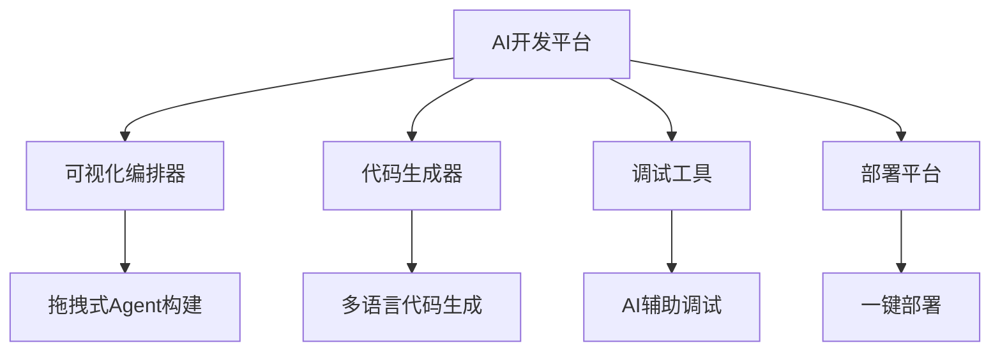
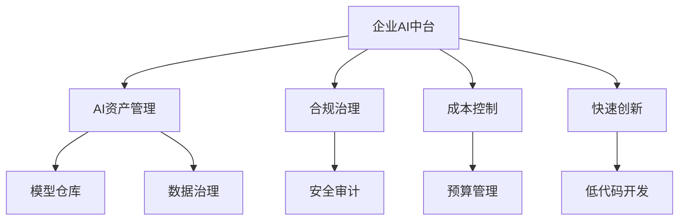
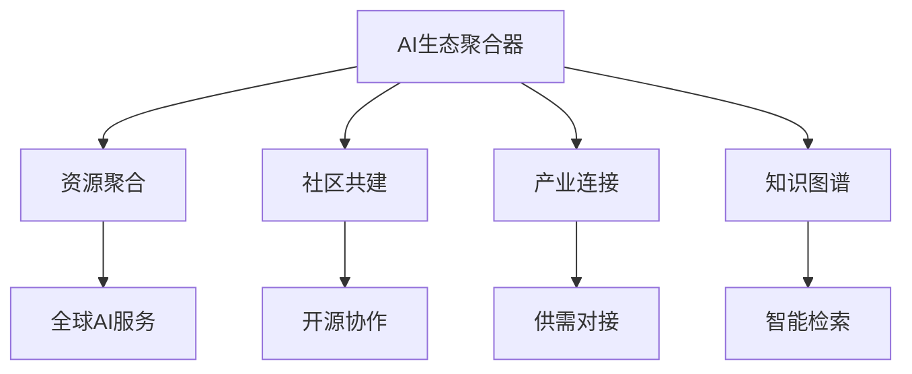
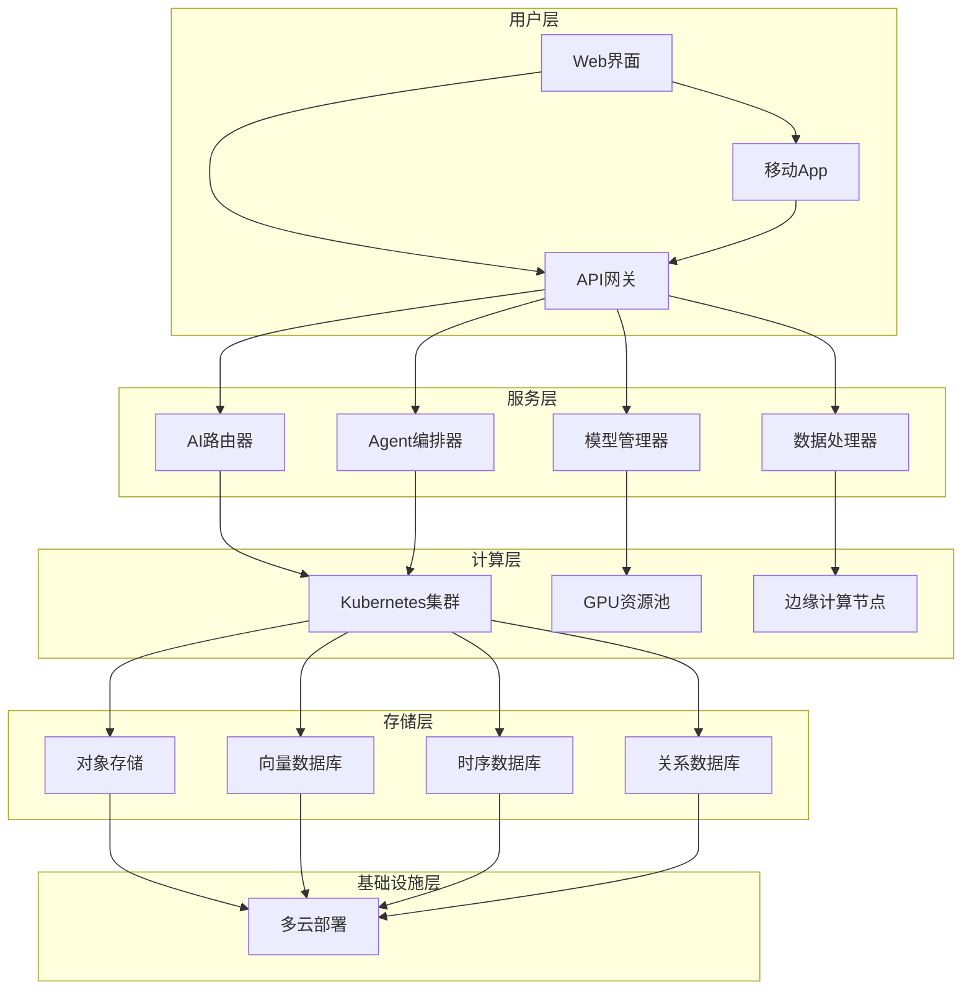
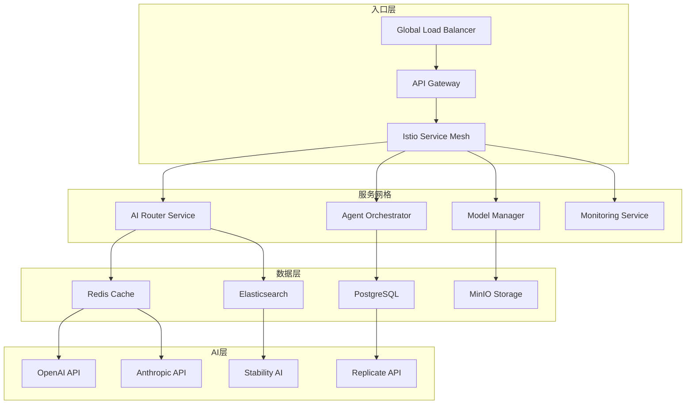
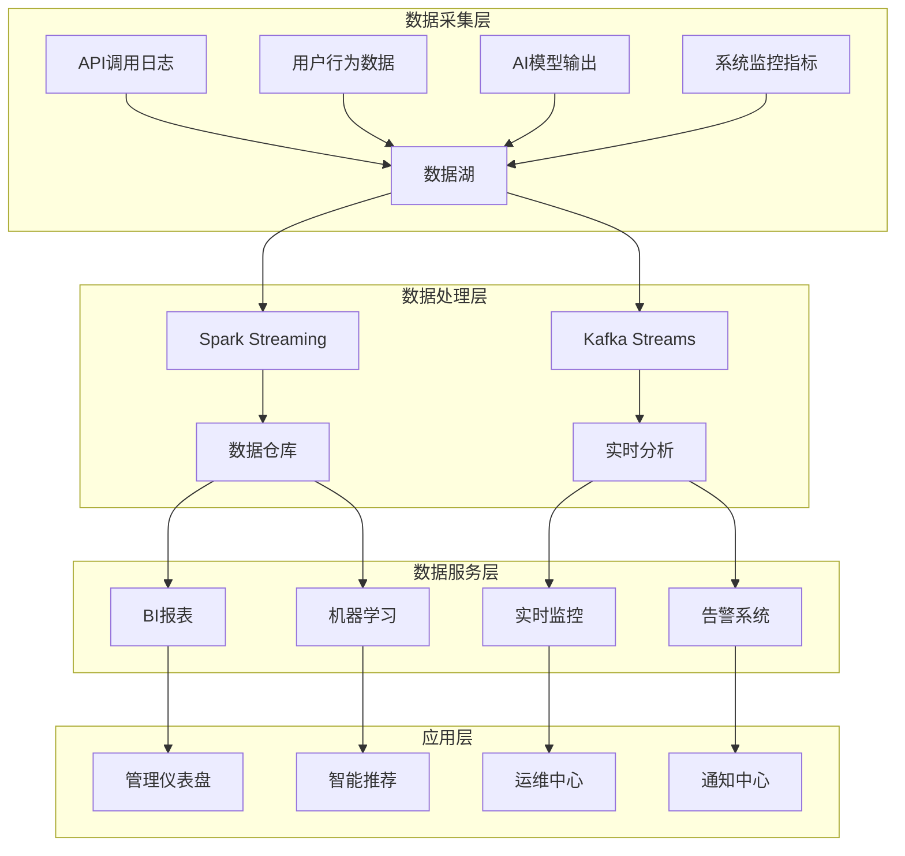
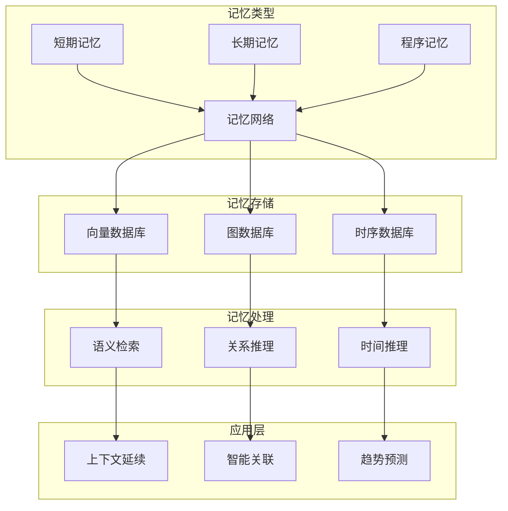
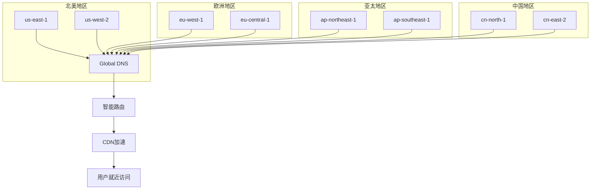
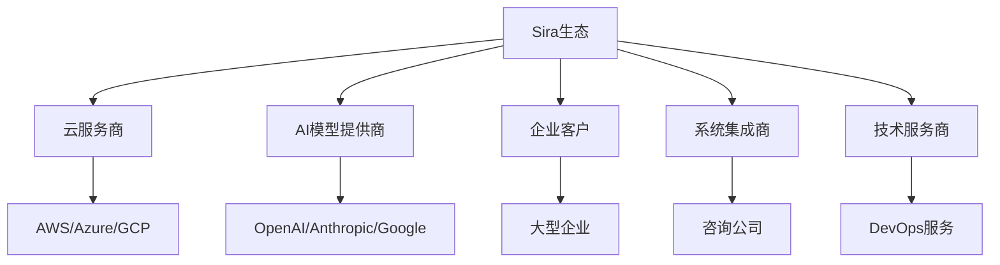
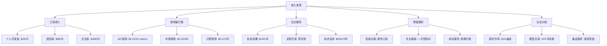

# Sira AI生态系统 - 未来蓝图：集思广益，构建AI时代的操作系统

## 🌟 愿景序言

> **"用技术连接AI，让智能触手可及"**

在AI技术快速发展的今天，我们不仅仅要提供AI服务，更要构建一个完整的AI生态系统。本文档借鉴全球优秀的设计理念和技术架构，集思广益，为Sira勾勒出一个宏大的未来蓝图。

---

## 📚 借鉴的优秀设计理念

### 🏗️ 技术架构层面的借鉴

#### 1. **Kubernetes - 容器编排与微服务**

```yaml
借鉴点:
• 声明式配置 - 基础设施即代码
• 自动扩缩容 - 智能资源调度
• 服务发现 - 动态服务注册
• 故障自愈 - 容器健康检查

Sira应用:
• AI服务网格 - 智能调度AI计算资源
• 自动扩缩容 - 根据AI负载动态调整实例
• 服务治理 - AI服务的注册发现和负载均衡
```

#### 2. **Istio - 服务网格架构**

```yaml
借鉴点:
• 流量管理 - 金丝雀发布，A/B测试
• 安全认证 - mTLS加密通信
• 可观测性 - 分布式追踪，指标收集
• 故障注入 - 混沌工程测试

Sira应用:
• AI流量调度 - 智能路由到最优AI模型
• 端到端加密 - AI数据传输安全保障
• AI服务监控 - 完整的AI调用链路追踪
```

#### 3. **Apache Kafka - 事件驱动架构**

```yaml
借鉴点:
• 事件流处理 - 高吞吐量消息队列
• 流式计算 - 实时数据处理
• 事件溯源 - 完整的事件历史
• 解耦架构 - 异步通信模式

Sira应用:
• AI事件总线 - 连接所有AI服务的事件流
• 实时AI分析 - 用户行为和AI响应的实时处理
• AI记忆流 - 用户交互事件的持久化存储
```

#### 4. **Elasticsearch - 搜索与分析**

```yaml
借鉴点:
• 全文搜索 - 强大的搜索能力
• 实时分析 - 近实时数据聚合
• 可扩展架构 - 分布式存储
• 丰富查询 - DSL查询语言

Sira应用:
• AI内容搜索 - 跨模态内容智能检索
• 用户洞察分析 - 实时用户行为分析
• AI模型评估 - 性能指标的实时聚合
```

### 🤖 AI平台层面的借鉴

#### 5. **LangChain - AI应用框架**

```python
借鉴点:
• 组件化设计 - 可复用的AI组件
• 链式调用 - AI能力的组合使用
• 记忆管理 - 会话状态持久化
• 工具集成 - 外部工具的调用

Sira应用:
• AI能力编排 - 拖拽式AI流程构建
• 多Agent协作 - AI Agent之间的智能协作
• 上下文管理 - 跨会话的记忆共享
```

#### 6. **AutoGen - 多Agent框架**

```python
借鉴点:
• 自主Agent - 独立决策的AI实体
• 群体智能 - Agent之间的协商合作
• 动态角色 - 根据任务分配角色
• 人机协作 - 人类参与Agent决策

Sira应用:
• AI团队组建 - 为复杂任务组建AI团队
• 智能分工 - Agent根据专长自动分工
• 协作学习 - Agent之间的经验共享
```

#### 7. **Haystack - AI搜索引擎**

```python
借鉴点:
• 检索增强 - RAG技术实现
• 文档处理 - 多格式文档解析
• 向量搜索 - 语义相似度匹配
• 问答系统 - 基于文档的智能问答

Sira应用:
• AI知识库 - 企业私有知识的智能检索
• 多模态搜索 - 文本、图像、语音的统一搜索
• 智能问答 - 基于企业知识的AI助手
```

#### 8. **MLflow - ML生命周期管理**

```python
借鉴点:
• 实验跟踪 - 模型训练过程记录
• 模型版本管理 - 模型的版本控制
• 模型部署 - 一键部署到生产环境
• 性能监控 - 模型性能的持续监控

Sira应用:
• AI模型管理 - 企业AI资产的全生命周期管理
• 模型A/B测试 - 新旧模型的对比评估
• 自动部署 - AI模型的智能部署和回滚
```

### 🚀 开发工具层面的借鉴

#### 9. **GitHub - 协作开发平台**

```markdown
借鉴点:
• 版本控制 - Git分布式版本管理
• 代码审查 - Pull Request协作流程
• CI/CD集成 - 自动化测试和部署
• 社区生态 - 开源项目协作模式

Sira应用:
• AI项目协作 - 多人协作的AI项目开发
• 代码生成审查 - AI生成的代码质量把关
• 自动化测试 - AI项目的CI/CD流程
```

#### 10. **VS Code - 开发环境**

```json
借鉴点:
• 插件生态 - 丰富的扩展生态
• 智能提示 - AI驱动的代码补全
• 调试工具 - 强大的调试能力
• 远程开发 - 云端开发环境

Sira应用:
• AI编程助手 - 集成AI代码生成的开发环境
• 智能调试 - AI辅助的代码调试和优化
• 云端工作台 - 浏览器中的AI开发环境
```

#### 11. **Postman - API测试平台**

```json
借鉴点:
• API文档 - 自动生成API文档
• 测试集合 - 组织化的API测试
• 环境管理 - 多环境配置管理
• 团队协作 - API测试的共享协作

Sira应用:
• AI API测试台 - 专门为AI API设计的测试工具
• 自动化测试 - AI模型的自动化测试套件
• 性能压测 - AI服务的性能压力测试
```

#### 12. **Vercel - 现代化部署平台**

```javascript
借鉴点:
• 边缘计算 - 全球CDN部署
• 预览部署 - 每个提交的预览环境
• 自动缩放 - 根据流量自动扩容
• 即时部署 - Git推送即部署

Sira应用:
• 全球AI服务 - 低延迟的全球AI服务部署
• 预览环境 - 新AI功能的快速预览
• 智能调度 - 根据地理位置优化AI服务
```

### 💼 商业平台层面的借鉴

#### 13. **Stripe - 支付处理系统**

```javascript
借鉴点:
• 简单集成 - 开发者友好的API
• 安全支付 - PCI DSS合规
• 全球支持 - 支持200+国家和地区
• 透明定价 - 清晰的费用结构

Sira应用:
• AI服务计费 - 灵活的AI使用量计费
• 全球支付 - 支持全球用户的AI服务付费
• 透明定价 - 清晰的AI成本展示
```

#### 14. **Slack - 团队协作平台**

```json
借鉴点:
• 实时通信 - WebSocket实时消息
• 集成生态 - 丰富的第三方集成
• 搜索功能 - 强大的消息搜索
• 工作流自动化 - Zapier风格的工作流

Sira应用:
• AI团队协作 - AI Agent之间的实时协作
• 通知中心 - AI事件和告警的统一通知
• 工作流集成 - 与现有工具的无缝集成
```

#### 15. **Notion - 文档协作平台**

```markdown
借鉴点:
• 块式编辑 - 灵活的内容组织
• 数据库功能 - 结构化数据管理
• 模板系统 - 可复用的内容模板
• 实时协作 - 多用户同时编辑

Sira应用:
• AI知识管理 - 结构化的AI知识库建设
• 文档生成 - AI辅助的内容创作和组织
• 协作编辑 - 多人协作的AI项目文档
```

#### 16. **Figma - 设计协作工具**

```json
借鉴点:
• 实时协作 - 多人同时编辑设计
• 版本历史 - 完整的设计版本控制
• 组件系统 - 可复用的设计组件
• 插件生态 - 丰富的设计插件

Sira应用:
• AI设计协作 - 多人协作的AI生成内容编辑
• 版本控制 - AI生成内容的版本管理
• 组件复用 - AI生成内容的模块化复用
```

---

## 🗺️ Sira未来蓝图：AI时代的操作系统

### 🎯 三大核心战略

#### 战略一：**AI原生开发平台**

> 让AI开发像写代码一样简单



#### 战略二：**企业级AI中台**

> 成为企业的AI基础设施中枢



#### 战略三：**AI生态聚合器**

> 连接AI世界的桥梁



### 🏗️ 技术架构蓝图

#### **云原生AI平台架构**



#### **AI服务网格架构**



### 🚀 产品矩阵规划

#### **核心产品线**

| 产品线               | 目标用户   | 核心功能                           | 商业模式   |
| -------------------- | ---------- | ---------------------------------- | ---------- |
| **Sira Studio**      | AI开发者   | 可视化AI开发平台，低代码AI应用构建 | SaaS订阅   |
| **Sira Enterprise**  | 企业用户   | 企业级AI中台，合规治理，私有部署   | 企业许可证 |
| **Sira Cloud**       | 个人用户   | 云端AI服务，开箱即用               | 按量付费   |
| **Sira Marketplace** | 开发者生态 | AI组件市场，模型交易平台           | 交易抽成   |
| **Sira Academy**     | 学习者     | AI学习平台，实践环境               | Freemium   |

#### **Sira Studio - AI开发平台**

```typescript
// 示例：可视化AI应用构建
const aiApp = new SiraApp('智能客服系统');

aiApp
  .addAgent('意图识别', {
    model: 'gpt-4',
    prompt: '分析用户意图...',
    tools: ['sentiment-analysis'],
  })
  .addAgent('知识检索', {
    model: 'embedding-model',
    knowledgeBase: 'company-docs',
    retrieval: 'semantic-search',
  })
  .addAgent('响应生成', {
    model: 'claude-3',
    style: 'professional',
    memory: 'session-based',
  })
  .connect('意图识别', '知识检索')
  .connect('知识检索', '响应生成')
  .deploy('production');
```

#### **Sira Enterprise - 企业AI中台**

```yaml
# 企业配置示例
sira-enterprise:
  security:
    data-encryption: AES-256
    audit-logging: enabled
    compliance: SOC2-GDPR

  governance:
    model-registry: enabled
    cost-controls: budget-limits
    access-control: RBAC

  deployment:
    private-cloud: aws
    hybrid-mode: enabled
    backup: automated
```

### 📊 数据架构设计

#### **多模态数据湖架构**



#### **AI记忆网络架构**



### 🔧 开发工具生态

#### **Sira DevTools - 开发者工具链**

```bash
# 一键初始化AI项目
sira init my-ai-app --template=chatbot

# 本地开发环境
sira dev

# 部署到云端
sira deploy --env=production

# 监控AI应用
sira monitor --app=my-ai-app

# 性能分析
sira profile --model=gpt-4 --dataset=test-data
```

#### **AI代码生成器**

```javascript
// 自然语言生成AI应用代码
const generator = new SiraCodeGenerator();

const code = await generator.generate(`
  创建一个智能客服系统，需要：
  1. 能够理解用户意图
  2. 从知识库中检索相关信息
  3. 生成自然回复
  4. 记录对话历史
`);

// 输出完整的应用代码
console.log(code);
```

### 🌐 全球化战略

#### **多区域部署架构**



#### **本地化策略**

```json
{
  "localization": {
    "languages": ["zh-CN", "en-US", "ja-JP", "ko-KR", "fr-FR", "de-DE"],
    "regions": ["China", "US", "EU", "Japan", "Korea"],
    "compliance": {
      "GDPR": ["EU"],
      "CCPA": ["US"],
      "PIPL": ["China"],
      "LGPD": ["Brazil"]
    },
    "pricing": {
      "currency": "local",
      "tax": "auto-calculate"
    }
  }
}
```

### 🤝 生态合作战略

#### **开源社区共建**

```markdown
开源策略:

1. 核心引擎开源 - 吸引社区贡献
2. 插件生态开放 - 第三方插件开发
3. 最佳实践分享 - 社区案例收集
4. 联合创新实验室 - 与高校合作
```

#### **商业合作伙伴体系**



#### **开发者激励计划**

```json
{
  "developer-incentives": {
    "contribution-rewards": {
      "code-contribution": "积分奖励",
      "bug-report": "优先支持",
      "feature-request": "roadmap影响",
      "documentation": "社区认可"
    },
    "monetization": {
      "plugin-market": "收益分成",
      "template-sales": "版税收入",
      "consulting": "推荐奖励",
      "training": "讲师分成"
    },
    "growth-support": {
      "mentorship": "技术指导",
      "funding": "项目资助",
      "visibility": "品牌曝光",
      "networking": "人脉拓展"
    }
  }
}
```

### 📈 商业化路径

#### **收入模型设计**



#### **定价策略**

```json
{
  "pricing-strategy": {
    "freemium": {
      "free-tier": "每月10万tokens",
      "pro-tier": "$29/月 - 100万tokens",
      "team-tier": "$99/月 - 无限量"
    },
    "enterprise": {
      "custom-pricing": "基于使用量定制",
      "feature-modules": "按需选择功能模块",
      "support-levels": "基础/专业/白金支持"
    },
    "regional": {
      "currency": "本地货币结算",
      "tax-compliance": "自动税务计算",
      "payment-methods": "本地化支付方式"
    }
  }
}
```

### 🎯 里程碑规划

#### **Phase 1: 基础平台 (2024 Q4 - 2025 Q2)**

```markdown
目标: 构建核心AI操作系统
• ✅ 多Agent架构实现
• ✅ AI服务网格部署
• ✅ 基础开发工具发布
• 🔄 企业版Beta测试
• 🔄 开源社区建立
```

#### **Phase 2: 生态扩展 (2025 Q3 - 2025 Q4)**

```markdown
目标: 完善生态体系
• 🔄 Marketplace上线
• 🔄 全球多区域部署
• 🔄 企业客户拓展
• 🔄 合作伙伴体系建立
• 🔄 开发者激励计划启动
```

#### **Phase 3: 智能化升级 (2026 Q1 - 2026 Q2)**

```markdown
目标: AI驱动的平台
• 🔄 自适应学习系统
• 🔄 预测性运维平台
• 🔄 AI代码生成器2.0
• 🔄 全球本地化完成
• 🔄 IPO准备
```

#### **Phase 4: 生态主导 (2026 Q3 - 2027 Q4)**

```markdown
目标: 成为AI生态标准
• 🔄 开源项目矩阵完善
• 🔄 全球开发者大会
• 🔄 产业基金设立
• 🔄 学术研究合作
• 🔄 社会责任项目
```

### 💪 成功关键因素

#### **技术创新持续性**

```markdown
创新原则:
• 🚀 技术雷达驱动 - 持续关注前沿技术
• 🧪 内部创新实验室 - 技术预研团队
• 🤝 外部合作 - 与顶尖AI实验室合作
• 📚 学术研究 - 转化最新研究成果
```

#### **用户体验至上**

```markdown
体验原则:
• 🎯 开发者优先 - 极致开发体验
• 🔧 工具思维 - 解决真实痛点
• 📱 移动优先 - 全场景覆盖
• ♿ 无障碍设计 - 包容性设计
```

#### **生态建设优先**

```markdown
生态原则:
• 🌟 开放心态 - 拥抱开源文化
• 🤝 共赢思维 - 合作伙伴共享价值
• 📈 规模效应 - 网络效应驱动增长
• 🔄 反馈循环 - 用户驱动产品迭代
```

#### **商业化平衡**

```markdown
商业原则:
• 💰 可持续增长 - 健康商业模式
• 🆓 开发者友好 - 合理的免费策略
• 🎯 价值驱动 - 产品价值导向
• 📊 数据驱动 - 基于数据决策
```

### 🌟 结语：我们的承诺与愿景

**我们的承诺：**

- **开放创新**: 持续借鉴全球优秀设计，保持技术领先
- **用户至上**: 始终以用户需求为中心，提供极致体验
- **生态共建**: 与合作伙伴共赢，构建繁荣AI生态
- **社会责任**: 推动AI普惠化发展，创造社会价值

**我们的愿景：**
成为AI时代的操作系统，让每个开发者、每个企业都能轻松驾驭AI的力量，释放人类的创造力，共同构建美好的AI未来。

---

**让我们携手，用技术连接AI，让智能触手可及！** 🚀

_本文档由Sira团队编写，借鉴了全球优秀技术架构和商业模式的设计理念。如有建议和反馈，欢迎通过GitHub Issues或邮箱联系我们。_
