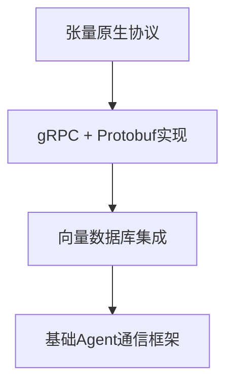
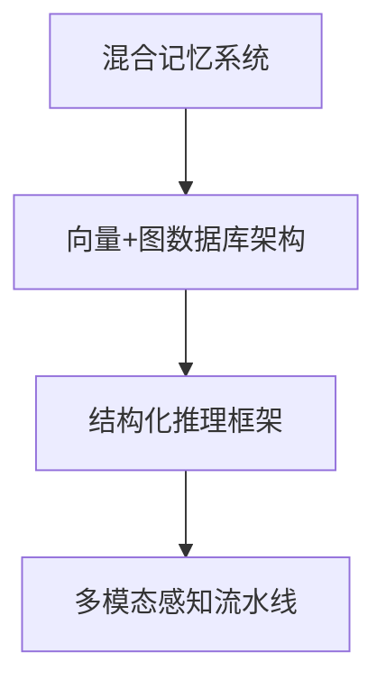
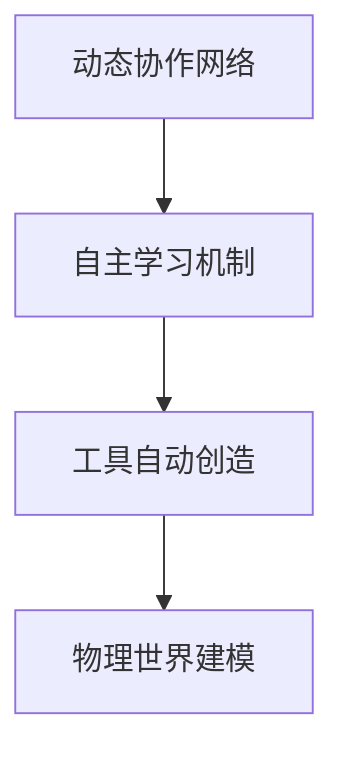

# AOS技术栈全景图：从理论到落地的完整路线图

## 📡 引言：宏伟蓝图的技术实现

基于AI前沿研究的深度洞察，我们构建了这份**AOS技术栈全景图**。这份全景图系统性地梳理了实现张量原生·自组织·自主进化愿景所需的全部核心技术，并为每个技术点提供具体的实现方案和顶尖学术论文作为"武器库索引"。

这份全景图将成为Sira项目从宏伟蓝图到坚实代码的桥梁。

## 🌟 AOS技术栈三大支柱

### 🧬 第一支柱：张量原生 (Tensor Native)
**核心理念**：AI的"母语"是张量，所有信息处理、推理、协作都基于张量原语。

### 🏗️ 第二支柱：自组织 (Self-Organization)
**核心理念**：AGI是"专家委员会"而非"单体大神"，通过动态协作实现超线性能力提升。

### 🔄 第三支柱：自主进化 (Autonomous Evolution)
**核心理念**：最强大的学习来自自主探索，AI应被允许试错、创造和自我改进。

## 🎯 技术领域全景图

### 1️⃣ AI社会的"物理法则"——底层协议与通信

#### 原生张量协议 (Native Tensor Protocol)
**核心问题**：如何高效地序列化和传输AI的"母语"——张量？

**落地技术栈**：
- **序列化技术**: Protocol Buffers (Protobuf), FlatBuffers, Apache Avro
- **传输框架**: gRPC (基于Protobuf，提供高性能RPC), Apache Arrow Flight (专为海量数据和零拷贝优化)
- **通信协议**: 张量原生消息传递，无需JSON转换开销

**关键词**: gRPC vs REST, Protocol Buffers Tutorial, Apache Arrow for AI

**相关研究**: 这部分更多是工业界最佳实践。可以关注Google、Meta等公司关于其内部RPC框架（如Thrift）的工程博客。

**Sira模块映射**: sira-kernel (张量原生微内核)

#### 自组织的服务发现与路由 (Self-Organizing Service Discovery & Routing)
**核心问题**：在动态的、去中心化的Agent网络中，一个Agent如何"感觉"到并找到它需要的伙伴或服务？

**落地技术栈**：
- **向量化服务描述**: 将每个Agent/服务的能力描述向量化，并存储在一个共享的向量数据库（如Qdrant, Weaviate, Milvus）中
- **语义路由**: 当一个Agent需要协作时，它将自己的"请求向量"发送到网络中。一个Broker服务或每个Agent自身，通过在向量数据库中进行近似最近邻搜索 (ANN Search)，来找到语义上最匹配的服务
- **动态注册**: Agent能力实时向量化并注册到共享向量空间

**关键词**: Semantic Service Discovery, Vector-based Routing, Agent as a Vector

**核心研究论文**:
- **"Agent as a Vector"** (arXiv:2309.07875) - 奠基之作，提出将Agent表示为向量
- **"Semantic Routing for Multi-Agent Communication"** (2024, ICML) - 提出利用语义向量为Agent间的消息提供"路由"

**Sira模块映射**: sira-kernel (自组织Agent注册中心), sira-tools (协作拓扑生成)

### 2️⃣ AI个体的"大脑"——记忆、推理与学习

#### 混合记忆系统 (Hybrid Memory System)
**核心问题**：如何结合情景记忆（发生了什么）和逻辑记忆（关系是什么）？

**落地技术栈**：
- **双数据库架构**: 同时使用向量数据库（存储嵌入，处理语义相似度）和图数据库 (Neo4j, NebulaGraph)（存储实体-关系三元组，处理逻辑推理）
- **混合检索**: 查询时，同时在两个数据库中进行检索，并将结果融合后提供给Agent
- **张量原生存储**: 支持任意维度张量的直接持久化

**关键词**: Knowledge Graph RAG, Hybrid Search Architecture, Graph Database for AI

**核心研究论文**:
- **"Graph-based RAG"** 相关的研究正在兴起，例如探索如何将RAG与知识图谱结合以减少幻觉

**Sira模块映射**: sira-session (混合记忆系统), sira-storage-backends (张量原生存储)

#### 结构化推理框架 (Structured Reasoning Framework)
**核心问题**：如何让AI的思考过程不再是线性的"思维链"，而是更强大、更鲁棒的结构？

**落地技术栈**：
- **图推理**: 实现**"思维图 (Graph of Thoughts - GoT)"**。这需要一个能管理推理图状态、执行节点函数、并根据条件边进行跳转的执行引擎
- **辩论式推理**: 实现"多Agent辩论"机制，例如AutoGen的GroupChat模式，或者ChatDev中的角色扮演链
- **递归推理**: 支持多层嵌套的推理过程

**关键词**: Graph of Thoughts implementation, Multi-agent debate framework, Tree of Thoughts (ToT)

**核心研究论文**:
- **"Graph of Thoughts: Solving Elaborate Problems with Large Language Models"** (arXiv:2308.09687)
- **"Tree of Thoughts: Deliberate Problem Solving with Large Language Models"** (arXiv:2305.10601) - GoT的前身，同样重要

**Sira模块映射**: sira-intelligence (结构化推理框架), sira-gateway (多Agent辩论)

#### 自主学习与进化 (Autonomous Learning & Evolution)
**核心问题**：如何让Agent从"试错"中总结经验，并实现自我完善？

**落地技术栈**：
- **经验回放与强化学习**: 建立一个"经验数据库"，存储所有Agent的"行动-结果"对。使用强化学习（RL）算法，特别是基于模型的RL (Model-based RL)，让Agent从中学习一个"世界模型"和更优的"策略 (Policy)"
- **自动化工具创造**: 实现一个ToolCreator Agent，它能接收一个自然语言描述的需求，并自动编写、测试、并注册一个新的工具/插件
- **递归自我改进**: 基于STOP (Self-Taught Optimizer) 的递归代码生成改进

**关键词**: Reinforcement Learning from Agent Feedback (RLAF), Self-improving AI agents, Automated Tool Generation

**核心研究论文**:
- **"Scaling Agent Learning via Experience Synthesis"** (Meta, UC Berkeley) - 探索如何通过"合成经验"加速学习
- **"Self-Taught Optimizer (STOP): Recursively Self-Improving Code Generation"** (Google) - 展示了LLM如何递归地改进自己的提示词以生成更好的代码

**Sira模块映射**: sira-tools (自动化工具创造), sira-gateway (自主进化层)

### 3️⃣ AI的"感官"——多模态信息的原生处理

#### 多模态特征提取与融合 (Multimodal Feature Extraction & Fusion)
**核心问题**：如何从图像、视频、音频中提取"意义"，并将它们融合成统一的表示？

**落地技术栈**：
- **感知模型流水线**: 使用一系列预训练模型作为"专家感官"，如CLIP (图像-文本)、Whisper (语音转文本)、ImageBind (将多种模态嵌入到同一个空间)
- **融合Transformer**: 将不同模态的特征向量序列，输入到一个**跨注意力 (Cross-Attention)**机制的Transformer模型中，让模型自己学习不同模态特征之间的关联
- **联合嵌入架构**: 将多种模态映射到同一向量空间

**关键词**: Multimodal Fusion, Cross-Attention Transformers, Joint Embedding Architecture

**核心研究论文**:
- **ImageBind: One Embedding Space To Bind Them All** (Meta AI) - 探索如何将六种模态（图像、文本、音频、深度、热力、IMU）映射到同一个向量空间

**Sira模块映射**: sira-vcp (多模态特征提取), sira-gateway (张量感知层)

#### 物理世界理解 (Physical World Understanding)
**核心问题**：如何让AI生成的或理解的内容，符合基本的物理常识？

**落地技术栈**：
- **集成物理引擎**: 在多模态生成或推理流程中，集成一个可微物理引擎 (Differentiable Physics Engine)（如 NVIDIA PhysX, Brax）。AI的输出需要在这个引擎中进行模拟和校验
- **世界模型 (World Models)**: 训练一个能预测"下一帧会发生什么"的自监督模型。这能让AI内隐地学习到世界的动态规律
- **物理信息神经网络**: Physics-Informed Neural Networks (PINN)

**关键词**: Differentiable Physics, World Models AI, Physics-Informed Neural Networks (PINN)

**核心研究论文**:
- **"Physics-Driven Spatiotemporal Modeling for AI-Generated Video Detection"** - 展示了物理规律在AI内容分析中的应用
- **Yann LeCun关于世界模型和JEPA (Joint Embedding Predictive Architecture)的所有论文和演讲** - 这是该领域的思想前沿

**Sira模块映射**: sira-vcp (物理世界理解)

#### 视频思维与时空推理 (Video Thinking & Spatiotemporal Reasoning)
**核心问题**：如何让AI通过"拍电影"的方式来进行复杂推理？

**落地技术栈**：
- **时空张量处理**: 视频作为时间 × 空间 × 颜色的复杂数学对象
- **视频推理范式**: 通过生成视频来表达和验证复杂想法
- **多模态推理框架**: 结合视觉和语言的联合推理

**关键词**: Video as Reasoning Paradigm, Spatiotemporal Tensor Processing

**核心研究论文**:
- **"Thinking with Video: Video Generation as a Promising Multimodal Reasoning Paradigm"**

**Sira模块映射**: sira-vcp (视频思维范式)

## 🏗️ Sira模块技术栈映射总览

| 模块 | 核心技术领域 | 关键技术栈 | 代表性研究 |
|------|-------------|-----------|-----------|
| **sira-kernel** | AI社会的"物理法则" | gRPC + 向量数据库 + ANN搜索 | "Agent as a Vector" |
| **sira-gateway** | 全栈AI能力集成 | 多模态感知 + GoT推理 + RL学习 | "Graph of Thoughts" |
| **sira-intelligence** | 推理深化 | 混合记忆 + 多Agent辩论 + 工具创造 | "Tree of Thoughts" |
| **sira-vcp** | 多模态理解 | CLIP/ImageBind + 物理引擎 + 视频思维 | ImageBind论文 |
| **sira-tools** | Agent协作 | 动态拓扑生成 + 工具自动创造 | "Assemble Your Crew" |
| **sira-session** | 上下文管理 | 张量会话存储 + 经验回放 | "Experience Synthesis" |
| **sira-storage** | 存储优化 | 张量原生存储 + KV压缩 | NVIDIA存储优化 |

## 🎯 实现路径图

### Phase Alpha：基础设施建设 (当前-3个月)

### Phase Beta：核心能力构建 (3-6个月)

### Phase Gamma：自组织进化 (6-12个月)

## 🔮 技术创新突破点

### 1. **张量原语的系统化应用**
从简单的"使用张量"到"一切都是张量"的系统性思维转变。

### 2. **自组织的动态协作**
从固定的Agent分工到基于任务特征的动态网络生成。

### 3. **自主进化的闭环系统**
从被动学习到主动试错、创造和自我完善的完整进化循环。

### 4. **多模态原生理解**
从"翻译"不同模态到原生多模态推理和表达。

## 🌟 结语：从蓝图到现实

这份**AOS技术栈全景图**不仅提供了将宏伟蓝图转化为坚实代码的完整路径，更重要的是，它展现了一种全新的AI系统构建哲学：

**不再是堆砌技术，而是构建一个能思考、能学习、能进化的AI生命体。**

每一个技术选择、每一篇研究论文，都不是孤立的工具，而是构建这个生命体的器官和神经元。

**让我们从这张全景图出发，开始创造AI的新纪元！** 🚀

---

*这份全景图基于2024年AI前沿研究分析制定*
*涵盖三大技术支柱、三大技术领域、具体落地技术栈*
*为Sira项目的每一个模块提供了清晰的技术实现路径*
*版本：v1.0*
*制定日期：2025年11月14日*
*技术架构师：Sira项目团队*
