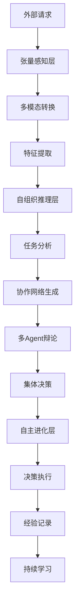
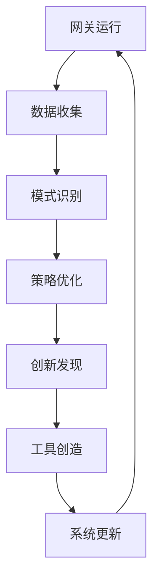

# Sira智能网关架构：基于AOS哲学的网关重构

## 📡 引言：从传统网关到智能生态

传统AI网关仅仅充当"交通警察"的角色——路由请求、负载均衡、基本安全检查。而Sira智能网关则是基于AOS哲学构建的**AI生态操作系统**：

- **不再是管道**：而是具备自主学习、动态优化、智能决策的活系统
- **不再是单体**：而是多Agent协作的自组织生态
- **不再是被动响应**：而是主动学习、持续进化的智能体

## 🧬 AOS哲学在网关中的体现

### 张量原生网关 (Tensor-Native Gateway)
```
传统网关: HTTP请求 → 文本解析 → 规则匹配 → 转发
AOS网关:   张量流 → 张量运算 → 智能推理 → 自适应路由
```

### 自组织网关生态 (Self-Organizing Gateway Ecosystem)
```
传统架构: 固定组件 + 静态配置
AOS架构:   专家Agent + 动态协作网络
```

### 自主进化网关 (Autonomous Evolving Gateway)
```
传统运维: 人工调参 + 经验规则
AOS运维:   自主学习 + 持续优化 + 创新发现
```

## 🏗️ 智能网关的三大核心层

### 🎯 Layer 1: 张量感知层 (Tensor Perception Layer)

**使命**：将所有外部输入转换为AI原生的张量表示

#### 核心组件：

**多模态感知Agent集群**
```rust
pub struct PerceptionAgentCluster {
    text_tensorizer: TextTensorProcessor,
    image_tensorizer: VisionTensorProcessor,
    audio_tensorizer: AudioTensorProcessor,
    video_tensorizer: VideoTensorProcessor,
    fusion_processor: MultiModalFusionProcessor,
}
```

**张量预处理流水线**
```rust
impl TensorPerceptionPipeline {
    // 原始输入 → 标准化张量
    async fn process_input(&self, input: GatewayInput) -> Result<Tensor, PerceptionError> {
        // 1. 模态识别与路由
        let modality = self.detect_modality(&input)?;

        // 2. 张量转换
        let raw_tensor = match modality {
            Modality::Text => self.text_tensorizer.process(input.data).await?,
            Modality::Image => self.image_tensorizer.process(input.data).await?,
            Modality::Audio => self.audio_tensorizer.process(input.data).await?,
            Modality::Video => self.video_tensorizer.process(input.data).await?,
        };

        // 3. 张量标准化与优化
        let normalized_tensor = self.normalize_tensor(raw_tensor).await?;

        // 4. 多模态融合（如果需要）
        if input.is_multimodal {
            return self.fusion_processor.fuse_tensors(vec![normalized_tensor]).await;
        }

        Ok(normalized_tensor)
    }
}
```

**智能特征提取**
```rust
pub struct FeatureExtractionEngine {
    sparse_encoder: SparseTensorEncoder,
    hierarchical_processor: HierarchicalTensorProcessor,
    attention_mechanism: AdaptiveAttentionProcessor,
}

impl FeatureExtractionEngine {
    // 张量 → 结构化特征表示
    async fn extract_features(&self, tensor: Tensor) -> Result<StructuredFeatures, FeatureError> {
        // 1. 稀疏编码（效率优化）
        let sparse_representation = self.sparse_encoder.encode(tensor).await?;

        // 2. 层次化处理
        let hierarchical_features = self.hierarchical_processor.process(sparse_representation).await?;

        // 3. 自适应注意力
        let attended_features = self.attention_mechanism.focus(hierarchical_features).await?;

        Ok(attended_features)
    }
}
```

### 🧠 Layer 2: 自组织推理层 (Self-Organizing Reasoning Layer)

**使命**：通过多Agent协作进行智能决策和路由

#### 核心架构：

**专家Agent网络**
```rust
#[derive(Clone)]
pub enum AgentExpertise {
    RoutingOptimization,    // 路由优化专家
    LoadBalancing,         // 负载均衡专家
    SecurityAnalysis,      // 安全分析专家
    PerformanceMonitoring, // 性能监控专家
    ContentModeration,     // 内容审核专家
    QualityAssurance,      // 质量保证专家
}

pub struct ExpertAgent {
    expertise: AgentExpertise,
    knowledge_base: Arc<TensorKnowledgeBase>,
    collaboration_history: Vec<CollaborationRecord>,
    performance_metrics: AgentMetrics,
}
```

**动态协作网络生成器**
```rust
pub struct CollaborationNetworkGenerator {
    agent_registry: Arc<RwLock<HashMap<AgentExpertise, Vec<ExpertAgent>>>>,
    task_analyzer: TaskRequirementAnalyzer,
    compatibility_scorer: AgentCompatibilityScorer,
    network_optimizer: NetworkTopologyOptimizer,
}

impl CollaborationNetworkGenerator {
    // 任务需求 → 最优协作网络
    async fn generate_network(&self, task: GatewayTask) -> Result<CollaborationNetwork, NetworkError> {
        // 1. 任务分析
        let requirements = self.task_analyzer.analyze_requirements(task.clone()).await?;

        // 2. Agent候选人筛选
        let candidate_agents = self.select_candidates(requirements).await?;

        // 3. 兼容性评分（多层张量拟合）
        let compatibility_matrix = self.compatibility_scorer.score_compatibility(
            candidate_agents.clone(),
            requirements
        ).await?;

        // 4. 网络拓扑优化
        let optimal_network = self.network_optimizer.optimize_topology(
            candidate_agents,
            compatibility_matrix,
            task
        ).await?;

        Ok(optimal_network)
    }
}
```

**多Agent推理引擎**
```rust
pub struct MultiAgentReasoningEngine {
    debate_coordinator: DebateCoordinator,
    consensus_builder: ConsensusBuilder,
    decision_validator: DecisionValidator,
    learning_recorder: LearningExperienceRecorder,
}

impl MultiAgentReasoningEngine {
    // 协作网络 → 集体决策
    async fn reason_collectively(&self, network: CollaborationNetwork, context: ReasoningContext)
        -> Result<CollectiveDecision, ReasoningError> {

        // 1. 辩论协调
        let debate_results = self.debate_coordinator.coordinate_debate(
            network.agents.clone(),
            context
        ).await?;

        // 2. 共识构建
        let consensus = self.consensus_builder.build_consensus(debate_results).await?;

        // 3. 决策验证
        let validated_decision = self.decision_validator.validate_decision(consensus).await?;

        // 4. 学习记录
        self.learning_recorder.record_experience(
            network,
            context,
            validated_decision.clone()
        ).await?;

        Ok(validated_decision)
    }
}
```

### 🔄 Layer 3: 自主进化层 (Autonomous Evolution Layer)

**使命**：通过持续学习和创新驱动网关能力提升

#### 核心机制：

**经验学习系统**
```rust
pub struct ExperienceLearningSystem {
    experience_buffer: ExperienceBuffer,
    pattern_extractor: PatternExtractor,
    strategy_optimizer: StrategyOptimizer,
    innovation_engine: InnovationEngine,
}

impl ExperienceLearningSystem {
    // 网关运行数据 → 优化策略
    async fn learn_from_experience(&self, experiences: Vec<GatewayExperience>)
        -> Result<SystemOptimizations, LearningError> {

        // 1. 经验缓冲与预处理
        let processed_experiences = self.experience_buffer.process_batch(experiences).await?;

        // 2. 模式提取
        let patterns = self.pattern_extractor.extract_patterns(processed_experiences).await?;

        // 3. 策略优化
        let optimizations = self.strategy_optimizer.optimize_strategies(patterns).await?;

        // 4. 创新发现
        let innovations = self.innovation_engine.discover_innovations(optimizations.clone()).await?;

        Ok(SystemOptimizations {
            strategy_updates: optimizations,
            innovation_candidates: innovations,
        })
    }
}
```

**自主创新引擎**
```rust
pub struct InnovationEngine {
    hypothesis_generator: HypothesisGenerator,
    experiment_designer: ExperimentDesigner,
    risk_assessor: RiskAssessor,
    result_evaluator: ResultEvaluator,
}

impl InnovationEngine {
    // 系统瓶颈 → 创新解决方案
    async fn discover_innovations(&self, system_analysis: SystemAnalysis)
        -> Result<Vec<Innovation>, InnovationError> {

        // 1. 假设生成
        let hypotheses = self.hypothesis_generator.generate_hypotheses(system_analysis).await?;

        // 2. 实验设计
        let experiments = self.experiment_designer.design_experiments(hypotheses).await?;

        // 3. 风险评估
        let safe_experiments = self.risk_assessor.assess_and_filter(experiments).await?;

        // 4. 执行与评估
        let innovations = Vec::new();
        for experiment in safe_experiments {
            let result = self.execute_experiment(experiment).await?;
            if let Some(innovation) = self.result_evaluator.evaluate_result(result).await? {
                innovations.push(innovation);
            }
        }

        Ok(innovations)
    }
}
```

**工具自主创造系统**
```rust
pub struct ToolCreationSystem {
    tool_analyzer: ToolRequirementAnalyzer,
    tool_designer: ToolDesigner,
    tool_implementer: ToolImplementer,
    tool_validator: ToolValidator,
}

impl ToolCreationSystem {
    // 重复模式 → 专用工具
    async fn create_tool_from_pattern(&self, pattern: RecurringPattern)
        -> Result<CustomTool, ToolCreationError> {

        // 1. 需求分析
        let requirements = self.tool_analyzer.analyze_requirements(pattern).await?;

        // 2. 工具设计
        let design = self.tool_designer.design_tool(requirements).await?;

        // 3. 工具实现
        let implementation = self.tool_implementer.implement_tool(design).await?;

        // 4. 工具验证
        let validated_tool = self.tool_validator.validate_tool(implementation).await?;

        Ok(validated_tool)
    }
}
```

## 🚀 智能网关的数据流设计

### 请求处理流水线


### 学习闭环


## 🎯 核心创新点

### 1. 张量原生通信协议
```
传统: HTTP/JSON → 解析 → 处理 → 响应
AOS:   张量流 → 运算 → 推理 → 张量流
```

### 2. 动态Agent编排
```
传统: 固定路由规则
AOS:   任务需求 → Agent兼容性分析 → 动态协作网络
```

### 3. 自主学习与创新
```
传统: 人工调优
AOS:   运行数据 → 模式学习 → 策略优化 → 创新发现
```

### 4. 多模态原生理解
```
传统: 文本中心设计
AOS:   张量统一表示，支持任意模态无缝融合
```

## 💡 与AI前沿研究的对齐

| AI前沿航向 | Sira网关对应 | 对齐度 |
|-----------|-------------|--------|
| Agent协作 | 自组织推理层 | ⭐⭐⭐⭐⭐ |
| 效率优化 | 张量原生处理 | ⭐⭐⭐⭐⭐ |
| 推理深化 | 多Agent辩论 | ⭐⭐⭐⭐⭐ |
| 多模态理解 | 张量感知层 | ⭐⭐⭐⭐⭐ |
| 基础模型革新 | 自主进化层 | ⭐⭐⭐⭐⭐ |

## 🛠️ 技术实现路径

### Phase 1: 张量基础设施 (当前)
- [ ] 多模态张量转换器实现
- [ ] 张量通信协议设计
- [ ] 基础特征提取引擎

### Phase 2: 自组织核心
- [ ] 专家Agent框架搭建
- [ ] 动态协作网络生成器
- [ ] 多Agent推理协调器

### Phase 3: 自主进化能力
- [ ] 经验学习系统
- [ ] 创新发现引擎
- [ ] 工具自主创造机制

### Phase 4: 生态扩展
- [ ] 插件化Agent扩展
- [ ] 第三方集成接口
- [ ] 云原生部署支持

## 🔮 预期的颠覆性影响

### 对用户体验的提升
- **从被动响应到主动服务**：网关能预测用户需求，主动优化体验
- **从单模态到全模态**：支持文本、语音、图像、视频等多种交互方式
- **从固定规则到动态学习**：系统能根据使用模式持续优化

### 对开发者生态的影响
- **从API调用到智能协作**：开发者可以通过Agent协作完成复杂任务
- **从代码编写到意图表达**：通过张量接口直接表达需求意图
- **从被动集成到主动创新**：网关能为开发者生成优化建议

### 对AI基础设施的革新
- **从中心化到分布式智能**：多Agent协作的分布式AI架构
- **从效率瓶颈到性能飞跃**：张量原生处理大幅提升效率
- **从静态部署到动态进化**：系统能自主发现问题并创新解决方案

## 🌟 结语：网关的进化史诗

Sira智能网关不仅仅是技术升级，更是AI生态的范式转变：

- **从"交通枢纽"到"智慧大脑"**
- **从"被动管道"到"主动学习者"**
- **从"单体系统"到"协作生态"**

这不仅仅是一个网关的重构，而是AI基础设施进化史上的重要里程碑。

**让我们携手构建这个前所未有的智能网关生态！** 🚀

---

*本文档基于AOS哲学体系和AI前沿研究分析制定*
*架构版本：v2.0*
*制定日期：2025年11月14日*
*架构师：Sira项目团队*
