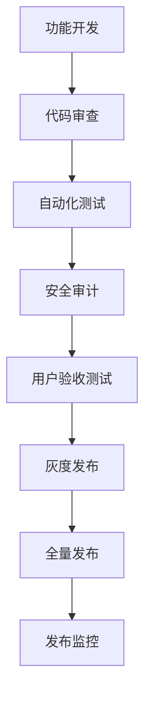

# 👨‍💼 管理模块 (Admin Module) 详细规划

## 📋 模块概述

**管理模块** 是Sira AI网关的管理控制中心，提供Web界面和REST API用于系统配置、监控、用户管理等管理功能。它是运维人员和管理员与系统的交互界面，实现可视化管理和自动化运维。

### 定位与职责

- **系统定位**: AI网关的管理控制台和运维平台
- **主要职责**: 系统配置、用户管理、监控面板、API管理
- **设计理念**: 用户友好、功能全面、安全可控、易于扩展

### 架构层次

```
管理模块架构:
├── 🎛️ 控制面板层 (Control Panel Layer)
│   ├── 仪表板 (Dashboard)
│   ├── 系统配置 (System Config)
│   └── 用户管理 (User Management)
├── 🔌 API管理层 (API Management Layer)
│   ├── 路由配置 (Route Config)
│   ├── 策略管理 (Policy Management)
│   └── 服务端点 (Service Endpoints)
├── 📊 监控面板层 (Monitoring Panel Layer)
│   ├── 实时监控 (Real-time Monitor)
│   ├── 性能分析 (Performance Analytics)
│   └── 告警管理 (Alert Management)
└── 🔐 安全控制层 (Security Control Layer)
    ├── 访问控制 (Access Control)
    ├── 审计日志 (Audit Logs)
    └── 权限管理 (Permission Management)
```

---

## 🏗️ 架构设计

### 1. 模块结构详解

#### 1.1 管理控制台架构

**文件位置**: `src/admin/`

**核心组件**:

```javascript
// 管理服务器架构
class AdminServer {
  constructor(options = {}) {
    this.app = express();
    this.config = {
      port: options.port || 8080,
      host: options.host || 'localhost',
      auth: options.auth || {},
      cors: options.cors || {},
      ...options,
    };

    this.setupMiddleware();
    this.setupRoutes();
    this.setupWebSocket();
  }

  // 中间件配置
  setupMiddleware() {
    // 安全中间件
    this.app.use(helmet());
    this.app.use(cors(this.config.cors));

    // 认证中间件
    this.app.use('/api', this.authMiddleware.bind(this));

    // 请求日志中间件
    this.app.use(morgan('combined', { stream: this.logStream }));

    // 静态文件服务
    this.app.use(express.static(path.join(__dirname, 'public')));
  }

  // 路由配置
  setupRoutes() {
    // API路由
    this.app.use('/api/v1', apiRoutes);

    // 页面路由
    this.app.get('/', (req, res) => {
      res.sendFile(path.join(__dirname, 'public', 'index.html'));
    });

    // WebSocket路由
    this.app.use('/ws', wsRoutes);
  }
}
```

#### 1.2 前端界面架构

**技术栈选择**:

```json
{
  "框架": "React 18 + TypeScript",
  "状态管理": "Redux Toolkit + RTK Query",
  "UI组件库": "Material-UI (MUI) v5",
  "图表库": "Recharts + D3.js",
  "构建工具": "Vite",
  "测试框架": "Jest + React Testing Library"
}
```

**组件架构**:

```typescript
// 组件层次结构
interface AdminUI {
  Layout: {
    Header: HeaderComponent;
    Sidebar: SidebarComponent;
    Main: MainContent;
    Footer: FooterComponent;
  };

  Dashboard: {
    OverviewCards: OverviewCards;
    MetricsCharts: MetricsCharts;
    RecentActivity: RecentActivity;
    QuickActions: QuickActions;
  };

  Configuration: {
    SystemConfig: SystemConfigPanel;
    RoutingRules: RoutingRulesPanel;
    PoliciesConfig: PoliciesConfigPanel;
    ServicesConfig: ServicesConfigPanel;
  };

  Monitoring: {
    RealTimeMonitor: RealTimeMonitor;
    PerformanceAnalytics: PerformanceAnalytics;
    AlertCenter: AlertCenter;
    LogsViewer: LogsViewer;
  };

  Management: {
    UsersManagement: UsersManagement;
    RolesPermissions: RolesPermissions;
    AuditLogs: AuditLogs;
    BackupRestore: BackupRestore;
  };
}
```

#### 1.3 API设计架构

**RESTful API设计**:

```javascript
// API路由架构
const apiRoutes = express.Router();

// 系统管理API
apiRoutes.get('/system/status', systemController.getStatus);
apiRoutes.put('/system/config', systemController.updateConfig);
apiRoutes.post('/system/restart', systemController.restart);

// 用户管理API
apiRoutes.get('/users', usersController.list);
apiRoutes.post('/users', usersController.create);
apiRoutes.put('/users/:id', usersController.update);
apiRoutes.delete('/users/:id', usersController.delete);

// 路由配置API
apiRoutes.get('/routes', routesController.list);
apiRoutes.post('/routes', routesController.create);
apiRoutes.put('/routes/:id', routesController.update);
apiRoutes.delete('/routes/:id', routesController.delete);

// 监控API
apiRoutes.get('/metrics', metricsController.getMetrics);
apiRoutes.get('/alerts', alertsController.getAlerts);
apiRoutes.post('/alerts/:id/acknowledge', alertsController.acknowledge);
```

**GraphQL API支持** (可选):

```javascript
// GraphQL Schema定义
const typeDefs = gql`
  type Query {
    systemStatus: SystemStatus!
    users(limit: Int, offset: Int): [User!]!
    routes(limit: Int, offset: Int): [Route!]!
    metrics(timeRange: TimeRange): Metrics!
    alerts(status: AlertStatus): [Alert!]!
  }

  type Mutation {
    updateSystemConfig(input: SystemConfigInput!): SystemConfig!
    createUser(input: UserInput!): User!
    updateRoute(id: ID!, input: RouteInput!): Route!
    acknowledgeAlert(id: ID!): Alert!
  }

  type SystemStatus {
    uptime: String!
    version: String!
    health: HealthStatus!
  }
`;
```

### 2. 核心技术栈

#### 2.1 后端技术栈

- **Web框架**: Express.js 4.x
- **认证**: JWT + Passport.js
- **数据库**: SQLite (开发) + PostgreSQL (生产)
- **缓存**: Redis
- **日志**: Winston
- **文档**: Swagger/OpenAPI

#### 2.2 前端技术栈

- **框架**: React 18 + TypeScript
- **构建**: Vite 4.x
- **状态管理**: Redux Toolkit
- **UI组件**: Material-UI v5
- **图表**: Recharts
- **测试**: Jest + React Testing Library

#### 2.3 基础设施

- **容器化**: Docker + Docker Compose
- **反向代理**: Nginx
- **SSL证书**: Let's Encrypt
- **CDN**: Cloudflare (可选)

---

## 🎯 功能职责详解

### 1. 系统配置管理

#### 1.1 系统基础配置

**配置面板功能**:

```javascript
class SystemConfigPanel {
  // 系统基础配置
  async updateBasicConfig(config) {
    const validated = await this.validateConfig(config);
    await this.saveConfig(validated);
    await this.notifyServices(config);
    await this.logConfigChange(config);
  }

  // AI服务商配置
  async updateAIProviders(providers) {
    for (const provider of providers) {
      await this.validateProviderConfig(provider);
      await this.testProviderConnection(provider);
    }

    await this.saveProviders(providers);
    await this.reloadRoutingEngine();
  }

  // 缓存配置
  async updateCacheConfig(config) {
    await this.validateCacheConfig(config);
    await this.updateCacheSettings(config);
    await this.clearCacheIfNeeded(config);
  }
}
```

**配置验证机制**:

```javascript
class ConfigValidator {
  // 配置模式验证
  validateSystemConfig(config) {
    const schema = Joi.object({
      port: Joi.number().integer().min(1).max(65535).default(8080),
      host: Joi.string().hostname().default('localhost'),
      logLevel: Joi.string()
        .valid('error', 'warn', 'info', 'debug')
        .default('info'),
      cache: Joi.object({
        enabled: Joi.boolean().default(true),
        ttl: Joi.number().integer().min(0).default(300),
        maxSize: Joi.number().integer().min(0).default(1000),
      }),
      ai: Joi.object({
        providers: Joi.array().items(
          Joi.object({
            name: Joi.string().required(),
            enabled: Joi.boolean().default(true),
            apiKey: Joi.string().when('enabled', {
              is: true,
              then: Joi.required(),
            }),
            priority: Joi.number().integer().min(1).max(10).default(5),
          })
        ),
      }),
    });

    return schema.validate(config);
  }
}
```

#### 1.2 动态配置更新

**热更新机制**:

```javascript
class HotConfigReloader {
  // 配置监听器
  watchConfigChanges() {
    this.watcher = chokidar.watch(this.configPath, {
      persistent: true,
      ignoreInitial: true,
    });

    this.watcher.on('change', async path => {
      console.log(`Config file ${path} changed, reloading...`);

      try {
        const newConfig = await this.loadConfig();
        const validated = await this.validateConfig(newConfig);
        await this.applyConfig(validated);
        await this.notifyServices(validated);

        console.log('Configuration reloaded successfully');
      } catch (error) {
        console.error('Failed to reload configuration:', error);
        await this.rollbackConfig();
      }
    });
  }

  // 服务通知机制
  async notifyServices(config) {
    const services = ['gateway', 'core', 'monitoring'];

    for (const service of services) {
      try {
        await this.sendServiceNotification(service, {
          type: 'config_update',
          config: this.getServiceConfig(config, service),
        });
      } catch (error) {
        console.error(`Failed to notify service ${service}:`, error);
      }
    }
  }
}
```

### 2. 用户和权限管理

#### 2.1 用户管理功能

**用户生命周期管理**:

```javascript
class UserManager {
  // 用户创建
  async createUser(userData) {
    // 验证用户数据
    const validated = await this.validateUserData(userData);

    // 检查用户名唯一性
    await this.checkUsernameUniqueness(validated.username);

    // 创建用户
    const user = await this.userModel.create({
      ...validated,
      password: await this.hashPassword(validated.password),
      createdAt: new Date(),
      status: 'active',
    });

    // 发送欢迎邮件
    await this.sendWelcomeEmail(user);

    return user;
  }

  // 用户更新
  async updateUser(userId, updates) {
    const user = await this.findUserById(userId);
    const validated = await this.validateUserUpdates(updates, user);

    const updatedUser = await this.userModel.update(userId, {
      ...validated,
      updatedAt: new Date(),
    });

    await this.logUserUpdate(userId, updates);
    return updatedUser;
  }

  // 用户删除 (软删除)
  async deleteUser(userId) {
    const user = await this.findUserById(userId);

    // 软删除
    await this.userModel.update(userId, {
      status: 'deleted',
      deletedAt: new Date(),
    });

    // 清理相关数据
    await this.cleanupUserData(userId);

    await this.logUserDeletion(userId);
  }
}
```

#### 2.2 角色和权限系统

**RBAC权限模型**:

```javascript
class RBACManager {
  constructor() {
    this.roles = {
      admin: {
        name: 'Administrator',
        permissions: ['*'], // 所有权限
        level: 100,
      },
      manager: {
        name: 'Manager',
        permissions: [
          'users.read',
          'users.write',
          'routes.read',
          'routes.write',
          'metrics.read',
          'config.read',
        ],
        level: 50,
      },
      viewer: {
        name: 'Viewer',
        permissions: ['metrics.read', 'logs.read'],
        level: 10,
      },
    };
  }

  // 权限检查
  async checkPermission(userId, resource, action) {
    const user = await this.userService.findById(userId);
    const userRoles = await this.getUserRoles(userId);

    // 检查用户是否有直接权限
    if (
      user.permissions &&
      user.permissions.includes(`${resource}.${action}`)
    ) {
      return true;
    }

    // 检查角色权限
    for (const roleName of userRoles) {
      const role = this.roles[roleName];
      if (
        role &&
        (role.permissions.includes(`${resource}.${action}`) ||
          role.permissions.includes('*'))
      ) {
        return true;
      }
    }

    return false;
  }

  // 角色分配
  async assignRole(userId, roleName) {
    if (!this.roles[roleName]) {
      throw new Error(`Role ${roleName} does not exist`);
    }

    await this.userRoleModel.create({
      userId,
      roleName,
      assignedAt: new Date(),
      assignedBy: this.currentUser.id,
    });

    await this.logRoleAssignment(userId, roleName);
  }
}
```

### 3. 监控和仪表板

#### 3.1 实时监控面板

**仪表板架构**:

```typescript
interface DashboardState {
  system: {
    status: 'healthy' | 'warning' | 'error';
    uptime: number;
    version: string;
    load: number;
  };
  metrics: {
    requestsPerSecond: number;
    averageResponseTime: number;
    errorRate: number;
    activeConnections: number;
  };
  alerts: Alert[];
  recentActivity: Activity[];
}

class DashboardController {
  // 实时数据更新
  setupRealTimeUpdates() {
    // WebSocket连接
    this.ws.on('metrics_update', data => {
      this.updateMetrics(data);
    });

    // 定时轮询 (fallback)
    setInterval(() => {
      this.fetchLatestMetrics();
    }, 5000);
  }

  // 仪表板数据聚合
  async getDashboardData() {
    const [system, metrics, alerts, activity] = await Promise.all([
      this.systemService.getStatus(),
      this.metricsService.getCurrent(),
      this.alertsService.getActive(),
      this.activityService.getRecent(),
    ]);

    return {
      system,
      metrics,
      alerts,
      activity,
    };
  }
}
```

#### 3.2 性能分析面板

**性能图表组件**:

```typescript
interface PerformanceCharts {
  responseTimeChart: {
    data: Array<{ time: Date; p50: number; p95: number; p99: number }>;
    type: 'line';
    title: 'Response Time Distribution';
  };

  throughputChart: {
    data: Array<{ time: Date; rps: number }>;
    type: 'area';
    title: 'Requests Per Second';
  };

  errorRateChart: {
    data: Array<{ time: Date; rate: number }>;
    type: 'bar';
    title: 'Error Rate Over Time';
  };

  topEndpointsChart: {
    data: Array<{ endpoint: string; count: number }>;
    type: 'horizontal-bar';
    title: 'Top Endpoints by Request Count';
  };
}

class PerformanceAnalytics {
  // 性能数据聚合
  async getPerformanceData(timeRange: TimeRange) {
    const rawMetrics = await this.metricsService.getMetrics(timeRange);

    return {
      responseTime: this.aggregateResponseTime(rawMetrics),
      throughput: this.aggregateThroughput(rawMetrics),
      errorRate: this.calculateErrorRate(rawMetrics),
      topEndpoints: this.getTopEndpoints(rawMetrics),
    };
  }

  // 性能趋势分析
  async analyzeTrends(timeRange: TimeRange) {
    const historical = await this.getHistoricalData(timeRange);

    return {
      trends: this.calculateTrends(historical),
      anomalies: this.detectAnomalies(historical),
      predictions: this.predictFuturePerformance(historical),
    };
  }
}
```

#### 3.3 告警管理中心

**告警系统架构**:

```javascript
class AlertManager {
  constructor() {
    this.alertRules = {
      highResponseTime: {
        condition: 'response_time_p95 > 200',
        severity: 'warning',
        message: 'Response time is too high',
        channels: ['ui', 'email', 'slack'],
      },
      highErrorRate: {
        condition: 'error_rate > 0.05',
        severity: 'error',
        message: 'Error rate is above threshold',
        channels: ['ui', 'email', 'slack', 'pagerduty'],
      },
      systemDown: {
        condition: 'health_status == "down"',
        severity: 'critical',
        message: 'System is down',
        channels: ['ui', 'email', 'sms', 'pagerduty'],
      },
    };

    this.activeAlerts = new Map();
  }

  // 告警规则评估
  async evaluateRules() {
    const metrics = await this.metricsService.getCurrent();

    for (const [ruleName, rule] of Object.entries(this.alertRules)) {
      const isTriggered = this.evaluateCondition(rule.condition, metrics);

      if (isTriggered && !this.activeAlerts.has(ruleName)) {
        await this.triggerAlert(ruleName, rule, metrics);
      } else if (!isTriggered && this.activeAlerts.has(ruleName)) {
        await this.resolveAlert(ruleName);
      }
    }
  }

  // 告警触发
  async triggerAlert(ruleName, rule, metrics) {
    const alert = {
      id: generateId(),
      ruleName,
      severity: rule.severity,
      message: rule.message,
      metrics,
      triggeredAt: new Date(),
      status: 'active',
    };

    this.activeAlerts.set(ruleName, alert);
    await this.persistAlert(alert);
    await this.notifyChannels(alert, rule.channels);
  }

  // 告警通知
  async notifyChannels(alert, channels) {
    for (const channel of channels) {
      try {
        await this.notificationService.send(channel, alert);
      } catch (error) {
        console.error(`Failed to send alert to ${channel}:`, error);
      }
    }
  }
}
```

---

## 🛠️ 技术实现详解

### 1. 前端架构实现

#### 1.1 React应用架构

```typescript
// 主应用组件
function App() {
  return (
    <Provider store={store}>
      <ThemeProvider theme={theme}>
        <CssBaseline />
        <Router>
          <AuthProvider>
            <Layout>
              <Routes>
                <Route path="/" element={<Dashboard />} />
                <Route path="/config" element={<Configuration />} />
                <Route path="/monitoring" element={<Monitoring />} />
                <Route path="/management" element={<Management />} />
              </Routes>
            </Layout>
          </AuthProvider>
        </Router>
      </ThemeProvider>
    </Provider>
  );
}

// 布局组件
function Layout({ children }: { children: React.ReactNode }) {
  const [sidebarOpen, setSidebarOpen] = useState(false);

  return (
    <Box sx={{ display: 'flex' }}>
      <AppBar position="fixed">
        <Toolbar>
          <IconButton onClick={() => setSidebarOpen(!sidebarOpen)}>
            <MenuIcon />
          </IconButton>
          <Typography variant="h6">Sira AI Gateway Admin</Typography>
        </Toolbar>
      </AppBar>

      <Drawer
        variant="persistent"
        open={sidebarOpen}
        sx={{ width: 240 }}
      >
        <Sidebar />
      </Drawer>

      <Box component="main" sx={{ flexGrow: 1, p: 3 }}>
        {children}
      </Box>
    </Box>
  );
}
```

#### 1.2 状态管理实现

```typescript
// Redux store配置
const store = configureStore({
  reducer: {
    auth: authReducer,
    system: systemReducer,
    users: usersReducer,
    routes: routesReducer,
    metrics: metricsReducer,
    alerts: alertsReducer,
  },
  middleware: getDefaultMiddleware =>
    getDefaultMiddleware().concat(api.middleware),
});

// RTK Query API定义
export const api = createApi({
  baseQuery: fetchBaseQuery({
    baseUrl: '/api/v1',
    prepareHeaders: (headers, { getState }) => {
      const token = (getState() as RootState).auth.token;
      if (token) {
        headers.set('authorization', `Bearer ${token}`);
      }
      return headers;
    },
  }),
  endpoints: builder => ({
    getSystemStatus: builder.query<SystemStatus, void>({
      query: () => 'system/status',
    }),
    getUsers: builder.query<User[], void>({
      query: () => 'users',
    }),
    createUser: builder.mutation<User, CreateUserRequest>({
      query: user => ({
        url: 'users',
        method: 'POST',
        body: user,
      }),
    }),
  }),
});
```

### 2. 后端API实现

#### 2.1 REST API实现

```javascript
// 用户管理API
class UsersAPI {
  constructor(router) {
    this.router = router;
    this.setupRoutes();
  }

  setupRoutes() {
    // 获取用户列表
    this.router.get(
      '/users',
      this.authenticate,
      this.authorize('users.read'),
      this.getUsers
    );

    // 创建用户
    this.router.post(
      '/users',
      this.authenticate,
      this.authorize('users.write'),
      this.createUser
    );

    // 更新用户
    this.router.put(
      '/users/:id',
      this.authenticate,
      this.authorize('users.write'),
      this.updateUser
    );

    // 删除用户
    this.router.delete(
      '/users/:id',
      this.authenticate,
      this.authorize('users.write'),
      this.deleteUser
    );
  }

  async getUsers(req, res) {
    try {
      const { page = 1, limit = 10, search } = req.query;
      const users = await this.userService.find({
        page: parseInt(page),
        limit: parseInt(limit),
        search,
      });

      res.json({
        success: true,
        data: users,
        pagination: {
          page: parseInt(page),
          limit: parseInt(limit),
          total: await this.userService.count({ search }),
        },
      });
    } catch (error) {
      res.status(500).json({
        success: false,
        error: error.message,
      });
    }
  }

  async createUser(req, res) {
    try {
      const user = await this.userService.create(req.body);
      res.status(201).json({
        success: true,
        data: user,
      });
    } catch (error) {
      res.status(400).json({
        success: false,
        error: error.message,
      });
    }
  }
}
```

#### 2.2 认证中间件

```javascript
class AuthMiddleware {
  // JWT认证中间件
  authenticate(req, res, next) {
    const token = this.extractToken(req);

    if (!token) {
      return res.status(401).json({
        success: false,
        error: 'No token provided',
      });
    }

    try {
      const decoded = jwt.verify(token, process.env.JWT_SECRET);
      req.user = decoded;
      next();
    } catch (error) {
      return res.status(401).json({
        success: false,
        error: 'Invalid token',
      });
    }
  }

  // 权限检查中间件
  authorize(permission) {
    return async (req, res, next) => {
      try {
        const hasPermission = await this.rbacService.checkPermission(
          req.user.id,
          permission
        );

        if (!hasPermission) {
          return res.status(403).json({
            success: false,
            error: 'Insufficient permissions',
          });
        }

        next();
      } catch (error) {
        res.status(500).json({
          success: false,
          error: 'Authorization check failed',
        });
      }
    };
  }

  // Token提取
  extractToken(req) {
    const authHeader = req.headers.authorization;
    if (authHeader && authHeader.startsWith('Bearer ')) {
      return authHeader.substring(7);
    }

    return req.cookies.token || req.query.token;
  }
}
```

### 3. 实时通信实现

#### 3.1 WebSocket支持

```javascript
class WebSocketManager {
  constructor(server) {
    this.wss = new WebSocket.Server({ server });
    this.clients = new Map();

    this.wss.on('connection', this.handleConnection.bind(this));
  }

  handleConnection(ws, req) {
    const clientId = generateId();
    this.clients.set(clientId, {
      ws,
      subscribedChannels: new Set(),
      connectedAt: new Date(),
    });

    ws.on('message', message => {
      this.handleMessage(clientId, message);
    });

    ws.on('close', () => {
      this.clients.delete(clientId);
    });

    // 发送欢迎消息
    ws.send(
      JSON.stringify({
        type: 'welcome',
        clientId,
        timestamp: new Date(),
      })
    );
  }

  handleMessage(clientId, message) {
    try {
      const data = JSON.parse(message);
      const client = this.clients.get(clientId);

      switch (data.type) {
        case 'subscribe':
          this.subscribeToChannel(client, data.channel);
          break;
        case 'unsubscribe':
          this.unsubscribeFromChannel(client, data.channel);
          break;
        default:
          console.warn(`Unknown message type: ${data.type}`);
      }
    } catch (error) {
      console.error('Failed to handle WebSocket message:', error);
    }
  }

  // 广播消息到频道
  broadcastToChannel(channel, message) {
    for (const [clientId, client] of this.clients) {
      if (client.subscribedChannels.has(channel)) {
        client.ws.send(JSON.stringify(message));
      }
    }
  }

  // 推送实时指标
  pushMetricsUpdate(metrics) {
    this.broadcastToChannel('metrics', {
      type: 'metrics_update',
      data: metrics,
      timestamp: new Date(),
    });
  }
}
```

---

## 📈 发展规划

### 1. 短期规划 (0-6个月)

#### 1.1 基础功能完善

- [ ] **用户界面优化**
  - [ ] 响应式设计支持移动端
  - [ ] 深色模式切换
  - [ ] 多语言支持 (中英文)
  - [ ] 无障碍访问支持

- [ ] **API功能增强**
  - [ ] OpenAPI/Swagger文档自动生成
  - [ ] GraphQL API支持
  - [ ] API版本管理
  - [ ] 请求/响应格式化

- [ ] **监控功能扩展**
  - [ ] 更多图表类型支持
  - [ ] 自定义监控面板
  - [ ] 告警规则配置界面
  - [ ] 历史数据分析

#### 1.2 安全性提升

- [ ] **认证增强**
  - [ ] 多因素认证 (MFA)
  - [ ] 单点登录 (SSO)
  - [ ] API密钥轮换
  - [ ] 会话管理

- [ ] **安全加固**
  - [ ] HTTPS强制启用
  - [ ] 安全头配置
  - [ ] XSS防护
  - [ ] CSRF防护

### 2. 中期规划 (6-12个月)

#### 2.1 企业级功能

- [ ] **多租户支持**
  - [ ] 租户数据隔离
  - [ ] 租户级配置
  - [ ] 租户资源配额
  - [ ] 租户计费管理

- [ ] **高级分析**
  - [ ] 用户行为分析
  - [ ] AI使用模式分析
  - [ ] 成本效益分析
  - [ ] 预测性洞察

- [ ] **自动化运维**
  - [ ] 配置自动化部署
  - [ ] 性能自动调优
  - [ ] 智能扩缩容
  - [ ] 自动故障恢复

#### 2.2 生态系统建设

- [ ] **插件市场**
  - [ ] 插件上传和管理
  - [ ] 插件版本控制
  - [ ] 插件评价系统
  - [ ] 开发者激励计划

- [ ] **集成能力**
  - [ ] 第三方工具集成
  - [ ] Webhook增强
  - [ ] 事件驱动架构
  - [ ] 消息队列集成

### 3. 长期规划 (12-24个月)

#### 3.1 智能化管理

- [ ] **AI辅助管理**
  - [ ] 智能配置建议
  - [ ] 自动化问题诊断
  - [ ] 预测性维护
  - [ ] 自然语言查询

- [ ] **高级可视化**
  - [ ] 3D网络拓扑图
  - [ ] 实时数据流可视化
  - [ ] 交互式仪表板
  - [ ] 自定义报告生成

#### 3.2 平台化发展

- [ ] **开发者平台**
  - [ ] API设计工具
  - [ ] 测试环境管理
  - [ ] 文档协作平台
  - [ ] 社区论坛

- [ ] **企业平台**
  - [ ] 企业控制台
  - [ ] 团队协作功能
  - [ ] 审计合规报告
  - [ ] 白标定制服务

---

## 🔗 依赖关系

### 1. 内部依赖

#### 1.1 强依赖模块

```
管理模块依赖关系:
├── 核心模块 (Core Module)
│   ├── 获取系统状态和指标
│   └── 调用配置更新接口
├── 配置模块 (Config Module)
│   ├── 读取和更新配置
│   └── 验证配置有效性
├── 服务模块 (Services Module)
│   ├── 用户认证和授权
│   └── 数据持久化操作
└── 网关模块 (Gateway Module)
    ├── API路由管理
    └── 中间件配置
```

#### 1.2 可选依赖模块

```
可选依赖:
├── 测试模块 (Test Module) - 开发时功能测试
├── 部署模块 (Docker Module) - 容器化部署支持
└── 文档模块 (Docs Module) - 帮助文档集成
```

### 2. 外部依赖

#### 2.1 前端依赖

```json
{
  "核心依赖": {
    "react": "^18.2.0",
    "react-dom": "^18.2.0",
    "typescript": "^5.0.0",
    "@mui/material": "^5.13.0",
    "@emotion/react": "^11.11.0",
    "@reduxjs/toolkit": "^1.9.0",
    "react-router-dom": "^6.11.0"
  },
  "开发依赖": {
    "vite": "^4.3.0",
    "@types/react": "^18.2.0",
    "@types/react-dom": "^18.2.0",
    "jest": "^29.5.0",
    "@testing-library/react": "^14.0.0"
  }
}
```

#### 2.2 后端依赖

```json
{
  "Web框架": {
    "express": "^4.18.0",
    "cors": "^2.8.5",
    "helmet": "^7.0.0",
    "morgan": "^1.10.0"
  },
  "认证授权": {
    "jsonwebtoken": "^9.0.0",
    "passport": "^0.6.0",
    "passport-jwt": "^4.0.1",
    "bcryptjs": "^2.4.3"
  },
  "数据库": {
    "sqlite3": "^5.1.0",
    "pg": "^8.11.0",
    "redis": "^4.6.0"
  },
  "工具库": {
    "joi": "^17.9.0",
    "winston": "^3.8.0",
    "chokidar": "^3.5.0",
    "ws": "^8.13.0"
  }
}
```

---

## 🧪 测试策略

### 1. 测试层次架构

#### 1.1 单元测试

**前端单元测试**:

```typescript
// React组件测试
describe('Dashboard', () => {
  it('should render system status correctly', async () => {
    const mockData = {
      system: { status: 'healthy', uptime: '2d 3h' },
      metrics: { rps: 150, latency: 45 }
    };

    render(<Dashboard />, { wrapper: TestWrapper });

    expect(screen.getByText('healthy')).toBeInTheDocument();
    expect(screen.getByText('150 RPS')).toBeInTheDocument();
  });

  it('should handle API errors gracefully', async () => {
    server.use(
      rest.get('/api/system/status', (req, res, ctx) => {
        return res(ctx.status(500));
      })
    );

    render(<Dashboard />, { wrapper: TestWrapper });

    expect(await screen.findByText('Failed to load system status')).toBeInTheDocument();
  });
});
```

**后端单元测试**:

```javascript
// API测试
describe('Users API', () => {
  beforeEach(() => {
    // 重置数据库
    resetDatabase();
    // 设置测试用户
    createTestUser();
  });

  describe('GET /users', () => {
    it('should return users list', async () => {
      const response = await request(app)
        .get('/api/users')
        .set('Authorization', `Bearer ${testToken}`)
        .expect(200);

      expect(response.body.success).toBe(true);
      expect(Array.isArray(response.body.data)).toBe(true);
    });

    it('should enforce authentication', async () => {
      await request(app).get('/api/users').expect(401);
    });

    it('should check permissions', async () => {
      const viewerToken = createViewerToken();

      await request(app)
        .get('/api/users')
        .set('Authorization', `Bearer ${viewerToken}`)
        .expect(403);
    });
  });
});
```

#### 1.2 集成测试

**端到端测试**:

```javascript
// E2E测试场景
describe('Admin Panel E2E', () => {
  it('should allow admin to create and manage users', async () => {
    // 登录管理员
    await page.goto('/login');
    await page.fill('[data-testid="username"]', 'admin');
    await page.fill('[data-testid="password"]', 'password');
    await page.click('[data-testid="login-button"]');

    // 导航到用户管理页面
    await page.click('[data-testid="users-menu"]');

    // 创建新用户
    await page.click('[data-testid="create-user-button"]');
    await page.fill('[data-testid="user-username"]', 'testuser');
    await page.fill('[data-testid="user-email"]', 'test@example.com');
    await page.click('[data-testid="save-user-button"]');

    // 验证用户创建成功
    await expect(page.locator('[data-testid="user-list"]')).toContainText(
      'testuser'
    );
  });

  it('should display real-time metrics', async () => {
    await page.goto('/dashboard');

    // 等待指标更新
    await page.waitForSelector('[data-testid="metrics-updated"]');

    // 验证指标显示
    const rpsElement = page.locator('[data-testid="rps-metric"]');
    await expect(rpsElement).toBeVisible();

    const rpsValue = await rpsElement.textContent();
    expect(parseInt(rpsValue)).toBeGreaterThan(0);
  });
});
```

### 2. 测试工具链

#### 2.1 前端测试工具

```json
{
  "单元测试": {
    "框架": "Jest",
    "断言库": "Jest DOM",
    "工具": "@testing-library/react"
  },
  "E2E测试": {
    "框架": "Playwright",
    "配置": "playwright.config.ts"
  },
  "视觉测试": {
    "工具": "Chromatic",
    "配置": "chromatic.config.json"
  }
}
```

#### 2.2 后端测试工具

```json
{
  "单元测试": {
    "框架": "Jest",
    "断言库": "expect",
    "mock库": "sinon"
  },
  "API测试": {
    "工具": "Supertest",
    "断言": "Jest expect"
  },
  "集成测试": {
    "框架": "Jest",
    "数据库": "sqlite (内存)",
    "消息队列": "mock队列"
  }
}
```

#### 2.3 持续集成

```yaml
# GitHub Actions CI配置
name: Admin Module CI
on: [push, pull_request]

jobs:
  test:
    runs-on: ubuntu-latest
    steps:
      - uses: actions/checkout@v4

      # 后端测试
      - name: Setup Node.js (Backend)
        uses: actions/setup-node@v4
        with:
          node-version: '18'
          cache: 'npm'
          cache-dependency-path: package.json

      - name: Install backend dependencies
        run: npm ci

      - name: Run backend tests
        run: npm run test:backend

      # 前端测试
      - name: Setup Node.js (Frontend)
        uses: actions/setup-node@v4
        with:
          node-version: '18'
          cache: 'npm'
          cache-dependency-path: src/admin/package.json

      - name: Install frontend dependencies
        run: cd src/admin && npm ci

      - name: Run frontend tests
        run: cd src/admin && npm run test

      - name: Run E2E tests
        run: cd src/admin && npm run test:e2e
```

---

## 🔧 维护计划

### 1. 日常维护

#### 1.1 监控和告警

**应用级监控**:

- [ ] 应用性能监控 (响应时间、错误率)
- [ ] 用户活跃度监控
- [ ] 功能使用统计
- [ ] 安全事件监控

**系统级监控**:

- [ ] 服务器资源使用
- [ ] 数据库连接状态
- [ ] 缓存命中率
- [ ] 网络连通性

#### 1.2 定期检查

**每日检查**:

- [ ] 应用日志分析
- [ ] 错误日志检查
- [ ] 用户反馈处理
- [ ] 安全扫描结果

**每周检查**:

- [ ] 性能基准测试
- [ ] 依赖包更新检查
- [ ] 数据库性能优化
- [ ] 备份完整性验证

**每月检查**:

- [ ] 用户满意度调查
- [ ] 功能使用分析报告
- [ ] 系统容量规划
- [ ] 安全评估报告

### 2. 版本管理

#### 2.1 发布计划

**发布频率**:

- **Patch版本**: 每周发布 (bug修复、安全更新)
- **Minor版本**: 月发布 (新功能、改进)
- **Major版本**: 季度发布 (重大功能、重构)

**发布流程**:



#### 2.2 回滚策略

**快速回滚机制**:

- [ ] 数据库迁移回滚脚本
- [ ] 配置版本控制
- [ ] 前端资源缓存清理
- [ ] API兼容性保证

**应急回滚流程**:

1. 检测到严重问题
2. 通知相关团队
3. 执行自动化回滚
4. 验证回滚结果
5. 问题根因分析

### 3. 技术债务管理

#### 3.1 债务识别

**前端债务**:

- [ ] 组件重复率检查
- [ ] 包体积分析
- [ ] TypeScript覆盖率
- [ ] 性能瓶颈识别

**后端债务**:

- [ ] API响应时间分析
- [ ] 数据库查询优化
- [ ] 错误处理完善度
- [ ] 代码复杂度检查

#### 3.2 债务偿还计划

**优先级排序**:

1. **P0 (紧急)**: 影响系统稳定性的债务
2. **P1 (重要)**: 影响用户体验的债务
3. **P2 (一般)**: 影响开发效率的债务

**偿还节奏**:

- [ ] 每个sprint预留20%时间偿还债务
- [ ] 设立技术债务KPI指标
- [ ] 定期技术债务评审会议

### 4. 文档维护

#### 4.1 API文档

**自动文档生成**:

```javascript
class APIDocumentation {
  // Swagger文档生成
  async generateSwaggerDocs() {
    const swaggerSpec = {
      openapi: '3.0.0',
      info: {
        title: 'Sira AI Gateway Admin API',
        version: '1.0.0',
        description: 'Administrative API for Sira AI Gateway',
      },
      servers: [
        {
          url: '/api/v1',
        },
      ],
      paths: await this.extractPaths(),
      components: {
        securitySchemes: {
          bearerAuth: {
            type: 'http',
            scheme: 'bearer',
            bearerFormat: 'JWT',
          },
        },
      },
    };

    return swaggerSpec;
  }

  // 路径信息提取
  async extractPaths() {
    const routes = await this.discoverRoutes();
    const paths = {};

    for (const route of routes) {
      paths[route.path] = {
        [route.method.toLowerCase()]: {
          summary: route.summary,
          description: route.description,
          parameters: route.parameters,
          requestBody: route.requestBody,
          responses: route.responses,
          security: [{ bearerAuth: [] }],
        },
      };
    }

    return paths;
  }
}
```

#### 4.2 用户文档

**文档体系**:

- [ ] **快速开始**: 5分钟部署指南
- [ ] **用户手册**: 详细功能说明
- [ ] **API参考**: 完整接口文档
- [ ] **最佳实践**: 配置和使用建议

---

## 📊 成功指标

### 1. 用户体验指标

#### 1.1 可用性指标

- [ ] **页面加载时间**: < 2秒 (P95)
- [ ] **API响应时间**: < 500ms (P95)
- [ ] **错误率**: < 1%
- [ ] **正常运行时间**: 99.9%

#### 1.2 易用性指标

- [ ] **任务完成率**: > 95% (核心任务)
- [ ] **用户满意度**: NPS > 70
- [ ] **学习曲线**: < 30分钟掌握基础功能
- [ ] **支持请求**: < 5%用户需要额外支持

### 2. 技术质量指标

#### 2.1 代码质量

- [ ] **测试覆盖率**: 前端80%，后端90%
- [ ] **代码重复率**: < 5%
- [ ] **圈复杂度**: < 10
- [ ] **安全漏洞**: 0个高危漏洞

#### 2.2 性能指标

- [ ] **并发用户数**: 支持1000+并发
- [ ] **内存使用**: < 200MB
- [ ] **CPU使用**: < 50% (峰值)
- [ ] **网络带宽**: < 10Mbps (平均)

### 3. 业务价值指标

#### 3.1 用户增长

- [ ] **月活跃用户**: 1000+ MAU
- [ ] **用户留存率**: > 85%
- [ ] **功能采用率**: > 80% (核心功能)
- [ ] **用户增长率**: 20%+ 月环比

#### 3.2 运维效率

- [ ] **MTTR**: < 15分钟 (平均修复时间)
- [ ] **自动化程度**: > 90% (部署和监控)
- [ ] **文档完备性**: 100%功能有文档
- [ ] **支持效率**: < 2小时平均响应时间

---

## 🎯 总结

管理模块作为Sira AI网关的"控制中心"，承担着系统管理和用户交互的关键职责。通过精心设计的架构和管理功能，管理模块能够：

**用户价值**:

- 提供直观易用的Web管理界面
- 支持实时监控和告警管理
- 实现细粒度的权限和用户管理
- 确保系统的安全稳定运行

**技术优势**:

- 前后端分离的现代化架构
- 实时WebSocket通信支持
- 响应式设计适配多终端
- 完整的API文档和测试覆盖

**业务价值**:

- 降低运维复杂度，提高管理效率
- 增强系统可观测性，快速问题定位
- 支持企业级多租户和合规要求
- 构建完整的生态系统和开发者社区

通过持续的功能迭代和技术优化，管理模块将成为连接管理员、开发者与AI网关系统的桥梁，为用户提供卓越的管理体验和运维效率。
