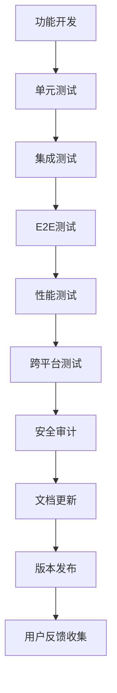

# 🛠️ 工具和生成器模块 (Bin Module) 详细规划

## 📋 模块概述

**工具和生成器模块** 是Sira AI网关的"开发工具箱"，提供命令行工具、代码生成器、开发辅助脚本和项目管理工具。它是开发者与项目的交互界面，实现快速开发、项目管理和自动化运维。

### 定位与职责

- **系统定位**: 开发工具链的核心，提供CLI工具和代码生成能力
- **主要职责**: 项目脚手架、代码生成、配置管理、开发辅助
- **设计理念**: 开发者友好、功能完整、易于扩展、高度自动化

### 架构层次

```
工具和生成器模块架构:
├── 🎯 CLI工具层 (CLI Tools Layer)
│   ├── 项目管理器 (Project Manager)
│   ├── 代码生成器 (Code Generator)
│   └── 配置工具 (Config Tools)
├── 📦 脚手架层 (Scaffolding Layer)
│   ├── 项目模板 (Project Templates)
│   ├── 模块模板 (Module Templates)
│   └── 插件模板 (Plugin Templates)
├── 🔧 开发辅助层 (Development Aids Layer)
│   ├── 调试工具 (Debug Tools)
│   ├── 测试工具 (Test Tools)
│   └── 性能工具 (Performance Tools)
└── 📊 项目管理层 (Project Management Layer)
    ├── 依赖管理 (Dependency Manager)
    ├── 版本控制 (Version Control)
    └── 发布工具 (Release Tools)
```

---

## 🏗️ 架构设计

### 1. CLI框架设计

#### 1.1 命令行界面架构

**基于Commander.js的CLI框架**:

```javascript
class SiraCLI {
  constructor() {
    this.program = new Command();
    this.commands = new Map();
    this.middlewares = [];

    this.setupGlobalOptions();
    this.setupCommands();
    this.setupErrorHandling();
  }

  // 全局选项配置
  setupGlobalOptions() {
    this.program
      .name('sira')
      .description('Sira AI Gateway CLI')
      .version(pkg.version)
      .option('-v, --verbose', 'enable verbose output')
      .option('-c, --config <path>', 'specify config file path')
      .option('--dry-run', 'show what would be done without executing')
      .option('--json', 'output in JSON format')
      .hook('preAction', this.preActionHook.bind(this));
  }

  // 命令注册
  registerCommand(name, command) {
    this.commands.set(name, command);

    const cmd = this.program.command(name).description(command.description);

    // 添加命令选项
    command.options?.forEach(option => {
      cmd.option(option.flags, option.description, option.defaultValue);
    });

    // 设置命令处理器
    cmd.action(async (...args) => {
      try {
        await this.executeMiddleware(command, args);
        await command.handler(...args);
      } catch (error) {
        await this.handleCommandError(error, command);
      }
    });

    return cmd;
  }

  // 中间件执行
  async executeMiddleware(command, args) {
    for (const middleware of this.middlewares) {
      await middleware(command, args);
    }
  }

  // 错误处理
  async handleCommandError(error, command) {
    if (this.program.opts().json) {
      console.log(
        JSON.stringify({
          success: false,
          error: error.message,
          command: command.name,
          timestamp: new Date().toISOString(),
        })
      );
    } else {
      console.error(
        `Error executing command '${command.name}':`,
        error.message
      );

      if (this.program.opts().verbose) {
        console.error(error.stack);
      }

      if (command.examples) {
        console.log('\nExamples:');
        command.examples.forEach(example => {
          console.log(`  ${example}`);
        });
      }
    }

    process.exit(1);
  }

  // 预处理钩子
  async preActionHook(cmd, actionCommand) {
    // 加载配置
    await this.loadConfiguration();

    // 设置日志级别
    this.setupLogging();

    // 验证环境
    await this.validateEnvironment();
  }

  // 启动CLI
  async run() {
    try {
      await this.program.parseAsync();
    } catch (error) {
      console.error('CLI execution failed:', error);
      process.exit(1);
    }
  }
}
```

#### 1.2 插件化命令系统

**动态命令加载**:

```javascript
class CommandLoader {
  constructor(cli) {
    this.cli = cli;
    this.loadedCommands = new Map();
    this.commandPaths = [
      path.join(__dirname, 'commands'),
      path.join(process.cwd(), 'commands'),
      path.join(os.homedir(), '.sira', 'commands'),
    ];
  }

  // 自动发现和加载命令
  async autoloadCommands() {
    for (const commandPath of this.commandPaths) {
      if (await fs.pathExists(commandPath)) {
        await this.loadCommandsFromPath(commandPath);
      }
    }
  }

  // 从路径加载命令
  async loadCommandsFromPath(commandPath) {
    const files = await glob('**/*.js', {
      cwd: commandPath,
      absolute: true,
    });

    for (const file of files) {
      try {
        const commandModule = require(file);
        const command =
          typeof commandModule === 'function' ? commandModule() : commandModule;

        if (this.validateCommand(command)) {
          this.cli.registerCommand(command.name, command);
          this.loadedCommands.set(command.name, {
            command,
            path: file,
            loadedAt: new Date(),
          });
        }
      } catch (error) {
        console.warn(`Failed to load command from ${file}:`, error.message);
      }
    }
  }

  // 命令验证
  validateCommand(command) {
    return (
      command &&
      typeof command.name === 'string' &&
      typeof command.description === 'string' &&
      typeof command.handler === 'function'
    );
  }

  // 热重载命令
  async reloadCommand(name) {
    const commandInfo = this.loadedCommands.get(name);
    if (!commandInfo) {
      throw new Error(`Command '${name}' not found`);
    }

    // 清除模块缓存
    delete require.cache[commandInfo.path];

    try {
      // 重新加载
      const commandModule = require(commandInfo.path);
      const newCommand =
        typeof commandModule === 'function' ? commandModule() : commandModule;

      if (this.validateCommand(newCommand)) {
        this.cli.registerCommand(newCommand.name, newCommand);
        this.loadedCommands.set(name, {
          ...commandInfo,
          command: newCommand,
          reloadedAt: new Date(),
        });

        console.log(`Command '${name}' reloaded successfully`);
      }
    } catch (error) {
      console.error(`Failed to reload command '${name}':`, error.message);
    }
  }
}
```

### 2. 代码生成器设计

#### 2.1 模板引擎架构

**基于EJS的模板系统**:

```javascript
class CodeGenerator {
  constructor() {
    this.templates = new Map();
    this.templateDirs = [
      path.join(__dirname, 'templates'),
      path.join(process.cwd(), 'templates'),
      path.join(os.homedir(), '.sira', 'templates'),
    ];

    this.engine = new EJS({
      root: this.templateDirs,
      cache: true,
      debug: process.env.NODE_ENV === 'development',
    });
  }

  // 注册模板
  registerTemplate(name, templatePath, metadata = {}) {
    this.templates.set(name, {
      path: templatePath,
      metadata: {
        description: metadata.description || '',
        variables: metadata.variables || [],
        dependencies: metadata.dependencies || [],
        ...metadata,
      },
    });
  }

  // 生成代码
  async generate(templateName, variables, options = {}) {
    const template = this.templates.get(templateName);
    if (!template) {
      throw new Error(`Template '${templateName}' not found`);
    }

    // 验证变量
    this.validateVariables(template.metadata.variables, variables);

    // 渲染模板
    const rendered = await this.engine.render(template.path, {
      ...variables,
      metadata: template.metadata,
      helpers: this.getTemplateHelpers(),
    });

    // 后处理
    let processed = rendered;
    if (options.postProcessors) {
      for (const processor of options.postProcessors) {
        processed = await processor(processed, variables);
      }
    }

    return processed;
  }

  // 批量生成
  async generateBatch(generations, options = {}) {
    const results = [];

    for (const generation of generations) {
      try {
        const result = await this.generate(
          generation.template,
          generation.variables,
          generation.options
        );

        results.push({
          template: generation.template,
          output: result,
          success: true,
        });
      } catch (error) {
        results.push({
          template: generation.template,
          error: error.message,
          success: false,
        });

        if (!options.continueOnError) {
          throw error;
        }
      }
    }

    return results;
  }

  // 模板助手函数
  getTemplateHelpers() {
    return {
      camelCase: str => _.camelCase(str),
      pascalCase: str => _.upperFirst(_.camelCase(str)),
      kebabCase: str => _.kebabCase(str),
      snakeCase: str => _.snakeCase(str),
      plural: str => pluralize.plural(str),
      singular: str => pluralize.singular(str),
      currentYear: () => new Date().getFullYear(),
      currentDate: () => new Date().toISOString().split('T')[0],
    };
  }
}
```

#### 2.2 智能代码生成

**基于AST的代码分析和生成**:

```javascript
class IntelligentCodeGenerator {
  constructor() {
    this.parser = new BabylonParser();
    this.generator = new CodeGenerator();
    this.analyzer = new CodeAnalyzer();
  }

  // 分析现有代码
  async analyzeCodebase(codebasePath) {
    const files = await glob('**/*.js', {
      cwd: codebasePath,
      absolute: true,
    });

    const analysis = {
      classes: [],
      functions: [],
      imports: [],
      exports: [],
      dependencies: [],
    };

    for (const file of files) {
      const content = await fs.readFile(file, 'utf8');
      const ast = this.parser.parse(content);

      const fileAnalysis = await this.analyzer.analyze(ast, file);
      Object.keys(analysis).forEach(key => {
        analysis[key].push(...fileAnalysis[key]);
      });
    }

    return analysis;
  }

  // 生成CRUD代码
  async generateCRUD(entityName, fields, options = {}) {
    const analysis = options.codebasePath
      ? await this.analyzeCodebase(options.codebasePath)
      : null;

    // 推断最佳实践
    const conventions = this.inferConventions(analysis);

    const templates = [
      {
        template: 'model',
        variables: {
          entityName,
          fields,
          conventions,
        },
      },
      {
        template: 'controller',
        variables: {
          entityName,
          fields,
          conventions,
        },
      },
      {
        template: 'routes',
        variables: {
          entityName,
          fields,
          conventions,
        },
      },
      {
        template: 'tests',
        variables: {
          entityName,
          fields,
          conventions,
        },
      },
    ];

    return await this.generator.generateBatch(templates);
  }

  // 生成API客户端
  async generateAPIClient(apiSpec, language = 'javascript') {
    const endpoints = this.parseAPISpec(apiSpec);

    return await this.generator.generate(`api-client-${language}`, {
      endpoints,
      baseURL: apiSpec.servers?.[0]?.url || '',
      version: apiSpec.info?.version || '1.0.0',
    });
  }

  // 推断代码规范
  inferConventions(analysis) {
    if (!analysis) return {};

    return {
      naming: this.inferNamingConventions(analysis),
      structure: this.inferProjectStructure(analysis),
      patterns: this.inferDesignPatterns(analysis),
    };
  }
}
```

---

## 🎯 功能职责详解

### 1. 项目管理功能

#### 1.1 项目初始化

**智能项目脚手架**:

```javascript
class ProjectInitializer {
  // 项目创建命令
  static async createProject(name, options = {}) {
    const projectPath = path.resolve(name);

    // 检查目标目录
    if (await fs.pathExists(projectPath)) {
      if (!options.force) {
        throw new Error(`Directory '${name}' already exists`);
      }
      await fs.remove(projectPath);
    }

    // 创建项目目录
    await fs.ensureDir(projectPath);

    // 选择项目模板
    const template = await this.selectTemplate(options.template);

    // 生成项目文件
    await this.generateProjectFiles(projectPath, name, template, options);

    // 初始化依赖
    if (!options.skipInstall) {
      await this.installDependencies(projectPath);
    }

    // 初始化Git仓库
    if (!options.skipGit) {
      await this.initializeGit(projectPath);
    }

    // 显示后续步骤
    this.displayNextSteps(name);

    console.log(`✅ Project '${name}' created successfully!`);
  }

  // 模板选择
  static async selectTemplate(templateName) {
    const templates = await this.loadAvailableTemplates();

    if (templateName) {
      const template = templates.find(t => t.name === templateName);
      if (!template) {
        throw new Error(`Template '${templateName}' not found`);
      }
      return template;
    }

    // 交互式选择
    const { template } = await inquirer.prompt([
      {
        type: 'list',
        name: 'template',
        message: 'Choose a project template:',
        choices: templates.map(t => ({
          name: `${t.name} - ${t.description}`,
          value: t,
        })),
      },
    ]);

    return template;
  }

  // 项目文件生成
  static async generateProjectFiles(projectPath, name, template, options) {
    const variables = {
      name,
      version: '1.0.0',
      description: options.description || `A Sira AI Gateway project`,
      author: options.author || this.getGitUser(),
      license: options.license || 'MIT',
      ...options,
    };

    for (const file of template.files) {
      const filePath = path.join(projectPath, file.path);
      const content = await this.generator.generate(file.template, variables);

      await fs.ensureDir(path.dirname(filePath));
      await fs.writeFile(filePath, content);
    }
  }
}
```

#### 1.2 依赖管理

**智能依赖解析**:

```javascript
class DependencyManager {
  constructor(projectPath) {
    this.projectPath = projectPath;
    this.packagePath = path.join(projectPath, 'package.json');
  }

  // 分析项目依赖
  async analyzeDependencies() {
    const packageJson = await this.readPackageJson();

    return {
      dependencies: await this.analyzeDeps(packageJson.dependencies || {}),
      devDependencies: await this.analyzeDeps(
        packageJson.devDependencies || {}
      ),
      peerDependencies: packageJson.peerDependencies || {},
      optionalDependencies: packageJson.optionalDependencies || {},
    };
  }

  // 添加依赖
  async addDependency(name, version, options = {}) {
    const packageJson = await this.readPackageJson();

    const deps = options.dev
      ? packageJson.devDependencies
      : packageJson.dependencies;
    deps[name] = version;

    await this.writePackageJson(packageJson);

    if (!options.skipInstall) {
      await this.installPackage(name);
    }
  }

  // 移除依赖
  async removeDependency(name, options = {}) {
    const packageJson = await this.readPackageJson();

    delete packageJson.dependencies?.[name];
    delete packageJson.devDependencies?.[name];

    await this.writePackageJson(packageJson);

    if (!options.skipInstall) {
      await this.uninstallPackage(name);
    }
  }

  // 检查依赖更新
  async checkUpdates() {
    const current = await this.analyzeDependencies();
    const latest = await this.fetchLatestVersions(
      Object.keys({
        ...current.dependencies,
        ...current.devDependencies,
      })
    );

    const updates = {};

    for (const [name, currentVersion] of Object.entries({
      ...current.dependencies,
      ...current.devDependencies,
    })) {
      const latestVersion = latest[name];
      if (latestVersion && semver.lt(currentVersion, latestVersion)) {
        updates[name] = {
          current: currentVersion,
          latest: latestVersion,
          type: semver.diff(currentVersion, latestVersion),
        };
      }
    }

    return updates;
  }

  // 批量更新依赖
  async updateDependencies(updates, options = {}) {
    const packageJson = await this.readPackageJson();

    for (const [name, info] of Object.entries(updates)) {
      const targetVersion = options.major ? info.latest : `^${info.latest}`;

      if (packageJson.dependencies?.[name]) {
        packageJson.dependencies[name] = targetVersion;
      } else if (packageJson.devDependencies?.[name]) {
        packageJson.devDependencies[name] = targetVersion;
      }
    }

    await this.writePackageJson(packageJson);

    if (!options.skipInstall) {
      await this.installAll();
    }
  }
}
```

### 2. 开发辅助功能

#### 2.1 调试工具

**集成调试环境**:

```javascript
class DebugTools {
  // 启动调试服务器
  static async startDebugServer(port = 9229) {
    const script = process.argv[1];
    const args = ['--inspect', `--inspect-port=${port}`, script];

    // 添加原始参数
    args.push(...process.argv.slice(2));

    const child = spawn('node', args, {
      stdio: 'inherit',
      cwd: process.cwd(),
    });

    console.log(`🔍 Debug server started on port ${port}`);
    console.log(`Open chrome://inspect or VS Code debugger`);

    return child;
  }

  // 性能分析
  static async startProfiling(duration = 30000) {
    console.log(`📊 Starting performance profiling for ${duration}ms...`);

    const profiler = new V8Profiler();
    profiler.start();

    await this.delay(duration);

    const profile = profiler.stop();
    const fileName = `profile-${Date.now()}.cpuprofile`;

    await fs.writeFile(fileName, JSON.stringify(profile));
    console.log(`📄 Profile saved to ${fileName}`);

    return fileName;
  }

  // 内存快照
  static async takeHeapSnapshot() {
    const snapshot = v8.writeHeapSnapshot();
    console.log(`📸 Heap snapshot saved to ${snapshot}`);
    return snapshot;
  }

  // 网络请求监控
  static async monitorNetwork(options = {}) {
    const http = require('http');
    const originalRequest = http.request;

    const requests = [];

    http.request = function (...args) {
      const req = originalRequest.apply(this, args);
      const startTime = Date.now();

      req.on('response', res => {
        const duration = Date.now() - startTime;
        requests.push({
          url: `${args[0].protocol}//${args[0].host}${args[0].path}`,
          method: args[0].method,
          statusCode: res.statusCode,
          duration,
          timestamp: new Date(),
        });
      });

      return req;
    };

    // 定期输出统计
    const interval = setInterval(() => {
      const recent = requests.filter(r => Date.now() - r.timestamp < 60000);
      console.log(`📡 Network stats (last minute): ${recent.length} requests`);
    }, 10000);

    // 清理函数
    return () => {
      http.request = originalRequest;
      clearInterval(interval);
      return requests;
    };
  }
}
```

#### 2.2 测试工具

**测试环境管理**:

```javascript
class TestTools {
  // 创建测试数据库
  static async createTestDatabase(options = {}) {
    const dbName = `test_${Date.now()}_${Math.random().toString(36).substr(2, 9)}`;

    // 创建数据库
    await this.executeSQL(`CREATE DATABASE ${dbName}`);

    // 运行迁移
    await this.runMigrations(dbName);

    // 返回清理函数
    return {
      name: dbName,
      url: `postgresql://localhost/${dbName}`,
      cleanup: async () => {
        await this.executeSQL(`DROP DATABASE ${dbName}`);
      },
    };
  }

  // 模拟外部服务
  static async startMockServices(services) {
    const mocks = [];

    for (const service of services) {
      const mock = await this.createMockService(service);
      mocks.push(mock);
    }

    return {
      services: mocks,
      cleanup: async () => {
        for (const mock of mocks) {
          await mock.stop();
        }
      },
    };
  }

  // 生成测试数据
  static async generateTestData(schema, count = 10) {
    const data = [];

    for (let i = 0; i < count; i++) {
      const item = {};

      for (const [field, config] of Object.entries(schema)) {
        item[field] = this.generateFieldValue(config);
      }

      data.push(item);
    }

    return data;
  }

  // 性能测试
  static async runPerformanceTest(testFn, options = {}) {
    const { iterations = 1000, concurrency = 10, warmup = 100 } = options;

    console.log(
      `🚀 Running performance test (${iterations} iterations, ${concurrency} concurrency)...`
    );

    // 预热
    for (let i = 0; i < warmup; i++) {
      await testFn();
    }

    // 执行测试
    const results = [];
    const semaphore = new Semaphore(concurrency);

    for (let i = 0; i < iterations; i++) {
      await semaphore.acquire();

      (async () => {
        const start = process.hrtime.bigint();
        try {
          await testFn();
          const end = process.hrtime.bigint();
          results.push(Number(end - start) / 1e6); // 转换为毫秒
        } catch (error) {
          results.push(-1); // 标记错误
        } finally {
          semaphore.release();
        }
      })();
    }

    // 等待所有测试完成
    await semaphore.acquire(concurrency);

    // 计算统计
    const validResults = results.filter(r => r >= 0);
    const stats = {
      total: iterations,
      successful: validResults.length,
      failed: results.length - validResults.length,
      min: Math.min(...validResults),
      max: Math.max(...validResults),
      mean: validResults.reduce((a, b) => a + b, 0) / validResults.length,
      p50: this.calculatePercentile(validResults, 50),
      p95: this.calculatePercentile(validResults, 95),
      p99: this.calculatePercentile(validResults, 99),
    };

    console.log('📊 Performance test results:', stats);
    return stats;
  }
}
```

---

## 🛠️ 技术实现详解

### 1. 命令行界面实现

#### 1.1 交互式命令

**基于Inquirer的交互界面**:

```javascript
class InteractiveCLI {
  // 项目创建向导
  static async createProjectWizard() {
    console.log('🚀 Welcome to Sira AI Gateway project creator!');

    const answers = await inquirer.prompt([
      {
        type: 'input',
        name: 'name',
        message: 'Project name:',
        validate: input => {
          if (!input.trim()) return 'Project name is required';
          if (!/^[a-z0-9-]+$/.test(input))
            return 'Project name can only contain lowercase letters, numbers, and hyphens';
          return true;
        },
      },
      {
        type: 'input',
        name: 'description',
        message: 'Project description:',
        default: 'A Sira AI Gateway project',
      },
      {
        type: 'list',
        name: 'template',
        message: 'Choose a project template:',
        choices: [
          { name: 'Basic Gateway - Simple AI gateway setup', value: 'basic' },
          {
            name: 'Enterprise Gateway - Full-featured enterprise setup',
            value: 'enterprise',
          },
          {
            name: 'Microservices Gateway - Multi-service architecture',
            value: 'microservices',
          },
          { name: 'Custom - Start from scratch', value: 'custom' },
        ],
      },
      {
        type: 'checkbox',
        name: 'features',
        message: 'Select additional features:',
        choices: [
          {
            name: 'Authentication & Authorization',
            value: 'auth',
            checked: true,
          },
          { name: 'Rate Limiting', value: 'rate-limit', checked: true },
          { name: 'Caching', value: 'cache', checked: true },
          { name: 'Monitoring & Metrics', value: 'monitoring', checked: true },
          { name: 'Load Balancing', value: 'load-balance', checked: false },
          { name: 'Circuit Breaker', value: 'circuit-breaker', checked: false },
          { name: 'API Documentation', value: 'docs', checked: true },
        ],
        when: answers => answers.template !== 'custom',
      },
      {
        type: 'confirm',
        name: 'installDeps',
        message: 'Install dependencies now?',
        default: true,
      },
      {
        type: 'confirm',
        name: 'initializeGit',
        message: 'Initialize Git repository?',
        default: true,
      },
    ]);

    // 执行项目创建
    await ProjectInitializer.createProject(answers.name, {
      description: answers.description,
      template: answers.template,
      features: answers.features,
      installDeps: answers.installDeps,
      initializeGit: answers.initializeGit,
    });
  }

  // 配置编辑器
  static async editConfiguration() {
    const configPath = await this.findConfigFile();

    if (!configPath) {
      console.log('No configuration file found. Run "sira init" first.');
      return;
    }

    const config = await this.loadConfig(configPath);

    // 转换为易编辑的格式
    const editableConfig = this.makeEditable(config);

    // 启动交互式编辑器
    const edited = await this.interactiveEdit(editableConfig);

    // 验证配置
    const validated = await this.validateEditedConfig(edited);

    // 保存配置
    await this.saveConfig(configPath, validated);

    console.log('✅ Configuration updated successfully!');
  }

  // 交互式编辑
  static async interactiveEdit(config) {
    const sections = Object.keys(config);

    for (const section of sections) {
      console.log(`\n📝 Editing section: ${section}`);

      const answers = await inquirer.prompt([
        {
          type: 'confirm',
          name: 'editSection',
          message: `Edit ${section} section?`,
          default: false,
        },
      ]);

      if (answers.editSection) {
        config[section] = await this.editSection(config[section]);
      }
    }

    return config;
  }
}
```

#### 1.2 自动补全和建议

**智能命令补全**:

```javascript
class CommandCompleter {
  constructor(cli) {
    this.cli = cli;
    this.completions = new Map();
  }

  // 注册补全规则
  registerCompletion(command, completer) {
    this.completions.set(command, completer);
  }

  // 生成补全建议
  async complete(line, cursor) {
    const tokens = line.slice(0, cursor).split(/\s+/);
    const current = tokens[tokens.length - 1];

    // 命令补全
    if (tokens.length === 1) {
      return this.completeCommand(current);
    }

    // 参数补全
    const command = tokens[0];
    const completer = this.completions.get(command);

    if (completer) {
      return await completer(tokens.slice(1), current);
    }

    return [];
  }

  // 命令补全
  completeCommand(prefix) {
    const commands = Array.from(this.cli.commands.keys());
    return commands.filter(cmd => cmd.startsWith(prefix));
  }

  // 文件路径补全
  static fileCompleter(current) {
    return new Promise(resolve => {
      glob(`${current}*`, { cwd: process.cwd() }, (err, files) => {
        if (err) resolve([]);
        else resolve(files);
      });
    });
  }

  // 项目名称补全
  static projectCompleter(current) {
    return new Promise(resolve => {
      // 扫描可能的项目目录
      glob(`${current}*/package.json`, { cwd: process.cwd() }, (err, files) => {
        if (err) resolve([]);
        else resolve(files.map(f => path.dirname(f)));
      });
    });
  }
}
```

### 2. 项目模板系统

#### 2.1 模板管理系统

**模板仓库和版本控制**:

```javascript
class TemplateManager {
  constructor() {
    this.templates = new Map();
    this.templateRegistry = 'https://registry.sira.ai/templates';
    this.localTemplateDir = path.join(os.homedir(), '.sira', 'templates');
  }

  // 安装模板
  async installTemplate(name, version = 'latest') {
    const templateInfo = await this.resolveTemplate(name, version);

    console.log(`📦 Installing template ${name}@${templateInfo.version}...`);

    // 下载模板
    const templatePath = await this.downloadTemplate(templateInfo);

    // 验证模板
    await this.validateTemplate(templatePath);

    // 注册模板
    this.templates.set(name, {
      ...templateInfo,
      localPath: templatePath,
      installedAt: new Date(),
    });

    console.log(`✅ Template ${name} installed successfully!`);
  }

  // 列出可用模板
  async listTemplates(options = {}) {
    const { remote = true, local = true } = options;
    const templates = [];

    if (remote) {
      const remoteTemplates = await this.fetchRemoteTemplates();
      templates.push(...remoteTemplates.map(t => ({ ...t, source: 'remote' })));
    }

    if (local) {
      const localTemplates = await this.scanLocalTemplates();
      templates.push(...localTemplates.map(t => ({ ...t, source: 'local' })));
    }

    return templates;
  }

  // 创建自定义模板
  async createTemplate(name, sourcePath, options = {}) {
    console.log(`🎨 Creating template from ${sourcePath}...`);

    // 分析源代码结构
    const structure = await this.analyzeProjectStructure(sourcePath);

    // 生成模板配置
    const templateConfig = {
      name,
      version: '1.0.0',
      description: options.description || `Custom template ${name}`,
      author: options.author || this.getGitUser(),
      files: structure.files,
      variables: structure.variables,
      dependencies: structure.dependencies,
      createdAt: new Date(),
    };

    // 保存模板
    const templatePath = path.join(this.localTemplateDir, name);
    await fs.ensureDir(templatePath);
    await fs.writeJson(
      path.join(templatePath, 'template.json'),
      templateConfig
    );

    // 复制模板文件
    for (const file of structure.files) {
      const sourceFile = path.join(sourcePath, file.source);
      const templateFile = path.join(templatePath, 'files', file.path);

      if (await fs.pathExists(sourceFile)) {
        await fs.ensureDir(path.dirname(templateFile));
        await fs.copy(sourceFile, templateFile);
      }
    }

    console.log(`✅ Template ${name} created successfully!`);
  }

  // 发布模板
  async publishTemplate(name, options = {}) {
    const template = this.templates.get(name);
    if (!template) {
      throw new Error(`Template ${name} not found`);
    }

    console.log(`🚀 Publishing template ${name}...`);

    // 打包模板
    const packagePath = await this.packageTemplate(template);

    // 上传到注册表
    await this.uploadToRegistry(packagePath, options);

    console.log(`✅ Template ${name} published successfully!`);
  }
}
```

#### 2.2 模板变量系统

**动态变量解析和验证**:

```javascript
class TemplateVariableSystem {
  constructor() {
    this.validators = new Map();
    this.transformers = new Map();

    this.registerBuiltInValidators();
    this.registerBuiltInTransformers();
  }

  // 注册变量验证器
  registerValidator(type, validator) {
    this.validators.set(type, validator);
  }

  // 注册变量转换器
  registerTransformer(type, transformer) {
    this.transformers.set(type, transformer);
  }

  // 验证变量
  validateVariable(variable, value) {
    const validator = this.validators.get(variable.type);
    if (!validator) {
      throw new Error(`Unknown variable type: ${variable.type}`);
    }

    const result = validator(value, variable);
    if (!result.valid) {
      throw new Error(`Variable ${variable.name}: ${result.message}`);
    }

    return result.transformedValue || value;
  }

  // 转换变量
  transformVariable(variable, value) {
    const transformer = this.transformers.get(variable.type);
    if (transformer) {
      return transformer(value, variable);
    }

    return value;
  }

  // 注册内置验证器
  registerBuiltInValidators() {
    // 字符串验证器
    this.registerValidator('string', (value, variable) => {
      if (typeof value !== 'string') {
        return { valid: false, message: 'Must be a string' };
      }

      if (variable.minLength && value.length < variable.minLength) {
        return {
          valid: false,
          message: `Minimum length is ${variable.minLength}`,
        };
      }

      if (variable.maxLength && value.length > variable.maxLength) {
        return {
          valid: false,
          message: `Maximum length is ${variable.maxLength}`,
        };
      }

      if (variable.pattern && !new RegExp(variable.pattern).test(value)) {
        return {
          valid: false,
          message: `Must match pattern ${variable.pattern}`,
        };
      }

      return { valid: true };
    });

    // 项目名称验证器
    this.registerValidator('project-name', value => {
      if (!/^[a-z0-9-]+$/.test(value)) {
        return {
          valid: false,
          message:
            'Project name can only contain lowercase letters, numbers, and hyphens',
        };
      }

      return { valid: true };
    });

    // 端口验证器
    this.registerValidator('port', value => {
      const port = parseInt(value);
      if (isNaN(port) || port < 1 || port > 65535) {
        return { valid: false, message: 'Port must be between 1 and 65535' };
      }

      return { valid: true };
    });
  }

  // 注册内置转换器
  registerBuiltInTransformers() {
    // 驼峰转换器
    this.registerTransformer('camelCase', value => _.camelCase(value));

    // 帕斯卡转换器
    this.registerTransformer('pascalCase', value =>
      _.upperFirst(_.camelCase(value))
    );

    // kebab转换器
    this.registerTransformer('kebabCase', value => _.kebabCase(value));

    // 复数转换器
    this.registerTransformer('plural', value => pluralize.plural(value));

    // 小写转换器
    this.registerTransformer('lowercase', value => value.toLowerCase());

    // 大写转换器
    this.registerTransformer('uppercase', value => value.toUpperCase());
  }
}
```

---

## 📈 发展规划

### 1. 短期规划 (0-6个月)

#### 1.1 核心功能完善

- [ ] **CLI框架增强**
  - [ ] 支持插件化命令扩展
  - [ ] 改进错误处理和用户反馈
  - [ ] 添加命令执行时间统计
  - [ ] 支持命令历史和重放

- [ ] **代码生成器升级**
  - [ ] 基于AST的智能代码分析
  - [ ] 支持更多编程语言生成
  - [ ] 改进模板变量系统
  - [ ] 添加代码格式化和美化

- [ ] **项目模板丰富**
  - [ ] 增加企业级项目模板
  - [ ] 支持多框架模板选择
  - [ ] 添加行业特定模板
  - [ ] 模板使用统计和优化

#### 1.2 开发者体验优化

- [ ] **交互式界面**
  - [ ] 图形化项目创建向导
  - [ ] 可视化配置编辑器
  - [ ] 实时命令预览和验证
  - [ ] 智能建议和自动补全

- [ ] **学习和文档**
  - [ ] 交互式CLI教程
  - [ ] 命令使用示例库
  - [ ] 最佳实践指南
  - [ ] 故障排除助手

### 2. 中期规划 (6-12个月)

#### 2.1 生态系统建设

- [ ] **插件市场**
  - [ ] 第三方插件审核和发布
  - [ ] 插件版本管理和兼容性
  - [ ] 插件使用统计和排行榜
  - [ ] 插件开发者激励计划

- [ ] **模板社区**
  - [ ] 用户生成模板分享
  - [ ] 模板质量评分和审核
  - [ ] 模板使用分析和改进
  - [ ] 模板定制服务

- [ ] **集成工具**
  - [ ] IDE插件和扩展
  - [ ] CI/CD集成工具
  - [ ] 云服务集成工具
  - [ ] 容器化部署工具

#### 2.2 智能化工具

- [ ] **AI辅助开发**
  - [ ] 代码生成AI助手
  - [ ] 智能错误诊断
  - [ ] 自动性能优化建议
  - [ ] 项目架构分析

- [ ] **自动化运维**
  - [ ] 智能部署策略
  - [ ] 自动扩缩容工具
  - [ ] 故障自动恢复
  - [ ] 性能监控自动化

### 3. 长期规划 (12-24个月)

#### 3.1 平台化发展

- [ ] **开发者平台**
  - [ ] 在线IDE集成
  - [ ] 协作开发环境
  - [ ] 项目管理工具
  - [ ] 团队协作功能

- [ ] **企业平台**
  - [ ] 企业控制台
  - [ ] 多租户管理
  - [ ] 企业级安全
  - [ ] 合规性管理

#### 3.2 生态主导

- [ ] **开源领导力**
  - [ ] 成为CLI工具标准
  - [ ] 建立行业规范
  - [ ] 领导开源社区
  - [ ] 开源基金会成员

- [ ] **商业生态**
  - [ ] 企业服务扩展
  - [ ] 合作伙伴体系
  - [ ] 增值服务开发
  - [ ] 国际化扩张

---

## 🔗 依赖关系

### 1. 内部依赖

#### 1.1 强依赖模块

```
工具和生成器模块依赖关系:
├── 核心模块 (Core Module)
│   ├── 调用AI路由配置
│   └── 使用配置验证
├── 配置模块 (Config Module)
│   ├── 读取CLI配置
│   └── 更新项目配置
├── 网关模块 (Gateway Module)
│   ├── 提供HTTP服务器
│   └── 支持调试接口
└── 测试模块 (Test Module)
    ├── 集成测试工具
    └── 性能测试框架
```

#### 1.2 可选依赖模块

```
可选依赖:
├── 管理模块 (Admin Module) - Web管理界面集成
├── 部署模块 (Docker Module) - 容器化部署支持
└── 文档模块 (Docs Module) - 帮助文档生成
```

### 2. 外部依赖

#### 2.1 核心依赖

```json
{
  "命令行框架": {
    "commander": "^11.0.0",
    "inquirer": "^9.2.0",
    "chalk": "^5.3.0",
    "ora": "^7.0.0"
  },
  "文件系统": {
    "fs-extra": "^11.1.0",
    "glob": "^10.3.0",
    "chokidar": "^3.5.0"
  },
  "代码生成": {
    "ejs": "^3.1.9",
    "prettier": "^3.0.0",
    "escodegen": "^2.1.0"
  },
  "工具库": {
    "lodash": "^4.17.0",
    "semver": "^7.5.0",
    "pluralize": "^8.0.0",
    "uuid": "^9.0.0"
  }
}
```

#### 2.2 开发工具依赖

```json
{
  "测试工具": {
    "jest": "^29.5.0",
    "supertest": "^6.3.0",
    "nock": "^13.3.0"
  },
  "代码质量": {
    "eslint": "^8.45.0",
    "husky": "^8.0.0",
    "lint-staged": "^13.2.0"
  },
  "构建工具": {
    "webpack": "^5.88.0",
    "babel": "^7.22.0",
    "typescript": "^5.1.0"
  }
}
```

---

## 🧪 测试策略

### 1. 测试层次架构

#### 1.1 单元测试

**CLI命令测试**:

```javascript
describe('CLI Commands', () => {
  let cli;

  beforeEach(() => {
    cli = new SiraCLI();
  });

  describe('create command', () => {
    test('should create basic project structure', async () => {
      const tempDir = await fs.mkdtemp('/tmp/sira-test-');
      const projectName = 'test-project';

      // Mock user input
      const mockPrompt = jest.spyOn(inquirer, 'prompt').mockResolvedValue({
        name: projectName,
        template: 'basic',
        description: 'Test project',
      });

      await cli.run(['create', '--cwd', tempDir]);

      expect(
        fs.existsSync(path.join(tempDir, projectName, 'package.json'))
      ).toBe(true);
      expect(fs.existsSync(path.join(tempDir, projectName, 'src'))).toBe(true);

      mockPrompt.mockRestore();
    });

    test('should validate project name', async () => {
      const consoleSpy = jest.spyOn(console, 'error').mockImplementation();

      await expect(cli.run(['create', 'Invalid Name!'])).rejects.toThrow();

      consoleSpy.mockRestore();
    });
  });

  describe('generate command', () => {
    test('should generate controller code', async () => {
      const output = await cli.run([
        'generate',
        'controller',
        'UserController',
        '--fields=name:string,email:string,age:number',
      ]);

      expect(output).toContain('class UserController');
      expect(output).toContain('createUser');
      expect(output).toContain('getUser');
    });

    test('should handle template not found', async () => {
      await expect(cli.run(['generate', 'nonexistent'])).rejects.toThrow(
        'Template not found'
      );
    });
  });
});
```

#### 1.2 集成测试

**端到端CLI测试**:

```javascript
describe('CLI E2E Tests', () => {
  let tempDir;

  beforeEach(async () => {
    tempDir = await fs.mkdtemp('/tmp/sira-cli-test-');
    process.chdir(tempDir);
  });

  afterEach(async () => {
    process.chdir(originalCwd);
    await fs.remove(tempDir);
  });

  test('should create and build a complete project', async () => {
    // Create project
    await execCLI([
      'create',
      'my-app',
      '--template',
      'basic',
      '--skip-install',
    ]);

    expect(fs.existsSync('my-app/package.json')).toBe(true);
    expect(fs.existsSync('my-app/src/index.js')).toBe(true);

    // Change to project directory
    process.chdir('my-app');

    // Install dependencies
    await execCLI(['install']);

    expect(fs.existsSync('node_modules')).toBe(true);

    // Run tests
    const testResult = await execCLI(['test']);
    expect(testResult.exitCode).toBe(0);

    // Build project
    const buildResult = await execCLI(['build']);
    expect(buildResult.exitCode).toBe(0);
    expect(fs.existsSync('dist')).toBe(true);
  });

  test('should handle project with custom template', async () => {
    // Create custom template
    await fs.ensureDir('custom-templates/my-template');
    await fs.writeJson('custom-templates/my-template/template.json', {
      name: 'my-template',
      files: [{ path: 'README.md', template: 'readme' }],
    });

    // Create project with custom template
    await execCLI(['create', 'custom-app', '--template', 'my-template']);

    expect(fs.existsSync('custom-app/README.md')).toBe(true);
  });
});
```

### 2. 测试工具链

#### 2.1 自动化测试

```yaml
# GitHub Actions CI配置
name: CLI Tools CI
on: [push, pull_request]

jobs:
  test:
    runs-on: ubuntu-latest
    strategy:
      matrix:
        node-version: [16.x, 18.x, 20.x]

    steps:
      - uses: actions/checkout@v4
      - name: Setup Node.js ${{ matrix.node-version }}
        uses: actions/setup-node@v4
        with:
          node-version: ${{ matrix.node-version }}
          cache: 'npm'

      - name: Install dependencies
        run: npm ci

      - name: Run linting
        run: npm run lint

      - name: Run unit tests
        run: npm run test:unit

      - name: Run integration tests
        run: npm run test:integration

      - name: Run E2E tests
        run: npm run test:e2e

      - name: Upload coverage
        uses: codecov/codecov-action@v3
```

#### 2.2 性能测试

**CLI性能基准测试**:

```javascript
class CLIPerformanceTest {
  static async runBenchmark() {
    console.log('🚀 Running CLI performance benchmark...');

    const results = {
      commandExecution: await this.benchmarkCommandExecution(),
      projectCreation: await this.benchmarkProjectCreation(),
      codeGeneration: await this.benchmarkCodeGeneration(),
      dependencyInstall: await this.benchmarkDependencyInstall(),
    };

    console.log('📊 CLI Performance Results:');
    console.table(results);

    return results;
  }

  static async benchmarkCommandExecution() {
    const commands = [['--help'], ['version'], ['list-templates']];

    const times = [];

    for (const cmd of commands) {
      const start = Date.now();
      await execCLI(cmd);
      times.push(Date.now() - start);
    }

    return {
      min: Math.min(...times),
      max: Math.max(...times),
      avg: times.reduce((a, b) => a + b) / times.length,
      p95: this.calculatePercentile(times, 95),
    };
  }

  static async benchmarkProjectCreation() {
    const tempDir = await fs.mkdtemp('/tmp/cli-perf-');

    const start = Date.now();
    await execCLI(
      ['create', 'perf-test', '--template', 'basic', '--skip-install'],
      {
        cwd: tempDir,
      }
    );
    const duration = Date.now() - start;

    await fs.remove(tempDir);

    return { duration, success: true };
  }

  static async benchmarkCodeGeneration() {
    const start = Date.now();
    await execCLI([
      'generate',
      'controller',
      'TestController',
      '--fields=id:number,name:string,email:string',
    ]);
    const duration = Date.now() - start;

    return { duration, success: true };
  }
}
```

---

## 🔧 维护计划

### 1. 日常维护

#### 1.1 监控和告警

**CLI工具监控**:

- [ ] 命令执行成功率监控
- [ ] 模板下载和安装监控
- [ ] 代码生成质量监控
- [ ] 用户使用行为分析

**告警规则**:

```javascript
const cliAlerts = {
  commandFailure: {
    condition: 'command_execution_errors > 5',
    severity: 'warning',
    message: 'High command execution error rate',
    channels: ['slack'],
  },
  templateDownloadFailure: {
    condition: 'template_download_failures > 0',
    severity: 'error',
    message: 'Template download failures detected',
    channels: ['slack', 'email'],
  },
  performanceDegradation: {
    condition: 'command_execution_time_p95 > 5000',
    severity: 'warning',
    message: 'CLI performance degradation detected',
    channels: ['slack'],
  },
};
```

#### 1.2 定期检查

**每日检查**:

- [ ] CLI命令执行日志分析
- [ ] 模板下载统计
- [ ] 用户反馈处理
- [ ] 错误日志审查

**每周检查**:

- [ ] 模板更新检查
- [ ] 依赖包安全扫描
- [ ] 性能基准测试
- [ ] 用户满意度调查

**每月检查**:

- [ ] 功能使用统计分析
- [ ] 新功能需求收集
- [ ] 竞争工具对比分析
- [ ] 版本发布规划

### 2. 版本管理

#### 2.1 发布流程

**CLI工具发布流程**:



**发布检查清单**:

- [ ] 所有测试通过 (单元、集成、E2E)
- [ ] 性能基准测试通过
- [ ] 跨平台兼容性测试 (Windows、macOS、Linux)
- [ ] 安全漏洞扫描通过
- [ ] 文档更新完成
- [ ] 变更日志编写完成

#### 2.2 更新机制

**自动更新系统**:

```javascript
class AutoUpdater {
  constructor() {
    this.updateCheckInterval = 24 * 60 * 60 * 1000; // 24小时
    this.updateUrl = 'https://registry.sira.ai/cli/releases/latest';
  }

  // 检查更新
  async checkForUpdates() {
    try {
      const currentVersion = pkg.version;
      const latestRelease = await this.fetchLatestRelease();

      if (semver.gt(latestRelease.version, currentVersion)) {
        const updateInfo = {
          currentVersion,
          latestVersion: latestRelease.version,
          changelog: latestRelease.changelog,
          downloadUrl: latestRelease.downloadUrl,
        };

        await this.notifyUser(updateInfo);
        return updateInfo;
      }
    } catch (error) {
      console.warn('Failed to check for updates:', error.message);
    }

    return null;
  }

  // 自动更新
  async performUpdate(updateInfo) {
    console.log(
      `🔄 Updating Sira CLI from ${updateInfo.currentVersion} to ${updateInfo.latestVersion}...`
    );

    // 下载新版本
    const downloadPath = await this.downloadUpdate(updateInfo.downloadUrl);

    // 备份当前版本
    await this.backupCurrentVersion();

    // 安装新版本
    await this.installUpdate(downloadPath);

    // 验证安装
    await this.verifyUpdate(updateInfo.latestVersion);

    console.log('✅ Update completed successfully!');
  }

  // 启动自动检查
  startAutoCheck() {
    // 立即检查一次
    this.checkForUpdates();

    // 设置定期检查
    setInterval(() => {
      this.checkForUpdates();
    }, this.updateCheckInterval);
  }
}
```

### 3. 技术债务管理

#### 3.1 债务识别

**CLI工具债务**:

- [ ] 命令重复代码清理
- [ ] 模板系统重构
- [ ] 测试覆盖率提升
- [ ] 错误处理统一化

**代码生成债务**:

- [ ] 模板维护困难
- [ ] 生成代码质量不稳定
- [ ] 变量系统复杂性
- [ ] 语言支持扩展性

#### 3.2 债务偿还计划

**优先级排序**:

1. **P0 (紧急)**: 影响CLI稳定性的债务
2. **P1 (重要)**: 影响用户体验的债务
3. **P2 (一般)**: 影响代码可维护性的债务

**偿还策略**:

- [ ] 每个迭代周期安排1-2个债务偿还任务
- [ ] 设立债务偿还KPI指标
- [ ] 定期债务评审会议，确保债务不积累

### 4. 文档维护

#### 4.1 CLI文档体系

**文档结构**:

- [ ] **入门指南**: 安装和基本使用
- [ ] **命令参考**: 所有命令的详细说明
- [ ] **模板文档**: 可用模板和自定义模板
- [ ] **开发指南**: 扩展CLI和创建模板

**自动文档生成**:

```javascript
class CLIDocumentationGenerator {
  // 生成命令帮助文档
  async generateCommandDocs() {
    const docs = {};

    for (const [name, command] of this.cli.commands) {
      docs[name] = {
        name: command.name,
        description: command.description,
        usage: this.generateUsage(command),
        options: this.generateOptionsDocs(command.options || []),
        examples: command.examples || [],
      };
    }

    return docs;
  }

  // 生成模板文档
  async generateTemplateDocs() {
    const templates = await this.templateManager.listTemplates();

    return templates.map(template => ({
      name: template.name,
      description: template.description,
      version: template.version,
      author: template.author,
      features: template.features || [],
      usage: this.generateTemplateUsage(template),
      variables: template.variables || [],
    }));
  }

  // 生成使用指南
  async generateUsageGuide() {
    const guide = {
      installation: this.generateInstallationGuide(),
      quickStart: this.generateQuickStartGuide(),
      commonTasks: this.generateCommonTasksGuide(),
      troubleshooting: this.generateTroubleshootingGuide(),
    };

    return guide;
  }
}
```

---

## 📊 成功指标

### 1. 功能完整性指标

#### 1.1 工具可用性

- [ ] **命令成功率**: > 99% 命令执行成功
- [ ] **模板生成成功率**: > 95% 模板生成成功
- [ ] **项目创建成功率**: > 98% 项目创建成功
- [ ] **代码生成质量**: > 90% 生成代码无需修改

#### 1.2 开发者体验

- [ ] **学习曲线**: < 15分钟掌握基础功能
- [ ] **任务完成时间**: 常用任务< 5分钟完成
- [ ] **错误恢复**: > 80% 错误可自动恢复
- [ ] **帮助完备性**: 100% 功能有帮助文档

### 2. 性能与稳定性指标

#### 2.1 性能指标

- [ ] **命令执行时间**: < 2秒 (P95)
- [ ] **项目创建时间**: < 30秒 (基础模板)
- [ ] **代码生成时间**: < 5秒
- [ ] **内存使用**: < 100MB (峰值)

#### 2.2 稳定性指标

- [ ] **CLI可用性**: > 99.5% 无崩溃运行
- [ ] **模板可用性**: > 99% 模板可正常下载
- [ ] **更新成功率**: > 95% 自动更新成功
- [ ] **跨平台兼容性**: 100% 支持主要平台

### 3. 用户 adoption指标

#### 3.1 使用指标

- [ ] **月活跃用户**: 1000+ MAU
- [ ] **命令执行量**: 10,000+ 月执行量
- [ ] **项目创建数**: 500+ 月创建项目
- [ ] **模板下载量**: 2000+ 月下载量

#### 3.2 社区指标

- [ ] **GitHub Stars**: 1000+ stars
- [ ] **贡献者数量**: 50+ 活跃贡献者
- [ ] **模板数量**: 100+ 社区模板
- [ ] **用户满意度**: NPS > 70

---

## 🎯 总结

工具和生成器模块作为Sira AI网关的"开发工具箱"，承担着项目开发、代码生成、依赖管理等关键职责。通过精心设计的CLI框架、智能代码生成器、项目模板系统和开发辅助工具，该模块能够：

**技术优势**:

- 插件化命令系统支持灵活扩展
- 基于EJS的模板引擎支持复杂代码生成
- 智能依赖管理和项目脚手架
- 完善的调试和测试工具集成

**业务价值**:

- 大幅降低项目启动时间和开发复杂度
- 提供一致的代码规范和项目结构
- 支持快速原型开发和功能迭代
- 提升开发团队的整体效率

**用户价值**:

- 开发者可专注于业务逻辑而非基础设施
- 新成员可快速上手项目开发
- 企业可标准化开发流程和规范
- 开源社区可轻松贡献和使用

通过持续的功能优化和生态建设，工具和生成器模块将成为AI网关项目开发的标准工具链，为开发者提供卓越的开发体验和生产力提升。
