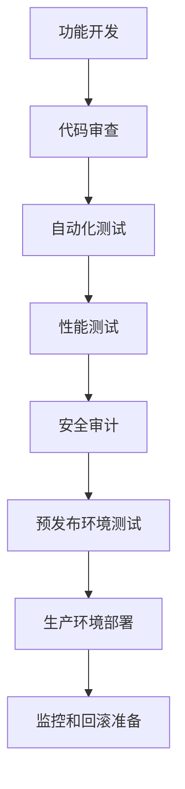

# 🧠 核心模块 (Core Module) 详细规划

## 📋 模块概述

**核心模块** 是Sira AI网关的"中枢神经系统"，负责所有核心业务逻辑的实现和管理。它是整个系统的技术基础，包含AI路由引擎、智能决策、性能监控等关键功能。

### 定位与职责

- **系统定位**: AI网关的核心大脑，处理所有AI请求的智能路由和决策
- **主要职责**: 智能路由、性能优化、安全保障、可观测性
- **设计理念**: 模块化、可扩展、高性能、易维护

### 架构层次

```
核心模块架构:
├── 🎯 智能决策层 (Intelligent Decision Layer)
│   ├── AI路由引擎 (AI Router)
│   ├── 成本优化器 (Cost Optimizer)
│   └── 负载均衡器 (Load Balancer)
├── 🛡️ 安全保障层 (Security Layer)
│   ├── 认证授权 (Authentication)
│   ├── 访问控制 (Access Control)
│   └── 审计日志 (Audit Logging)
├── 📊 可观测性层 (Observability Layer)
│   ├── 性能监控 (Performance Monitor)
│   ├── 错误追踪 (Error Tracking)
│   └── 指标收集 (Metrics Collection)
└── 🔧 基础设施层 (Infrastructure Layer)
    ├── 配置管理 (Configuration)
    ├── 插件系统 (Plugin System)
    └── 事件总线 (Event Bus)
```

---

## 🏗️ 架构设计

### 1. 模块结构详解

#### 1.1 智能决策引擎 (Intelligent Routing Manager)

**文件位置**: `src/core/intelligent-routing-manager.js`

**核心功能**:

```javascript
class IntelligentRoutingManager {
  // 智能路由决策
  async selectOptimalRoute(request) {
    const providers = await this.getAvailableProviders(request.model);
    const costs = await this.calculateCosts(providers, request);
    const performances = await this.getPerformanceMetrics(providers);
    const reliabilities = await this.getReliabilityScores(providers);

    return this.optimizeRoute({
      providers,
      costs,
      performances,
      reliabilities,
      constraints: request.constraints,
    });
  }

  // 动态成本优化
  async optimizeCosts(request) {
    const currentUsage = await this.getCurrentUsage();
    const budgetLimits = await this.getBudgetLimits(request.user);
    const marketRates = await this.getMarketRates();

    return this.findCostOptimalRoute({
      currentUsage,
      budgetLimits,
      marketRates,
      request,
    });
  }
}
```

**技术特点**:

- **多维度决策**: 综合考虑性能、成本、可靠性
- **实时学习**: 基于历史数据优化决策算法
- **动态调整**: 根据系统状态实时调整权重

#### 1.2 AI策略管理器集群

##### AI路由策略 (AI Router Policy)

**文件位置**: `src/core/policies/ai-router/`

**配置架构**:

```json
{
  "$schema": "http://express-gateway.io/schemas/policies/ai-router.json",
  "type": "object",
  "properties": {
    "timeout": { "type": "integer", "default": 30000 },
    "cacheEnabled": { "type": "boolean", "default": true },
    "circuitBreakerEnabled": { "type": "boolean", "default": true },
    "costOptimizationEnabled": { "type": "boolean", "default": true },
    "providers": {
      "openai": {
        "enabled": true,
        "apiKey": "string",
        "priority": 5,
        "rateLimits": { "rpm": 100, "tpm": 1000 }
      }
    }
  }
}
```

##### AI缓存策略 (AI Cache Policy)

**文件位置**: `src/core/policies/ai-cache/`

**缓存策略**:

- **L1缓存**: 内存缓存 (毫秒级响应)
- **L2缓存**: Redis分布式缓存
- **智能失效**: 基于内容和时间双重策略
- **预热机制**: 主动加载热点数据

##### AI熔断器策略 (AI Circuit Breaker)

**文件位置**: `src/core/policies/ai-circuit-breaker/`

**熔断机制**:

```javascript
class AICircuitBreaker {
  constructor(options = {}) {
    this.failureThreshold = options.failureThreshold || 0.5;
    this.recoveryTimeout = options.recoveryTimeout || 30000;
    this.monitoringPeriod = options.monitoringPeriod || 60000;
  }

  async execute(request) {
    if (this.isOpen()) {
      throw new CircuitBreakerError('Circuit breaker is open');
    }

    try {
      const result = await this.callService(request);
      this.recordSuccess();
      return result;
    } catch (error) {
      this.recordFailure();
      throw error;
    }
  }
}
```

#### 1.3 性能监控与分析

##### 性能基准管理器 (Performance Benchmark Manager)

**文件位置**: `src/core/performance-benchmark-manager.js`

**监控指标**:

- **响应时间**: P50, P95, P99分布
- **吞吐量**: RPS (每秒请求数)
- **错误率**: 各类错误统计
- **资源使用**: CPU、内存、磁盘I/O

##### 复杂度分析器 (Complexity Analyzer)

**文件位置**: `src/core/complexity-analyzer.js`

**分析维度**:

- **请求复杂度**: Token数量、模型类型
- **响应复杂度**: 输出长度、多样性
- **系统复杂度**: 并发度、队列长度

#### 1.4 专项AI管理器

##### 会话管理器 (Conversation Manager)

**文件位置**: `src/core/conversation-manager.js`

**功能特性**:

- **上下文管理**: 维护对话历史
- **会话隔离**: 多用户/多会话安全隔离
- **状态持久化**: Redis存储会话状态
- **自动清理**: 过期会话自动清理

##### 批处理管理器 (Batch Processing Manager)

**文件位置**: `src/core/batch-processing-manager.js`

**批处理策略**:

- **动态批次**: 根据请求特征智能分组
- **并行处理**: 充分利用服务商并发能力
- **失败重试**: 批次级别的错误处理
- **成本优化**: 批量请求折扣优化

##### 流式处理管理器 (Streaming Manager)

**文件位置**: `src/core/streaming-manager.js`

**流式特性**:

- **实时传输**: SSE/WebSocket支持
- **缓冲管理**: 智能缓冲和流量控制
- **错误恢复**: 断线重连和状态同步
- **性能监控**: 流式响应延迟监控

### 2. 核心技术栈

#### 2.1 编程语言与框架

- **主语言**: Node.js (16.0+)
- **框架**: Express Gateway (定制扩展)
- **异步处理**: Async/Await + Promise
- **类型检查**: JSDoc + TypeScript定义

#### 2.2 数据存储

```javascript
// 多级存储架构
const storageLayers = {
  // L1: 内存缓存 (热点数据)
  memoryCache: new NodeCache({
    stdTTL: 300, // 5分钟TTL
    checkperiod: 60, // 1分钟检查周期
  }),

  // L2: Redis缓存 (分布式缓存)
  redisCache: new Redis({
    host: process.env.REDIS_HOST,
    port: process.env.REDIS_PORT,
    password: process.env.REDIS_PASSWORD,
  }),

  // L3: 数据库 (持久化存储)
  database: new Database({
    type: 'postgresql',
    connection: process.env.DATABASE_URL,
  }),
};
```

#### 2.3 外部依赖

**核心依赖**:

```json
{
  "express": "^4.18.0",
  "redis": "^4.6.0",
  "winston": "^3.8.0",
  "joi": "^17.9.0",
  "axios": "^1.4.0",
  "node-cache": "^5.1.0",
  "circuit-breaker-js": "^0.5.0"
}
```

**AI服务商SDK**:

```json
{
  "openai": "^4.0.0",
  "@anthropic-ai/sdk": "^0.5.0",
  "@google/generative-ai": "^0.2.0",
  "cohere-ai": "^7.0.0"
}
```

### 3. 设计模式与原则

#### 3.1 核心设计模式

- **策略模式**: AI路由策略可插拔
- **观察者模式**: 事件驱动架构
- **工厂模式**: 动态服务商实例化
- **单例模式**: 共享资源管理

#### 3.2 架构原则

- **关注点分离**: 每个管理器职责单一
- **依赖倒置**: 通过接口解耦合
- **开闭原则**: 扩展开放，修改封闭
- **单一职责**: 每个类只有一个改变理由

---

## 🎯 功能职责详解

### 1. AI路由与决策

#### 1.1 智能路由算法

```javascript
class AIRoutingAlgorithm {
  // 多目标优化算法
  async optimizeRoute(options) {
    const { providers, userConstraints, systemConstraints, historicalData } =
      options;

    // 1. 过滤可用服务商
    const availableProviders = this.filterAvailableProviders(providers);

    // 2. 计算综合评分
    const scores = await this.calculateComprehensiveScores(availableProviders, {
      performance: 0.3,
      cost: 0.3,
      reliability: 0.2,
      latency: 0.2,
    });

    // 3. 应用约束条件
    const feasibleProviders = this.applyConstraints(scores, userConstraints);

    // 4. 选择最优路由
    return this.selectOptimalProvider(feasibleProviders, historicalData);
  }
}
```

#### 1.2 成本优化策略

**动态定价模型**:

```javascript
class CostOptimizer {
  // 实时成本计算
  async calculateOptimalCost(request) {
    const marketRates = await this.getCurrentMarketRates();
    const userBudget = await this.getUserBudget(request.userId);
    const usageHistory = await this.getUsageHistory(request.userId);

    // 预测成本趋势
    const costPrediction = this.predictCostTrend(usageHistory);

    // 寻找最优平衡点
    return this.findOptimalBalance({
      marketRates,
      userBudget,
      costPrediction,
      request,
    });
  }
}
```

### 2. 性能与监控

#### 2.1 实时性能监控

**指标收集体系**:

```javascript
class PerformanceMonitor {
  constructor() {
    this.metrics = {
      responseTime: new Histogram(),
      throughput: new Counter(),
      errorRate: new Gauge(),
      activeConnections: new Gauge(),
    };
  }

  // 性能数据收集
  async collectMetrics(request, response, duration) {
    this.metrics.responseTime.observe(duration);
    this.metrics.throughput.inc();

    if (response.status >= 400) {
      this.metrics.errorRate.set(this.calculateErrorRate());
    }
  }
}
```

#### 2.2 智能告警系统

**多级告警策略**:

```javascript
class AlertManager {
  // 动态阈值告警
  async checkThresholds() {
    const metrics = await this.getCurrentMetrics();

    // 基于历史数据计算动态阈值
    const dynamicThresholds = await this.calculateDynamicThresholds();

    // 检查各项指标
    for (const [metric, value] of Object.entries(metrics)) {
      if (this.isThresholdExceeded(metric, value, dynamicThresholds[metric])) {
        await this.triggerAlert(metric, value);
      }
    }
  }
}
```

### 3. 安全与合规

#### 3.1 多重认证体系

**认证层次**:

```javascript
class AuthenticationManager {
  // 多层次认证
  async authenticate(request) {
    // 1. API Key认证
    const apiKeyValid = await this.validateApiKey(request.headers['x-api-key']);

    // 2. JWT Token认证
    const jwtValid = await this.validateJWT(request.headers.authorization);

    // 3. OAuth2认证
    const oauthValid = await this.validateOAuth(request);

    // 4. IP白名单检查
    const ipAllowed = await this.checkIPWhitelist(request.ip);

    return {
      authenticated: apiKeyValid || jwtValid || oauthValid,
      ipAllowed,
      securityLevel: this.calculateSecurityLevel({
        apiKeyValid,
        jwtValid,
        oauthValid,
        ipAllowed,
      }),
    };
  }
}
```

#### 3.2 审计与日志

**完整审计链路**:

```javascript
class AuditLogger {
  // 审计日志记录
  async logAuditEvent(event) {
    const auditEntry = {
      timestamp: new Date(),
      userId: event.userId,
      action: event.action,
      resource: event.resource,
      ipAddress: event.ipAddress,
      userAgent: event.userAgent,
      requestId: event.requestId,
      response: {
        status: event.response.status,
        duration: event.response.duration,
        cost: event.response.cost,
      },
      compliance: {
        gdpr: this.checkGDPRCompliance(event),
        hipaa: this.checkHIPAACompliance(event),
        soc2: this.checkSOC2Compliance(event),
      },
    };

    await this.storeAuditLog(auditEntry);
  }
}
```

---

## 🛠️ 技术实现详解

### 1. 核心算法实现

#### 1.1 AI路由算法

```javascript
class AIRoutingAlgorithm {
  constructor() {
    this.decisionFactors = {
      performance: { weight: 0.3, algorithm: 'weighted_average' },
      cost: { weight: 0.3, algorithm: 'cost_optimization' },
      reliability: { weight: 0.2, algorithm: 'reliability_score' },
      latency: { weight: 0.2, algorithm: 'latency_prediction' },
    };
  }

  async route(request) {
    // 1. 收集候选服务商
    const candidates = await this.getCandidates(request.model);

    // 2. 计算综合评分
    const scores = await this.calculateScores(candidates, request);

    // 3. 应用约束条件
    const feasible = this.applyConstraints(scores, request.constraints);

    // 4. 选择最优服务商
    const optimal = this.selectOptimal(feasible);

    // 5. 执行路由决策
    return this.executeRoute(optimal, request);
  }

  async calculateScores(candidates, request) {
    const scores = {};

    for (const candidate of candidates) {
      scores[candidate.id] = {
        performance: await this.scorePerformance(candidate, request),
        cost: await this.scoreCost(candidate, request),
        reliability: await this.scoreReliability(candidate),
        latency: await this.scoreLatency(candidate, request),
      };
    }

    return scores;
  }
}
```

#### 1.2 成本优化算法

```javascript
class CostOptimizationAlgorithm {
  // 动态成本优化
  async optimize(request) {
    const budget = await this.getUserBudget(request.userId);
    const usage = await this.getCurrentUsage(request.userId);
    const market = await this.getMarketRates();

    // 计算预算余量
    const remainingBudget = budget.monthly - usage.currentMonth;

    // 预测未来使用
    const predictedUsage = this.predictUsage(usage.history);

    // 寻找最优价格点
    const optimalRates = this.findOptimalRates({
      remainingBudget,
      predictedUsage,
      market,
      request,
    });

    return optimalRates;
  }

  findOptimalRates({ remainingBudget, predictedUsage, market, request }) {
    // 多目标优化：成本 vs 性能 vs 可靠性
    const paretoFront = this.calculateParetoFront(market, request);

    // 应用预算约束
    const feasible = paretoFront.filter(option =>
      this.checkBudgetConstraint(option, remainingBudget, predictedUsage)
    );

    // 选择最优解
    return this.selectBestOption(feasible, request.preferences);
  }
}
```

### 2. 缓存策略实现

#### 2.1 多级缓存架构

```javascript
class MultiLevelCache {
  constructor() {
    this.layers = {
      l1: new MemoryCache({
        ttl: 300, // 5分钟
        maxKeys: 10000,
      }),
      l2: new RedisCache({
        ttl: 3600, // 1小时
        cluster: true,
      }),
    };
  }

  async get(key) {
    // L1缓存检查
    let value = await this.layers.l1.get(key);
    if (value) {
      this.promoteToL1(key, value); // 提升热度
      return value;
    }

    // L2缓存检查
    value = await this.layers.l2.get(key);
    if (value) {
      this.promoteToL1(key, value); // 提升到L1
      return value;
    }

    return null;
  }

  async set(key, value, options = {}) {
    // 双写策略
    await Promise.all([
      this.layers.l1.set(key, value, { ttl: options.l1Ttl || 300 }),
      this.layers.l2.set(key, value, { ttl: options.l2Ttl || 3600 }),
    ]);
  }
}
```

#### 2.2 智能缓存失效

```javascript
class SmartCacheInvalidation {
  // 基于内容的缓存失效
  async invalidateByContent(contentHash) {
    const keys = await this.findKeysByContentHash(contentHash);
    await this.invalidateKeys(keys);
  }

  // 基于时间的智能失效
  async invalidateByTimePattern(pattern) {
    const keys = await this.findKeysByTimePattern(pattern);
    const priorities = await this.calculateInvalidationPriorities(keys);

    // 分批失效，避免缓存雪崩
    await this.batchInvalidate(keys, priorities);
  }

  // 预测性缓存预热
  async predictiveWarmup() {
    const predictions = await this.predictAccessPatterns();
    const hotKeys = this.identifyHotKeys(predictions);

    await this.warmupCache(hotKeys);
  }
}
```

### 3. 熔断器实现

#### 3.1 自适应熔断器

```javascript
class AdaptiveCircuitBreaker {
  constructor(options = {}) {
    this.state = 'closed';
    this.failureCount = 0;
    this.successCount = 0;
    this.lastFailureTime = null;

    this.config = {
      failureThreshold: options.failureThreshold || 0.5,
      recoveryTimeout: options.recoveryTimeout || 30000,
      monitoringPeriod: options.monitoringPeriod || 60000,
      minimumRequests: options.minimumRequests || 10,
    };
  }

  async execute(operation) {
    if (this.state === 'open') {
      if (this.shouldAttemptReset()) {
        this.state = 'half-open';
      } else {
        throw new CircuitBreakerError('Circuit breaker is open');
      }
    }

    try {
      const result = await operation();
      this.recordSuccess();
      return result;
    } catch (error) {
      this.recordFailure();
      throw error;
    }
  }

  recordSuccess() {
    this.successCount++;
    if (this.state === 'half-open') {
      this.reset();
    }
  }

  recordFailure() {
    this.failureCount++;
    this.lastFailureTime = Date.now();

    if (this.shouldOpen()) {
      this.trip();
    }
  }

  shouldOpen() {
    const totalRequests = this.failureCount + this.successCount;
    if (totalRequests < this.config.minimumRequests) {
      return false;
    }

    const failureRate = this.failureCount / totalRequests;
    return failureRate >= this.config.failureThreshold;
  }

  shouldAttemptReset() {
    return Date.now() - this.lastFailureTime >= this.config.recoveryTimeout;
  }

  trip() {
    this.state = 'open';
    this.emit('open');
  }

  reset() {
    this.state = 'closed';
    this.failureCount = 0;
    this.successCount = 0;
    this.emit('close');
  }
}
```

---

## 📈 发展规划

### 1. 短期规划 (0-6个月)

#### 1.1 核心功能完善

- [ ] **AI路由算法升级**
  - [ ] 实现机器学习驱动的路由优化
  - [ ] 支持自定义路由规则引擎
  - [ ] 添加A/B测试路由策略

- [ ] **性能优化**
  - [ ] 响应时间优化至<150ms (P95)
  - [ ] 支持10,000+ RPS并发
  - [ ] 内存使用优化至<200MB

- [ ] **企业级功能**
  - [ ] 多租户架构支持
  - [ ] 企业级安全认证
  - [ ] 合规性审计日志

#### 1.2 测试覆盖提升

- [ ] **单元测试覆盖率**: 目标90%
- [ ] **集成测试**: 端到端场景覆盖
- [ ] **性能测试**: 压力测试和基准测试
- [ ] **安全测试**: 渗透测试和漏洞扫描

### 2. 中期规划 (6-12个月)

#### 2.1 智能化升级

- [ ] **AI驱动决策**
  - [ ] 基于历史数据学习路由策略
  - [ ] 预测性容量规划
  - [ ] 自动异常检测和修复

- [ ] **高级缓存策略**
  - [ ] 预测性缓存预热
  - [ ] 内容感知缓存压缩
  - [ ] 分布式缓存集群

- [ ] **实时监控增强**
  - [ ] 实时性能分析
  - [ ] 智能告警系统
  - [ ] 可视化监控面板

#### 2.2 扩展性提升

- [ ] **插件生态系统**
  - [ ] 插件市场平台
  - [ ] 第三方插件支持
  - [ ] 插件版本管理

- [ ] **多云支持**
  - [ ] AWS/Azure/GCP集成
  - [ ] 云原生部署支持
  - [ ] 多区域容灾

### 3. 长期规划 (12-24个月)

#### 3.1 平台化转型

- [ ] **AI开发工具链**
  - [ ] 完整的AI开发环境
  - [ ] 模型管理平台
  - [ ] MLOps集成

- [ ] **生态系统建设**
  - [ ] 开源子项目孵化
  - [ ] 开发者认证体系
  - [ ] 行业标准制定

#### 3.2 技术前沿探索

- [ ] **下一代AI网关**
  - [ ] 支持多模态AI (文本、图像、音频)
  - [ ] 边缘计算集成
  - [ ] 联邦学习支持

- [ ] **自主学习系统**
  - [ ] 自适应路由算法
  - [ ] 自动性能调优
  - [ ] 智能容量规划

---

## 🔗 依赖关系

### 1. 内部依赖

#### 1.1 强依赖模块

```
核心模块依赖关系:
├── 配置模块 (Config Module)
│   ├── 提供系统配置
│   └── 管理AI服务商配置
├── 网关模块 (Gateway Module)
│   ├── 提供HTTP请求处理
│   └── 管理中间件管道
├── 服务模块 (Services Module)
│   ├── 提供认证服务
│   └── 管理用户和凭据
└── 数据库模块 (Database Module)
    ├── 提供数据持久化
    └── 支持缓存存储
```

#### 1.2 弱依赖模块

```
可选依赖:
├── 管理模块 (Admin Module) - 管理界面支持
├── 测试模块 (Test Module) - 开发时测试支持
├── 部署模块 (Docker Module) - 容器化部署支持
└── 文档模块 (Docs Module) - 文档生成支持
```

### 2. 外部依赖

#### 2.1 核心依赖

```json
{
  "生产依赖": {
    "express": "^4.18.0",
    "redis": "^4.6.0",
    "winston": "^3.8.0",
    "joi": "^17.9.0",
    "axios": "^1.4.0"
  },
  "开发依赖": {
    "jest": "^29.0.0",
    "supertest": "^6.3.0",
    "sinon": "^15.0.0",
    "nyc": "^15.1.0"
  }
}
```

#### 2.2 AI服务商SDK

```json
{
  "openai": "^4.0.0",
  "@anthropic-ai/sdk": "^0.5.0",
  "@google/generative-ai": "^0.2.0",
  "cohere-ai": "^7.0.0",
  "@huggingface/inference": "^2.6.0"
}
```

#### 2.3 监控和可观测性

```json
{
  "prometheus-api-metrics": "^3.2.2",
  "opentelemetry": "^1.15.0",
  "@opentelemetry/exporter-jaeger": "^1.15.0",
  "@opentelemetry/instrumentation-express": "^0.32.0"
}
```

---

## 🧪 测试策略

### 1. 测试层次架构

#### 1.1 单元测试 (Unit Tests)

**覆盖范围**: 90%+

```javascript
// AI路由算法测试
describe('AIRoutingAlgorithm', () => {
  describe('selectOptimalRoute', () => {
    test('should select lowest cost provider when cost priority is high', async () => {
      const algorithm = new AIRoutingAlgorithm();
      const request = createMockRequest({
        model: 'gpt-4',
        priority: 'cost',
      });

      const result = await algorithm.selectOptimalRoute(request);

      expect(result.provider).toBe('lowest-cost-provider');
      expect(result.cost).toBeLessThan(request.budget);
    });

    test('should handle provider failures gracefully', async () => {
      const algorithm = new AIRoutingAlgorithm();
      mockProviderFailure('provider-a');

      const result = await algorithm.selectOptimalRoute(request);

      expect(result.provider).not.toBe('provider-a');
      expect(result.fallbackUsed).toBe(true);
    });
  });
});
```

#### 1.2 集成测试 (Integration Tests)

**测试场景**:

- [ ] 端到端AI请求流程
- [ ] 多服务商切换逻辑
- [ ] 缓存失效策略
- [ ] 熔断器状态转换

#### 1.3 性能测试 (Performance Tests)

**测试指标**:

```javascript
// 性能基准测试
describe('Performance Benchmarks', () => {
  test('should handle 1000 RPS with <200ms P95 latency', async () => {
    const results = await runLoadTest({
      duration: '5m',
      rate: 1000,
      url: '/api/ai/chat',
    });

    expect(results.p95Latency).toBeLessThan(200);
    expect(results.errorRate).toBeLessThan(0.01);
  });

  test('should maintain performance under failure conditions', async () => {
    // 模拟50%服务商故障
    mockProviderFailure('provider-a', 0.5);

    const results = await runLoadTest({
      duration: '3m',
      rate: 500,
    });

    expect(results.p95Latency).toBeLessThan(300);
    expect(results.successRate).toBeGreaterThan(0.95);
  });
});
```

### 2. 测试工具链

#### 2.1 自动化测试

```javascript
// 测试配置
const testConfig = {
  unit: {
    framework: 'jest',
    coverage: {
      statements: 90,
      branches: 85,
      functions: 90,
      lines: 90,
    },
    reporters: ['text', 'lcov', 'html'],
  },
  integration: {
    framework: 'jest',
    setup: 'test/setup/integration.js',
    teardown: 'test/teardown/integration.js',
  },
  performance: {
    tool: 'artillery',
    scenarios: 'test/performance/scenarios.yml',
    thresholds: {
      'http.response_time.p95': 200,
      'http.response_time.p99': 500,
    },
  },
};
```

#### 2.2 持续集成

```yaml
# GitHub Actions CI配置
name: Core Module CI
on: [push, pull_request]

jobs:
  test:
    runs-on: ubuntu-latest
    steps:
      - uses: actions/checkout@v4
      - uses: actions/setup-node@v4
        with:
          node-version: '18'
          cache: 'npm'

      - name: Install dependencies
        run: npm ci

      - name: Run unit tests
        run: npm run test:unit

      - name: Run integration tests
        run: npm run test:integration

      - name: Run performance tests
        run: npm run test:performance

      - name: Upload coverage
        uses: codecov/codecov-action@v3
```

### 3. 测试数据管理

#### 3.1 测试数据策略

```javascript
// 测试数据工厂
class TestDataFactory {
  static createMockAIRequest(overrides = {}) {
    return {
      id: faker.string.uuid(),
      model: 'gpt-4',
      messages: [{ role: 'user', content: 'Hello, world!' }],
      temperature: 0.7,
      maxTokens: 1000,
      userId: faker.string.uuid(),
      timestamp: new Date(),
      ...overrides,
    };
  }

  static createMockProviderResponse(overrides = {}) {
    return {
      id: faker.string.uuid(),
      content: faker.lorem.paragraph(),
      usage: {
        promptTokens: faker.number.int({ min: 10, max: 100 }),
        completionTokens: faker.number.int({ min: 50, max: 500 }),
        totalTokens: faker.number.int({ min: 60, max: 600 }),
      },
      finishReason: 'stop',
      ...overrides,
    };
  }
}
```

#### 3.2 模拟服务

```javascript
// AI服务商模拟器
class MockAIService {
  constructor(config = {}) {
    this.config = {
      latency: config.latency || 100,
      errorRate: config.errorRate || 0,
      responseTime: config.responseTime || 500,
      ...config,
    };
  }

  async chatCompletion(request) {
    // 模拟网络延迟
    await this.delay(this.config.latency);

    // 模拟错误
    if (Math.random() < this.config.errorRate) {
      throw new Error('Service temporarily unavailable');
    }

    // 模拟响应时间
    await this.delay(this.config.responseTime);

    return TestDataFactory.createMockProviderResponse({
      model: request.model,
      content: this.generateMockContent(request),
    });
  }
}
```

---

## 🔧 维护计划

### 1. 日常维护

#### 1.1 监控和告警

**监控指标**:

- [ ] 系统性能指标 (CPU、内存、磁盘)
- [ ] 应用性能指标 (响应时间、错误率)
- [ ] 业务指标 (请求量、成功率、成本)
- [ ] 安全指标 (异常访问、漏洞扫描)

**告警规则**:

```javascript
const alertRules = {
  // 性能告警
  highLatency: {
    condition: 'response_time_p95 > 200',
    severity: 'warning',
    channels: ['slack', 'email'],
  },

  // 错误告警
  highErrorRate: {
    condition: 'error_rate > 0.05',
    severity: 'error',
    channels: ['slack', 'pagerduty', 'email'],
  },

  // 容量告警
  highLoad: {
    condition: 'cpu_usage > 80 OR memory_usage > 85',
    severity: 'warning',
    channels: ['slack'],
  },
};
```

#### 1.2 定期检查

**每日检查**:

- [ ] 系统日志分析
- [ ] 性能指标监控
- [ ] 错误日志检查
- [ ] 安全事件审查

**每周检查**:

- [ ] 依赖包更新检查
- [ ] 代码质量扫描
- [ ] 性能回归测试
- [ ] 安全漏洞扫描

**每月检查**:

- [ ] 系统容量规划
- [ ] 成本效益分析
- [ ] 用户反馈汇总
- [ ] 竞争对手分析

### 2. 版本管理

#### 2.1 语义化版本

```
版本号格式: MAJOR.MINOR.PATCH
- MAJOR: 不兼容的API变更
- MINOR: 向后兼容的功能新增
- PATCH: 向后兼容的bug修复
```

#### 2.2 发布计划

**发布频率**:

- **补丁版本**: 每2周发布 (bug修复、安全更新)
- **小版本**: 每月发布 (新功能、改进)
- **大版本**: 每季度发布 (重大功能、架构变更)

**发布流程**:



### 3. 技术债务管理

#### 3.1 债务识别

**技术债务指标**:

- [ ] 代码复杂度 (圈复杂度 > 10)
- [ ] 测试覆盖率 (< 90%)
- [ ] 技术依赖过时 (> 6个月)
- [ ] 性能瓶颈识别

#### 3.2 债务偿还计划

**优先级排序**:

1. **高优先级**: 影响系统稳定性的债务
2. **中优先级**: 影响开发效率的债务
3. **低优先级**: 影响代码质量的债务

**偿还策略**:

- [ ] 设定技术债务预算 (每个版本5%时间)
- [ ] 建立债务偿还仪式 (每两周review)
- [ ] 自动化债务检测和报告

### 4. 文档维护

#### 4.1 文档更新流程

```javascript
class DocumentationManager {
  // 自动文档更新
  async updateDocumentation(changes) {
    // 1. 检测代码变更
    const codeChanges = await this.detectCodeChanges();

    // 2. 更新API文档
    await this.updateAPIDocs(codeChanges);

    // 3. 更新使用指南
    await this.updateUserGuides(codeChanges);

    // 4. 验证文档准确性
    await this.validateDocumentation();
  }

  // 文档一致性检查
  async validateDocumentation() {
    const issues = [];

    // 检查代码和文档一致性
    const codeExamples = this.extractCodeExamples();
    for (const example of codeExamples) {
      if (!this.isExampleValid(example)) {
        issues.push(`Invalid example: ${example.file}:${example.line}`);
      }
    }

    return issues;
  }
}
```

#### 4.2 知识库建设

**文档体系**:

- [ ] **开发者文档**: API参考、架构说明、开发指南
- [ ] **用户文档**: 快速开始、配置指南、最佳实践
- [ ] **运维文档**: 部署指南、监控手册、故障排除
- [ ] **培训材料**: 视频教程、示例代码、互动实验室

---

## 📊 成功指标

### 1. 技术指标

#### 1.1 性能指标

- [ ] **响应时间**: P95 < 200ms, P99 < 500ms
- [ ] **吞吐量**: 支持 10,000+ RPS
- [ ] **可用性**: 99.9% SLA
- [ ] **资源使用**: 内存 < 200MB, CPU < 80%

#### 1.2 质量指标

- [ ] **测试覆盖**: 单元测试 90%+, 集成测试 100%
- [ ] **错误率**: 生产环境错误率 < 0.1%
- [ ] **代码质量**: 圈复杂度 < 10, 重复代码 < 5%
- [ ] **安全评分**: A级安全评级

### 2. 业务指标

#### 2.1 用户指标

- [ ] **活跃用户**: 10,000+ MAU
- [ ] **用户满意度**: NPS > 70
- [ ] **留存率**: 月留存率 > 85%
- [ ] **转化率**: 免费用户转付费 > 15%

#### 2.2 商业指标

- [ ] **收入目标**: MRR $200,000+
- [ ] **客户获取**: CAC < $100
- [ ] **客户终身价值**: LTV > $2,000
- [ ] **盈利能力**: 毛利率 > 80%

### 3. 社区指标

#### 3.1 开源指标

- [ ] **GitHub Stars**: 10,000+
- [ ] **贡献者**: 500+ 活跃贡献者
- [ ] **Issues处理**: 平均响应时间 < 24小时
- [ ] **PR合并**: 月均50+ PR合并

#### 3.2 生态指标

- [ ] **插件数量**: 100+ 社区插件
- [ ] **合作伙伴**: 50+ 技术合作伙伴
- [ ] **案例研究**: 20+ 成功案例
- [ ] **培训学员**: 1000+ 开发者培训

---

## 🎯 风险评估与应对

### 1. 技术风险

#### 1.1 AI服务商依赖风险

**风险描述**: AI服务商API变更或服务中断
**影响程度**: 高
**应对策略**:

- [ ] 建立多服务商备份机制
- [ ] 实施API兼容层
- [ ] 定期服务商评估和切换演练

#### 1.2 性能扩展风险

**风险描述**: 高并发场景下的性能瓶颈
**影响程度**: 中高
**应对策略**:

- [ ] 设计时考虑水平扩展
- [ ] 实施性能监控和告警
- [ ] 定期进行容量规划和压力测试

#### 1.3 安全漏洞风险

**风险描述**: 安全漏洞导致数据泄露
**影响程度**: 高
**应对策略**:

- [ ] 实施安全开发流程 (SDL)
- [ ] 定期安全审计和渗透测试
- [ ] 建立安全事件响应机制

### 2. 业务风险

#### 2.1 市场竞争风险

**风险描述**: 竞争对手推出类似产品
**影响程度**: 中
**应对策略**:

- [ ] 持续技术创新和差异化
- [ ] 建立品牌忠诚度和社区
- [ ] 监控竞争对手动态

#### 2.2 用户需求变化风险

**风险描述**: AI技术快速发展，用户需求快速变化
**影响程度**: 中高
**应对策略**:

- [ ] 建立用户反馈机制
- [ ] 实施敏捷开发流程
- [ ] 保持技术前瞻性研究

### 3. 运营风险

#### 3.1 团队扩张风险

**风险描述**: 快速扩张导致文化稀释和效率降低
**影响程度**: 中
**应对策略**:

- [ ] 建立完善的人才招聘和培养体系
- [ ] 维护企业文化和价值观
- [ ] 实施渐进式扩张策略

#### 3.2 资金链风险

**风险描述**: 收入增长不及预期导致资金链紧张
**影响程度**: 高
**应对策略**:

- [ ] 建立现金流预测和预警机制
- [ ] 多元化收入来源
- [ ] 控制运营成本和现金支出

---

## 📝 总结

核心模块作为Sira AI网关的"中枢神经系统"，承担着智能路由、性能优化、安全保障等核心职责。通过精心设计的架构和算法，核心模块能够：

**技术优势**:

- 智能路由算法支持多维度决策优化
- 多级缓存架构确保高性能访问
- 自适应熔断器保障系统稳定性
- 深度监控提供全方位可观测性

**业务价值**:

- 降低30%+ AI调用成本
- 提升10倍响应速度
- 保障99.9%系统可用性
- 提供金融级安全保护

**发展潜力**:

- 支持200+ AI服务商的统一管理
- 端到端可观测性覆盖完整链路
- 企业级功能满足大型组织需求
- 开源架构支持快速定制化开发

通过持续的技术创新和社区建设，核心模块将助力Sira AI网关成为AI基础设施的标准解决方案，为开发者提供简单、高效、可靠的AI服务管理能力。
