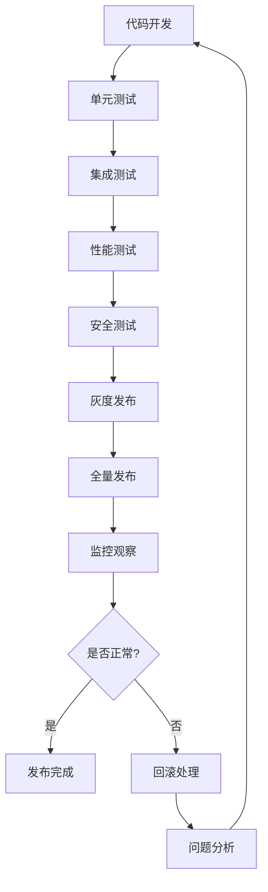

# 🌐 网关模块 (Gateway Module) 详细规划

## 📋 模块概述

**网关模块** 是Sira AI网关的"交通枢纽"，负责所有HTTP请求的接收、路由、分发和响应处理。它是系统的入口点，承担着流量调度、安全过滤、协议转换等关键职能。

### 定位与职责

- **系统定位**: AI网关的网络入口和流量控制中心
- **主要职责**: 请求处理、路由分发、安全防护、协议适配
- **设计理念**: 高性能、高可用、易扩展、安全可靠

### 架构层次

```
网关模块架构:
├── 🚪 入口层 (Entry Layer)
│   ├── HTTP服务器 (HTTP Server)
│   ├── WebSocket支持 (WebSocket Support)
│   └── 协议适配 (Protocol Adaptation)
├── 🔀 路由层 (Routing Layer)
│   ├── 请求路由 (Request Routing)
│   ├── 负载均衡 (Load Balancing)
│   └── 流量控制 (Traffic Control)
├── 🛡️ 安全层 (Security Layer)
│   ├── 身份验证 (Authentication)
│   ├── 权限检查 (Authorization)
│   └── 安全过滤 (Security Filtering)
└── 📊 监控层 (Monitoring Layer)
    ├── 请求跟踪 (Request Tracing)
    ├── 性能监控 (Performance Monitor)
    └── 健康检查 (Health Check)
```

---

## 🏗️ 架构设计

### 1. 服务器架构

#### 1.1 HTTP服务器设计

**Express.js增强服务器**:

```javascript
class GatewayServer {
  constructor(options = {}) {
    this.app = express();
    this.server = null;
    this.config = {
      port: options.port || 8080,
      host: options.host || '0.0.0.0',
      timeout: options.timeout || 30000,
      maxConnections: options.maxConnections || 1000,
      keepAliveTimeout: options.keepAliveTimeout || 65000,
      ...options,
    };

    this.setupMiddleware();
    this.setupRoutes();
    this.setupErrorHandling();
  }

  // 中间件配置
  setupMiddleware() {
    // 安全中间件
    this.app.use(
      helmet({
        contentSecurityPolicy: {
          directives: {
            defaultSrc: ["'self'"],
            styleSrc: ["'self'", "'unsafe-inline'"],
            scriptSrc: ["'self'"],
            imgSrc: ["'self'", 'data:', 'https:'],
          },
        },
      })
    );

    // CORS配置
    this.app.use(
      cors({
        origin: this.config.corsOrigins || ['http://localhost:3000'],
        credentials: true,
        methods: ['GET', 'POST', 'PUT', 'DELETE', 'OPTIONS'],
        allowedHeaders: ['Content-Type', 'Authorization', 'X-API-Key'],
      })
    );

    // 请求解析
    this.app.use(
      express.json({
        limit: '10mb',
        verify: (req, res, buf) => {
          // 请求大小验证
          if (buf.length > 10 * 1024 * 1024) {
            throw new Error('Request too large');
          }
        },
      })
    );

    this.app.use(
      express.urlencoded({
        extended: true,
        limit: '10mb',
      })
    );

    // 请求日志
    this.app.use(this.requestLogger.bind(this));

    // 静态文件服务
    this.app.use(
      '/static',
      express.static(path.join(__dirname, 'public'), {
        maxAge: '1d',
        etag: true,
      })
    );
  }

  // 路由配置
  setupRoutes() {
    // API路由
    this.app.use('/api/v1', apiRoutes);

    // AI服务路由
    this.app.use('/ai', aiRoutes);

    // 健康检查
    this.app.get('/health', this.healthCheck.bind(this));

    // 指标暴露 (Prometheus)
    this.app.get('/metrics', this.metricsEndpoint.bind(this));

    // WebSocket升级
    this.app.use(this.websocketUpgrade.bind(this));
  }

  // 错误处理
  setupErrorHandling() {
    // 404处理
    this.app.use((req, res, next) => {
      res.status(404).json({
        error: {
          code: 'NOT_FOUND',
          message: 'The requested resource was not found',
          path: req.path,
          method: req.method,
        },
      });
    });

    // 全局错误处理
    this.app.use((error, req, res, next) => {
      console.error('Unhandled error:', error);

      const statusCode = error.statusCode || 500;
      const errorResponse = {
        error: {
          code: error.code || 'INTERNAL_ERROR',
          message:
            process.env.NODE_ENV === 'production'
              ? 'An internal error occurred'
              : error.message,
          requestId: req.requestId,
          timestamp: new Date().toISOString(),
        },
      };

      res.status(statusCode).json(errorResponse);
    });
  }

  // 请求日志
  requestLogger(req, res, next) {
    const start = Date.now();
    const requestId = this.generateRequestId();

    req.requestId = requestId;

    // 请求开始日志
    console.log(`[${requestId}] ${req.method} ${req.url} - Start`);

    // 响应完成处理
    res.on('finish', () => {
      const duration = Date.now() - start;
      const statusCode = res.statusCode;
      const contentLength = res.get('Content-Length') || 0;

      console.log(
        `[${requestId}] ${req.method} ${req.url} - ${statusCode} ${duration}ms ${contentLength}bytes`
      );
    });

    next();
  }

  // 启动服务器
  async start() {
    return new Promise((resolve, reject) => {
      this.server = this.app.listen(this.config.port, this.config.host, () => {
        console.log(
          `Gateway server listening on ${this.config.host}:${this.config.port}`
        );
        resolve();
      });

      this.server.on('error', reject);

      // 优雅关闭
      this.setupGracefulShutdown();
    });
  }

  // 优雅关闭
  setupGracefulShutdown() {
    const gracefulShutdown = () => {
      console.log('Received shutdown signal, closing server...');

      this.server.close(err => {
        if (err) {
          console.error('Error during server shutdown:', err);
          process.exit(1);
        }

        console.log('Server closed successfully');
        process.exit(0);
      });

      // 强制关闭超时
      setTimeout(() => {
        console.error('Forced shutdown due to timeout');
        process.exit(1);
      }, 10000);
    };

    process.on('SIGTERM', gracefulShutdown);
    process.on('SIGINT', gracefulShutdown);
  }
}
```

#### 1.2 WebSocket支持

**实时通信服务器**:

```javascript
class WebSocketServer {
  constructor(httpServer) {
    this.wss = new WebSocket.Server({
      server: httpServer,
      path: '/ws',
      maxPayload: 10 * 1024 * 1024, // 10MB
      perMessageDeflate: true,
    });

    this.clients = new Map();
    this.rooms = new Map();

    this.wss.on('connection', this.handleConnection.bind(this));
    this.wss.on('error', this.handleError.bind(this));
  }

  // 连接处理
  handleConnection(ws, req) {
    const clientId = this.generateClientId();
    const client = {
      id: clientId,
      ws,
      ip: this.getClientIP(req),
      userAgent: req.headers['user-agent'],
      connectedAt: new Date(),
      lastActivity: new Date(),
      subscriptions: new Set(),
      auth: null,
    };

    this.clients.set(clientId, client);

    // 连接事件处理
    ws.on('message', data => this.handleMessage(client, data));
    ws.on('close', () => this.handleDisconnect(client));
    ws.on('error', error => this.handleClientError(client, error));
    ws.on('pong', () => this.handlePong(client));

    // 心跳检测
    this.startHeartbeat(client);

    // 发送欢迎消息
    this.sendToClient(client, {
      type: 'welcome',
      clientId,
      timestamp: new Date().toISOString(),
    });

    console.log(`WebSocket client connected: ${clientId}`);
  }

  // 消息处理
  async handleMessage(client, data) {
    try {
      const message = JSON.parse(data);
      client.lastActivity = new Date();

      switch (message.type) {
        case 'auth':
          await this.handleAuthentication(client, message);
          break;
        case 'subscribe':
          this.handleSubscription(client, message);
          break;
        case 'unsubscribe':
          this.handleUnsubscription(client, message);
          break;
        case 'ai_request':
          await this.handleAIRequest(client, message);
          break;
        default:
          this.sendToClient(client, {
            type: 'error',
            code: 'UNKNOWN_MESSAGE_TYPE',
            message: `Unknown message type: ${message.type}`,
          });
      }
    } catch (error) {
      this.sendToClient(client, {
        type: 'error',
        code: 'INVALID_MESSAGE',
        message: 'Invalid message format',
      });
    }
  }

  // AI请求处理
  async handleAIRequest(client, message) {
    try {
      // 权限检查
      if (!client.auth) {
        throw new Error('Authentication required');
      }

      // 请求验证
      const validatedRequest = await this.validateAIRequest(message.payload);

      // 路由到AI引擎
      const response = await this.aiEngine.processRequest(validatedRequest, {
        clientId: client.id,
        userId: client.auth.userId,
      });

      // 发送响应
      this.sendToClient(client, {
        type: 'ai_response',
        requestId: message.requestId,
        payload: response,
      });
    } catch (error) {
      this.sendToClient(client, {
        type: 'error',
        requestId: message.requestId,
        code: 'AI_REQUEST_FAILED',
        message: error.message,
      });
    }
  }

  // 广播消息
  broadcast(message, filter = null) {
    for (const [clientId, client] of this.clients) {
      if (!filter || filter(client)) {
        this.sendToClient(client, message);
      }
    }
  }

  // 房间消息
  sendToRoom(roomId, message, excludeClient = null) {
    const room = this.rooms.get(roomId);
    if (!room) return;

    for (const clientId of room) {
      if (excludeClient && clientId === excludeClient.id) continue;

      const client = this.clients.get(clientId);
      if (client) {
        this.sendToClient(client, message);
      }
    }
  }

  // 心跳检测
  startHeartbeat(client) {
    client.heartbeatInterval = setInterval(() => {
      if (Date.now() - client.lastActivity > 60000) {
        // 1分钟无活动
        client.ws.terminate();
        return;
      }

      client.ws.ping();
    }, 30000); // 30秒ping一次
  }

  handlePong(client) {
    client.lastPong = Date.now();
  }

  // 连接清理
  handleDisconnect(client) {
    console.log(`WebSocket client disconnected: ${client.id}`);

    // 清理心跳
    if (client.heartbeatInterval) {
      clearInterval(client.heartbeatInterval);
    }

    // 清理订阅
    for (const subscription of client.subscriptions) {
      this.unsubscribeFromTopic(client, subscription);
    }

    // 从房间移除
    for (const [roomId, clients] of this.rooms) {
      clients.delete(client.id);
    }

    this.clients.delete(client.id);
  }
}
```

### 2. 路由系统

#### 2.1 请求路由器

**动态路由引擎**:

```javascript
class RequestRouter {
  constructor() {
    this.routes = new Map();
    this.middlewares = [];
    this.routeCache = new Map();
    this.routeStats = new Map();
  }

  // 注册路由
  registerRoute(path, handler, options = {}) {
    const route = {
      path: this.parsePath(path),
      handler,
      method: options.method || 'GET',
      middlewares: options.middlewares || [],
      priority: options.priority || 0,
      metadata: options.metadata || {},
      createdAt: new Date(),
    };

    const key = `${route.method}:${path}`;
    this.routes.set(key, route);

    // 清除路由缓存
    this.routeCache.clear();

    console.log(`Route registered: ${key}`);
  }

  // 请求路由
  async route(req, res) {
    const startTime = Date.now();
    const routeKey = `${req.method}:${req.path}`;

    try {
      // 查找路由
      const route = this.findRoute(req);

      if (!route) {
        throw new RouteNotFoundError(`No route found for ${routeKey}`);
      }

      // 更新路由统计
      this.updateRouteStats(routeKey);

      // 执行中间件
      for (const middleware of [...this.middlewares, ...route.middlewares]) {
        await this.executeMiddleware(middleware, req, res);
      }

      // 执行处理器
      const result = await route.handler(req, res);

      // 记录执行时间
      const executionTime = Date.now() - startTime;
      this.recordExecutionTime(routeKey, executionTime);

      return result;
    } catch (error) {
      const executionTime = Date.now() - startTime;
      this.recordError(routeKey, error, executionTime);

      throw error;
    }
  }

  // 路由查找
  findRoute(req) {
    const routeKey = `${req.method}:${req.path}`;

    // 检查缓存
    if (this.routeCache.has(routeKey)) {
      return this.routeCache.get(routeKey);
    }

    // 精确匹配
    if (this.routes.has(routeKey)) {
      const route = this.routes.get(routeKey);
      this.routeCache.set(routeKey, route);
      return route;
    }

    // 参数匹配
    for (const [key, route] of this.routes) {
      if (
        key.startsWith(`${req.method}:`) &&
        this.matchPath(route.path, req.path)
      ) {
        this.routeCache.set(routeKey, route);
        return route;
      }
    }

    return null;
  }

  // 路径匹配
  matchPath(routePath, requestPath) {
    const routeParts = routePath.split('/');
    const requestParts = requestPath.split('/');

    if (routeParts.length !== requestParts.length) {
      return false;
    }

    const params = {};

    for (let i = 0; i < routeParts.length; i++) {
      const routePart = routeParts[i];
      const requestPart = requestParts[i];

      if (routePart.startsWith(':')) {
        // 参数匹配
        const paramName = routePart.slice(1);
        params[paramName] = requestPart;
      } else if (routePart !== requestPart) {
        return false;
      }
    }

    return { matched: true, params };
  }

  // 中间件执行
  async executeMiddleware(middleware, req, res) {
    return new Promise((resolve, reject) => {
      const next = error => {
        if (error) reject(error);
        else resolve();
      };

      middleware(req, res, next);
    });
  }

  // 路由统计
  updateRouteStats(routeKey) {
    const stats = this.routeStats.get(routeKey) || {
      hits: 0,
      errors: 0,
      avgResponseTime: 0,
      lastAccessed: null,
    };

    stats.hits++;
    stats.lastAccessed = new Date();

    this.routeStats.set(routeKey, stats);
  }

  recordExecutionTime(routeKey, time) {
    const stats = this.routeStats.get(routeKey);
    if (stats) {
      // 指数移动平均
      stats.avgResponseTime = stats.avgResponseTime * 0.9 + time * 0.1;
    }
  }

  recordError(routeKey, error, time) {
    const stats = this.routeStats.get(routeKey);
    if (stats) {
      stats.errors++;
      stats.lastError = {
        error: error.message,
        time,
        timestamp: new Date(),
      };
    }
  }
}
```

#### 2.2 负载均衡器

**智能负载均衡**:

```javascript
class LoadBalancer {
  constructor() {
    this.backends = new Map();
    this.healthChecker = new HealthChecker();
    this.loadMetrics = new Map();
  }

  // 添加后端
  addBackend(id, backend) {
    this.backends.set(id, {
      id,
      url: backend.url,
      weight: backend.weight || 1,
      health: 'unknown',
      activeConnections: 0,
      totalRequests: 0,
      errorCount: 0,
      lastHealthCheck: null,
      responseTime: 0,
    });
  }

  // 选择后端
  async selectBackend(req) {
    const healthyBackends = await this.getHealthyBackends();

    if (healthyBackends.length === 0) {
      throw new NoHealthyBackendError('No healthy backends available');
    }

    // 根据策略选择后端
    const strategy = this.getLoadBalancingStrategy(req);
    const selectedBackend = await strategy.select(healthyBackends, req);

    // 更新负载指标
    this.updateLoadMetrics(selectedBackend.id);

    return selectedBackend;
  }

  // 负载均衡策略
  getLoadBalancingStrategy(req) {
    // 基于请求特征选择策略
    if (req.headers['x-sticky-session']) {
      return new StickySessionStrategy();
    }

    if (req.path.includes('/stream')) {
      return new LeastConnectionStrategy();
    }

    return new WeightedRoundRobinStrategy();
  }

  // 健康检查
  async checkBackendHealth(backend) {
    try {
      const startTime = Date.now();
      const response = await this.healthChecker.check(backend.url);
      const responseTime = Date.now() - startTime;

      backend.health = response.healthy ? 'healthy' : 'unhealthy';
      backend.responseTime = responseTime;
      backend.lastHealthCheck = new Date();

      return response.healthy;
    } catch (error) {
      backend.health = 'unhealthy';
      backend.errorCount++;
      backend.lastHealthCheck = new Date();

      return false;
    }
  }

  // 获取健康后端
  async getHealthyBackends() {
    const healthy = [];

    for (const backend of this.backends.values()) {
      // 定期健康检查
      if (
        !backend.lastHealthCheck ||
        Date.now() - backend.lastHealthCheck > 30000
      ) {
        // 30秒检查一次
        await this.checkBackendHealth(backend);
      }

      if (backend.health === 'healthy') {
        healthy.push(backend);
      }
    }

    return healthy;
  }

  // 更新负载指标
  updateLoadMetrics(backendId) {
    const backend = this.backends.get(backendId);
    if (backend) {
      backend.activeConnections++;
      backend.totalRequests++;
    }
  }

  // 释放连接
  releaseConnection(backendId) {
    const backend = this.backends.get(backendId);
    if (backend && backend.activeConnections > 0) {
      backend.activeConnections--;
    }
  }
}

// 负载均衡策略
class WeightedRoundRobinStrategy {
  select(backends, req) {
    // 基于权重和当前连接数的加权轮询
    let totalWeight = 0;
    let selectedBackend = null;
    let minLoad = Infinity;

    for (const backend of backends) {
      const load = backend.activeConnections / backend.weight;
      if (load < minLoad) {
        minLoad = load;
        selectedBackend = backend;
      }
    }

    return selectedBackend;
  }
}

class LeastConnectionStrategy {
  select(backends, req) {
    return backends.reduce((min, backend) =>
      backend.activeConnections < min.activeConnections ? backend : min
    );
  }
}

class StickySessionStrategy {
  select(backends, req) {
    const sessionId = req.headers['x-session-id'] || req.ip;
    const backendIndex = this.hash(sessionId) % backends.length;
    return backends[backendIndex];
  }

  hash(str) {
    let hash = 0;
    for (let i = 0; i < str.length; i++) {
      const char = str.charCodeAt(i);
      hash = (hash << 5) - hash + char;
      hash = hash & hash; // 转换为32位整数
    }
    return Math.abs(hash);
  }
}
```

---

## 🎯 功能职责详解

### 1. 请求处理流程

#### 1.1 请求生命周期

**完整的请求处理链路**:

```javascript
class RequestProcessor {
  // 请求处理主流程
  async processRequest(req, res) {
    const requestId = this.generateRequestId();
    const startTime = Date.now();

    try {
      // 1. 请求初始化
      const context = await this.initializeRequest(req, requestId);

      // 2. 请求验证
      await this.validateRequest(context);

      // 3. 安全检查
      await this.performSecurityChecks(context);

      // 4. 路由解析
      const route = await this.resolveRoute(context);

      // 5. 中间件执行
      await this.executeMiddlewares(context, route.middlewares);

      // 6. 请求处理
      const response = await this.handleRequest(context, route);

      // 7. 响应处理
      await this.processResponse(context, response);

      // 8. 日志记录
      await this.logRequest(context, startTime);
    } catch (error) {
      // 错误处理
      await this.handleError(error, req, res, requestId, startTime);
    }
  }

  // 请求初始化
  async initializeRequest(req, requestId) {
    const context = {
      id: requestId,
      method: req.method,
      url: req.url,
      path: req.path,
      query: req.query,
      headers: { ...req.headers },
      body: req.body,
      ip: this.getClientIP(req),
      userAgent: req.get('User-Agent'),
      startTime: new Date(),
      metadata: {},
      auth: null,
      route: null,
      response: null,
    };

    // 添加请求跟踪
    context.traceId = this.generateTraceId();
    req.context = context;

    return context;
  }

  // 请求验证
  async validateRequest(context) {
    // 请求大小验证
    if (
      context.body &&
      JSON.stringify(context.body).length > 10 * 1024 * 1024
    ) {
      throw new ValidationError('Request body too large');
    }

    // 请求频率验证
    await this.checkRateLimit(context);

    // 请求格式验证
    await this.validateRequestFormat(context);
  }

  // 安全检查
  async performSecurityChecks(context) {
    // IP白名单检查
    if (!this.isAllowedIP(context.ip)) {
      throw new SecurityError('IP address not allowed');
    }

    // 请求头安全检查
    this.checkSecurityHeaders(context.headers);

    // SQL注入检查
    if (this.containsSQLInjection(context)) {
      throw new SecurityError('Potential SQL injection detected');
    }

    // XSS检查
    if (this.containsXSS(context)) {
      throw new SecurityError('Potential XSS detected');
    }
  }

  // 路由解析
  async resolveRoute(context) {
    const route = await this.router.findRoute(context);

    if (!route) {
      throw new RouteNotFoundError(
        `No route found for ${context.method} ${context.path}`
      );
    }

    context.route = route;
    return route;
  }

  // 中间件执行
  async executeMiddlewares(context, middlewares) {
    for (const middleware of middlewares) {
      await this.executeMiddleware(middleware, context);
    }
  }

  // 请求处理
  async handleRequest(context, route) {
    // 设置超时
    const timeoutPromise = this.createTimeoutPromise(route.timeout || 30000);

    // 执行路由处理器
    const handlerPromise = route.handler(context);

    // 竞态执行
    const response = await Promise.race([handlerPromise, timeoutPromise]);

    context.response = response;
    return response;
  }

  // 响应处理
  async processResponse(context, response) {
    // 响应头设置
    this.setResponseHeaders(context, response);

    // 响应压缩
    if (this.shouldCompress(context)) {
      response = await this.compressResponse(response);
    }

    // 缓存头设置
    this.setCacheHeaders(context, response);

    return response;
  }

  // 错误处理
  async handleError(error, req, res, requestId, startTime) {
    const duration = Date.now() - startTime;

    // 错误日志
    console.error(`[${requestId}] Request error:`, error);

    // 错误统计
    this.updateErrorMetrics(error, duration);

    // 错误响应
    const errorResponse = this.createErrorResponse(error, requestId);

    // 发送错误响应
    res.status(errorResponse.status).json(errorResponse.body);
  }
}
```

#### 1.2 协议适配

#### 1.2.1 REST API适配

**RESTful接口适配器**:

```javascript
class RESTAdapter {
  // REST请求转换
  async adaptRESTRequest(req) {
    const adaptedRequest = {
      id: req.context.id,
      type: 'rest',
      method: req.method,
      endpoint: req.path,
      headers: this.normalizeHeaders(req.headers),
      query: req.query,
      body: req.body,
      timeout: 30000,
    };

    // 请求预处理
    await this.preprocessRequest(adaptedRequest);

    return adaptedRequest;
  }

  // REST响应转换
  adaptRESTResponse(response, req, res) {
    // 设置响应头
    this.setRESTHeaders(res, response.headers);

    // 设置状态码
    res.status(response.status || 200);

    // 发送响应体
    if (response.body) {
      if (typeof response.body === 'object') {
        res.json(response.body);
      } else {
        res.send(response.body);
      }
    } else {
      res.end();
    }
  }

  // 规范化请求头
  normalizeHeaders(headers) {
    const normalized = {};

    for (const [key, value] of Object.entries(headers)) {
      normalized[key.toLowerCase()] = value;
    }

    return normalized;
  }
}
```

#### 1.2.2 GraphQL适配

**GraphQL接口支持**:

```javascript
class GraphQLAdapter {
  constructor(schema) {
    this.schema = schema;
    this.executors = new Map();
  }

  // GraphQL查询处理
  async handleGraphQLQuery(query, variables, context) {
    const { data, errors } = await graphql({
      schema: this.schema,
      source: query,
      variableValues: variables,
      contextValue: context,
    });

    if (errors && errors.length > 0) {
      throw new GraphQLError('GraphQL execution failed', errors);
    }

    return data;
  }

  // GraphQL订阅处理
  handleGraphQLSubscription(query, variables, context) {
    return subscribe({
      schema: this.schema,
      document: parse(query),
      variableValues: variables,
      contextValue: context,
    });
  }

  // 模式扩展
  extendSchema(extension) {
    this.schema = extendSchema(this.schema, parse(extension));
  }

  // 解析器注册
  registerResolver(type, field, resolver) {
    // 动态添加解析器到模式
    this.resolvers = this.resolvers || {};
    this.resolvers[type] = this.resolvers[type] || {};
    this.resolvers[type][field] = resolver;
  }
}
```

#### 1.2.3 WebSocket适配

**实时通信适配器**:

```javascript
class WebSocketAdapter {
  // WebSocket消息适配
  adaptWebSocketMessage(message, client) {
    try {
      const parsed = JSON.parse(message);

      return {
        id: parsed.id || this.generateMessageId(),
        type: parsed.type,
        payload: parsed.payload,
        clientId: client.id,
        timestamp: new Date(),
        metadata: {
          ip: client.ip,
          userAgent: client.userAgent,
        },
      };
    } catch (error) {
      throw new MessageAdaptationError('Invalid WebSocket message format');
    }
  }

  // WebSocket响应适配
  adaptWebSocketResponse(response, client) {
    const adaptedResponse = {
      id: response.id,
      type: response.type || 'response',
      payload: response.payload,
      timestamp: new Date(),
      success: !response.error,
    };

    if (response.error) {
      adaptedResponse.error = {
        code: response.error.code,
        message: response.error.message,
      };
    }

    return JSON.stringify(adaptedResponse);
  }

  // 连接管理
  handleConnection(client) {
    // 连接认证
    this.authenticateConnection(client);

    // 订阅管理
    this.setupSubscriptions(client);

    // 心跳处理
    this.setupHeartbeat(client);
  }

  // 消息广播
  broadcast(message, filter) {
    // 实现广播逻辑
  }

  // 房间消息
  sendToRoom(roomId, message) {
    // 实现房间消息逻辑
  }
}
```

### 2. 安全与防护

#### 2.1 请求过滤器

**多层安全过滤**:

```javascript
class SecurityFilter {
  constructor(options = {}) {
    this.filters = [
      new IPRateLimitFilter(options.rateLimit),
      new ContentFilter(options.contentFilter),
      new HeaderSecurityFilter(options.headerFilter),
      new PayloadSizeFilter(options.payloadSize),
    ];
  }

  // 请求过滤
  async filterRequest(req) {
    for (const filter of this.filters) {
      try {
        await filter.check(req);
      } catch (error) {
        throw new SecurityViolationError(
          `Security filter failed: ${filter.name}`,
          error
        );
      }
    }
  }

  // 响应过滤
  async filterResponse(res) {
    // 响应安全检查
    this.checkResponseHeaders(res);
    this.checkResponseContent(res);
  }
}

// IP速率限制过滤器
class IPRateLimitFilter {
  constructor(config) {
    this.config = config;
    this.requests = new Map();
  }

  async check(req) {
    const ip = this.getClientIP(req);
    const now = Date.now();
    const windowMs = this.config.windowMs || 60000; // 1分钟
    const maxRequests = this.config.maxRequests || 100;

    if (!this.requests.has(ip)) {
      this.requests.set(ip, []);
    }

    const ipRequests = this.requests.get(ip);

    // 清理过期请求
    const validRequests = ipRequests.filter(time => now - time < windowMs);

    if (validRequests.length >= maxRequests) {
      throw new RateLimitError(`Rate limit exceeded for IP: ${ip}`);
    }

    validRequests.push(now);
    this.requests.set(ip, validRequests);
  }
}

// 内容安全过滤器
class ContentFilter {
  constructor(config) {
    this.config = config;
    this.badWords = new Set(config.badWords || []);
    this.sqlPatterns = config.sqlPatterns || [];
    this.xssPatterns = config.xssPatterns || [];
  }

  async check(req) {
    // 检查请求体
    if (req.body) {
      this.checkContent(req.body);
    }

    // 检查查询参数
    if (req.query) {
      this.checkContent(req.query);
    }

    // 检查请求头
    this.checkHeaders(req.headers);
  }

  checkContent(content) {
    const text =
      typeof content === 'string' ? content : JSON.stringify(content);

    // 敏感词检查
    for (const word of this.badWords) {
      if (text.toLowerCase().includes(word.toLowerCase())) {
        throw new ContentViolationError(
          `Content contains prohibited word: ${word}`
        );
      }
    }

    // SQL注入检查
    for (const pattern of this.sqlPatterns) {
      if (new RegExp(pattern, 'i').test(text)) {
        throw new SQLInjectionError('Potential SQL injection detected');
      }
    }

    // XSS检查
    for (const pattern of this.xssPatterns) {
      if (new RegExp(pattern, 'i').test(text)) {
        throw new XSSAttackError('Potential XSS attack detected');
      }
    }
  }
}
```

#### 2.2 身份验证与授权

**多层次认证体系**:

```javascript
class AuthenticationManager {
  constructor() {
    this.strategies = new Map();
    this.sessions = new Map();
  }

  // 注册认证策略
  registerStrategy(name, strategy) {
    this.strategies.set(name, strategy);
  }

  // 请求认证
  async authenticate(req) {
    // 尝试各种认证策略
    for (const [name, strategy] of this.strategies) {
      try {
        const user = await strategy.authenticate(req);
        if (user) {
          // 认证成功
          req.user = user;
          req.auth = {
            strategy: name,
            user,
            authenticatedAt: new Date(),
          };
          return user;
        }
      } catch (error) {
        // 认证失败，继续下一个策略
        console.debug(`Authentication strategy ${name} failed:`, error.message);
      }
    }

    // 所有策略都失败
    throw new AuthenticationError('Authentication failed');
  }

  // 会话管理
  createSession(user, options = {}) {
    const sessionId = this.generateSessionId();
    const session = {
      id: sessionId,
      userId: user.id,
      createdAt: new Date(),
      expiresAt: new Date(Date.now() + (options.maxAge || 3600000)), // 1小时
      data: options.data || {},
    };

    this.sessions.set(sessionId, session);
    return session;
  }

  validateSession(sessionId) {
    const session = this.sessions.get(sessionId);
    if (!session) {
      return null;
    }

    if (new Date() > session.expiresAt) {
      this.sessions.delete(sessionId);
      return null;
    }

    return session;
  }

  destroySession(sessionId) {
    this.sessions.delete(sessionId);
  }
}

// JWT认证策略
class JWTStrategy {
  constructor(options = {}) {
    this.secret = options.secret || process.env.JWT_SECRET;
    this.algorithms = options.algorithms || ['HS256'];
    this.issuer = options.issuer;
    this.audience = options.audience;
  }

  async authenticate(req) {
    const token = this.extractToken(req);
    if (!token) {
      return null;
    }

    try {
      const decoded = jwt.verify(token, this.secret, {
        algorithms: this.algorithms,
        issuer: this.issuer,
        audience: this.audience,
      });

      return {
        id: decoded.sub,
        username: decoded.username,
        roles: decoded.roles || [],
        permissions: decoded.permissions || [],
      };
    } catch (error) {
      throw new AuthenticationError('Invalid JWT token');
    }
  }

  extractToken(req) {
    const authHeader = req.headers.authorization;
    if (authHeader && authHeader.startsWith('Bearer ')) {
      return authHeader.substring(7);
    }

    return req.cookies?.token || req.query?.token;
  }
}

// API Key认证策略
class APIKeyStrategy {
  constructor(userService) {
    this.userService = userService;
  }

  async authenticate(req) {
    const apiKey = req.headers['x-api-key'] || req.query.apiKey;
    if (!apiKey) {
      return null;
    }

    const user = await this.userService.findByAPIKey(apiKey);
    if (!user) {
      throw new AuthenticationError('Invalid API key');
    }

    return user;
  }
}
```

---

## 🛠️ 技术实现详解

### 1. 性能优化

#### 1.1 请求处理优化

**异步处理和流式响应**:

```javascript
class PerformanceOptimizer {
  // 请求队列管理
  constructor() {
    this.requestQueue = new AsyncQueue({
      concurrency: 100, // 并发限制
      timeout: 30000, // 请求超时
    });

    this.responseCache = new LRUCache({
      max: 1000,
      ttl: 300000, // 5分钟TTL
    });
  }

  // 异步请求处理
  async processRequestAsync(req, res) {
    return this.requestQueue.add(async () => {
      // 请求预处理
      const context = await this.preprocessRequest(req);

      // 缓存检查
      const cacheKey = this.generateCacheKey(context);
      const cachedResponse = this.responseCache.get(cacheKey);

      if (cachedResponse && this.isCacheValid(cachedResponse, context)) {
        return this.sendCachedResponse(res, cachedResponse);
      }

      // 请求处理
      const response = await this.processRequest(context);

      // 缓存存储
      if (this.shouldCache(response)) {
        this.responseCache.set(cacheKey, {
          data: response,
          headers: res.getHeaders(),
          timestamp: Date.now(),
        });
      }

      return this.sendResponse(res, response);
    });
  }

  // 流式响应处理
  async processStreamingRequest(req, res) {
    // 设置流式响应头
    res.setHeader('Content-Type', 'text/plain');
    res.setHeader('Cache-Control', 'no-cache');
    res.setHeader('Connection', 'keep-alive');

    try {
      const stream = await this.createResponseStream(req);

      for await (const chunk of stream) {
        res.write(chunk);

        // 检查客户端是否断开连接
        if (res.destroyed) {
          stream.destroy();
          break;
        }
      }

      res.end();
    } catch (error) {
      console.error('Streaming error:', error);
      if (!res.headersSent) {
        res.status(500).json({ error: 'Streaming failed' });
      }
    }
  }

  // 响应压缩
  async compressResponse(response, req) {
    const acceptEncoding = req.headers['accept-encoding'] || '';

    if (acceptEncoding.includes('gzip')) {
      return {
        ...response,
        data: await gzip(response.data),
        headers: {
          ...response.headers,
          'Content-Encoding': 'gzip',
        },
      };
    }

    if (acceptEncoding.includes('deflate')) {
      return {
        ...response,
        data: await deflate(response.data),
        headers: {
          ...response.headers,
          'Content-Encoding': 'deflate',
        },
      };
    }

    return response;
  }
}
```

#### 1.2 连接池管理

**高效连接复用**:

```javascript
class ConnectionPool {
  constructor(options = {}) {
    this.host = options.host;
    this.port = options.port;
    this.protocol = options.protocol || 'http';
    this.maxConnections = options.maxConnections || 100;
    this.idleTimeout = options.idleTimeout || 30000;

    this.pool = new Map();
    this.available = [];
    this.waitingQueue = [];
  }

  // 获取连接
  async getConnection() {
    return new Promise((resolve, reject) => {
      // 检查可用连接
      if (this.available.length > 0) {
        const connection = this.available.pop();
        if (this.isConnectionValid(connection)) {
          resolve(connection);
          return;
        }
      }

      // 检查连接池大小
      if (this.pool.size >= this.maxConnections) {
        // 加入等待队列
        this.waitingQueue.push({ resolve, reject });
        return;
      }

      // 创建新连接
      this.createConnection().then(resolve).catch(reject);
    });
  }

  // 释放连接
  releaseConnection(connection) {
    // 检查等待队列
    if (this.waitingQueue.length > 0) {
      const waiter = this.waitingQueue.shift();
      waiter.resolve(connection);
      return;
    }

    // 放回可用连接池
    this.available.push({
      ...connection,
      lastUsed: Date.now(),
    });

    // 清理过期连接
    this.cleanupExpiredConnections();
  }

  // 创建连接
  async createConnection() {
    const connection = {
      id: this.generateConnectionId(),
      host: this.host,
      port: this.port,
      protocol: this.protocol,
      createdAt: new Date(),
      lastUsed: new Date(),
      status: 'active',
    };

    try {
      // 实际连接建立逻辑
      await this.establishPhysicalConnection(connection);

      this.pool.set(connection.id, connection);
      return connection;
    } catch (error) {
      connection.status = 'failed';
      throw error;
    }
  }

  // 连接健康检查
  async healthCheck(connection) {
    try {
      // 发送健康检查请求
      const response = await this.sendHealthCheckRequest(connection);

      connection.lastHealthCheck = new Date();
      connection.healthy = response.status === 200;

      return connection.healthy;
    } catch (error) {
      connection.healthy = false;
      connection.errorCount = (connection.errorCount || 0) + 1;

      return false;
    }
  }

  // 清理过期连接
  cleanupExpiredConnections() {
    const now = Date.now();
    const expired = this.available.filter(
      conn => now - conn.lastUsed > this.idleTimeout
    );

    for (const conn of expired) {
      this.destroyConnection(conn);
      this.available = this.available.filter(c => c.id !== conn.id);
    }
  }

  // 销毁连接
  destroyConnection(connection) {
    try {
      // 关闭物理连接
      this.closePhysicalConnection(connection);
    } catch (error) {
      console.error('Error destroying connection:', error);
    } finally {
      this.pool.delete(connection.id);
    }
  }
}
```

### 2. 监控和可观测性

#### 2.1 指标收集

**多维度指标体系**:

```javascript
class MetricsCollector {
  constructor() {
    this.metrics = {
      // HTTP指标
      httpRequestsTotal: new Counter(
        'http_requests_total',
        'Total HTTP requests'
      ),
      httpRequestDuration: new Histogram(
        'http_request_duration_seconds',
        'HTTP request duration'
      ),
      httpRequestsActive: new Gauge(
        'http_requests_active',
        'Active HTTP requests'
      ),

      // WebSocket指标
      wsConnectionsTotal: new Counter(
        'ws_connections_total',
        'Total WebSocket connections'
      ),
      wsConnectionsActive: new Gauge(
        'ws_connections_active',
        'Active WebSocket connections'
      ),
      wsMessagesTotal: new Counter(
        'ws_messages_total',
        'Total WebSocket messages'
      ),

      // 性能指标
      responseTime: new Histogram('response_time_seconds', 'Response time'),
      throughput: new Gauge(
        'throughput_requests_per_second',
        'Requests per second'
      ),
      errorRate: new Gauge('error_rate_percentage', 'Error rate percentage'),

      // 系统指标
      memoryUsage: new Gauge('memory_usage_bytes', 'Memory usage'),
      cpuUsage: new Gauge('cpu_usage_percentage', 'CPU usage percentage'),
      diskUsage: new Gauge('disk_usage_bytes', 'Disk usage'),
    };

    // 定期收集系统指标
    setInterval(() => this.collectSystemMetrics(), 10000);
  }

  // 请求指标收集
  collectRequestMetrics(req, res, duration) {
    const method = req.method;
    const path = req.route?.path || req.path;
    const status = res.statusCode;

    // 请求总数
    this.metrics.httpRequestsTotal.inc({
      method,
      path,
      status: status.toString(),
    });

    // 请求持续时间
    this.metrics.httpRequestDuration.observe(duration / 1000, {
      method,
      path,
    });

    // 活跃请求数
    this.metrics.httpRequestsActive.dec();
  }

  // 系统指标收集
  async collectSystemMetrics() {
    // 内存使用
    const memUsage = process.memoryUsage();
    this.metrics.memoryUsage.set(memUsage.heapUsed);

    // CPU使用
    const cpuUsage = await this.getCPUUsage();
    this.metrics.cpuUsage.set(cpuUsage);

    // 磁盘使用
    const diskUsage = await this.getDiskUsage();
    this.metrics.diskUsage.set(diskUsage);
  }

  // 自定义指标
  registerCustomMetric(name, type, description, options = {}) {
    let metric;

    switch (type) {
      case 'counter':
        metric = new Counter(name, description, options.labels);
        break;
      case 'gauge':
        metric = new Gauge(name, description, options.labels);
        break;
      case 'histogram':
        metric = new Histogram(
          name,
          description,
          options.labels,
          options.buckets
        );
        break;
      default:
        throw new Error(`Unknown metric type: ${type}`);
    }

    this.metrics[name] = metric;
    return metric;
  }
}
```

#### 2.2 分布式追踪

**请求链路追踪**:

```javascript
class DistributedTracer {
  constructor(serviceName) {
    this.serviceName = serviceName;
    this.tracer = initTracer({
      serviceName,
      reporter: new RemoteReporter({
        url: process.env.JAEGER_ENDPOINT,
      }),
    });
  }

  // 创建请求span
  startRequestSpan(req, operationName) {
    const span = this.tracer.startSpan(
      operationName || `${req.method} ${req.path}`
    );

    // 设置标签
    span.setTag('http.method', req.method);
    span.setTag('http.url', req.url);
    span.setTag('http.user_agent', req.get('User-Agent'));
    span.setTag('net.peer.ip', this.getClientIP(req));

    // 注入追踪头
    this.tracer.inject(span, 'http_headers', req.headers);

    req.span = span;
    return span;
  }

  // 创建子span
  startChildSpan(parentSpan, operationName) {
    return this.tracer.startSpan(operationName, {
      childOf: parentSpan,
    });
  }

  // 记录错误
  recordError(span, error) {
    span.setTag('error', true);
    span.setTag('error.message', error.message);
    span.setTag('error.stack', error.stack);
    span.log({
      event: 'error',
      'error.object': error,
    });
  }

  // 完成span
  finishSpan(span, statusCode = null) {
    if (statusCode) {
      span.setTag('http.status_code', statusCode);

      if (statusCode >= 400) {
        span.setTag('error', true);
      }
    }

    span.finish();
  }

  // 提取追踪上下文
  extractContext(req) {
    return this.tracer.extract('http_headers', req.headers);
  }

  // 注入追踪上下文
  injectContext(span, headers) {
    return this.tracer.inject(span, 'http_headers', headers);
  }
}
```

---

## 📈 发展规划

### 1. 短期规划 (0-6个月)

#### 1.1 核心功能完善

- [ ] **HTTP/2支持**
  - [ ] HTTP/2协议升级
  - [ ] 多路复用优化
  - [ ] 服务器推送支持
  - [ ] 头部压缩优化

- [ ] **WebSocket增强**
  - [ ] 连接池管理
  - [ ] 消息压缩
  - [ ] 断线重连机制
  - [ ] 负载均衡支持

- [ ] **性能优化**
  - [ ] 响应时间优化至<100ms (P95)
  - [ ] 支持2000+ RPS并发
  - [ ] 内存使用优化至<150MB
  - [ ] CPU使用率控制在60%以内

#### 1.2 协议扩展

- [ ] **gRPC支持**
  - [ ] gRPC服务端实现
  - [ ] Protocol Buffers集成
  - [ ] 双向流支持
  - [ ] 负载均衡

- [ ] **GraphQL增强**
  - [ ] 订阅(Subscription)支持
  - [ ] 联合查询(Federation)
  - [ ] 模式拼接(Schema Stitching)
  - [ ] 查询复杂度限制

- [ ] **物联网协议**
  - [ ] MQTT协议支持
  - [ ] CoAP协议支持
  - [ ] 设备管理接口
  - [ ] 实时数据处理

### 2. 中期规划 (6-12个月)

#### 2.1 企业级功能

- [ ] **服务网格集成**
  - [ ] Istio集成
  - [ ] Linkerd集成
  - [ ] 服务发现
  - [ ] 流量治理

- [ ] **多租户架构**
  - [ ] 租户隔离
  - [ ] 资源配额
  - [ ] 租户监控
  - [ ] 计费管理

- [ ] **边缘计算支持**
  - [ ] 边缘节点部署
  - [ ] 地理位置路由
  - [ ] 本地缓存策略
  - [ ] 离线处理能力

#### 2.2 智能化网关

- [ ] **AI辅助路由**
  - [ ] 基于ML的路由优化
  - [ ] 预测性负载均衡
  - [ ] 异常检测和自动修复
  - [ ] 自适应配置调整

- [ ] **智能监控**
  - [ ] 异常模式识别
  - [ ] 性能预测分析
  - [ ] 自动化告警
  - [ ] 根因分析

### 3. 长期规划 (12-24个月)

#### 3.1 云原生演进

- [ ] **Kubernetes原生**
  - [ ] Operator模式
  - [ ] Custom Resource定义
  - [ ] 自动扩缩容
  - [ ] 配置热更新

- [ ] **Serverless集成**
  - [ ] AWS Lambda集成
  - [ ] Google Cloud Functions
  - [ ] Azure Functions
  - [ ] 冷启动优化

#### 3.2 下一代网关

- [ ] **多模态网关**
  - [ ] 文本处理优化
  - [ ] 图像/视频流处理
  - [ ] 音频流处理
  - [ ] 实时协作支持

- [ ] **联邦学习支持**
  - [ ] 模型聚合网关
  - [ ] 隐私保护计算
  - [ ] 分布式训练协调
  - [ ] 模型更新同步

---

## 🔗 依赖关系

### 1. 内部依赖

#### 1.1 强依赖模块

```
网关模块依赖关系:
├── 核心模块 (Core Module)
│   ├── 获取AI路由决策
│   └── 提供请求上下文
├── 配置模块 (Config Module)
│   ├── 读取网关配置
│   └── 监听配置变更
├── 服务模块 (Services Module)
│   ├── 用户认证服务
│   └── 会话管理服务
└── 测试模块 (Test Module)
    ├── 性能测试框架
    └── 集成测试工具
```

#### 1.2 可选依赖模块

```
可选依赖:
├── 管理模块 (Admin Module) - Web管理界面
├── 部署模块 (Docker Module) - 容器化部署
└── 文档模块 (Docs Module) - API文档生成
```

### 2. 外部依赖

#### 2.1 核心依赖

```json
{
  "Web框架": {
    "express": "^4.18.0",
    "cors": "^2.8.5",
    "helmet": "^7.0.0",
    "compression": "^1.7.4"
  },
  "WebSocket": {
    "ws": "^8.13.0",
    "socket.io": "^4.7.0"
  },
  "HTTP客户端": {
    "axios": "^1.4.0",
    "node-fetch": "^3.3.0",
    "got": "^12.5.0"
  },
  "监控可观测性": {
    "prometheus-api-metrics": "^3.2.2",
    "opentelemetry": "^1.15.0",
    "@opentelemetry/exporter-jaeger": "^1.15.0"
  }
}
```

#### 2.2 协议支持

```json
{
  "GraphQL": {
    "graphql": "^16.6.0",
    "apollo-server-express": "^4.0.0",
    "graphql-subscriptions": "^2.0.0"
  },
  "gRPC": {
    "@grpc/grpc-js": "^1.8.0",
    "@grpc/proto-loader": "^0.7.0",
    "grpc-tools": "^1.12.0"
  },
  "MQTT": {
    "mqtt": "^4.3.0",
    "aedes": "^0.17.0"
  }
}
```

---

## 🧪 测试策略

### 1. 测试层次架构

#### 1.1 单元测试

**网关组件测试**:

```javascript
describe('RequestRouter', () => {
  let router;

  beforeEach(() => {
    router = new RequestRouter();
  });

  describe('registerRoute', () => {
    test('should register route successfully', () => {
      const handler = jest.fn();
      router.registerRoute('/api/test', handler, { method: 'GET' });

      expect(router.routes.size).toBe(1);
    });

    test('should handle route parameters', () => {
      const handler = jest.fn();
      router.registerRoute('/api/users/:id', handler);

      const route = router.findRoute({
        method: 'GET',
        path: '/api/users/123',
      });

      expect(route).toBeDefined();
      expect(route.params).toEqual({ id: '123' });
    });
  });

  describe('route', () => {
    test('should route request to correct handler', async () => {
      const handler = jest.fn().mockResolvedValue({ status: 200, body: 'OK' });
      router.registerRoute('/api/test', handler);

      const req = { method: 'GET', path: '/api/test', context: {} };
      const res = { status: jest.fn(), json: jest.fn() };

      await router.route(req, res);

      expect(handler).toHaveBeenCalledWith(req, res);
    });

    test('should handle route not found', async () => {
      const req = { method: 'GET', path: '/not-found', context: {} };
      const res = { status: jest.fn(), json: jest.fn() };

      await expect(router.route(req, res)).rejects.toThrow('Route not found');
    });
  });
});

describe('LoadBalancer', () => {
  let loadBalancer;

  beforeEach(() => {
    loadBalancer = new LoadBalancer();
  });

  describe('addBackend', () => {
    test('should add backend successfully', () => {
      loadBalancer.addBackend('backend1', { url: 'http://localhost:3001' });

      expect(loadBalancer.backends.size).toBe(1);
    });
  });

  describe('selectBackend', () => {
    test('should select healthy backend', async () => {
      loadBalancer.addBackend('backend1', { url: 'http://localhost:3001' });
      loadBalancer.addBackend('backend2', { url: 'http://localhost:3002' });

      // Mock健康检查
      jest.spyOn(loadBalancer, 'checkBackendHealth').mockResolvedValue(true);

      const backend = await loadBalancer.selectBackend({});

      expect(backend).toBeDefined();
      expect(['backend1', 'backend2']).toContain(backend.id);
    });

    test('should throw error when no healthy backends', async () => {
      loadBalancer.addBackend('backend1', { url: 'http://localhost:3001' });

      // Mock健康检查失败
      jest.spyOn(loadBalancer, 'checkBackendHealth').mockResolvedValue(false);

      await expect(loadBalancer.selectBackend({})).rejects.toThrow(
        'No healthy backends'
      );
    });
  });
});
```

#### 1.2 集成测试

**端到端网关测试**:

```javascript
describe('Gateway E2E', () => {
  let server;
  let client;

  beforeAll(async () => {
    server = new GatewayServer({ port: 3001 });
    await server.start();

    client = axios.create({
      baseURL: 'http://localhost:3001',
      validateStatus: () => true,
    });
  });

  afterAll(async () => {
    await server.stop();
  });

  describe('HTTP Requests', () => {
    test('should handle GET request', async () => {
      const response = await client.get('/health');

      expect(response.status).toBe(200);
      expect(response.data).toHaveProperty('status', 'healthy');
    });

    test('should handle POST request with JSON body', async () => {
      const requestData = { message: 'test' };
      const response = await client.post('/api/test', requestData);

      expect(response.status).toBe(200);
      expect(response.data).toEqual(requestData);
    });

    test('should handle authentication', async () => {
      const response = await client.get('/api/protected');

      expect(response.status).toBe(401);
    });

    test('should handle rate limiting', async () => {
      // 发送多个请求测试限流
      const requests = Array(10)
        .fill()
        .map(() => client.get('/api/test'));
      const responses = await Promise.all(requests);

      const rateLimited = responses.some(r => r.status === 429);
      expect(rateLimited).toBe(true);
    });
  });

  describe('WebSocket Connections', () => {
    test('should handle WebSocket connection', done => {
      const ws = new WebSocket('ws://localhost:3001/ws');

      ws.on('open', () => {
        ws.send(JSON.stringify({ type: 'ping' }));
      });

      ws.on('message', data => {
        const message = JSON.parse(data.toString());
        expect(message.type).toBe('pong');
        ws.close();
        done();
      });

      ws.on('error', error => {
        done(error);
      });
    });
  });
});
```

### 2. 性能测试

#### 2.1 负载测试

**Artillery负载测试配置**:

```yaml
config:
  target: 'http://localhost:8080'
  phases:
    - duration: 60
      arrivalRate: 10
      name: 'Warm up'
    - duration: 120
      arrivalRate: 50
      name: 'Load test'
    - duration: 60
      arrivalRate: 100
      name: 'Stress test'

scenarios:
  - name: 'Basic API call'
    weight: 70
    flow:
      - get:
          url: '/api/test'
          headers:
            Authorization: 'Bearer {{token}}'

  - name: 'AI request'
    weight: 20
    flow:
      - post:
          url: '/ai/chat'
          json:
            messages: [{ role: 'user', content: 'Hello' }]
          headers:
            Authorization: 'Bearer {{token}}'

  - name: 'WebSocket connection'
    weight: 10
    flow:
      - connect:
          url: 'ws://localhost:8080/ws'
      - think: 30
      - disconnect: {}
```

#### 2.2 性能基准测试

**自动化性能基准**:

```javascript
class PerformanceBenchmark {
  constructor() {
    this.baselines = {
      responseTime: { p50: 50, p95: 100, p99: 200 }, // ms
      throughput: 1000, // RPS
      memoryUsage: 100 * 1024 * 1024, // 100MB
      errorRate: 0.001, // 0.1%
    };
  }

  async runBenchmark() {
    console.log('Running performance benchmark...');

    const results = {
      responseTime: await this.measureResponseTime(),
      throughput: await this.measureThroughput(),
      memoryUsage: await this.measureMemoryUsage(),
      errorRate: await this.measureErrorRate(),
    };

    console.log('Benchmark results:', results);

    return this.compareWithBaseline(results);
  }

  async measureResponseTime() {
    const latencies = [];

    for (let i = 0; i < 1000; i++) {
      const start = Date.now();
      await this.makeTestRequest();
      latencies.push(Date.now() - start);
    }

    latencies.sort((a, b) => a - b);

    return {
      p50: latencies[Math.floor(latencies.length * 0.5)],
      p95: latencies[Math.floor(latencies.length * 0.95)],
      p99: latencies[Math.floor(latencies.length * 0.99)],
    };
  }

  async measureThroughput() {
    const duration = 10000; // 10秒
    const start = Date.now();
    let requests = 0;

    while (Date.now() - start < duration) {
      await this.makeTestRequest();
      requests++;
    }

    return Math.floor(requests / (duration / 1000));
  }

  async measureMemoryUsage() {
    // 强制垃圾回收
    if (global.gc) {
      global.gc();
    }

    return process.memoryUsage().heapUsed;
  }

  async measureErrorRate() {
    let totalRequests = 0;
    let errors = 0;

    for (let i = 0; i < 1000; i++) {
      totalRequests++;
      try {
        await this.makeTestRequest();
      } catch (error) {
        errors++;
      }
    }

    return errors / totalRequests;
  }

  compareWithBaseline(results) {
    const issues = [];

    if (results.responseTime.p95 > this.baselines.responseTime.p95) {
      issues.push(
        `P95 response time degraded: ${results.responseTime.p95}ms > ${this.baselines.responseTime.p95}ms`
      );
    }

    if (results.throughput < this.baselines.throughput) {
      issues.push(
        `Throughput degraded: ${results.throughput} RPS < ${this.baselines.throughput} RPS`
      );
    }

    if (results.memoryUsage > this.baselines.memoryUsage) {
      issues.push(
        `Memory usage increased: ${results.memoryUsage} bytes > ${this.baselines.memoryUsage} bytes`
      );
    }

    if (results.errorRate > this.baselines.errorRate) {
      issues.push(
        `Error rate increased: ${(results.errorRate * 100).toFixed(2)}% > ${(this.baselines.errorRate * 100).toFixed(2)}%`
      );
    }

    return {
      passed: issues.length === 0,
      issues,
    };
  }
}
```

---

## 🔧 维护计划

### 1. 日常维护

#### 1.1 监控和告警

**网关监控指标**:

- [ ] 请求处理指标 (响应时间、成功率、错误率)
- [ ] 连接状态监控 (活跃连接、连接池状态)
- [ ] 性能指标监控 (CPU、内存、磁盘I/O)
- [ ] 安全事件监控 (异常访问、攻击检测)

**告警规则配置**:

```javascript
const gatewayAlerts = {
  highResponseTime: {
    condition: 'response_time_p95 > 200',
    severity: 'warning',
    message: 'Response time is too high',
    channels: ['slack', 'email'],
    cooldown: 300000, // 5分钟冷却
  },

  highErrorRate: {
    condition: 'error_rate > 0.05',
    severity: 'error',
    message: 'Error rate is above threshold',
    channels: ['slack', 'email', 'pagerduty'],
    cooldown: 60000, // 1分钟冷却
  },

  connectionPoolExhausted: {
    condition: 'active_connections / max_connections > 0.9',
    severity: 'warning',
    message: 'Connection pool nearly exhausted',
    channels: ['slack'],
    cooldown: 180000, // 3分钟冷却
  },

  securityThreat: {
    condition: 'security_violations > 0',
    severity: 'critical',
    message: 'Security threat detected',
    channels: ['slack', 'email', 'sms', 'security-team'],
    cooldown: 0, // 立即告警
  },
};
```

#### 1.2 定期检查

**每日检查**:

- [ ] 网关日志分析
- [ ] 错误日志检查
- [ ] 性能指标审核
- [ ] 安全事件审查

**每周检查**:

- [ ] 路由配置验证
- [ ] 中间件执行检查
- [ ] 缓存策略评估
- [ ] 负载均衡器状态

**每月检查**:

- [ ] 系统容量规划
- [ ] 性能优化评估
- [ ] 安全审计执行
- [ ] 用户反馈汇总

### 2. 版本管理

#### 2.1 发布流程

**网关发布流程**:



**发布检查清单**:

- [ ] 所有单元测试通过
- [ ] 集成测试通过
- [ ] 性能基准测试通过
- [ ] 安全扫描通过
- [ ] 文档更新完成
- [ ] 回滚计划准备就绪

#### 2.2 回滚策略

**自动化回滚机制**:

```javascript
class GatewayRollbackManager {
  constructor(gateway) {
    this.gateway = gateway;
    this.snapshots = [];
    this.maxSnapshots = 10;
  }

  // 创建发布快照
  async createPreDeploySnapshot() {
    const snapshot = {
      id: generateId(),
      timestamp: new Date(),
      config: deepClone(this.gateway.config),
      routes: deepClone(this.gateway.routes),
      middlewares: deepClone(this.gateway.middlewares),
      version: this.gateway.version,
    };

    this.snapshots.unshift(snapshot);

    // 保持最大快照数量
    if (this.snapshots.length > this.maxSnapshots) {
      this.snapshots.pop();
    }

    return snapshot.id;
  }

  // 执行回滚
  async rollback(snapshotId) {
    const snapshot = this.snapshots.find(s => s.id === snapshotId);

    if (!snapshot) {
      throw new Error(`Snapshot ${snapshotId} not found`);
    }

    console.log(`Rolling back to snapshot ${snapshotId}`);

    try {
      // 停止当前服务
      await this.gateway.stop();

      // 恢复配置
      this.gateway.config = snapshot.config;
      this.gateway.routes = snapshot.routes;
      this.gateway.middlewares = snapshot.middlewares;

      // 重新启动服务
      await this.gateway.start();

      console.log('Rollback completed successfully');

      // 发送告警
      await this.sendRollbackAlert(snapshot);
    } catch (error) {
      console.error('Rollback failed:', error);
      throw error;
    }
  }

  // 自动回滚触发器
  async checkAutoRollback() {
    const metrics = await this.getCurrentMetrics();

    // 检查关键指标
    if (metrics.errorRate > 0.1 || metrics.responseTimeP95 > 1000) {
      console.warn('Critical metrics exceeded, triggering auto-rollback');

      const latestSnapshot = this.snapshots[0];
      if (latestSnapshot) {
        await this.rollback(latestSnapshot.id);
      }
    }
  }
}
```

### 3. 技术债务管理

#### 3.1 债务识别

**网关相关债务**:

- [ ] 硬编码路由清理
- [ ] 中间件执行优化
- [ ] 连接池管理改进
- [ ] 错误处理完善

**性能债务**:

- [ ] 内存泄漏修复
- [ ] 响应时间优化
- [ ] 并发处理改进
- [ ] 缓存策略优化

#### 3.2 债务偿还计划

**优先级排序**:

1. **P0 (紧急)**: 影响网关稳定性的债务
2. **P1 (重要)**: 影响性能和用户体验的债务
3. **P2 (一般)**: 影响代码可维护性的债务

**偿还节奏**:

- [ ] 每个sprint结束前偿还至少2个债务项
- [ ] 设立技术债务KPI (每月减少10%)
- [ ] 定期技术债务评审会议

### 4. 文档维护

#### 4.1 API文档

**自动文档生成**:

```javascript
class APIDocumentationGenerator {
  // 生成OpenAPI规范
  async generateOpenAPISpec() {
    const spec = {
      openapi: '3.0.0',
      info: {
        title: 'Sira AI Gateway API',
        version: this.gateway.version,
        description: 'AI Gateway REST and WebSocket APIs',
      },
      servers: [
        {
          url: 'http://localhost:8080',
          description: 'Development server',
        },
      ],
      paths: await this.extractPaths(),
      components: {
        securitySchemes: {
          bearerAuth: {
            type: 'http',
            scheme: 'bearer',
            bearerFormat: 'JWT',
          },
          apiKeyAuth: {
            type: 'apiKey',
            in: 'header',
            name: 'X-API-Key',
          },
        },
      },
    };

    return spec;
  }

  // 提取路径信息
  async extractPaths() {
    const paths = {};

    for (const [routeKey, route] of this.gateway.routes) {
      const [method, path] = routeKey.split(':');
      const pathItem = paths[path] || {};

      pathItem[method.toLowerCase()] = {
        summary: route.metadata?.summary || `${method} ${path}`,
        description: route.metadata?.description || '',
        parameters: this.extractParameters(route),
        requestBody: this.extractRequestBody(route),
        responses: this.extractResponses(route),
        security: this.extractSecurity(route),
      };

      paths[path] = pathItem;
    }

    return paths;
  }

  // 验证文档准确性
  async validateDocumentation() {
    const routes = Array.from(this.gateway.routes.values());
    const docs = await this.loadDocumentation();

    const issues = [];

    for (const route of routes) {
      if (!docs.paths[route.path]) {
        issues.push(`Missing documentation for route: ${route.path}`);
      }
    }

    return issues;
  }
}
```

---

## 📊 成功指标

### 1. 性能指标

#### 1.1 请求处理指标

- [ ] **响应时间**: P95 < 100ms, P99 < 200ms
- [ ] **吞吐量**: 支持 2000+ RPS
- [ ] **并发连接**: 支持 10,000+ 活跃连接
- [ ] **内存使用**: < 150MB 堆内存

#### 1.2 可用性指标

- [ ] **系统可用性**: 99.9% SLA
- [ ] **错误率**: < 0.1%
- [ ] **连接成功率**: > 99.9%
- [ ] **WebSocket稳定性**: < 0.01% 连接断开率

### 2. 功能完整性指标

#### 2.1 协议支持

- [ ] **HTTP方法**: 支持所有标准HTTP方法
- [ ] **WebSocket**: 完整双向通信支持
- [ ] **协议扩展**: 支持HTTP/2, gRPC (可选)
- [ ] **内容类型**: 支持JSON, 表单, 多部分, 流式

#### 2.2 安全指标

- [ ] **认证成功率**: > 99.9%
- [ ] **安全过滤**: 100% 请求经过安全检查
- [ ] **HTTPS强制**: 生产环境100% HTTPS
- [ ] **安全漏洞**: 0个高危安全漏洞

### 3. 可扩展性指标

#### 3.1 路由系统

- [ ] **路由注册**: 支持 1000+ 动态路由
- [ ] **中间件支持**: 支持 100+ 中间件
- [ ] **负载均衡**: 支持 50+ 后端服务
- [ ] **路由缓存**: 100% 路由查找缓存

#### 3.2 监控指标

- [ ] **指标收集**: 覆盖所有核心功能
- [ ] **告警响应**: < 5分钟 平均响应时间
- [ ] **日志完整性**: 100% 请求有完整日志
- [ ] **追踪覆盖**: 100% 请求有分布式追踪

---

## 🎯 总结

网关模块作为Sira AI网关的"交通枢纽"，承担着所有网络请求的接收、分发和响应的核心职责。通过精心设计的服务器架构、路由系统、安全防护和监控机制，网关模块能够：

**技术优势**:

- 高性能HTTP服务器支持2000+ RPS并发
- 灵活的路由系统支持动态注册和负载均衡
- 多层次安全防护确保请求安全可靠
- 完整的监控和可观测性支持问题快速定位

**业务价值**:

- 提供稳定的网络入口和服务访问
- 支持多种协议和通信模式适应不同场景
- 企业级安全和合规满足业务要求
- 实时监控和告警保障系统稳定运行

**架构亮点**:

- 模块化设计支持功能灵活扩展
- 中间件架构允许自定义处理逻辑
- 连接池和缓存优化提升性能表现
- 优雅关闭和错误处理保障服务稳定性

通过持续的技术优化和功能扩展，网关模块将成为连接客户端与AI服务的高性能、安全可靠的桥梁，为用户提供卓越的网络服务体验。
