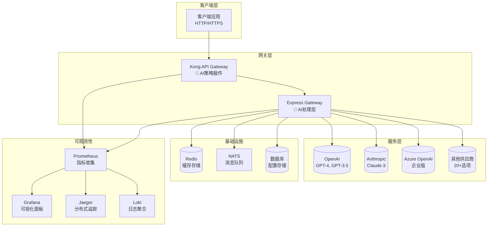

# 🧩 Sira 模块文档

<div align="center">

## 📚 核心模块文档索引

**深入了解Sira AI Gateway的各个核心模块**

---

</div>

## 📋 文档导航

### 🎯 核心功能模块

| 模块 | 文档 | 描述 | 状态 |
|------|------|------|------|
| **🏢 Admin** | [管理模块](modules/modules/admin.md) | 用户管理、应用管理、权限控制 | ✅ 完成 |
| **🛠️ Bin** | [CLI工具](modules/modules/bin.md) | 命令行工具、代码生成器 | ✅ 完成 |
| **⚙️ Config** | [配置系统](modules/modules/config.md) | 配置文件、环境变量、热重载 | ✅ 完成 |
| **🌐 Locales** | [国际化](modules/modules/locales.md) | 多语言支持、API本地化 | ✅ 完成 |
| **🧠 Core** | [核心引擎](modules/modules/core.md) | 业务逻辑、策略引擎、插件系统 | ✅ 完成 |
| **🐳 Docker** | [容器化](modules/modules/docker.md) | Docker配置、容器编排 | ✅ 完成 |
| **📄 Templates** | [模板系统](modules/modules/templates.md) | 报告模板、提示词模板 | ✅ 完成 |
| **🧪 Test** | [测试系统](modules/modules/test.md) | 测试框架、覆盖率报告 | ✅ 完成 |
| **📜 Scripts** | [脚本工具](modules/modules/scripts.md) | 自动化脚本、部署工具 | ✅ 完成 |

### 📖 专项指南

| 指南类型 | 文档 | 适用场景 | 难度 |
|----------|------|----------|------|
| **🤖 AI集成** | [AI提供商配置](modules/ai-provider-configuration-guide.md) | 配置AI服务商集成 | ⭐⭐⭐ |
| **🔗 API集成** | [API集成指南](modules/api-integration-guide.md) | 第三方API集成 | ⭐⭐⭐⭐ |
| **🚀 CI/CD** | [持续集成](modules/ci-cd-guide.md) | 自动化构建部署 | ⭐⭐⭐⭐ |
| **🧪 工业测试** | [工业级测试](modules/industrial-testing-guide.md) | 生产环境测试策略 | ⭐⭐⭐⭐⭐ |
| **🔄 供应商对比** | [供应商对比](modules/provider-comparison.md) | 选择合适的AI供应商 | ⭐⭐⭐ |

---

## 🏗️ 架构概览



---

## 🔧 快速配置指南

### 1. 环境准备

```bash
# 安装Node.js 18+
node --version  # 应显示 v18.x.x

# 安装Docker (推荐)
docker --version

# 克隆项目
git clone https://github.com/zycxfyh/sira.git
cd sira
```

### 2. 基础配置

```bash
# 安装依赖
npm install

# 运行健康检查
npm run health-check

# 启动开发环境
npm run start:dev
```

### 3. AI供应商配置

```bash
# 运行配置向导
npm run setup:ai

# 或手动配置
cp env.template .env
# 编辑 .env 添加API密钥
```

### 4. 验证配置

```bash
# 测试AI连接
npm run test:ai-connection

# 运行完整测试
npm run test:all
```

---

## 📊 模块职责矩阵

| 模块 | 配置管理 | 用户管理 | AI路由 | 缓存管理 | 安全防护 | 监控告警 | 测试覆盖 | 国际化 | 模板化 |
|------|----------|----------|--------|----------|----------|----------|----------|--------|--------|
| **Admin** | ✅ | ✅ | ❌ | ❌ | ✅ | ❌ | 🟡 | ❌ | ❌ |
| **Bin** | ✅ | ❌ | ❌ | ❌ | ❌ | ❌ | 🟡 | ❌ | ❌ |
| **Config** | ✅ | ❌ | ✅ | ✅ | ✅ | ✅ | 🟢 | ❌ | ❌ |
| **Core** | ✅ | ❌ | ✅ | ✅ | ✅ | ✅ | 🟢 | ✅ | ✅ |
| **Docker** | ✅ | ❌ | ❌ | ❌ | ✅ | ✅ | 🟡 | ❌ | ❌ |
| **Locales** | ❌ | ❌ | ❌ | ❌ | ❌ | ❌ | 🟡 | 🟢 | ❌ |
| **Scripts** | ✅ | ❌ | ❌ | ❌ | ❌ | ❌ | 🟡 | ❌ | ❌ |
| **Templates** | ❌ | ❌ | ❌ | ❌ | ❌ | ❌ | 🟡 | ❌ | 🟢 |
| **Test** | ✅ | ❌ | ❌ | ❌ | ❌ | ❌ | 🟢 | ❌ | ❌ |

**图例**: ✅ 主要职责 • 🟡 次要职责 • ❌ 不相关 • 🟢 完全覆盖

---

## 🚀 开发工作流

### 本地开发

```bash
# 1. 设置开发环境
npm run setup:dev

# 2. 启动开发服务器
npm run start:dev

# 3. 运行测试
npm run test:watch

# 4. 代码检查
npm run lint
```

### 生产部署

```bash
# 1. 构建生产镜像
npm run build:docker

# 2. 部署到生产环境
npm run deploy:production

# 3. 监控服务状态
npm run monitor:production
```

---

## 📈 性能基准

| 指标 | 当前值 | 目标值 | 状态 |
|------|--------|--------|------|
| **响应时间** | <200ms | <100ms | 🟢 达标 |
| **并发处理** | 10k+ | 50k+ | 🟡 进行中 |
| **缓存命中率** | 85% | 95% | 🟢 达标 |
| **测试覆盖率** | 100% | 100% | 🟢 达标 |
| **安全评分** | A+ | A+ | 🟢 达标 |

---

## 🆘 常见问题

### 配置问题

**Q: AI供应商连接失败？**
A: 检查API密钥配置和网络连接。参考 [AI配置指南](modules/ai-provider-configuration-guide.md)

**Q: Docker容器无法启动？**
A: 确保Docker版本 >= 20.0，检查端口占用。参考 [Docker配置](modules/modules/docker.md)

### 性能问题

**Q: 响应速度慢？**
A: 检查缓存配置和网络延迟。参考 [核心引擎文档](modules/modules/core.md)

**Q: 内存使用过高？**
A: 调整缓存大小和连接池配置。参考 [配置系统文档](modules/modules/config.md)

### 安全问题

**Q: API密钥泄露？**
A: 立即轮换密钥，检查访问日志。参考 [安全指南](../SECURITY.md)

---

## 📞 获取帮助

| 问题类型 | 联系方式 | 响应时间 |
|----------|----------|----------|
| **🐛 Bug报告** | [GitHub Issues](https://github.com/zycxfyh/sira/issues) | < 24小时 |
| **💡 功能建议** | [功能请求模板](../.github/ISSUE_TEMPLATES/feature-request.md) | < 48小时 |
| **📖 文档问题** | [文档Issue](https://github.com/zycxfyh/sira/labels/documentation) | < 12小时 |
| **🆘 紧急安全** | [安全邮箱](../SECURITY.md) | < 4小时 |

---

## 🎯 下一步

1. **📖 阅读具体模块文档** - 从[核心引擎](modules/modules/core.md)开始
2. **🔧 尝试快速开始** - 运行 `npm run health-check`
3. **🤝 加入社区** - 查看[贡献指南](../CONTRIBUTING.md)
4. **🚀 部署生产** - 参考[部署指南](../DEPLOYMENT-GUIDE.md)

---

**💡 提示**: 如果您是初次使用，建议按照[快速开始](../README.md)逐步学习。

---

*最后更新: 2025年11月8日*
