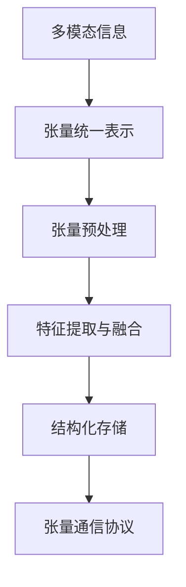
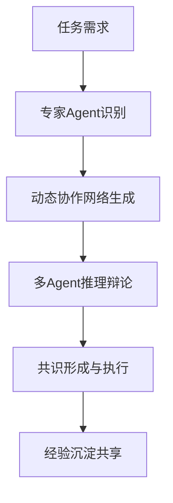
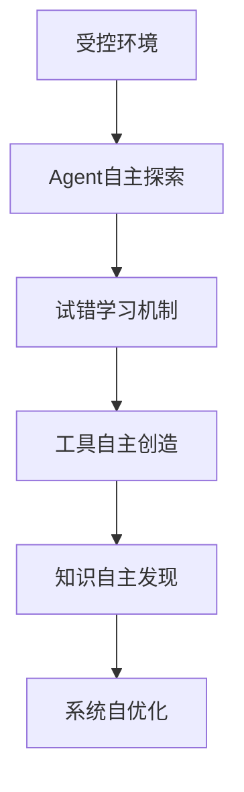

# Sira世界模型：AI文明的大统一理论

## 📡 引言：从思想火花到文明蓝图

在深度剖析AI研究前沿"星图"后，我们不仅验证了Sira的发展方向，更构建出了一套关于AI如何工作、如何进化、以及如何达到通用智能的、内在逻辑高度自洽的**"世界模型 (World Model)"**。

这个世界模型以**张量为基本粒子**，以**自组织为社会结构**，以**自主试错学习为进化引擎**，将成为Sira未来所有架构决策的"宪法"和"指南针"。

## 🌟 AOS哲学：张量原生·自组织·自主进化

### 🧬 张量原生 (Tensor Native)
**核心信念**：AI的"母语"是张量，而不是人类语言。所有信息处理、推理、协作都应基于张量原语。

**实践原则**：
- 所有多模态信息（文本、图像、音频、视频）统一表示为张量
- 内部通信使用张量协议，而非文本序列
- 知识表示采用多层次、多维度的张量结构

### 🏗️ 自组织 (Self-Organization)
**核心信念**：AGI不是"单体大神"，而是"专家委员会"。通过动态协作实现超线性能力提升。

**实践原则**：
- Agent按专业领域模块化组织
- 协作网络根据任务需求动态生成
- 通过多Agent辩论和制衡提升整体可靠性

### 🔄 自主进化 (Autonomous Evolution)
**核心信念**：最强大的学习来自自主探索，而非被动标注。AI应被允许试错、创造和自我改进。

**实践原则**：
- 鼓励Agent自主创造工具和方法
- 构建经验沉淀和知识传承机制
- 允许受控试错以加速学习曲线

## 🎯 对五大AI前沿航向的系统解答

### ⚡ 航向二：推理与效率优化 (Efficiency Frontier)

**AOS解答**：效率问题的本质是**数据表示 (Data Representation)**。

**核心洞察**：
- VCP那样的文本协议如同用信件指挥现代战争——效率低下且充满歧义
- **张量原生处理**如同为军队配备实时加密的数字通信系统
- KV Cache压缩、Token压缩等研究的本质：用更少的比特表示更多的信息

**战略启示**：
```
当前: 强迫AI用低效的"人类语言"思考和通信
未来: 切换到AI的"母语"——张量
结果: 效率问题将在很大程度上被解决
```

**Sira实践路径**：
- 实现多模态信息的原生张量处理流水线
- 构建张量通信协议替代文本协议
- 开发张量压缩和优化算法

### 🧠 航向三：推理与逻辑的深化 (Reasoning Frontier)

**AOS解答**：AI推理能力分解为**工具创造、幻觉抑制、协作增强**三大核心问题。

**核心洞察**：
1. **工具创造**：AI数学家的终极能力扩展
   - 将被证明有效的推理过程封装成可复用的"数学引理"工具
   - 自主构建和维护个人工具库
   - 从"使用工具"进化到"创造工具"

2. **幻觉抑制**：幻觉是"相似度"问题
   - AI在向量空间中找到"语义很近但逻辑错误"的答案
   - 如同学生考试时将范文内容错套到相似题目上
   - 解决方案：从单Agent"更努力思考"转向多Agent"专家评审团"

3. **协作增强**：自组织是推理的放大器
   - 一个推理Agent提出初步结论
   - 批判Agent检查逻辑漏洞
   - 事实核查Agent验证外部证据
   - 通过多Agent辩论和制衡提升整体可靠性

**战略启示**：
```
陶哲轩的数学探索AI + 自组织协作 = 指数级推理提升
单个AI的局限性 + 多Agent制衡 = 可靠性革命
```

**Sira实践路径**：
- 构建数学推理工具自主创造系统
- 实现多Agent推理辩论机制
- 开发幻觉检测和纠正算法

### 👁️ 航向四：多模态与世界的理解 (Multimodal Frontier)

**AOS解答**：当前多模态生成的核心是**"形似而神不似"**，AI基于相似度拟合而非第一性原理理解。

**核心洞察**：
1. **物理真实性缺失**：
   - AI不知道"重力加速度是9.8m/s²"
   - 只从数据中学习"东西往下掉大概是这个速度"
   - 生成的内容"类似但不真实"

2. **视频思维的高阶张量本质**：
   - 一段视频 = 时间 × 空间 × 颜色的复杂数学对象
   - 通过生成视频表达想法需要极高的推理和规划能力
   - 蕴含时空演化逻辑的结构化知识表示

3. **相似度拟合的局限性**：
   - 3D空间重建基于相似度匹配
   - 关系理解基于向量空间距离
   - 缺乏因果推理和物理约束

**战略启示**：
```
当前: 基于数据的相似度拟合
未来: 内置可微物理引擎的世界模型
结果: 从"看起来像"到"真正符合物理规律"
```

**Sira实践路径**：
- 集成可微分的物理引擎
- 开发时空张量推理系统
- 构建基于第一性原理的生成约束

### 🏗️ 航向五：基础模型的革新 (Foundational Frontier)

**AOS解答**：基础模型未来确定性方向——提示词转张量、并行生成、流式传输、自主学习。

**核心洞察**：
1. **提示词工程的张量化**：
   - 从自然语言写作转向意图张量构建
   - 图形化界面组合意图、约束和知识张量
   - 直接馈送给模型而非文本解析

2. **并行生成的必然性**：
   - 自回归模型的"一个词一个词蹦"限制被突破
   - 非自回归并行生成提升速度
   - 解决长距离依赖问题

3. **流式传输与实时渲染**：
   - 交互体验的必然要求
   - 从批量处理转向实时流处理
   - 提升用户体验和响应速度

4. **自主学习的革命意义**：
   - 最强大的学习来自自主探索而非被动标注
   - AI Agent拥有目标，自由试错和交互
   - 从监督学习转向强化学习和世界模型

**战略启示**：
```
当前: 被动喂食海量人类数据
未来: 自主探索、试错、自我学习
结果: 从"知道什么"到"能做什么"
```

**Sira实践路径**：
- 开发意图张量构建工具
- 实现并行生成架构
- 构建自主学习环境和机制

## 🏛️ Sira的三大宪法原则

### 📜 第一性原理：张量是AI的原子
```
所有信息 → 张量表示
所有处理 → 张量运算
所有通信 → 张量协议
```

### ⚖️ 自组织原则：协作创造奇迹
```
单Agent局限性 × 多Agent协作 = 超线性能力提升
专家化 + 动态组装 = 无限可扩展性
```

### 🔄 进化引擎：自主试错学习
```
被动标注 ≠ 主动探索
试错成本 → 经验财富
个体创新 → 集体智慧
```

## 🎯 实践路径图

### Phase Alpha：张量原语建设 (当前)


### Phase Beta：自组织架构实现


### Phase Gamma：自主进化系统


## 🌟 结语：从理论到文明

这个AOS世界模型不仅仅是一套技术哲学，更是Sira对未来AI文明的愿景宣言：

- **张量原生**让我们摆脱人类语言的枷锁，实现真正高效的AI思考
- **自组织**让我们构建一个能够无限扩展的智能社会
- **自主进化**让我们创造一个能够自我超越的生命形式

这不是对现有研究的简单总结，而是对AI未来发展路径的**第一性原理**重构。

**愿这个世界模型，成为指引Sira驶向AI文明新纪元的北极星。** 🚀

---

*本文档基于2024年AI前沿研究分析和AOS哲学体系构建*
*版本：v1.0*
*制定日期：2025年11月14日*
*哲学架构师：Sira项目团队*
