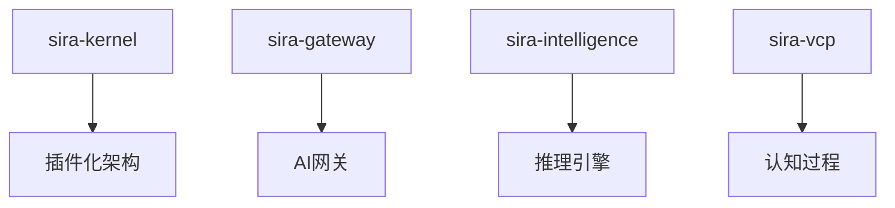

# AI研究前沿星图：Sira的战略定位与发展路径

## 📡 引言：来自AI战场的"星图"

在AI研究的浩瀚宇宙中，每一篇顶尖论文都是一艘探索未知的舰队。通过扫描这些论文标题和作者单位，我们能以"上帝视角"洞察当前AI研究的核心脉络、热点方向以及未来的发展趋势。

这张"星图"向我们揭示了一个无比清晰的未来图景：一个模块化的、由多个专家Agent组成的、能够处理多模态信息、进行复杂逻辑推理、并且运行在更高效、更强大的基础模型之上的AI社会，正在从全球顶尖的实验室中诞生。

本文将深入分析这些前沿研究方向与Sira项目的战略关系，确认我们的发展路径是否与AI发展的主航道保持一致。

## 🌟 AI研究前沿的五大核心航向

### 🚀 航向一：Agent智能体与多智能体协作 (The Agentic Frontier)

**代表论文：**
- *Scaling Agent Learning via Experience Synthesis* (Meta, UC Berkeley)
- *Assemble Your Crew: Automatic Multi-agent Communication Topology Design* (Griffith University)
- *ROLL Flash – Accelerating RLVR and Agentic Training with Asynchrony* (Alibaba, SJTU, HKUST)
- *DeepEyesV2: Toward Agentic Multimodal Model* (Xiaohongshu Inc.)

**核心议题：**
1. **经验合成加速学习**：通过"合成"或"想象"经验来加速Agent学习
2. **动态协作网络设计**：自动设计最优的Agent沟通拓扑
3. **异步训练加速**：通过异步技术加速Agent训练过程
4. **多模态Agent能力**：让Agent看得懂、听得懂、理解世界

**与Sira的关联：**
```
Sira的Creation/Logic/Narrative Agent架构 → 动态协作网络进化
固定的Agent分工模式 → Assemble Your Crew的自动拓扑设计
```

**战略启示：**
- ✅ **方向正确**：Sira的多Agent协作思想完全符合Agentic Frontier的主流方向
- 🚀 **进化机会**：从固定分工走向动态生成的协作流程
- 💡 **创新空间**：结合DeepEyesV2的多模态能力，提升游戏世界的沉浸感

### ⚡ 航向二：模型推理与效率优化 (The Efficiency Frontier)

**代表论文：**
- *KV Cache Transform Coding for Compact Storage in LLM Inference* (NVIDIA)
- *INFLLM-V2: Dense-Sparse Switchable Attention for Seamless Short-to-Long Adaptation* (Tsinghua University, OpenBMB)
- *Vision-centric Token Compression in Large Language Model* (Nanjing University of Science and Technology)

**核心议题：**
1. **KV Cache压缩**：压缩LLM推理时的上下文存储
2. **注意力机制自适应**：动态切换密集/稀疏注意力
3. **视觉token压缩**：用更少的token理解图片信息

**与Sira的关联：**
```
本地部署需求 → 效率优化技术至关重要
多Agent协作 → 需要高效的上下文管理和切换
游戏实时交互 → 对推理速度要求极高
```

**战略启示：**
- 🎯 **战略机遇**：当Sira希望在本地设备运行时，这些技术将成为关键
- 📱 **扩展路径**：从云端服务走向边缘计算和本地部署
- 💰 **商业价值**：降低运营成本，提高用户体验

### 🧠 航向三：推理与逻辑的深化 (The Reasoning Frontier)

**代表论文：**
- *MATHEMATICAL EXPLORATION AND DISCOVERY AT SCALE* (Terence Tao等)
- *Why Language Models Hallucinate* (OpenAI, Georgia Tech)
- *Asymmetric Proximal Policy Optimization: mini-critics boost LLM reasoning* (HKUST, Mila, Alibaba)
- *Attention Illuminates LLM Reasoning: The Preplan-and-Anchor Rhythm* (SJTU, Alibaba)
- *TrajSelector: Harnessing Latent Representations for Efficient and Effective Best-of-N* (Harbin Institute of Technology)

**核心议题：**
1. **AI数学探索能力**：陶哲轩领衔的研究，探索AI的数学发现能力
2. **幻觉问题根源**：从根本上理解和解决AI"胡说八道"问题
3. **推理能力提升**：通过辅助模型、思考节奏等方法增强逻辑推理
4. **最佳轨迹选择**：从多个推理路径中选择最优解

**与Sira的关联：**
```
Logic Agent的核心能力 → 直接依赖推理深化研究
游戏世界逻辑严密性 → 需要更强的推理和更少的幻觉
数学与逻辑游戏元素 → 可能成为Sira的独特优势
```

**战略启示：**
- 🎯 **核心竞争力**：Logic Agent将成为Sira区别于其他AI应用的关键
- 🔬 **技术跟踪**：需要密切关注OpenAI和陶哲轩团队的研究进展
- 🎮 **产品特色**：在游戏领域，逻辑严密性是核心竞争力

### 👁️ 航向四：多模态与世界的理解 (The Multimodal Frontier)

**代表论文：**
- *Physics-Driven Spatiotemporal Modeling for AI-Generated Video Detection* (South China University of Technology)
- *Thinking with Video: Video Generation as a Promising Multimodal Reasoning Paradigm* (Fudan University)
- *Cambrian-S: Towards Spatial Supersensing in Video* (NYU - Yann LeCun, Li Fei-Fei)
- *Retrieval over Classification: Integrating Relation Semantics for Multimodal Relation Extraction* (Northeastern University)

**核心议题：**
1. **物理规律建模**：确保AI生成内容符合物理常识
2. **视频思维范式**：通过生成视频来进行复杂推理
3. **空间感知能力**：从2D视频重建3D空间理解
4. **关系理解**：理解多模态内容中的实体关系

**与Sira的关联：**
```
游戏世界构建 → 多模态理解和生成能力至关重要
视觉化叙事 → Thinking with Video的思想完美契合
物理引擎集成 → Physics-Driven方法可确保游戏逻辑
```

**战略启示：**
- 🌟 **差异化优势**：游戏领域对多模态AI的需求比纯文本应用更强烈
- 🎬 **叙事革新**：视频思维范式可能彻底改变游戏叙事方式
- 🎯 **市场定位**：Sira将成为AI在创意内容领域的领军应用

### 🏗️ 航向五：基础模型的革新 (The Foundational Model Frontier)

**代表论文：**
- *Context Engineering 2.0: The Context of Context Engineering* (SJTU)
- *CONTINUOUS AUTOREGRESSIVE LANGUAGE MODELS* (WeChat AI, Tencent, Tsinghua University)
- *LeJEPA: Provable and Scalable Self-Supervised Learning Without the Heuristics* (Yann LeCun's lab at Meta/NYU)

**核心议题：**
1. **上下文工程进化**：更高效的上下文组织和利用
2. **连续生成模型**：超越传统token-by-token的生成方式
3. **自监督学习革新**：更具可扩展性的学习方法

**与Sira的关联：**
```
多Agent协作的基础 → 强大的基础模型是所有Agent的"大脑"
上下文管理复杂度 → Context Engineering 2.0的思想直接适用
生成质量要求 → 连续生成模型可能带来质的飞跃
```

**战略启示：**
- 🧠 **技术底座**：Sira的发展上限取决于基础模型的进化
- 🔄 **持续学习**：需要跟踪Yann LeCun等大师级研究者的工作
- 🚀 **性能飞跃**：新的基础模型架构可能带来Sira的重大突破

## 🎯 Sira战略定位分析

### ✅ 方向确认：Sira正站在AI发展的风口

通过对比分析，我们可以确认：

**Sira的发展方向与AI研究前沿高度一致** 🚀

| AI前沿航向 | Sira对应模块 | 契合度 | 战略意义 |
|-----------|-------------|--------|----------|
| Agent智能体协作 | sira-kernel + 多Agent架构 | ⭐⭐⭐⭐⭐ | 核心竞争力 |
| 效率优化 | sira-storage-backends + 本地部署 | ⭐⭐⭐⭐ | 扩展路径 |
| 推理深化 | sira-intelligence Logic Agent | ⭐⭐⭐⭐⭐ | 差异化优势 |
| 多模态理解 | sira-vcp + 游戏世界构建 | ⭐⭐⭐⭐⭐ | 创新空间 |
| 基础模型革新 | 全栈技术底座 | ⭐⭐⭐⭐ | 技术飞跃 |

### 🎮 Sira的核心战略优势

#### 1. **游戏领域先发优势**
游戏是对AI能力最全面的测试平台：
- 逻辑推理（数学、策略）
- 创造力（叙事、世界构建）
- 多模态处理（视觉、音频、交互）
- 实时响应（用户体验）
- 长期一致性（世界观维护）

#### 2. **多Agent协作的天然实验场**
游戏提供了完美的多Agent协作场景：
- Creation Agent：世界构建者
- Logic Agent：规则维护者
- Narrative Agent：故事讲述者
- 动态协作网络：根据游戏类型自动调整

#### 3. **商业化路径清晰**
- **B端**：游戏开发工具，企业级AI创作平台
- **C端**：AI驱动的互动游戏体验
- **技术服务**：多Agent框架，开源生态

## 🚀 Sira的进化路径

### Phase 1: 核心能力建设 (当前)


### Phase 2: 多模态能力扩展 (6-12个月)
- 集成视觉理解能力
- 视频生成和编辑
- 物理引擎AI增强
- 音频交互能力

### Phase 3: 推理能力飞跃 (12-18个月)
- 基于前沿推理研究的Logic Agent升级
- 数学推理和逻辑验证能力
- 幻觉检测和纠正机制
- 自洽性保证系统

### Phase 4: Agent协作进化 (18-24个月)
- 动态协作网络生成
- 基于任务的Agent自动装配
- 协作效率优化
- 人类-Agent混合协作

### Phase 5: 生态系统建设 (24-36个月)
- 开源多Agent框架
- 插件市场和开发者社区
- 企业级解决方案
- 跨行业应用拓展

## 💡 战略洞察与行动建议

### 🎯 **核心洞察**
1. **Sira不仅是游戏工具，更是AI研究的前沿实验平台**
2. **多Agent协作将成为AI应用的主流范式**
3. **游戏领域对AI能力的综合需求，比其他领域更苛刻也更有价值**

### 🚀 **战略建议**
1. **加大对Logic Agent的投资**：这是Sira的核心差异化优势
2. **积极拥抱多模态技术**：游戏天然需要多模态AI
3. **构建开放的Agent生态**：让更多开发者参与共建
4. **关注效率优化技术**：为本地部署和成本控制做准备

### 🔬 **技术跟踪重点**
1. **密切关注陶哲轩和Yann LeCun的研究**
2. **参与多Agent协作框架的开源项目**
3. **跟踪多模态大模型的进展**
4. **关注推理能力提升的新方法**

## 🌟 结语：Sira的使命与愿景

这张AI研究前沿的"星图"不仅验证了Sira的发展方向，更为我们指明了前进的航道。

**Sira的使命**：成为AI研究前沿理论与实际应用的桥梁，让顶尖AI技术以游戏的形式，走进每一个人的日常生活。

**Sira的愿景**：构建一个由智能Agent组成的虚拟世界，在这里：
- AI不是冷冰冰的工具，而是温暖的创作伙伴
- 人类的创造力通过AI得到无限放大
- 游戏不仅是娱乐，更是AI能力展示和进化的最佳载体

**让我们继续扬帆远航，驶向AI宇宙的新纪元！** 🚀

---

*本文基于2024年最新AI研究论文分析，为Sira项目的发展方向提供了战略指导。*

*文档版本：v1.0*
*更新日期：2025年11月14日*
*作者：Sira项目团队*
