# AI网关项目工具集成指南

本文档专门为AI网关项目定制的开发工具集成方案，参考了Kong、Express Gateway、Tyk等主流API网关项目的实践。

## 🎯 AI网关项目特点分析

### 项目定位

- **核心功能**: AI服务商智能路由、负载均衡、缓存策略
- **技术栈**: Node.js + Express + Docker + 微服务架构
- **用户群体**: 开发者、AI应用集成者、企业客户
- **部署方式**: 云原生、容器化、Serverless

### 性能关键指标

- **响应时间**: <200ms (关键路径)
- **并发处理**: 1000+ RPS
- **内存占用**: <100MB (基础配置)
- **CPU使用**: 优化异步处理

### 开发重点

- **稳定性**: 7×24小时服务可用性
- **可扩展性**: 支持20+ AI服务商
- **安全性**: API密钥管理、速率限制
- **可观测性**: 详细的监控和日志

## 📋 推荐工具集成方案

### 🔧 核心工具 (必须集成)

| 工具                    | 优先级     | 适用性      | 理由                 |
| ----------------------- | ---------- | ----------- | -------------------- |
| **ESLint + Prettier**   | ⭐⭐⭐⭐⭐ | ✅ 高度适用 | 代码质量和风格统一   |
| **Jest**                | ⭐⭐⭐⭐⭐ | ✅ 已集成   | 测试框架，项目已在用 |
| **Bundle Analyzer**     | ⭐⭐⭐⭐   | ✅ 适用     | 包大小优化重要       |
| **Docker**              | ⭐⭐⭐⭐⭐ | ✅ 已集成   | 容器化部署标准       |
| **Husky + lint-staged** | ⭐⭐⭐⭐   | ✅ 适用     | Git hooks质量保障    |

### 🔄 次要工具 (可选集成)

| 工具                 | 优先级 | 适用性      | 理由                                      |
| -------------------- | ------ | ----------- | ----------------------------------------- |
| **Commitlint**       | ⭐⭐⭐ | ⚠️ 可选     | 规范化提交，但对学习项目过于严格          |
| **Lighthouse CI**    | ⭐⭐   | ❌ 不太适用 | 更适合前端项目，API网关需要专门的性能测试 |
| **Nx**               | ⭐⭐   | ❌ 不适用   | 单仓项目过于复杂，适合大型多应用项目      |
| **Semantic Release** | ⭐⭐   | ⚠️ 可选     | 自动化发布对学习项目可能过于复杂          |

### 🆕 AI网关专用工具

| 工具           | 适用性      | 价值                          |
| -------------- | ----------- | ----------------------------- |
| **Artillery**  | ✅ 强烈推荐 | API负载测试，模拟真实用户场景 |
| **Clinic.js**  | ✅ 推荐     | Node.js性能分析工具           |
| **autocannon** | ✅ 推荐     | HTTP负载测试，简单高效        |
| **Nock**       | ✅ 已集成   | HTTP请求模拟，测试友好        |

## 🛠️ 详细配置方案

### 代码质量工具 (核心)

#### ESLint + Prettier 配置

```javascript
// .eslintrc.js - AI网关优化配置
module.exports = {
  extends: ['standard', 'prettier'],
  plugins: ['prettier'],
  rules: {
    'prettier/prettier': 'error',
    'no-console': process.env.NODE_ENV === 'production' ? 'error' : 'warn',
    // AI网关特定规则
    'no-unused-vars': ['warn', { argsIgnorePattern: '^(_|req|res|next)' }],
    'prefer-const': 'error',
    'no-var': 'error',
  },
  env: {
    node: true,
    jest: true,
  },
};
```

#### 性能测试工具 (推荐替换Lighthouse)

```bash
# package.json
{
  "scripts": {
    "test:load": "artillery run test/load/load-test.yml",
    "test:perf": "autocannon -c 100 -d 10 http://localhost:8080/health",
    "clinic:doctor": "clinic doctor -- node src/core/index.js",
    "clinic:bubbleprof": "clinic bubbleprof -- node src/core/index.js"
  }
}
```

### 包大小优化 (核心)

#### Bundle Analyzer 配置

```javascript
// scripts/analyze-bundle.js
const webpack = require('webpack-bundle-analyzer');

module.exports = {
  mode: 'production',
  entry: './src/core/index.js',
  externals: {
    // 排除Node.js内置模块
    fs: 'commonjs fs',
    path: 'commonjs path',
    http: 'commonjs http',
    https: 'commonjs https',
    // 排除大型依赖
    redis: 'commonjs redis',
    ioredis: 'commonjs ioredis',
  },
};
```

### CI/CD 配置 (AI网关优化)

```yaml
# .github/workflows/ci.yml
name: CI
on: [push, pull_request]

jobs:
  test:
    runs-on: ubuntu-latest
    steps:
      - uses: actions/checkout@v4
      - uses: actions/setup-node@v4
        with:
          node: '18'
          cache: 'npm'

      - run: npm ci
      - run: npm run lint
      - run: npm run test:ci

      # AI网关专用: API性能测试
      - name: API Performance Test
        run: npm run test:perf

      # AI网关专用: 内存泄漏检查
      - name: Memory Leak Test
        run: npm run clinic:doctor -- --duration=10s

      - name: Upload Coverage
        uses: codecov/codecov-action@v3
```

### 发布策略 (学习项目友好)

```yaml
# .github/workflows/release.yml
name: Release
on:
  push:
    tags: ['v*']

jobs:
  release:
    runs-on: ubuntu-latest
    steps:
      - uses: actions/checkout@v4
      - uses: actions/setup-node@v4
        with:
          node: '18'
          cache: 'npm'

      - run: npm ci
      - run: npm run test:ci
      - run: npm run lint

      # 创建GitHub Release (手动触发更合适)
      - name: Create Release
        uses: actions/create-release@v1
        env:
          GITHUB_TOKEN: ${{ secrets.GITHUB_TOKEN }}
        with:
          tag_name: ${{ github.ref }}
          release_name: Release ${{ github.ref }}
          body: See CHANGELOG.md for details
```

## 🏗️ 项目架构优化建议

### 单仓 vs 多仓

**推荐单仓结构** (适合学习项目):

```
sira/
├── src/                    # 源代码
│   ├── core/              # 核心网关逻辑
│   ├── policies/          # AI策略插件
│   ├── services/          # 业务服务
│   └── test/              # 测试文件
├── config/                # 配置文件
├── docker/                # Docker配置
├── docs/                  # 文档
└── scripts/               # 构建脚本
```

**Nx多仓结构** (适合企业级):

- 对单个AI网关项目来说过于复杂
- 适合有多个相关项目的大型组织

### 分层架构设计

```
┌─────────────────┐
│   API Routes    │  ← RESTful接口
└─────────────────┘
┌─────────────────┐
│  AI Strategies  │  ← AI路由策略
└─────────────────┘
┌─────────────────┐
│   Core Engine   │  ← 核心处理引擎
└─────────────────┘
┌─────────────────┐
│ Infrastructure  │  ← 基础设施层
└─────────────────┘
```

## 📊 性能优化重点

### AI网关性能指标

| 指标         | 目标值    | 监控工具    | 优化策略           |
| ------------ | --------- | ----------- | ------------------ |
| **响应时间** | <200ms    | autocannon  | 缓存策略、连接池   |
| **并发处理** | 1000+ RPS | Artillery   | 异步处理、负载均衡 |
| **内存使用** | <100MB    | Clinic.js   | 内存泄漏检测       |
| **CPU使用**  | <50%      | Node.js监控 | 事件循环优化       |

### 监控告警配置

```yaml
# 关键指标监控
alert_rules:
  - name: high_response_time
    condition: response_time > 500ms for 5m
    severity: warning

  - name: high_error_rate
    condition: error_rate > 5% for 10m
    severity: error

  - name: memory_leak
    condition: memory_growth > 50MB/hour
    severity: critical
```

## 🔒 安全加固

### API网关安全工具

```bash
# package.json 安全相关脚本
{
  "scripts": {
    "security:audit": "npm audit --audit-level=moderate",
    "security:scan": "npm run test -- --grep security",
    "security:headers": "curl -I http://localhost:8080/health"
  }
}
```

### 密钥管理

```javascript
// config/security.js
module.exports = {
  encryption: {
    algorithm: 'aes-256-gcm',
    keyRotation: '30d',
  },
  rateLimit: {
    windowMs: 15 * 60 * 1000, // 15 minutes
    max: 100, // limit each IP to 100 requests per windowMs
  },
};
```

## 🚀 部署优化

### Docker优化

```dockerfile
# Dockerfile - AI网关优化
FROM node:18-alpine

# 安全: 使用非root用户
USER node

# 性能: 多阶段构建
COPY --chown=node:node package*.json ./
RUN npm ci --only=production && npm cache clean --force

# 监控: 健康检查
HEALTHCHECK --interval=30s --timeout=3s --start-period=5s --retries=3 \
  CMD curl -f http://localhost:8080/health || exit 1

EXPOSE 8080 9876
```

### 云原生配置

```yaml
# Kubernetes deployment - AI网关
apiVersion: apps/v1
kind: Deployment
metadata:
  name: sira-gateway
spec:
  replicas: 3
  selector:
    matchLabels:
      app: sira-gateway
  template:
    spec:
      containers:
        - name: gateway
          image: sira/gateway:latest
          resources:
            requests:
              memory: '64Mi'
              cpu: '100m'
            limits:
              memory: '128Mi'
              cpu: '200m'
          livenessProbe:
            httpGet:
              path: /health
              port: 8080
            initialDelaySeconds: 30
            periodSeconds: 10
```

## 📚 学习资源

### 优秀AI网关项目参考

| 项目                | 技术栈      | 学习重点          |
| ------------------- | ----------- | ----------------- |
| **Kong**            | Lua + Nginx | 企业级API网关架构 |
| **Express Gateway** | Node.js     | 插件化架构设计    |
| **Tyk**             | Go          | 性能优化和高可用  |
| **KrakenD**         | Go          | 轻量级网关设计    |
| **Gloo Edge**       | Go + Envoy  | 云原生网关        |

### 性能优化资源

- [Node.js Performance Best Practices](https://nodejs.org/en/docs/guides/simple-profiling/)
- [Clinic.js Documentation](https://clinicjs.org/)
- [Artillery.io Documentation](https://artillery.io/)
- [API Gateway Performance Patterns](https://microservices.io/patterns/apigateway.html)

## 🎯 实施建议

### Phase 1: 基础工具 (1-2周)

1. ✅ ESLint + Prettier
2. ✅ Bundle Analyzer
3. ✅ Artillery (性能测试)
4. ✅ Clinic.js (内存分析)

### Phase 2: CI/CD优化 (2-4周)

1. ⚠️ 优化GitHub Actions (移除不适合的工具)
2. ✅ 添加API性能测试
3. ✅ 配置监控告警

### Phase 3: 生产就绪 (1个月+)

1. ✅ Docker优化
2. ✅ K8s部署配置
3. ✅ 监控面板完善
4. ✅ 安全加固

## ⚠️ 需要移除/调整的工具

### 不适合AI网关项目的工具

1. **Nx**: 过于复杂，适合大型单仓项目
2. **Lighthouse CI**: 前端性能工具，不适合API网关
3. **Semantic Release**: 对学习项目过于自动化
4. **复杂的分仓结构**: 增加维护成本

### 建议的替换方案

| 原工具           | 替换工具               | 理由              |
| ---------------- | ---------------------- | ----------------- |
| Nx               | 简单的monorepo结构     | 降低复杂度        |
| Lighthouse CI    | Artillery + autocannon | 专业的API性能测试 |
| Semantic Release | 手动发布 + 版本标签    | 学习项目更友好    |
| 复杂CI/CD        | 精简的CI/CD流程        | 专注核心功能      |

## 📈 成功指标

### 技术指标

- ✅ 代码覆盖率 > 80%
- ✅ ESLint 0错误
- ✅ 响应时间 < 200ms
- ✅ 内存使用 < 100MB

### 开发体验

- ✅ 提交前自动检查
- ✅ 清晰的错误信息
- ✅ 简单的部署流程
- ✅ 完善的文档

### 生产就绪

- ✅ 容器化部署
- ✅ 健康检查
- ✅ 日志聚合
- ✅ 监控告警

---

这个指南专门针对AI网关项目的特点定制，参考了行业主流实践。建议优先集成核心工具，然后根据项目发展阶段逐步添加其他功能。

## 🛠️ 详细配置说明

### ESLint + Prettier

#### 功能特性

- **自动代码格式化**: 使用Prettier统一代码风格
- **代码质量检查**: ESLint检测潜在问题和最佳实践
- **Git Hooks集成**: 提交前自动格式化和检查
- **IDE集成**: 支持VSCode等编辑器的实时检查

#### 使用方法

```bash
# 手动格式化代码
npm run format

# 检查格式是否符合要求
npm run format:check

# 代码质量检查
npm run lint

# 仅检查代码质量（不自动修复）
npm run lint:check
```

#### 配置亮点

- 支持TypeScript检查（为未来扩展准备）
- 环境变量感知的规则配置
- 生产环境更严格的检查规则
- 智能的未使用变量检测

### Bundle Analyzer

#### 功能特性

- **包大小分析**: 可视化展示依赖大小分布
- **性能优化**: 识别大型依赖包
- **CI/CD集成**: 自动生成分析报告
- **历史对比**: 跟踪包大小变化趋势

#### 使用方法

```bash
# 交互式分析（浏览器中查看）
npm run analyze-bundle

# CI模式（生成报告文件）
npm run analyze-bundle:ci
```

#### 输出文件

- `dist/bundle-report.html`: 可视化分析报告
- `reports/bundle-analysis.json`: 详细数据报告

### Nx 模块化

#### 功能特性

- **智能缓存**: 基于输入输出的任务缓存
- **依赖管理**: 自动构建依赖图
- **分布式缓存**: 支持Nx Cloud加速构建
- **项目组织**: 清晰的单仓多应用结构

#### 项目结构

```
sira/
├── apps/                 # 应用
│   └── sira-gateway/    # 主应用
├── libs/                # 共享库
│   └── core/           # 核心库
├── nx.json             # Nx配置
└── project.json        # 项目配置
```

#### 使用方法

```bash
# 显示所有项目
npx nx show projects

# 运行特定项目的任务
npx nx test sira-gateway
npx nx lint core

# 运行所有项目的任务
npx nx run-many --target=test --all
```

### Lighthouse CI

#### 功能特性

- **性能监控**: 自动检测性能回归
- **可访问性检查**: 确保应用的可访问性
- **SEO分析**: 优化搜索引擎表现
- **最佳实践**: 遵循Web开发最佳实践

#### 监控指标

- **First Contentful Paint (FCP)**: 首次内容绘制
- **Largest Contentful Paint (LCP)**: 最大内容绘制
- **First Input Delay (FID)**: 首次输入延迟
- **Cumulative Layout Shift (CLS)**: 累积布局偏移

#### 使用方法

```bash
# 本地运行（需要启动服务）
npm run lighthouse

# CI模式
npm run lighthouse:ci

# 桌面模式测试
npm run lighthouse:desktop

# 移动模式测试
npm run lighthouse:mobile
```

### Semantic Release

#### 功能特性

- **自动版本管理**: 根据提交信息自动确定版本号
- **CHANGELOG生成**: 自动生成详细的变更日志
- **Git标签**: 自动创建版本标签
- **GitHub Release**: 自动创建GitHub发布

#### 提交类型映射

| 提交类型           | 版本影响     | 说明       |
| ------------------ | ------------ | ---------- |
| `feat:`            | 次版本号+1   | 新功能     |
| `fix:`             | 补丁版本号+1 | 修复bug    |
| `BREAKING CHANGE:` | 主版本号+1   | 破坏性变更 |
| `docs:`            | 不影响版本   | 文档更新   |
| `style:`           | 不影响版本   | 代码格式   |
| `refactor:`        | 不影响版本   | 重构       |
| `perf:`            | 不影响版本   | 性能优化   |
| `test:`            | 不影响版本   | 测试       |
| `chore:`           | 不影响版本   | 构建/工具  |

#### 示例提交信息

```bash
feat: add AI router performance monitoring
fix: resolve memory leak in webhook handler
docs: update deployment guide for Docker Compose
perf: optimize bundle size with tree shaking
```

### Commitlint

#### 功能特性

- **提交信息规范**: 强制约定式提交格式
- **自动化检查**: Git Hooks自动验证
- **团队协作**: 统一提交信息规范
- **工具集成**: 支持Semantic Release

#### 提交格式要求

```
<type>(<scope>): <subject>

<body>

<footer>
```

#### 验证规则

- `type`必须是预定义类型之一
- `subject`必须小写开头，不超过100字符
- `body`每行不超过100字符
- 支持可选的`scope`和`footer`

## 🚀 CI/CD 工作流

### GitHub Actions 集成

项目包含以下自动化工作流：

#### 1. Lighthouse CI (`lighthouse.yml`)

- 触发条件: Push/PR 到 main/develop 分支
- 执行内容: 性能、可访问性、SEO检查
- 输出: 详细的性能报告和建议

#### 2. Release (`release.yml`)

- 触发条件: Push 到 main 分支
- 执行内容: 测试、代码质量检查、性能分析
- 输出: 自动版本发布和CHANGELOG

#### 3. Bundle Analysis (`bundle-analysis.yml`)

- 触发条件: PR 创建/更新
- 执行内容: 包大小分析和对比
- 输出: Bundle大小变化报告

## 📊 质量保证流程

### 开发流程

```mermaid
graph LR
    A[开发] --> B[Prettier格式化]
    B --> C[ESLint检查]
    C --> D[Commitlint验证]
    D --> E[Git提交]
    E --> F[Pre-commit Hooks]
    F --> G[Push到远程]
    G --> H[CI/CD检查]
    H --> I[代码审查]
    I --> J[合并到主分支]
    J --> K[自动发布]
```



### 质量门禁

项目设置了多层质量门禁：

1. **本地开发**: ESLint + Prettier + Husky hooks
2. **代码提交**: Commitlint + 格式检查
3. **CI构建**: 单元测试 + 集成测试 + 代码覆盖率
4. **性能检查**: Lighthouse CI + Bundle分析
5. **安全扫描**: 依赖审计 + 漏洞检查

## 🔧 配置自定义

### 修改ESLint规则

编辑 `.eslintrc.js`:

```javascript
rules: {
  // 添加自定义规则
  'no-console': 'warn', // 生产环境改为error
  'prefer-const': 'error',
}
```

### 调整Lighthouse阈值

编辑 `lighthouserc.js`:

```javascript
assertions: {
  'first-contentful-paint': ['error', { maxNumericValue: 1500 }],
  'categories:performance': ['error', { minScore: 0.95 }],
}
```

### 配置Semantic Release分支

编辑 `.releaserc.json`:

```json
{
  "branches": [
    "main",
    { "name": "beta", "prerelease": true },
    { "name": "alpha", "prerelease": true }
  ]
}
```

## 📈 性能优化效果

### Bundle大小优化

- **Tree Shaking**: 移除未使用的代码
- **代码分割**: 按需加载模块
- **压缩优化**: Gzip + Brotli压缩

### 构建速度优化

- **Nx缓存**: 增量构建加速
- **并行处理**: 多核CPU充分利用
- **依赖优化**: 精确的依赖分析

### 开发体验优化

- **热重载**: 快速预览更改
- **类型检查**: 编译时错误检测
- **自动修复**: 减少手动修改代码

## 🎯 最佳实践

### 提交信息规范

```bash
# ✅ 好的提交信息
feat: add AI model performance monitoring dashboard

- Add real-time performance metrics
- Support multiple model comparison
- Include historical data visualization

Closes #123

# ❌ 不好的提交信息
fix bug
update code
add feature
```

### 分支策略

```bash
main          # 生产分支，自动发布
develop       # 开发分支，集成新功能
feature/*     # 功能分支，开发新特性
hotfix/*      # 热修复分支，紧急修复
release/*     # 发布分支，准备发布
```

### 代码审查清单

- [ ] ESLint检查通过
- [ ] Prettier格式化完成
- [ ] 单元测试覆盖率达标
- [ ] Lighthouse性能分数正常
- [ ] Bundle大小无明显增长
- [ ] 提交信息符合规范

## 📚 相关文档

- [ESLint规则参考](https://eslint.org/docs/rules/)
- [Prettier选项](https://prettier.io/docs/en/options.html)
- [Nx官方文档](https://nx.dev/)
- [Lighthouse CI](https://github.com/GoogleChrome/lighthouse-ci)
- [Semantic Release](https://semantic-release.gitbook.io/)
- [约定式提交](https://conventionalcommits.org/)

---

通过这些先进工具的集成，Sira AI网关项目实现了：

✅ **先进性**: 使用最新的开发工具和技术栈
✅ **轻量化**: 优化的包大小和构建性能
✅ **可迁移**: 容器化部署和跨平台兼容
✅ **适配性高**: 多环境配置和智能路由
✅ **模块化**: 清晰的项目结构和依赖管理

持续维护和优化这些工具配置，将确保项目的长期健康发展。
