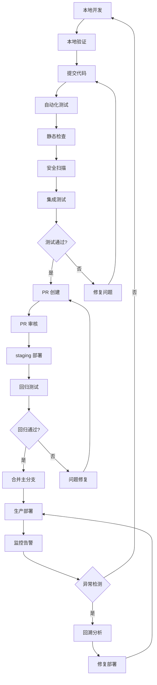

# API 中转站测试与 CI/CD 工作流

> 完整的软件开发生命周期管理，从本地开发到生产部署

---

## 目录

1. [工作流总览](#工作流总览)
2. [本地验证环境](#本地验证环境)
3. [自动化测试](#自动化测试)
4. [静态与安全检查](#静态与安全检查)
5. [集成测试](#集成测试)
6. [PR 审核流程](#pr-审核流程)
7. [Staging 环境](#staging-环境)
8. [回归测试](#回归测试)
9. [生产部署](#生产部署)
10. [监控与回溯](#监控与回溯)
11. [工具与配置](#工具与配置)
12. [故障排除](#故障排除)

---

## 工作流总览

### 开发流程图


### 质量门禁标准

| 阶段 | 成功标准 | 失败处理 |
|------|---------|----------|
| **本地验证** | 代码格式化 + 基础测试通过 | 本地修复 |
| **自动化测试** | 单元测试覆盖率 > 80% | CI 失败 |
| **静态检查** | ESLint + TypeScript 类型检查通过 | CI 失败 |
| **安全扫描** | 高危漏洞为0，中危漏洞 < 5 | 安全审查 |
| **集成测试** | E2E 测试通过率 > 95% | 集成环境修复 |
| **PR 审核** | 人工 Code Review 通过 | PR 打回 |
| **回归测试** | 所有回归用例通过 | Staging 环境修复 |

---

## 本地验证环境

### 开发环境设置

#### 1. 环境要求
```bash
Node.js >= 18.0.0
Docker >= 20.0.0
Docker Compose >= 2.0.0
Git >= 2.30.0
```

#### 2. 克隆项目
```bash
# 基础版本
git clone https://github.com/your-org/api-gateway.git
cd api-gateway

# 或 V2 版本
git clone https://github.com/your-org/api-gateway-v2.git
cd api-gateway-v2
```

#### 3. 环境配置
```bash
# 复制环境模板
cp env.template .env

# 编辑配置文件（添加测试API密钥）
vim .env
```

#### 4. 启动本地环境
```bash
# 启动依赖服务
docker-compose up -d mongodb redis

# 安装依赖
npm install

# 运行本地开发服务器
npm run dev
```

### 本地验证工具

#### 代码质量检查
```bash
# 代码格式化
npm run format

# 代码检查
npm run lint

# 类型检查 (V2版本)
npm run type-check

# 基础测试
npm test

# 带覆盖率的测试
npm run test:coverage
```

#### 健康检查
```bash
# API 健康检查
curl http://localhost:3000/health

# 依赖服务检查
curl http://localhost:6379  # Redis
curl http://localhost:27017 # MongoDB (V2)
```

#### 性能基准测试
```bash
# 基础性能测试
npm run test:perf

# 负载测试
npm run test:load
```

---

## 自动化测试

### 测试策略

```
测试金字塔结构
     /\
    /  \
   / E2E \
  /--------\
 / 集成测试 \
/------------\
| 单元测试  |
-------------
```

### 单元测试

#### 测试框架配置
```javascript
// jest.config.js
module.exports = {
  testEnvironment: 'node',
  collectCoverageFrom: [
    'src/**/*.js',
    '!src/index.js',
    '!src/**/*.test.js'
  ],
  coverageThreshold: {
    global: {
      branches: 80,
      functions: 80,
      lines: 80,
      statements: 80
    }
  },
  setupFilesAfterEnv: ['<rootDir>/tests/setup.js']
};
```

#### 示例单元测试
```javascript
// tests/services/cache.test.js
const CacheService = require('../../src/services/cache');

describe('Cache Service', () => {
  let cache;

  beforeEach(async () => {
    cache = new CacheService();
    await cache.connect();
  });

  afterEach(async () => {
    await cache.disconnect();
  });

  test('should cache and retrieve values', async () => {
    const key = 'test-key';
    const value = { data: 'test' };

    await cache.set(key, value, 300);
    const retrieved = await cache.get(key);

    expect(retrieved).toEqual(value);
  });

  test('should respect TTL', async () => {
    const key = 'ttl-test';
    const value = { data: 'ttl' };

    await cache.set(key, value, 1); // 1 second
    await new Promise(resolve => setTimeout(resolve, 1100));

    const retrieved = await cache.get(key);
    expect(retrieved).toBeNull();
  });
});
```

#### 测试覆盖率报告
```bash
# 生成覆盖率报告
npm run test:coverage

# 查看报告
open coverage/lcov-report/index.html
```

### 集成测试

#### 测试环境设置
```javascript
// tests/integration/setup.js
const { MongoMemoryServer } = require('mongodb-memory-server');
const { RedisMemoryServer } = require('redis-memory-server');

let mongoServer;
let redisServer;

beforeAll(async () => {
  // 启动内存数据库
  mongoServer = await MongoMemoryServer.create();
  redisServer = await RedisMemoryServer.create();

  process.env.MONGODB_URI = mongoServer.getUri();
  process.env.REDIS_HOST = redisServer.getOptions().host;
  process.env.REDIS_PORT = redisServer.getOptions().port;
});

afterAll(async () => {
  await mongoServer.stop();
  await redisServer.stop();
});
```

#### API集成测试
```javascript
// tests/integration/api.test.js
const request = require('supertest');
const app = require('../../src/app');
const User = require('../../src/models/User');

describe('API Integration Tests', () => {
  let testUser;
  let apiKey;

  beforeEach(async () => {
    // 创建测试用户
    testUser = await User.create({
      username: 'testuser',
      email: 'test@example.com',
      password: 'password123'
    });

    apiKey = testUser.generateApiKey('test-key');
    await testUser.save();
  });

  test('should create chat completion', async () => {
    const response = await request(app)
      .post('/api/v2/chat/completions')
      .set('x-api-key', apiKey)
      .send({
        model: 'gpt-3.5-turbo',
        messages: [{ role: 'user', content: 'Hello' }]
      })
      .expect(200);

    expect(response.body).toHaveProperty('choices');
    expect(response.body.choices[0]).toHaveProperty('message');
  });

  test('should handle rate limiting', async () => {
    // 模拟超出配额的请求
    const promises = [];
    for (let i = 0; i < 150; i++) {
      promises.push(
        request(app)
          .post('/api/v2/chat/completions')
          .set('x-api-key', apiKey)
          .send({
            model: 'gpt-3.5-turbo',
            messages: [{ role: 'user', content: `Request ${i}` }]
          })
      );
    }

    const results = await Promise.allSettled(promises);
    const failedCount = results.filter(r => r.status === 'rejected' || r.value.status === 429).length;

    expect(failedCount).toBeGreaterThan(0);
  });
});
```

---

## 静态与安全检查

### ESLint 配置
```javascript
// .eslintrc.js
module.exports = {
  env: {
    node: true,
    es2022: true,
    jest: true
  },
  extends: [
    'eslint:recommended',
    'plugin:node/recommended',
    'plugin:security/recommended'
  ],
  plugins: ['node', 'security', 'import'],
  rules: {
    // 代码质量规则
    'no-console': 'warn',
    'no-unused-vars': ['error', { argsIgnorePattern: '^_' }],
    'prefer-const': 'error',
    'no-var': 'error',

    // 安全规则
    'security/detect-object-injection': 'error',
    'security/detect-eval-with-expression': 'error',

    // Node.js 特定规则
    'node/no-missing-import': 'error',
    'node/no-unpublished-import': 'error'
  }
};
```

### 安全扫描配置

#### OWASP ZAP 配置
```yaml
# zap-api-scan.yaml
env:
  contexts:
    - name: "API Gateway"
      urls:
        - "http://localhost:3000"
      includePaths:
        - ".*"
      excludePaths:
        - ".*/health$"
        - ".*/metrics$"

  policies:
    - name: "API Scan"
      defaultStrength: "medium"
      defaultThreshold: "medium"
      rules:
        - id: 40012  # Cross Site Scripting (Reflected)
          strength: "high"
        - id: 40014  # HTTP Parameter Pollution
          strength: "high"

  parameters:
    failOnError: true
    failOnWarning: false
    continueOnFailure: false
```

#### SonarQube 配置
```xml
<!-- sonar-project.properties -->
sonar.projectKey=api-gateway
sonar.projectName=API Gateway
sonar.projectVersion=1.0.0

sonar.sources=src
sonar.tests=tests
sonar.test.inclusions=**/*.test.js,**/*.spec.js

sonar.javascript.lcov.reportPaths=coverage/lcov.info
sonar.testExecutionReportPaths=test-report.xml

sonar.exclusions=**/*.test.js,**/node_modules/**,**/coverage/**

# 质量门禁
sonar.qualitygate.wait=true
sonar.qualitygate.timeout=300
```

### Pre-commit 钩子
```bash
#!/bin/bash
# .git/hooks/pre-commit

echo "Running pre-commit checks..."

# 代码格式化检查
npm run lint
if [ $? -ne 0 ]; then
  echo "❌ ESLint failed. Please fix the issues."
  exit 1
fi

# 单元测试
npm test
if [ $? -ne 0 ]; then
  echo "❌ Tests failed. Please fix the failing tests."
  exit 1
fi

# 构建检查
npm run build
if [ $? -ne 0 ]; then
  echo "❌ Build failed. Please fix build issues."
  exit 1
fi

echo "✅ All pre-commit checks passed!"
```

---

## 集成测试

### E2E 测试配置

#### Playwright 配置
```javascript
// playwright.config.js
const { defineConfig } = require('@playwright/test');

module.exports = defineConfig({
  testDir: './tests/e2e',
  retries: 2,
  workers: 4,

  use: {
    baseURL: 'http://localhost:3000',
    headless: true,
    screenshot: 'only-on-failure',
    video: 'retain-on-failure'
  },

  projects: [
    {
      name: 'chromium',
      use: { ...devices['Desktop Chrome'] }
    },
    {
      name: 'firefox',
      use: { ...devices['Desktop Firefox'] }
    }
  ],

  reporter: [
    ['html'],
    ['json', { outputFile: 'test-results/e2e-results.json' }],
    ['junit', { outputFile: 'test-results/e2e-results.xml' }]
  ]
});
```

#### E2E 测试示例
```javascript
// tests/e2e/api-gateway.spec.js
const { test, expect } = require('@playwright/test');

test.describe('API Gateway E2E Tests', () => {
  let apiKey;

  test.beforeAll(async () => {
    // 创建测试用户并获取API密钥
    const response = await fetch('http://localhost:3000/api/user/register', {
      method: 'POST',
      headers: { 'Content-Type': 'application/json' },
      body: JSON.stringify({
        username: 'e2e-test-user',
        email: 'e2e@example.com',
        password: 'testpass123'
      })
    });

    const user = await response.json();

    // 登录获取JWT
    const loginResponse = await fetch('http://localhost:3000/api/auth/login', {
      method: 'POST',
      headers: { 'Content-Type': 'application/json' },
      body: JSON.stringify({
        email: 'e2e@example.com',
        password: 'testpass123'
      })
    });

    const { token } = await loginResponse.json();

    // 生成API密钥
    const keyResponse = await fetch('http://localhost:3000/api/user/api-keys', {
      method: 'POST',
      headers: {
        'Content-Type': 'application/json',
        'Authorization': `Bearer ${token}`
      },
      body: JSON.stringify({
        name: 'E2E Test Key'
      })
    });

    const { key } = await keyResponse.json();
    apiKey = key;
  });

  test('complete chat completion workflow', async ({ page }) => {
    // 模拟前端应用调用API
    const response = await page.request.post('/api/v2/chat/completions', {
      headers: {
        'x-api-key': apiKey,
        'Content-Type': 'application/json'
      },
      data: {
        model: 'gpt-3.5-turbo',
        messages: [
          { role: 'user', content: 'Hello, how are you?' }
        ],
        temperature: 0.7
      }
    });

    expect(response.ok()).toBeTruthy();

    const data = await response.json();
    expect(data).toHaveProperty('choices');
    expect(data.choices[0]).toHaveProperty('message');
    expect(data.choices[0].message.role).toBe('assistant');
  });

  test('rate limiting works', async ({ page }) => {
    // 发送大量请求测试限流
    const requests = [];
    for (let i = 0; i < 150; i++) {
      requests.push(
        page.request.post('/api/v2/chat/completions', {
          headers: {
            'x-api-key': apiKey,
            'Content-Type': 'application/json'
          },
          data: {
            model: 'gpt-3.5-turbo',
            messages: [{ role: 'user', content: `Request ${i}` }]
          }
        })
      );
    }

    const results = await Promise.allSettled(requests);
    const rateLimited = results.filter(r =>
      r.status === 'rejected' ||
      (r.value && r.value.status() === 429)
    ).length;

    expect(rateLimited).toBeGreaterThan(0);
  });

  test('batch processing works', async ({ page }) => {
    // 测试批处理功能
    const response = await page.request.post('/api/v2/chat/completions', {
      headers: {
        'x-api-key': apiKey,
        'x-enable-batch': 'true',
        'Content-Type': 'application/json'
      },
      data: {
        model: 'gpt-3.5-turbo',
        messages: [
          { role: 'user', content: 'Write a haiku about coding' }
        ]
      }
    });

    expect(response.ok()).toBeTruthy();

    const data = await response.json();
    expect(data).toHaveProperty('batch_id');
    expect(data).toHaveProperty('processing_time');
  });

  test('admin functions work', async ({ page }) => {
    // 测试管理员功能
    const adminResponse = await page.request.get('/api/admin/users', {
      headers: {
        'x-api-key': apiKey,
        'Authorization': `Bearer ${adminToken}` // 需要管理员token
      }
    });

    if (adminResponse.ok()) {
      const users = await adminResponse.json();
      expect(Array.isArray(users)).toBeTruthy();
    }
  });
});
```

### 性能测试

#### Artillery 配置
```yaml
# tests/load/load-test.yml
config:
  target: 'http://localhost:3000'
  phases:
    - duration: 60
      arrivalRate: 5
      name: "Warm-up"
    - duration: 240
      arrivalRate: 5
      rampTo: 20
      name: "Ramp-up"
    - duration: 300
      arrivalRate: 20
      name: "Sustained load"
  defaults:
    headers:
      x-api-key: "{{ apiKey }}"
      Content-Type: 'application/json'

scenarios:
  - name: "Normal chat completion"
    weight: 70
    flow:
      - post:
          url: "/api/v2/chat/completions"
          json:
            model: "gpt-3.5-turbo"
            messages:
              - role: "user"
                content: "Say hello in 5 words"
            temperature: 0.7

  - name: "Batch processing"
    weight: 20
    flow:
      - post:
          url: "/api/v2/chat/completions"
          headers:
            x-enable-batch: "true"
          json:
            model: "gpt-3.5-turbo"
            messages:
              - role: "user"
                content: "Summarize this: Artificial Intelligence is transforming industries"

  - name: "Embeddings"
    weight: 10
    flow:
      - post:
          url: "/api/v2/embeddings"
          json:
            model: "text-embedding-ada-002"
            input: ["Hello world", "Machine learning"]
```

---

## PR 审核流程

### 自动检查

#### GitHub Actions PR 检查
```yaml
# .github/workflows/pr-checks.yml
name: PR Checks

on:
  pull_request:
    branches: [ main, develop ]

jobs:
  pr-checks:
    runs-on: ubuntu-latest

    steps:
    - uses: actions/checkout@v3

    - name: Setup Node.js
      uses: actions/setup-node@v3
      with:
        node-version: '18'
        cache: 'npm'

    - name: Install dependencies
      run: npm ci

    - name: Run linting
      run: npm run lint

    - name: Run type checking
      run: npm run type-check

    - name: Run unit tests
      run: npm test -- --coverage

    - name: Run security scan
      uses: github/super-linter/slim@v5
      env:
        DEFAULT_BRANCH: main
        GITHUB_TOKEN: ${{ secrets.GITHUB_TOKEN }}

    - name: Upload coverage reports
      uses: codecov/codecov-action@v3
      with:
        file: ./coverage/lcov.info

    - name: Check test coverage
      run: |
        COVERAGE=$(jq '.total.lines.pct' coverage/coverage-summary.json)
        if (( $(echo "$COVERAGE < 80" | bc -l) )); then
          echo "Test coverage is too low: ${COVERAGE}% (required: 80%)"
          exit 1
        fi
```

### 人工审核清单

#### Code Review Checklist
- [ ] **功能完整性**: 新功能是否完整实现？
- [ ] **测试覆盖**: 是否有足够的测试用例？
- [ ] **代码质量**: 代码是否符合项目规范？
- [ ] **性能影响**: 是否会影响系统性能？
- [ ] **安全检查**: 是否存在安全漏洞？
- [ ] **文档更新**: 是否更新了相关文档？

#### 安全审核清单
- [ ] **输入验证**: 所有用户输入是否正确验证？
- [ ] **认证授权**: API权限控制是否正确？
- [ ] **数据泄露**: 是否存在敏感信息泄露风险？
- [ ] **依赖安全**: 新依赖是否有已知漏洞？
- [ ] **日志安全**: 是否记录了敏感操作？

### PR 合并条件

#### 必须满足的条件
1. ✅ 所有自动化检查通过
2. ✅ 至少一个维护者 Approve
3. ✅ 没有阻塞性评论
4. ✅ 测试覆盖率 >= 80%
5. ✅ 没有高危安全漏洞

#### 可选但推荐的条件
- 🔄 相关文档已更新
- 🔄 集成测试通过
- 🔄 性能测试无明显退化

---

## Staging 环境

### 环境配置

#### Docker Compose (Staging)
```yaml
# docker-compose.staging.yml
version: '3.8'

services:
  api-gateway:
    image: api-gateway:${TAG}
    environment:
      - NODE_ENV=staging
      - MONGODB_URI=mongodb://mongodb:27017/api-gateway-staging
      # Staging specific config
    deploy:
      replicas: 2
      restart_policy:
        condition: on-failure

  mongodb:
    image: mongo:7-jammy
    volumes:
      - staging_mongo_data:/data/db

  redis:
    image: redis:7-alpine
    volumes:
      - staging_redis_data:/data
```

#### 部署脚本
```bash
#!/bin/bash
# scripts/deploy-staging.sh

# 构建镜像
docker build -t api-gateway:staging-${BUILD_NUMBER} .

# 部署到 staging
docker-compose -f docker-compose.staging.yml up -d

# 运行健康检查
sleep 30
curl -f http://staging-api.example.com/health

# 运行冒烟测试
npm run test:smoke -- --env staging
```

### 环境变量管理

#### Staging 环境变量
```bash
# .env.staging
NODE_ENV=staging
PORT=3000
MONGODB_URI=mongodb://staging-db:27017/api-gateway-staging
REDIS_HOST=staging-redis
REDIS_PORT=6379

# Staging API keys (使用测试密钥)
OPENAI_API_KEY=sk-test-...
ANTHROPIC_API_KEY=sk-ant-test-...

# Monitoring
SENTRY_DSN=https://staging-sentry-dsn
DATADOG_API_KEY=staging-datadog-key
```

---

## 回归测试

### 回归测试矩阵

#### 功能回归
| 功能模块 | 测试用例 | 自动化 | 优先级 |
|---------|---------|--------|--------|
| 用户认证 | JWT 登录/登出 | ✅ | 高 |
| API 密钥 | 密钥生成/验证 | ✅ | 高 |
| 聊天完成 | OpenAI/Anthropic | ✅ | 高 |
| 批处理 | 请求合并 | ✅ | 高 |
| 缓存 | Redis 缓存 | ✅ | 高 |
| 限流 | 速率限制 | ✅ | 高 |
| 监控 | 指标收集 | ✅ | 中 |

#### 性能回归
- **响应时间**: P95 < 500ms (vs 基线)
- **吞吐量**: > 100 RPS (vs 基线)
- **错误率**: < 1% (vs 基线)
- **内存使用**: < 512MB (vs 基线)

#### 兼容性回归
- **API 版本**: v1/v2 兼容性
- **浏览器**: Chrome/Firefox/Safari
- **移动端**: iOS/Android App

### 回归测试执行

#### 自动化回归脚本
```bash
#!/bin/bash
# scripts/run-regression.sh

echo "Starting regression tests..."

# 1. 单元测试回归
npm run test:unit
if [ $? -ne 0 ]; then
    echo "❌ Unit tests failed"
    exit 1
fi

# 2. 集成测试回归
npm run test:integration
if [ $? -ne 0 ]; then
    echo "❌ Integration tests failed"
    exit 1
fi

# 3. E2E 测试回归
npm run test:e2e
if [ $? -ne 0 ]; then
    echo "❌ E2E tests failed"
    exit 1
fi

# 4. 性能回归测试
npm run test:performance -- --baseline
if [ $? -ne 0 ]; then
    echo "❌ Performance regression detected"
    exit 1
fi

# 5. 安全回归检查
npm run test:security
if [ $? -ne 0 ]; then
    echo "❌ Security issues found"
    exit 1
fi

echo "✅ All regression tests passed!"
```

#### 性能基准比较
```javascript
// tests/performance/benchmark.js
const { performance } = require('perf_hooks');

class PerformanceBenchmark {
  constructor() {
    this.baselines = {
      responseTime: { p95: 450, p99: 800 },
      throughput: { min: 80 },
      errorRate: { max: 0.01 }
    };
  }

  async runBenchmark() {
    const results = await this.runPerformanceTests();

    return this.compareWithBaseline(results);
  }

  compareWithBaseline(results) {
    const issues = [];

    // 检查响应时间回归
    if (results.responseTime.p95 > this.baselines.responseTime.p95 * 1.1) {
      issues.push({
        type: 'regression',
        metric: 'response_time_p95',
        current: results.responseTime.p95,
        baseline: this.baselines.responseTime.p95,
        degradation: `${((results.responseTime.p95 / this.baselines.responseTime.p95 - 1) * 100).toFixed(1)}%`
      });
    }

    // 检查吞吐量回归
    if (results.throughput < this.baselines.throughput.min * 0.9) {
      issues.push({
        type: 'regression',
        metric: 'throughput',
        current: results.throughput,
        baseline: this.baselines.throughput.min,
        degradation: `${((this.baselines.throughput.min / results.throughput - 1) * 100).toFixed(1)}%`
      });
    }

    return {
      passed: issues.length === 0,
      results,
      issues
    };
  }
}

module.exports = PerformanceBenchmark;
```

---

## 生产部署

### 蓝绿部署策略

#### 部署流程
```bash
#!/bin/bash
# scripts/deploy-production.sh

# 1. 构建新版本镜像
docker build -t api-gateway:${NEW_VERSION} .

# 2. 运行蓝绿部署
kubectl set image deployment/api-gateway-blue api-gateway=api-gateway:${NEW_VERSION}

# 3. 等待部署完成
kubectl rollout status deployment/api-gateway-blue

# 4. 运行冒烟测试
npm run test:smoke -- --env production

# 5. 切换流量 (如果测试通过)
kubectl patch service api-gateway -p '{"spec":{"selector":{"version":"blue"}}}'

# 6. 监控新版本
sleep 300
./scripts/monitor-deployment.sh ${NEW_VERSION}

# 7. 如果监控正常，清理旧版本
kubectl delete deployment api-gateway-green
```

### 金丝雀部署

#### 逐步流量切换
```yaml
# k8s/canary-deployment.yml
apiVersion: networking.istio.io/v1beta1
kind: VirtualService
metadata:
  name: api-gateway
spec:
  http:
  - route:
    - destination:
        host: api-gateway
        subset: v1
      weight: 90
    - destination:
        host: api-gateway
        subset: v2
      weight: 10
```

### 部署验证

#### 冒烟测试
```javascript
// tests/smoke/smoke.test.js
const request = require('supertest');

describe('Smoke Tests', () => {
  const baseURL = process.env.SMOKE_TEST_URL || 'http://localhost:3000';

  test('health endpoint responds', async () => {
    const response = await request(baseURL)
      .get('/health')
      .timeout(5000);

    expect(response.status).toBe(200);
    expect(response.body.status).toBe('healthy');
  });

  test('basic API functionality', async () => {
    const response = await request(baseURL)
      .post('/api/v2/chat/completions')
      .set('x-api-key', process.env.SMOKE_API_KEY)
      .send({
        model: 'gpt-3.5-turbo',
        messages: [{ role: 'user', content: 'Hello' }]
      })
      .timeout(10000);

    expect(response.status).toBe(200);
    expect(response.body).toHaveProperty('choices');
  });

  test('metrics endpoint works', async () => {
    const response = await request(baseURL)
      .get('/metrics')
      .timeout(5000);

    expect(response.status).toBe(200);
    expect(response.text).toContain('api_gateway_requests_total');
  });
});
```

---

## 监控与回溯

### 生产监控

#### 关键指标监控
```yaml
# monitoring/production-alerts.yml
groups:
  - name: api_gateway_production
    rules:
      - alert: HighErrorRate
        expr: rate(api_gateway_requests_total{status=~"5.."}[5m]) / rate(api_gateway_requests_total[5m]) > 0.05
        for: 5m
        labels:
          severity: critical
        annotations:
          summary: "High error rate in production"
          description: "Error rate is {{ $value }}%"

      - alert: HighResponseTime
        expr: histogram_quantile(0.95, rate(api_gateway_request_duration_seconds_bucket[5m])) > 2
        for: 5m
        labels:
          severity: warning
        annotations:
          summary: "High response time"
          description: "P95 response time is {{ $value }}s"

      - alert: LowCacheHitRate
        expr: rate(api_gateway_cache_hits_total[5m]) / (rate(api_gateway_cache_hits_total[5m]) + rate(api_gateway_cache_misses_total[5m])) < 0.3
        for: 10m
        labels:
          severity: warning
        annotations:
          summary: "Low cache hit rate"
          description: "Cache hit rate dropped to {{ $value }}%"

      - alert: HighMemoryUsage
        expr: (1 - node_memory_MemAvailable_bytes / node_memory_MemTotal_bytes) > 0.9
        for: 5m
        labels:
          severity: critical
        annotations:
          summary: "High memory usage"
          description: "Memory usage is {{ $value }}%"
```

#### 分布式追踪
```javascript
// src/utils/tracing.js
const opentelemetry = require('@opentelemetry/api');
const { NodeTracerProvider } = require('@opentelemetry/sdk-trace-node');
const { JaegerExporter } = require('@opentelemetry/exporter-jaeger');
const { SimpleSpanProcessor } = require('@opentelemetry/sdk-trace-base');

const provider = new NodeTracerProvider();
const exporter = new JaegerExporter({
  endpoint: process.env.JAEGER_ENDPOINT || 'http://jaeger:14268/api/traces'
});

provider.addSpanProcessor(new SimpleSpanProcessor(exporter));
provider.register();

// 创建追踪中间件
const tracingMiddleware = (req, res, next) => {
  const tracer = opentelemetry.trace.getTracer('api-gateway');
  const span = tracer.startSpan(`${req.method} ${req.path}`);

  span.setAttribute('http.method', req.method);
  span.setAttribute('http.url', req.url);
  span.setAttribute('user.id', req.user?.id);

  res.on('finish', () => {
    span.setAttribute('http.status_code', res.statusCode);
    span.end();
  });

  next();
};

module.exports = { tracingMiddleware };
```

### 回溯分析

#### 事件关联分析
```javascript
// src/utils/incident-analysis.js
class IncidentAnalysis {
  constructor() {
    this.correlationId = require('crypto').randomUUID();
  }

  async analyzeIncident(incident) {
    const analysis = {
      incidentId: this.correlationId,
      timestamp: new Date(),
      type: incident.type,
      severity: incident.severity,
      relatedEvents: []
    };

    // 收集相关日志
    analysis.relatedEvents = await this.collectRelatedLogs(incident);

    // 分析根本原因
    analysis.rootCause = await this.identifyRootCause(incident, analysis.relatedEvents);

    // 生成修复建议
    analysis.recommendations = this.generateRecommendations(analysis.rootCause);

    return analysis;
  }

  async collectRelatedLogs(incident) {
    // 从 ELK Stack 或类似系统收集相关日志
    const logs = await this.queryLogs({
      timestamp: incident.timestamp,
      userId: incident.userId,
      requestId: incident.requestId,
      timeRange: '15m'
    });

    return logs;
  }

  async identifyRootCause(incident, logs) {
    // 使用简单的规则引擎识别根本原因
    const patterns = {
      timeout: /timeout|ETIMEDOUT/,
      rateLimit: /rate limit|429/,
      authError: /authentication|authorization|401|403/,
      dbError: /connection refused|ECONNREFUSED/,
      externalAPI: /502|503|Bad Gateway/
    };

    for (const [cause, pattern] of Object.entries(patterns)) {
      if (logs.some(log => pattern.test(log.message))) {
        return cause;
      }
    }

    return 'unknown';
  }

  generateRecommendations(rootCause) {
    const recommendations = {
      timeout: [
        'Increase timeout values',
        'Optimize database queries',
        'Consider implementing caching'
      ],
      rateLimit: [
        'Implement request queuing',
        'Increase rate limits',
        'Add request prioritization'
      ],
      authError: [
        'Verify API key validity',
        'Check user permissions',
        'Review authentication flow'
      ],
      dbError: [
        'Check database connectivity',
        'Verify connection pool settings',
        'Consider database failover'
      ],
      externalAPI: [
        'Implement circuit breaker',
        'Add retry logic with backoff',
        'Consider API provider failover'
      ]
    };

    return recommendations[rootCause] || ['Investigate logs for more details'];
  }
}

module.exports = IncidentAnalysis;
```

#### 自动回滚机制
```javascript
// scripts/auto-rollback.js
const k8s = require('@kubernetes/client-node');
const monitoring = require('./monitoring');

class AutoRollback {
  constructor() {
    this.kc = new k8s.KubeConfig();
    this.kc.loadFromDefault();
    this.appsApi = this.kc.makeApiClient(k8s.AppsV1Api);
  }

  async monitorAndRollback(deploymentName, namespace = 'default') {
    const metrics = await monitoring.getHealthMetrics();

    // 检查错误率
    if (metrics.errorRate > 0.1) { // 10% error rate
      console.log('High error rate detected, initiating rollback...');
      await this.rollbackDeployment(deploymentName, namespace);
      return true;
    }

    // 检查响应时间
    if (metrics.p95ResponseTime > 5000) { // 5 seconds
      console.log('High response time detected, initiating rollback...');
      await this.rollbackDeployment(deploymentName, namespace);
      return true;
    }

    return false;
  }

  async rollbackDeployment(deploymentName, namespace) {
    try {
      // 执行 Kubernetes 回滚
      const result = await this.appsApi.rollbackNamespacedDeployment(
        deploymentName,
        namespace,
        {
          apiVersion: 'apps/v1',
          kind: 'DeploymentRollback',
          name: deploymentName,
          rollbackTo: {
            revision: 0 // 回滚到上一个版本
          }
        }
      );

      console.log('Rollback initiated successfully');

      // 发送告警通知
      await this.sendRollbackNotification(deploymentName, result);

    } catch (error) {
      console.error('Rollback failed:', error);
      throw error;
    }
  }

  async sendRollbackNotification(deploymentName, result) {
    // 发送到 Slack、邮件等通知渠道
    const message = `🚨 Auto-rollback triggered for ${deploymentName}
Reason: Performance degradation detected
Status: Rollback initiated
Time: ${new Date().toISOString()}`;

    // 这里可以集成 Slack、邮件等通知
    console.log(message);
  }
}

module.exports = AutoRollback;
```

---

## 工具与配置

### CI/CD 工具链

#### GitHub Actions 配置
```yaml
# .github/workflows/ci-cd.yml
name: CI/CD Pipeline

on:
  push:
    branches: [ main, develop ]
  pull_request:
    branches: [ main, develop ]

env:
  REGISTRY: ghcr.io
  IMAGE_NAME: ${{ github.repository }}

jobs:
  test:
    runs-on: ubuntu-latest
    steps:
    - uses: actions/checkout@v3

    - name: Setup Node.js
      uses: actions/setup-node@v3
      with:
        node-version: '18'
        cache: 'npm'

    - name: Install dependencies
      run: npm ci

    - name: Run linting
      run: npm run lint

    - name: Run tests
      run: npm test -- --coverage

    - name: Upload coverage
      uses: codecov/codecov-action@v3

  security:
    runs-on: ubuntu-latest
    steps:
    - uses: actions/checkout@v3

    - name: Run security scan
      uses: github/super-linter/slim@v5
      env:
        DEFAULT_BRANCH: main
        GITHUB_TOKEN: ${{ secrets.GITHUB_TOKEN }}

    - name: Dependency check
      uses: dependency-check/Dependency-Check_Action@main
      with:
        project: 'API Gateway'
        path: '.'
        format: 'ALL'

  build:
    needs: [test, security]
    runs-on: ubuntu-latest
    steps:
    - name: Build and push Docker image
      uses: docker/build-push-action@v4
      with:
        context: .
        push: true
        tags: ${{ env.REGISTRY }}/${{ env.IMAGE_NAME }}:${{ github.sha }}

  staging:
    needs: build
    if: github.ref == 'refs/heads/develop'
    runs-on: ubuntu-latest
    steps:
    - name: Deploy to staging
      run: |
        echo "Deploying to staging environment..."
        # Add staging deployment logic

  production:
    needs: [build, staging]
    if: github.ref == 'refs/heads/main'
    runs-on: ubuntu-latest
    steps:
    - name: Deploy to production
      run: |
        echo "Deploying to production environment..."
        # Add production deployment logic
```

### 本地开发工具

#### Husky + lint-staged
```javascript
// package.json
{
  "husky": {
    "hooks": {
      "pre-commit": "lint-staged",
      "commit-msg": "commitlint -E HUSKY_GIT_PARAMS"
    }
  },
  "lint-staged": {
    "*.js": [
      "eslint --fix",
      "prettier --write",
      "git add"
    ],
    "*.json": [
      "prettier --write",
      "git add"
    ]
  }
}
```

#### Commit 规范检查
```javascript
// commitlint.config.js
module.exports = {
  extends: ['@commitlint/config-conventional'],
  rules: {
    'type-enum': [
      2,
      'always',
      [
        'feat',     // 新功能
        'fix',      // 修复
        'docs',     // 文档
        'style',    // 样式
        'refactor', // 重构
        'test',     // 测试
        'chore'     // 杂项
      ]
    ],
    'subject-case': [2, 'always', 'lower-case']
  }
};
```

---

## 故障排除

### 常见问题

#### CI/CD 问题

**问题**: GitHub Actions 构建失败
```bash
# 检查构建日志
gh run view <run-id> --log

# 本地重现问题
npm ci
npm run build
npm test
```

**问题**: Docker 构建失败
```bash
# 检查 Docker 缓存
docker system prune -a

# 本地构建测试
docker build -t test-build .
```

#### 测试问题

**问题**: 测试超时
```bash
# 增加超时时间
jest.setTimeout(10000);

# 或检查异步操作
await page.waitForTimeout(5000);
```

**问题**: 内存不足
```bash
# 增加 Node.js 内存限制
NODE_OPTIONS="--max-old-space-size=4096" npm test
```

#### 部署问题

**问题**: Kubernetes 部署失败
```bash
# 检查 Pod 状态
kubectl get pods
kubectl describe pod <pod-name>

# 查看日志
kubectl logs <pod-name>
```

**问题**: 服务不可用
```bash
# 检查服务状态
kubectl get services
kubectl describe service <service-name>

# 测试端点
curl -f http://service-url/health
```

### 调试技巧

#### 本地调试
```bash
# 启用调试模式
DEBUG=* npm run dev

# 使用调试器
node --inspect src/index.js

# 性能分析
clinic doctor -- node src/index.js
```

#### 远程调试
```bash
# 连接到远程容器
kubectl exec -it <pod-name> -- /bin/bash

# 查看应用日志
kubectl logs -f <pod-name>

# 端口转发
kubectl port-forward <pod-name> 9229:9229
```

### 监控和告警

#### 健康检查端点
```javascript
// 详细健康检查
app.get('/health/detailed', async (req, res) => {
  const health = {
    status: 'healthy',
    timestamp: new Date().toISOString(),
    version: process.env.npm_package_version,
    uptime: process.uptime(),
    services: {}
  };

  // 检查数据库连接
  try {
    await mongoose.connection.db.admin().ping();
    health.services.database = { status: 'healthy', response_time: 0 };
  } catch (error) {
    health.services.database = { status: 'unhealthy', error: error.message };
    health.status = 'unhealthy';
  }

  // 检查 Redis 连接
  try {
    await cache.ping();
    health.services.redis = { status: 'healthy' };
  } catch (error) {
    health.services.redis = { status: 'unhealthy', error: error.message };
    health.status = 'unhealthy';
  }

  // 检查外部 API
  try {
    const response = await axios.get('https://api.openai.com/v1/models', {
      timeout: 5000,
      headers: { Authorization: `Bearer ${process.env.OPENAI_API_KEY}` }
    });
    health.services.openai = { status: 'healthy', response_time: response.responseTime };
  } catch (error) {
    health.services.openai = { status: 'degraded', error: error.message };
  }

  res.status(health.status === 'healthy' ? 200 : 503).json(health);
});
```

这个测试与CI/CD工作流文档提供了完整的软件开发生命周期管理，从本地开发到生产部署的每个阶段都有详细的指导和配置示例。文档强调了质量门禁、自动化测试、监控告警等关键实践，确保代码质量和系统稳定性。
