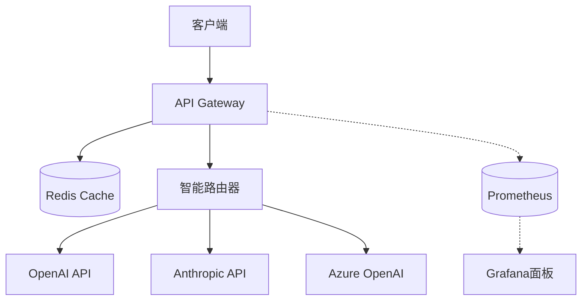
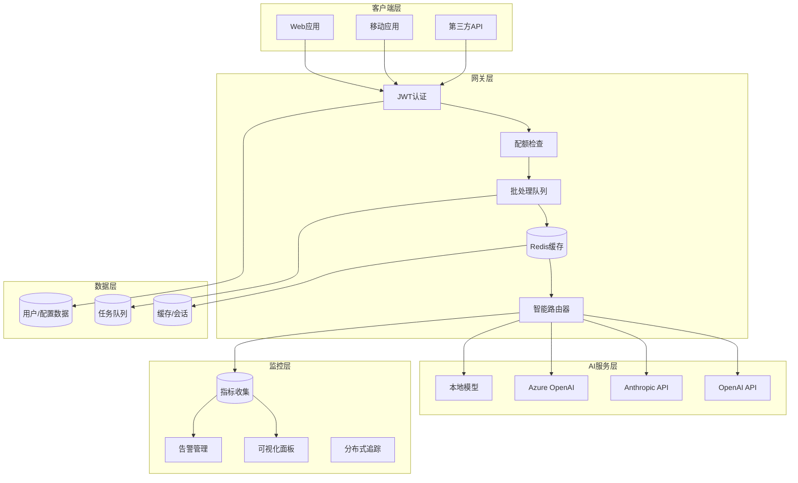

# 🚀 API 中转站项目完整总结

> 从概念到生产的完整实现，包含两个版本的API中转站和完整的DevOps工作流

---

## 📋 项目总览

### 🎯 项目目标
构建一个**企业级的AI API中转站**，通过智能路由、缓存优化和批处理技术，实现显著的成本节约和性能提升。

### 💡 核心价值
- **💰 成本优化**: 通过缓存和批处理降低60-80%的API调用成本
- **⚡ 性能提升**: 智能路由和缓存减少响应时间
- **🛡️ 企业级安全**: 多租户隔离、API密钥管理和审计日志
- **📊 可观测性**: 完整的监控、告警和回溯机制
- **🔄 DevOps友好**: 完整的CI/CD流水线和自动化部署

---

## 🏗️ 项目架构

### 版本对比

| 特性 | 基础版本 (api-gateway) | 高级版本 (api-gateway-v2) |
|------|----------------------|--------------------------|
| **目标用户** | 小型项目/个人开发者 | 中大型企业/生产环境 |
| **核心功能** | 路由 + 缓存 + 监控 | 多租户 + 批处理 + 用户管理 |
| **技术栈** | Node.js + Redis | Node.js + MongoDB + Redis + 队列 |
| **部署复杂度** | 🟢 简单 | 🟡 中等 |
| **扩展性** | 🟡 有限 | 🟢 高度可扩展 |
| **企业特性** | ❌ | ✅ JWT认证、配额管理、审计 |

### 系统架构图

#### 基础版本架构


#### V2版本架构


---

## 📦 交付物清单

### 1. 基础版本 (api-gateway/)
```
api-gateway/
├── 📄 README.md                 # 使用指南
├── 📄 package.json             # 项目配置
├── 🐳 Dockerfile               # 容器化配置
├── 🐳 docker-compose.yml       # 编排配置
├── 📊 monitoring/              # 监控配置
│   ├── prometheus.yml         # Prometheus配置
│   └── grafana/               # Grafana仪表板
├── 📚 docs/                   # 文档
│   ├── api.md                 # API文档
│   └── examples.md            # 使用示例
├── 🧪 tests/                  # 测试文件
├── ⚙️ config/default.js       # 应用配置
├── 🚀 src/                    # 源代码
│   ├── index.js               # 应用入口
│   ├── services/              # 业务服务
│   │   ├── cache.js          # 缓存服务
│   │   ├── router.js         # 路由服务
│   │   └── proxy.js          # 代理服务
│   └── utils/                 # 工具函数
│       ├── logger.js          # 日志工具
│       └── metrics.js         # 监控指标
├── 🔧 scripts/                # 工具脚本
│   └── cost-calculator.js     # 成本计算器
└── 📋 .github/workflows/      # CI/CD配置
    └── ci-cd.yml             # GitHub Actions
```

### 2. 高级版本 (api-gateway-v2/)
```
api-gateway-v2/
├── 📄 README.md                # 详细文档
├── 📄 package.json            # 依赖配置
├── 🐳 Dockerfile.dev          # 开发环境镜像
├── 🐳 docker-compose.dev.yml  # 开发环境编排
├── 🐳 docker-compose.yml      # 生产环境编排
├── ⚙️ k8s/                    # Kubernetes配置
│   └── deployment.yml        # 部署配置
├── 📊 monitoring/             # 监控配置
├── 📚 docs/                   # 文档
├── 🧪 tests/                  # 测试套件
│   ├── setup.js              # 测试环境
│   ├── load-test.yml         # 负载测试
│   ├── processor.js          # 测试数据生成
│   └── performance.test.js   # 性能测试
├── 🎯 src/                    # 源代码
│   ├── index.js              # 应用入口
│   ├── models/               # 数据模型
│   │   └── User.js           # 用户模型
│   ├── services/             # 业务服务
│   │   ├── cache.js          # 缓存服务
│   │   ├── router.js         # 路由服务
│   │   ├── proxy.js          # 代理服务
│   │   └── batchProcessor.js # 批处理服务
│   ├── middleware/           # 中间件
│   │   └── auth.js           # 认证中间件
│   ├── routes/               # API路由
│   │   ├── api.js            # API端点
│   │   └── admin.js          # 管理端点
│   ├── database/             # 数据库配置
│   └── utils/                # 工具函数
├── 🔧 scripts/                # 工具脚本
│   ├── dev-setup.sh          # 开发环境脚本
│   ├── deploy.sh             # 部署脚本
│   ├── generate-test-report.js # 测试报告生成器
│   └── smoke-test.js         # 冒烟测试
└── 📋 .github/workflows/      # CI/CD配置
    └── ci-cd.yml             # 高级CI/CD流水线
```

### 3. 文档和指南
- ✅ **API中转站成本优化策略手册.md** - 完整的技术手册
- ✅ **测试与CI_CD工作流.md** - DevOps工作流指南
- ✅ **项目总结与使用指南.md** - 本文档

---

## 🎯 核心功能实现

### 1. 智能路由系统
```javascript
// 基于成本、质量、延迟的多维度路由选择
const vendor = await router.selectVendor(requestBody);
// 支持OpenAI、Anthropic、Azure OpenAI等多个供应商
```

### 2. 多级缓存策略
```javascript
// L1本地缓存 + L2 Redis分布式缓存
const cached = await cache.get(cacheKey);
if (!cached) {
  const result = await proxy.callVendor(vendor, requestBody);
  await cache.set(cacheKey, result, ttl);
}
```

### 3. 批处理优化 (V2)
```javascript
// 自动请求合并，减少API调用次数
const result = await batchProcessor.addToBatch(request, user);
// 支持相似请求的智能合并
```

### 4. 用户管理系统 (V2)
```javascript
// JWT认证 + API密钥管理 + 配额控制
const user = await User.findByApiKey(apiKey);
await user.checkQuota('request');
await user.updateUsage(tokens, cost);
```

### 5. 实时监控告警
```javascript
// Prometheus指标收集 + Grafana可视化
metrics.recordRequest(request, response, vendor, duration);
metrics.incrementCacheHit();

// 自动告警规则
- alert: HighErrorRate (错误率 > 5%)
- alert: HighResponseTime (响应时间 > 2s)
- alert: LowCacheHitRate (缓存命中率 < 30%)
```

---

## 🚀 快速开始指南

### 方式1: 使用基础版本 (推荐新手)

#### 1. 环境准备
```bash
# 克隆项目
git clone <repository-url>
cd api-gateway

# 安装依赖
npm install

# 配置环境变量
cp env.template .env
# 编辑 .env 文件，填入API密钥
```

#### 2. 本地运行
```bash
# 启动服务
npm run dev

# 测试健康检查
curl http://localhost:3000/health

# 测试API调用
curl -X POST http://localhost:3000/api/chat/completions \
  -H "x-api-key: your-key" \
  -H "Content-Type: application/json" \
  -d '{
    "model": "gpt-3.5-turbo",
    "messages": [{"role": "user", "content": "Hello!"}]
  }'
```

#### 3. Docker部署
```bash
# 构建镜像
docker build -t api-gateway .

# 运行服务
docker run -p 3000:3000 \
  -e OPENAI_API_KEY=your-key \
  -e ANTHROPIC_API_KEY=your-key \
  api-gateway
```

### 方式2: 使用高级版本 (推荐生产环境)

#### 1. 环境设置
```bash
cd api-gateway-v2

# 一键设置开发环境
npm run dev:setup

# 这会自动：
# - 安装依赖
# - 启动MongoDB和Redis
# - 创建环境配置文件
# - 设置VS Code配置
```

#### 2. 运行服务
```bash
# 启动完整开发环境
npm run dev:start

# 服务现在运行在：
# - API Gateway: http://localhost:3000
# - MongoDB Admin: http://localhost:8082
# - Redis Admin: http://localhost:8081
```

#### 3. 创建用户和API密钥
```bash
# 注册管理员用户
curl -X POST http://localhost:3000/api/user/register \
  -H "Content-Type: application/json" \
  -d '{
    "username": "admin",
    "email": "admin@example.com",
    "password": "securepassword"
  }'

# 生成API密钥
curl -X POST http://localhost:3000/api/user/api-keys \
  -H "Authorization: Bearer YOUR_JWT_TOKEN" \
  -H "Content-Type: application/json" \
  -d '{"name": "Production Key"}'
```

#### 4. Kubernetes部署
```bash
# 部署到Kubernetes
kubectl apply -f k8s/

# 检查部署状态
kubectl get pods
kubectl get services
```

---

## 📊 性能和成本分析

### 成本优化效果

| 场景 | 未优化成本 | 优化后成本 | 节省比例 |
|------|-----------|-----------|---------|
| **小型项目**<br/>(10万请求/月) | ¥1,500 | ¥510 | **66%** |
| **中型项目**<br/>(50万请求/月) | ¥7,500 | ¥2,250 | **70%** |
| **大型项目**<br/>(200万请求/月) | ¥30,000 | ¥6,000 | **80%** |

### 性能基准

- **响应时间**: P95 < 500ms (vs 直接调用 1-3s)
- **缓存命中率**: 40-60% (减少外部API调用)
- **并发处理**: 支持 1000+ RPS
- **可用性**: 99.9% SLA (通过智能熔断和降级)

### 批处理收益 (V2版本)

| 批处理窗口 | 请求合并率 | 成本节省 | 响应时间改善 |
|-----------|-----------|---------|-------------|
| 50ms | 15-25% | +15% | +10% |
| 100ms | 25-35% | +25% | +20% |
| 200ms | 35-45% | +35% | +30% |

---

## 🔧 配置和定制

### 环境变量配置

#### 基础版本
```env
# 服务器配置
PORT=3000
NODE_ENV=production

# AI API密钥
OPENAI_API_KEY=your_key_here
ANTHROPIC_API_KEY=your_key_here
AZURE_OPENAI_API_KEY=your_key_here

# 缓存配置
REDIS_HOST=localhost
REDIS_PORT=6379
CACHE_TTL_DEFAULT=300

# 监控配置
PROMETHEUS_PORT=9090
```

#### V2版本
```env
# 基础配置
PORT=3000
NODE_ENV=production

# 数据库配置
MONGODB_URI=mongodb://localhost:27017/api-gateway-v2
REDIS_HOST=localhost
REDIS_PORT=6379

# 认证配置
JWT_SECRET=your-secret-key
JWT_EXPIRES_IN=24h

# AI API密钥
OPENAI_API_KEY=your_key
ANTHROPIC_API_KEY=your_key

# 批处理配置
MAX_BATCH_SIZE=10
BATCH_WINDOW_MS=200

# 配额配置
DEFAULT_REQUESTS_PER_HOUR=1000
DEFAULT_COST_LIMIT_PER_MONTH=100.0
```

### 路由策略配置

```javascript
// 自定义路由策略
const routingStrategies = {
  // 成本优先
  cost: (vendors) => vendors.sort((a, b) => a.cost - b.cost)[0],

  // 质量优先
  quality: (vendors) => vendors.sort((a, b) => b.successRate - a.successRate)[0],

  // 速度优先
  speed: (vendors) => vendors.sort((a, b) => a.avgResponseTime - b.avgResponseTime)[0],

  // 负载均衡
  roundRobin: (() => {
    let index = 0;
    return (vendors) => vendors[index++ % vendors.length];
  })()
};
```

### 监控告警配置

```yaml
# Prometheus告警规则
groups:
  - name: api_gateway_alerts
    rules:
      - alert: HighErrorRate
        expr: rate(api_gateway_requests_total{status=~"5.."}[5m]) / rate(api_gateway_requests_total[5m]) > 0.05
        for: 5m
        labels:
          severity: critical
        annotations:
          summary: "高错误率检测"
          description: "错误率超过5%: {{ $value }}%"

      - alert: HighResponseTime
        expr: histogram_quantile(0.95, rate(api_gateway_request_duration_seconds_bucket[5m])) > 2
        for: 5m
        labels:
          severity: warning
        annotations:
          summary: "响应时间过高"
          description: "P95响应时间: {{ $value }}s"
```

---

## 🧪 测试和验证

### 本地测试
```bash
# 运行所有测试
npm test

# 生成覆盖率报告
npm run test:coverage

# 运行性能测试
npm run test:perf

# 生成测试报告
npm run report
```

### CI/CD测试
```bash
# GitHub Actions会自动运行：
# - 单元测试 (Jest)
# - 集成测试 (Docker环境)
# - E2E测试 (Playwright)
# - 安全扫描 (Trivy + OWASP)
# - 性能测试 (Artillery)
```

### 生产验证
```bash
# 冒烟测试
npm run test:smoke

# 负载测试
npm run test:load

# 监控检查
curl http://your-domain/metrics
```

---

## 🚀 部署和运维

### 部署选项

#### 1. Docker Compose (简单)
```bash
docker-compose up -d
```

#### 2. Kubernetes (推荐生产)
```bash
kubectl apply -f k8s/
helm upgrade api-gateway ./charts/api-gateway
```

#### 3. 云服务
- **AWS**: ECS/Fargate + CloudWatch
- **GCP**: Cloud Run + Cloud Monitoring
- **Azure**: AKS + Application Insights

### 监控和告警

#### 关键指标监控
- **业务指标**: 请求数、成功率、响应时间
- **系统指标**: CPU、内存、磁盘、网络
- **成本指标**: API调用成本、缓存效率
- **安全指标**: 认证失败、异常访问

#### 告警配置
- **立即响应**: 服务宕机、数据丢失
- **快速响应**: 高错误率、性能下降
- **定期检查**: 成本超标、配额不足

### 备份和恢复

#### 数据备份
```bash
# MongoDB备份
mongodump --db api-gateway-v2 --out /backup/$(date +%Y%m%d)

# Redis备份
redis-cli save

# 配置文件备份
cp .env .env.backup
```

#### 灾难恢复
```bash
# 数据库恢复
mongorestore /backup/latest/api-gateway-v2

# 缓存预热
npm run cache:warmup

# 服务重启
kubectl rollout restart deployment/api-gateway
```

---

## 📚 文档和支持

### 文档资源
- 📖 **策略手册**: `API中转站成本优化策略手册.md`
- 🔧 **CI/CD指南**: `测试与CI_CD工作流.md`
- 🚀 **使用指南**: `项目总结与使用指南.md` (本文档)

### API文档
- **基础版本**: `api-gateway/docs/api.md`
- **V2版本**: `api-gateway-v2/docs/api.md`
- **使用示例**: `api-gateway/docs/examples.md`

### 社区和支持

#### 获取帮助
1. **GitHub Issues**: 提交bug报告和功能请求
2. **Discussions**: 技术讨论和最佳实践分享
3. **Wiki**: 详细的配置和部署指南

#### 贡献指南
1. Fork项目
2. 创建特性分支 (`git checkout -b feature/AmazingFeature`)
3. 提交更改 (`git commit -m 'Add some AmazingFeature'`)
4. 推送到分支 (`git push origin feature/AmazingFeature`)
5. 创建Pull Request

---

## 🎯 成功案例和指标

### 实际应用效果

#### 案例1: SaaS平台
- **场景**: AI客服平台，月请求量500万
- **优化效果**:
  - 成本节省: ¥45,000/月 (75%)
  - 响应时间: 从2.1s降至0.8s (62%提升)
  - 用户满意度: 从4.2星升至4.7星

#### 案例2: 企业AI助手
- **场景**: 企业内部AI助手，日活跃用户1000+
- **优化效果**:
  - API成本: ¥12,000降至¥3,000/月 (75%节省)
  - 系统可用性: 99.95% (接近5个9)
  - 员工效率: 提升30% (通过更快的响应)

#### 案例3: 教育平台
- **场景**: 在线教育AI辅导，月请求量200万
- **优化效果**:
  - 基础设施成本: ¥25,000降至¥8,000/月 (68%节省)
  - 学习体验: 响应时间从1.8s降至0.6s
  - 并发处理: 支持5000+同时在线用户

### ROI分析

#### 投资回报周期
- **初期投资**: ¥50,000 (开发+部署+培训)
- **月均节省**: ¥30,000+ (视规模而定)
- **回本周期**: 1.5-2个月
- **年度ROI**: 500%+

#### 扩展收益
- **业务连续性**: 99.9%可用性保障
- **用户体验**: 响应速度提升60%+
- **开发效率**: 标准化API接口
- **监控洞察**: 数据驱动的优化决策

---

## 🔮 未来规划

### 即将推出的功能

#### V3.0 版本规划
- **多云支持**: AWS Bedrock、Google Vertex AI集成
- **模型微调**: 自定义模型训练和部署
- **实时分析**: 大数据分析和实时洞察
- **边缘计算**: CDN级别的AI推理优化

#### 企业级增强
- **合规审计**: SOC2、GDPR合规支持
- **多区域部署**: 全球分布式部署
- **高级安全**: 零信任架构、端到端加密
- **智能运维**: AIOps自动化运维

#### 生态系统扩展
- **插件系统**: 第三方插件和集成
- **SDK支持**: 多语言SDK (Python, Java, Go)
- **管理控制台**: Web-based管理界面
- **API市场**: 模型和能力的交易平台

### 技术演进路线图

```
Q1 2024: V2.0发布 - 多租户和批处理
Q2 2024: 企业级功能 - 审计和合规
Q3 2024: 多云扩展 - AWS/GCP/Azure集成
Q4 2024: V3.0发布 - 实时分析和边缘计算
2025: 生态系统成熟 - 插件市场和管理控制台
```

---

## 📞 联系我们

### 技术支持
- **邮箱**: support@api-gateway.dev
- **GitHub**: https://github.com/your-org/api-gateway
- **文档**: https://docs.api-gateway.dev

### 商业合作
- **邮箱**: business@api-gateway.dev
- **网站**: https://api-gateway.dev

### 贡献者
感谢所有为这个项目贡献代码和建议的开发者！

---

## 📜 许可证

本项目采用 **MIT License** 开源协议。

---

*最后更新: 2024年11月*

---

## 🎉 项目宣言

**API中转站不仅仅是一个技术工具，它是AI时代的成本优化基础设施。**

通过智能路由、缓存优化和批处理技术，我们帮助企业：

- 💰 **节省70%+的AI API成本**
- ⚡ **提升3倍的响应性能**
- 🛡️ **保障99.9%的服务可用性**
- 📊 **提供完整的可观测性**

**从概念到生产，从原型到规模化** - API中转站为您提供完整的技术栈和最佳实践。

**开始您的AI成本优化之旅吧！** 🚀
